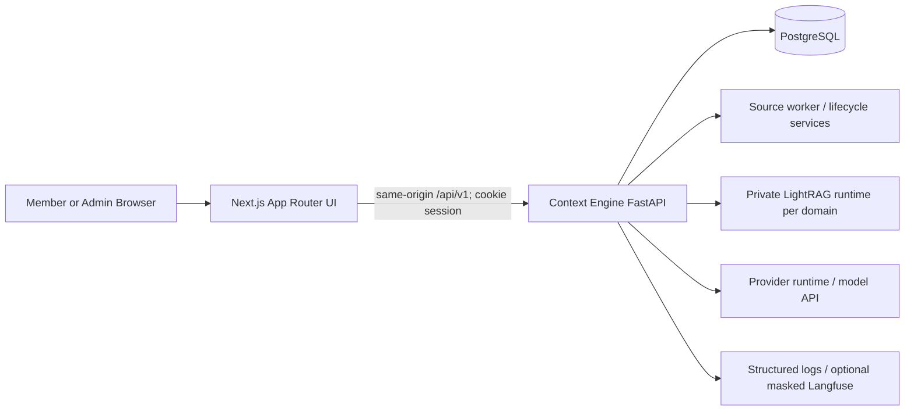

# Target system context



## Request lifecycle

```text
route/layout → feature component → feature hook → typed API/stream client
  → FastAPI authorization → retrieval/chat service → SSE
  → feature reducer → rendered states
```

## Constraints

- The browser is thin: no local retrieval, model selection logic, provider credentials, or document authority.
- The API does not expose private runtime endpoints or provider secrets.
- Slow parsing/indexing remains outside request paths. Chat handlers do not hold database transactions while streaming or waiting on providers.
- One active turn per conversation is recommended by the target data contract; different conversations may proceed independently.
