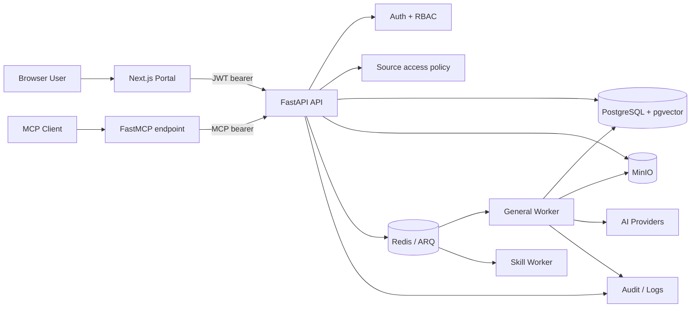
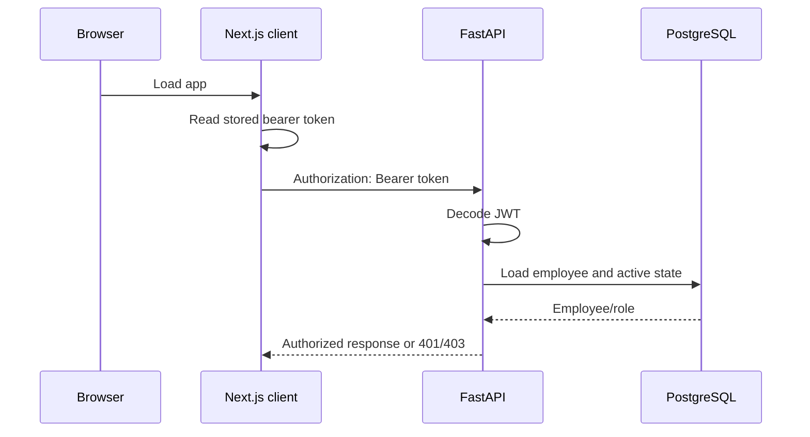
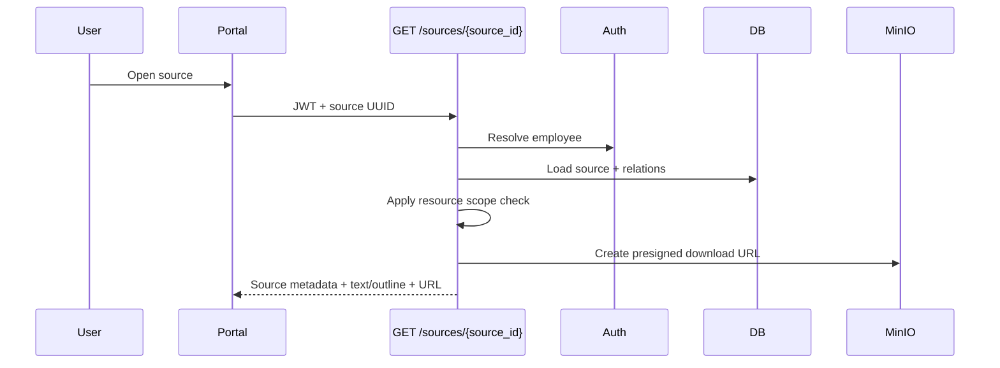
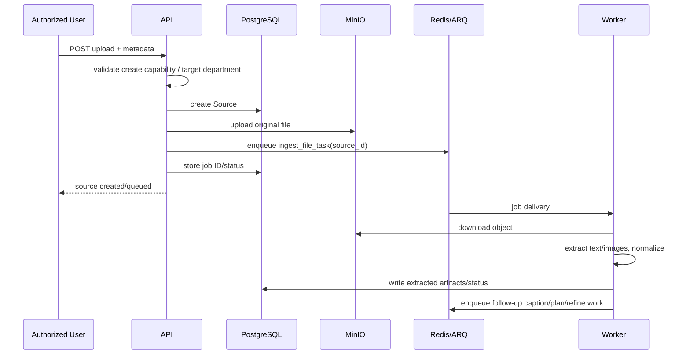
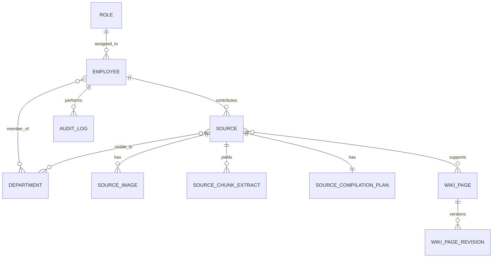
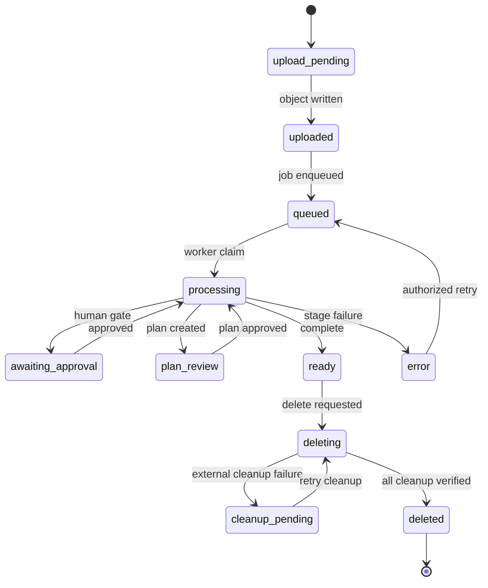

# Arkon Production-Readiness Review
## Static reverse-engineering report for a small multi-user knowledge/MCP application

**Repository:** `nduckmink/arkon`  
**Public source snapshot reviewed:** public default branch displayed as `main`  
**Review date:** June 25, 2026  
**Commit SHA:** Not captured — pin the target SHA before code changes  
**Method:** Static source/configuration review, call-path tracing and targeted official framework/security research. No local clone, live deployment, database, or runtime logs were available.  
**Target profile:** 5–10 concurrent interactive users; departmental knowledge separation; administrators manage configuration/content.

> **Production decision:** **No.** Do not put departmental knowledge or real users on this build until P0 source authorization and production-secret/bootstrap controls are fixed.

---

# 0. Review contract and runtime entry points

## Areas inspected

| Repository area | Runtime role | Status |
|---|---|---|
| `app/main.py` | FastAPI construction, lifespan/startup, CORS, router inclusion, MCP mount, health | Active |
| `app/config.py` | Environment/configuration defaults | Active |
| `app/routers/sources.py` | Source CRUD, upload, status, plan and deletion workflows | Active |
| `app/services/auth_service.py` | JWT, current user, broad permission checks | Active |
| Permission service module | `can_access_document` resource scope logic | Active but inconsistently invoked |
| `app/database/models.py` | SQLAlchemy entities and relationships | Active |
| `app/worker.py` | ARQ ingestion and compiled-wiki work | Active |
| `app/mcp/*` | MCP server, identity and tool policy | Active |
| `docker-compose.yml`, `.env.docker.example` | Operational topology and bootstrap environment | Active |
| `alembic/versions/*` | Schema history | Active |
| `frontend/*` | Next.js portal and bearer-token API client | Active; targeted static review |
| `tests/*` | Unit/integration tests | Active but insufficient for isolation/recovery gates |
| `app/routers/scopes.py` | Scope membership router | Likely inactive in inspected router include list |

## Entry point inventory

| Runtime process | Entry point | Function |
|---|---|---|
| API | Uvicorn loading `app.main:app` | REST, auth, admin APIs and mounted MCP endpoint |
| Migrator | Alembic `upgrade head` compose service | Applies database migrations before API |
| General worker | `python -m arq app.worker.WorkerSettings` | File/URL ingestion, extraction, image, MRP plan/refine tasks |
| Skill worker | `python -m arq app.worker.SkillWorkerSettings` | Skill-related asynchronous jobs |
| Portal | Next.js frontend | Browser user interface |
| PostgreSQL/pgvector | Compose service | Canonical relational data and vector-bearing data |
| Redis | Compose service | ARQ scheduling/queue |
| MinIO | Compose service | Original files and binary artifacts |

---

# 1. Executive architecture summary

## What the system does

Arkon is a self-hosted knowledge system with a web portal and an MCP interface. The core business flow is source ingestion: a user uploads a file or creates a URL source, the API creates a `Source` record, writes the binary to MinIO, queues ARQ background work in Redis, and the worker extracts text/images and drives a multi-stage compilation workflow toward source-backed wiki knowledge. PostgreSQL stores people, roles, departments, sources, extracted artifacts, plans, wiki records, audit entries, and vector-oriented records. MCP tools search or surface that knowledge under a separate token flow.

## Architecture direction

**Keep:** the modular monolith shape; one API process; separate ARQ worker processes; PostgreSQL + MinIO + Redis. This is appropriate for the target user count.

**Simplify:** put all source ID authorization behind one reusable access service; turn source lifecycle and delete cleanup into explicit state changes; impose production settings validation.

**Do not add:** Kubernetes, microservices, Kafka/event buses, workflow engines, multi-region data, multi-provider failover, a new vector database, or a generic tenancy platform. None solve the current risks.

## System/container diagram



## Overall readiness scorecard

| Area | Status | Confidence | Main reason |
|---|---|---:|---|
| Multi-user isolation | **Risk / Blocking** | High | Several source UUID routes omit resource department scope enforcement |
| Authentication | Conditional | High | JWT implemented, but bootstrap/default secret posture is unsafe |
| Chat/search/MCP scope | Conditional | Medium | MCP appears to apply tool-level scope, but parity tests are missing |
| Source ingestion | Conditional | High | Worker pipeline exists, but DB/MinIO/Redis lifecycle is non-atomic |
| Source deletion | **Risk** | High | Object cleanup failure can be swallowed while relational deletion proceeds |
| Concurrent use | Conditional | Medium | ARQ workers/caps exist; race/retry/cancel behavior lacks proof |
| Observability | Risk | Medium | Source states/audit/logs exist; no demonstrated worker health/correlation model |
| Deployment | **Risk / Blocking** | High | Known default credentials/secrets and CORS wildcard defaults |
| Testing | Risk | Medium | Targeted tests visible; isolation, cleanup and recovery gates not established |

---

# 2. Runtime topology and data ownership

## Active component inventory

| Component | Responsibility | Active? | Evidence |
|---|---|---:|---|
| Next.js portal | Browser UX, API calls, session state | Yes | E-013 |
| FastAPI application | REST, auth, admin, source/wiki routes, MCP mount | Yes | E-002, E-004 |
| PostgreSQL + pgvector | Relational authority and vector-bearing data | Yes | E-003, E-009 |
| Redis / ARQ | Queue and worker coordination | Yes | E-003, E-010 |
| MinIO | Original uploads and source artifacts | Yes | E-001, E-003 |
| General ARQ worker | Ingest/extract/compile pipeline | Yes | E-003, E-010 |
| Skill ARQ worker | Skill work | Yes | E-003 |
| Database migrator | Alembic migrations | Yes | E-003 |
| Provider config service/registry | DB-managed model/provider config | Yes | E-001 |
| Audit records | Operator history | Yes | E-009 |
| Scope router | Scope membership APIs | Unclear/inactive | E-004, E-012 |

## Ownership matrix

| Data | Canonical owner | Read by | Written by | Cleanup owner | Risk |
|---|---|---|---|---|---|
| Employees, roles, departments | PostgreSQL | API/MCP/portal | Admin/RBAC | DB lifecycle | Primary auth authority |
| Signed access token | Client | Portal/API | Login API | Token expiry/client logout | No observed server-side token revocation |
| MCP token | PostgreSQL token hash/prefix | MCP auth | Token admin | Token service | Legacy plaintext field still present |
| Source metadata/status | PostgreSQL `Source` | API/worker/portal | API/worker | Source lifecycle | Primary source authorization subject |
| Original uploaded file | MinIO | Worker, portal via URL | API upload | Source cleanup | Orphan / presigned URL window |
| Extracted text/outline/page offsets | Source row | API/worker | Worker | Source cleanup | Row-size/lifecycle concern |
| Source images | DB + MinIO | API/worker | Worker | Source cleanup | Multi-store cleanup |
| Extracts/plans | PostgreSQL child rows | API/worker | Worker/reviewer | Source cleanup | Inherit source access |
| Wiki pages/revisions | PostgreSQL + pgvector | API/MCP | Worker/API | Wiki/source cleanup | Array source IDs make integrity app-managed |
| Job identity/state | Redis + Source job/status | API/worker | API/worker | Queue/reconciler | Not a durable workflow ledger |
| Audit | PostgreSQL | Admin | API/worker | Retention policy | Correlation completeness unclear |

---

# 3. End-to-end request lifecycle

## 3.1 Session restoration and authenticated API request



**Verified:** JWT payload contains employee ID (`sub`), role, name, issuance and expiry; expiry is 24 hours and signing uses HS256. **Verified:** API resolves the employee and checks active state. [E-006]

**Static frontend observation:** portal token storage uses browser local storage and sends a bearer header. [E-013]

**Inference:** logout is client token removal; no server token revocation/session registry was identified.

## 3.2 Source detail read



**Verified safe path:** the inspected source-detail route loads the source and applies source-level access logic before exposing detail, extracted text, outline and a MinIO download URL. [E-007]

**Inferred risk:** MinIO pre-signed URLs are configured with a 24-hour default. Once issued, later role/department revocation cannot invalidate that already-issued URL.

## 3.3 Upload → ingest → compiled knowledge



**Verified:** `ingest_file_task` documents and implements the worker's expected sequence: MinIO download, text extraction, outline, then follow-up MRP/image work; the file must already be in object storage when queued. [E-010]

### Failure, retry, cancellation and timeout observations

| Scenario | Current evidence | Result |
|---|---|---|
| Extraction failure | Worker updates source toward error and rethrows | Verified partial recovery signal |
| Large source review gate | Configuration can route large extracted text to `awaiting_approval` | Verified |
| Retry | Retry/state routes exist; auto-recovery limit configured | Verified, but auth guard must be fixed |
| API/MinIO/Redis interruption | Lifecycle spans independent writes | Verified risk; reconcile rather than assume atomicity |
| Worker restart | Queue/status data exists | Inferred; needs kill/restart test |
| User cancellation | No active source cancellation route was found in inspected `sources.py` | Missing/needs local confirmation |
| Duplicate submission | No universal upload idempotency key seen | Missing |
| Job timeout | Worker configuration default is 1800 seconds | Verified configuration, not behavior |

## 3.4 Source plan and deletion lifecycle

Source progress, update, plan view, approval/rejection/regeneration, retry and delete routes are present. Several accept a caller-controlled source UUID, use only `require_permission(...)`, then load the source without applying `can_access_document`. This is the central P0 isolation defect.

---

# 4. Authentication, authorization, and trust boundaries

## Identity model

| Concern | Implementation | Evidence | Production assessment |
|---|---|---|---|
| Login | Password → signed JWT | E-006 | Fine for a small internal system after rate-limit/secret hardening |
| Token signing | HS256 + process secret | E-006 | Secret rotation strategy needed |
| Token expiry | 24 hours | E-006 | Too long for easily exfiltrated bearer token if localStorage persists it |
| Employee active check | DB lookup after token decode | E-006 | Good revocation-at-user level |
| Browser token storage | local storage | E-013 | XSS blast radius |
| Default admin | startup seeds configured admin | E-005 | Unsafe with defaults |
| MCP token | HMAC hash/prefix model | E-011 | Better than plaintext, but legacy plaintext field should be retired |
| Role/permission | scoped strings like `doc:read:own_dept`/`all` | E-006, E-008 | Broad check must be followed by object scope evaluation |

## Authorization matrix

| Action | Anonymous | Own-dept user | Admin | Current enforcement conclusion |
|---|---:|---:|---:|---|
| List sources | No | Intended yes, scoped | Yes | Scoped list observed |
| Get source detail | No | Intended yes | Yes | Source-level check observed |
| Get source progress | No | **Should be scoped** | Yes | **P0: broad read only** |
| Get plan | No | **Should be scoped** | Yes | **P0: broad read only** |
| Upload to permitted department | No | Yes | Yes | Permission + department validation observed |
| Update source | No | **Should be scoped** | Yes | **P0: broad edit only** |
| Retry/approve/reject/regenerate | No | **Should be scoped** | Yes | **P0: broad edit only** |
| Delete source | No | **Should be scoped** | Yes | **P0: broad delete only** |
| MCP search | No | Intended scoped | Yes | Tool-layer scope appears present; parity tests needed |

## The policy split

`require_permission("doc:read")` is explicitly a coarse permission dependency. It can allow `doc:read:own_dept` and does not itself prove the caller may see a particular source. The codebase has a `can_access_document` helper for the actual resource decision: administrator / `all` permission / global source policy / source-department intersection. [E-006, E-008]

**Consequence:** every route that uses a source ID must call the same authoritative resource-level helper. Client-side filtering, hidden buttons, or tool-list filtering cannot secure content.

## Security boundary map

| Boundary | Current state | Lean hardening |
|---|---|---|
| Browser → API | JWT bearer | Enforce HTTPS; short session design; preferably HttpOnly/Secure/SameSite session strategy if externally reachable |
| API → DB | App credentials | Deployment-only secrets; never return raw settings in health/errors |
| API/worker → MinIO | Shared service credentials and pre-signed URLs | Least-privilege MinIO account; short presign; reauthorize per URL issuance |
| API → Redis | Internal queue | Private network; dependency health and job observability |
| MCP → API | MCP bearer + tool identity | Use same lower-level source policy as HTTP |
| Admin → provider config | DB-managed provider settings | Encrypt with non-default key; audit changes and expose only safe diagnostics |
| Worker → provider | Async external calls | Bound timeout/retry/concurrency and log only safe provider identifiers |

---

# 5. API contract map

> This is a high-value critical surface map, not a substitute for an OpenAPI export from a running pinned commit.

| Endpoint | Primary caller | Current guard | Required resource guard | Side effect / risk |
|---|---|---|---|---|
| `GET /api/sources` | Portal list | current user | scoped query predicate | Positive pattern |
| `GET /api/sources/{id}` | Portal detail | current user | source read check | Presigned URL validity window |
| `GET /api/sources/{id}/progress` | Portal polling | `doc:read` | source read check | **Cross-dept status leak** |
| `POST /api/sources/upload` | Portal | `doc:create` | department assignment policy | DB + MinIO + queue non-atomic |
| `POST /api/sources/url` | Portal | `doc:create` | department/source URL policy | SSRF/fetch policy needs explicit test |
| `PATCH /api/sources/{id}` | Portal | `doc:edit` | source edit check | **Cross-dept metadata/scope mutation** |
| retry source route(s) | Portal | `doc:edit` | source edit + state check | **Cross-dept compute/cost** |
| `GET /api/sources/{id}/plan` | Portal | `doc:read` | source read check | **Plan disclosure** |
| approve extraction / plan | Portal | `doc:edit` | source edit + state check | **Unauthorized pipeline transition** |
| reject/regenerate plan | Portal | `doc:edit` | source edit + state check | **Unauthorized interference/spend** |
| `DELETE /api/sources/{id}` | Portal | `doc:delete` | source delete + state check | **Cross-dept destructive action; orphan object risk** |

## Typed response recommendation

```json
{
  "error": {
    "code": "SOURCE_STATE_CONFLICT",
    "message": "This source cannot be approved from its current state.",
    "request_id": "..."
  }
}
```

Use stable codes:
- `UNAUTHENTICATED`
- `SOURCE_NOT_FOUND`
- `SOURCE_FORBIDDEN`
- `SOURCE_STATE_CONFLICT`
- `QUEUE_UNAVAILABLE`
- `OBJECT_STORAGE_UNAVAILABLE`
- `CLEANUP_PENDING`
- `PROVIDER_TRANSIENT_FAILURE`

Return safe messages to users. Store provider response categories, request IDs, job IDs and source IDs in logs/audit, not secrets or raw exception traces.

---

# 6. Domain model and database lifecycle

## Entity inventory

| Entity | Purpose | Relationships / integrity observations |
|---|---|---|
| `Employee` | Authenticated actor | role/global role, active state, department M2M, MCP token fields |
| Role / permission | Broad action capability | Scope suffix needs source-level enforcement |
| `Department` | Data isolation boundary | employees and sources M2M |
| `Source` | Ingestion root and state record | contributor, departments, images, extracts, plan, wiki references |
| `SourceDepartment` | Source visibility M2M | No membership means global according to observed policy |
| `SourceImage` | Extracted image metadata | Source child; binary object may exist in MinIO |
| `SourceChunkExtract` | Chunk-level extracted data | Source child, unique source/chunk behavior observed |
| `SourceCompilationPlan` | Reviewable plan | One/source relationship |
| `WikiPage` / revisions | Compiled knowledge and history | Source IDs held in array-like field; integrity handled in app |
| Vector records | Search embeddings | Rebuild/model compatibility workflow must be controlled |
| Audit log | Operator history | Needs correlation and retention policy |
| Provider configuration | Provider/model settings | DB managed, must be encrypted/audited |

## ERD



## Source lifecycle target



## Data design observations

1. **String statuses / distributed state transitions:** source status and related fields are mutated from routes and workers. Add a `StrEnum` and a small transition validator; avoid a generic workflow engine.
2. **Array source references in wiki data:** convenient but application owns referential cleanup. Add a reconciliation job rather than rewriting the schema immediately.
3. **Migration churn:** migrations show scope/workspace concepts added/removed; run an active-model-to-migration audit before major changes.
4. **Legacy MCP plaintext token field:** retire after code usage audit and migration to reduce accidental exposure.
5. **Potential N+1 count work:** source-related helper `_wiki_page_count` is per-source; use grouped aggregate for list pages.

---

# 7. Async processing, retries, cache, and concurrency

## Worker pipeline

| Stage | Entry | Persisted status | Error/retry posture |
|---|---|---|---|
| Upload/file URL source | Source router | Source + object + job id | Multi-store failure window |
| Ingest | `ingest_file_task` | source text/images/status | Worker updates error then rethrows |
| Image caption | Follow-up ARQ task | Source image fields | Separate execution prevents main ingest blocking |
| MRP plan/refine | Follow-up jobs | extracts/plans/wiki states | Human review branch/approval routes |
| Stale approval cleanup | Config indicates TTL | Must confirm scheduled invocation | Needs dynamic validation |
| Reembedding | Worker/config path | vectors | Requires config snapshot / compatibility policy |

## 5–10 user capacity assessment

Current configuration has `worker_max_jobs=3` and a 30-minute job timeout. That is an acceptable first cap for expensive ingestion, but not a complete capacity guarantee. Main risks:
- long jobs occupy all worker slots;
- retry/delete/worker races can duplicate artifacts;
- no obvious per-source lease/version fencing;
- no proved separation of interactive traffic from long provider work;
- no demonstrated worker heartbeat/queue lag visibility.

**Lean recommendation:** retain the single worker queue until metrics prove starvation. Add source-version/lease checks, provider concurrency caps, queue age metrics, and bounded retry policies first.

## Required failure recovery design

| Failure | Current gap | Recommended response |
|---|---|---|
| Crash after source DB create, before object write | Orphan metadata | `upload_pending` reconciler |
| Crash after object write, before ARQ enqueue | Orphan object / stuck source | `pending_enqueue` DB state + idempotent reconciler |
| Worker crash mid-stage | May remain processing | Lease/heartbeat + deterministic recovery |
| Queue unavailable | Upload can be partially accepted | Typed 503 or durable pending-enqueue state |
| Provider timeout/5xx | Error/retry behavior must be tested | Bounded backoff, frozen config ID, safe diagnostics |
| Delete while worker runs | Worker may write after delete | `deleting` tombstone/version check before writes |
| MinIO delete fails | Current DB delete can proceed | `cleanup_pending`, retry reconciler, no false success |
| Browser duplicate request | Duplicate job/artifacts | Idempotency key/content hash |

---

# 8. Storage, search, MCP and third-party integration review

| Integration | Owns | Source of truth | Main risk |
|---|---|---|---|
| PostgreSQL / pgvector | Accounts, roles, sources, plans, wiki, audit | Relational authority | Cross-store transaction gap |
| MinIO | Original/uploaded binaries and artifacts | Binary authority | Orphans, pre-signed URL duration |
| Redis / ARQ | Dispatching operational work | Operational queue | Not a canonical lifecycle ledger |
| AI providers | External computation | Not canonical | Retry/cost/config drift |
| MCP | Tool access surface | Uses service policy | Must not rely on tool-list filtering |

## MCP specific conclusion

MCP lives in the same API process and uses its own token/identity path. The reviewed middleware makes clear that tool listing/filtering is not a security boundary. This is good design awareness. The required next step is proof that all MCP tools call the same source-scope query/service as HTTP routes. [E-011]

## File URL policy

Default pre-signed object URL expiry is 24 hours. For departmental documents:
- Reduce to 5–15 minutes.
- Re-authorize on each URL creation.
- Never expose direct permanent object identifiers to the browser.
- Treat revocation as requiring new authorization, not as a capability of a previously issued URL.

---

# 9. Observability and operating model

## Current signals

| Signal | Current evidence | Gap |
|---|---|---|
| Route/worker logs | Logging calls observed | Structured fields/correlation not proven |
| Source status/progress | Persisted status/message fields | Progress endpoint currently leaks source status across scope |
| Job ID | Stored/logged around enqueue | No durable attempt history proven |
| Audit table | Entity/log helper observed | Needs request/job/provider correlation |
| API health | DB/Redis/MinIO checking | Does not prove workers process queue |
| Metrics/tracing | Not confirmed | Add basic counters/histograms only |

## Required safe diagnostic envelope

Every source operation should include:
- `request_id`
- `source_id`
- `job_id`
- actor ID (if user initiated)
- source state transition
- stage
- attempt number
- provider/model/config snapshot IDs
- elapsed duration
- upstream category/status class
- cleanup result

Never log by default:
- bearer tokens
- API keys
- passwords
- raw source contents
- full prompts/context
- MinIO credentials

## Health endpoints to add

- `/health/live`: process is alive.
- `/health/ready`: DB/Redis/MinIO and migration version compatible.
- restricted `/health/workers` or admin dashboard: worker heartbeat, active job count, oldest queued job, stuck source count, cleanup pending count.
- Basic metrics: queue age, stage duration, errors by category, cleanup retries.

---

# 10. Deployment and operations review

## Verified compose shape

Compose declares PostgreSQL, Redis, MinIO, migrations, API, general worker, skill worker, and frontend. Core dependency health checks and startup ordering exist; API is configured after migration completion. This is a reasonable self-hosted baseline.

## Major deployment risks

| Risk | Why it matters | Minimal fix |
|---|---|---|
| Known defaults in settings | Predictable JWT/encryption/admin/MCP/MinIO credentials | Production startup validation |
| Automatic default admin seeding | Known admin possible on first boot | Explicit one-time bootstrap command/secret |
| Wildcard CORS default | Excessively open browser policy; blocks secure cookie patterns | Explicit production origin allowlist |
| Worker liveness unproven | API can be “healthy” while ingestion is dead | Worker heartbeat/health |
| MinIO public mapping | Accidental exposure | Loopback bind by default / reverse proxy |
| Backup restore untested | Cannot trust deletion or recovery | DB+MinIO restore drill |
| Migration rollback unclear | Failed deployment recovery uncertain | Forward-only migration tests + restore runbook |

## Operator runbook

1. Generate unique DB, MinIO, JWT/encryption and MCP secrets.
2. Start dependencies and apply migrations.
3. Confirm API readiness and worker heartbeat.
4. Smoke test: upload → process → detail → MCP search → delete → confirm object absence.
5. Back up PostgreSQL and MinIO; restore to an isolated environment.
6. Rotate bootstrap credentials and record audit.
7. Monitor queue age, source stuck states, cleanup pending, provider error categories.

---

# 11. Testing and change safety

Visible tests cover selected embedding, MRP and MCP behavior. They do not demonstrate comprehensive direct-route scope isolation, MinIO cleanup, worker restart, or production configuration gates. [E-014]

| Area | Current evidence | Required gate |
|---|---|---|
| Auth/JWT | Static code confidence | invalid credential, expired token, inactive employee |
| Department source isolation | Insufficient | two-department direct UUID matrix across every route |
| Upload lifecycle | Insufficient | DB/MinIO/Redis failure injection and idempotency |
| Worker recovery | Insufficient | kill/restart at each stage |
| Source deletion | Insufficient | MinIO failure becomes `cleanup_pending` |
| MCP scope | Partial | direct tool parity with HTTP |
| Provider failure | Insufficient | timeout/429/5xx with bounded same-config retry |
| Migration | Insufficient | fresh and upgrade-from-fixture database tests |
| UI states | Insufficient | progress/error/forbidden/delete-pending E2E |
| Production secret guard | Missing | CI assert production defaults cause startup failure |

---

# 12. Findings register

## Finding RAG-001 — Department-scoped source routes bypass object-level authorization

**Priority:** P0  
**Category:** Authorization / isolation  
**Status:** Verified  
**Production impact:** Blocking

### Evidence

- `app/services/auth_service.py :: require_permission`
- `app/routers/sources.py :: get_source_progress`, `update_source`, plan handlers and `delete_source`
- `require_permission` explicitly describes itself as a broad capability check for scoped resource permissions.
- Unsafe route pattern is broad permission → `db.get(Source, source_id)` → read/mutate/respond.
- Confidence: High.

### Current behavior

Several source ID routes check `doc:read`, `doc:edit`, or `doc:delete` but omit `can_access_document`/equivalent source department enforcement. The caller controls the UUID.

### Concrete failure

An editor limited to Department A obtains a Department B source UUID from a copied URL/log/MCP output. They can update metadata, retry provider work, approve/reject/re-generate a plan, or delete the Department B source because only broad edit/delete is checked.

### Minimal safe fix

Introduce `load_authorized_source(action, source_id, user, db)` and use it for every source-ID endpoint, source download/image endpoint, and source-derived plan/job transition. It must:
1. load source and departments,
2. apply broad action capability,
3. call the existing `can_access_document`,
4. choose 404 or 403 consistently,
5. return a locked/versioned source for mutation.

### Acceptance criteria

- [ ] Every source ID route has a resource authorization test.
- [ ] An `own_dept` user cannot discover/read/update/retry/plan/delete other-department sources.
- [ ] Admin and `all` roles retain intentional behavior.
- [ ] Global-source policy is explicit and covered.
- [ ] No router contains duplicated department intersection logic.

**Effort:** Medium. **Change risk:** Medium. **Architecture effect:** Simplifies policy.

---

## Finding RAG-002 — Plan/retry routes permit unauthorized state transitions and provider spending

**Priority:** P0  
**Category:** Authorization / concurrency / provider cost  
**Status:** Verified

### Evidence

- `app/routers/sources.py :: approve_extraction`, plan approve/reject/regenerate and retry workflows.
- Broad `doc:edit` is used before source/plan lookup/enqueue.
- Confidence: High.

### Risk

A cross-department user can force expensive processing, reject a colleague's plan, requeue work, or alter source state. This is both an isolation defect and an availability/cost-control defect.

### Minimal safe fix

Apply RAG-001 authorization, then guard every transition:
- retry only from `error`;
- approve extraction only from `awaiting_approval`;
- approve/reject/regenerate only valid plan review states;
- delete transitions source to `deleting` first;
- second concurrent mutation returns `409 SOURCE_STATE_CONFLICT`.

**Effort:** Medium. **Change risk:** Medium.

---

## Finding RAG-003 — Predictable production defaults plus startup admin seed

**Priority:** P0  
**Category:** Secrets / deployment  
**Status:** Verified

### Evidence

- `app/config.py :: Settings` defaults for secret key, default admin, MCP pepper, MinIO keys and CORS.
- `app/main.py` startup seeds default administrator.
- Confidence: High.

### Risk

A first deployment that does not override all values can use known credentials or secrets, enabling administrator compromise, JWT forging, config encryption compromise, object-store access or MCP token hashing weaknesses.

### Minimal safe fix

Add `ENVIRONMENT=development|test|production` and reject known/blank/weak secrets in production before migration/API startup. Require one-time bootstrap credentials via secret injection or a controlled command. No wildcard CORS in production.

### Acceptance criteria

- [ ] Production boot fails independently for every placeholder/default.
- [ ] Bootstrap password never appears in logs.
- [ ] Non-production retains convenience defaults.
- [ ] CI runs a negative boot test.
- [ ] Secrets rotation runbook exists.

**Effort:** Small. **Change risk:** Low.

---

## Finding RAG-004 — Deletion can falsely succeed after MinIO cleanup failure

**Priority:** P1  
**Category:** Storage / data lifecycle  
**Status:** Verified

### Evidence

- `app/routers/sources.py :: delete_source`
- Object-prefix deletion error is caught/logged and relational/wiki cleanup continues.
- Confidence: High.

### Risk

The UI/operator can see a deleted source while original file or image objects remain in MinIO. This violates expected deletion, leaves privacy/retention risks, and creates unexplained storage orphans.

### Minimal safe fix

Make deletion stateful:
1. mark source `deleting` in DB and audit actor;
2. enqueue cleanup worker;
3. worker deletes object prefix and child/referenced data idempotently;
4. finalize terminal delete only after success;
5. otherwise keep `cleanup_pending` with bounded retry and operator visibility.

**Effort:** Medium. **Change risk:** Medium.

---

## Finding RAG-005 — Local-storage bearer token expands XSS compromise impact

**Priority:** P1  
**Category:** Session security  
**Status:** Verified storage observation; risk is standards-based

### Evidence

- Frontend static review found `arkon_token` local storage behavior and bearer header.
- `app/services/auth_service.py :: create_access_token` uses 24h JWT.
- Confidence: Medium for exact frontend location; high for session trade-off.

### Recommendation

For a browser portal, prefer secure HttpOnly/SameSite cookie session design with CSRF controls. If bearer remains, reduce expiry, hold access token in memory, strengthen CSP/output encoding, and document accepted risk.

**Effort:** Medium. **Change risk:** Medium.

---

## Finding RAG-006 — Upload lifecycle spans DB, object storage and queue without a recoverable transaction protocol

**Priority:** P1  
**Category:** Reliability / ingestion  
**Status:** Verified architecture, dynamic recovery behavior incomplete

### Evidence

- Source upload route creates source, writes object and enqueues ARQ job.
- Worker assumes object already exists before task begins.
- Confidence: High.

### Risk

Crashes at boundaries create source rows without objects, objects without jobs, jobs without source/object, and duplicate retries.

### Minimal safe fix

Use explicit states (`upload_pending`, `uploaded`, `pending_enqueue`, `queued`) plus an idempotent reconciler. Use content hash/client idempotency key and deterministic object key.

**Effort:** Medium. **Change risk:** Medium.

---

## Finding RAG-007 — Worker health and end-to-end traceability are not demonstrated

**Priority:** P2  
**Category:** Observability  
**Status:** Missing/partial

### Evidence

- API health checks dependencies.
- Worker compose processes are present; no worker healthcheck was confirmed.
- Source job IDs/logging exist.
- Confidence: Medium.

### Minimal safe fix

Add worker heartbeat and basic operator signals: queue age, active jobs, stuck processing sources, cleanup pending, last provider failure category. Correlate request/source/job/actor IDs.

---

## Finding RAG-008 — Source state logic is stringly typed and distributed

**Priority:** P2  
**Category:** Maintainability / reliability  
**Status:** Verified

### Recommendation

Define a `SourceStatus` `StrEnum` and transition map shared by routers and workers. Keep DB representation as existing strings for a low-risk incremental change. Avoid adding a workflow engine.

---

## Finding RAG-009 — Pre-signed URLs outlive later authorization changes

**Priority:** P2  
**Category:** Data exposure  
**Status:** Inferred

### Evidence

- Source detail returns presigned URL after authorization.
- `minio_presign_expiry_hours` default is 24.
- Confidence: Medium.

### Recommendation

Reduce to 5–15 minutes and reauthorize URL creation; for highly sensitive sources, proxy download through an authorization endpoint.

---

## Finding RAG-010 — No demonstrated release gate for isolation, cleanup or worker recovery

**Priority:** P2  
**Category:** Testing  
**Status:** Missing

### Recommendation

Make the matrix in `TEST_AND_RELEASE_PLAN.md` a required CI suite before production.

---

# 13. Phased implementation plan

## Phase 0 — Production blockers

1. Centralize source access and apply it to every source UUID route.
2. Add direct cross-department HTTP tests for all source actions.
3. Production startup fails on placeholder/default secrets and wildcard CORS.
4. Rotate all deployment secrets/bootstrap credentials.
5. Document source global/default visibility policy.

**Exit:** Cross-department access is denied and production defaults refuse boot.

## Phase 1 — Reliable daily operations

1. Source state enum/transition checker.
2. Deletion `deleting` / `cleanup_pending` reconciliation.
3. Upload/queue idempotency and stale-state reconciler.
4. Worker heartbeat and job/source correlation.
5. Snapshot provider/model configuration on job/trace.

**Exit:** Worker restart and MinIO delete-failure tests pass.

## Phase 2 — Evidence and contract hardening

1. Short-lived, reauthorized download URLs.
2. Versioned OpenAPI artifact and typed API error envelope.
3. MCP/HTTP source-scope parity test suite.
4. Retrieval/evidence evaluation set.
5. Aggregate source list page-count query.

## Phase 3 — Simplification and maintenance

1. Retire plaintext legacy MCP token field.
2. Audit model/migration/unused-router drift.
3. Backup/restore drill and retention documentation.
4. Session architecture hardening based on exposure model.
5. Remove dead paths only after coverage exists.

---

# 14. Final handoff

## Safe to operate today?

**No** for real multi-user departmental content.

## Required conditions before use

1. Resolve RAG-001/RAG-002 authorization defects and verify with end-to-end tests.
2. Resolve RAG-003 deployment defaults and rotate any previously used credentials.
3. Resolve RAG-004 delete correctness and prove recovery behavior.
4. Establish worker health, traceability, and required release tests.

## Highest-leverage change

**Build one canonical `load_authorized_source()` service/dependency and require it on every route/tool path handling a source ID.** It closes the largest security hole and prevents authorization logic from drifting across router handlers.

## Explicitly defer

Kubernetes, microservices, an event bus, a workflow engine, multi-region deployment, automatic provider failover, multi-tenant SaaS architecture and new vector infrastructure.
