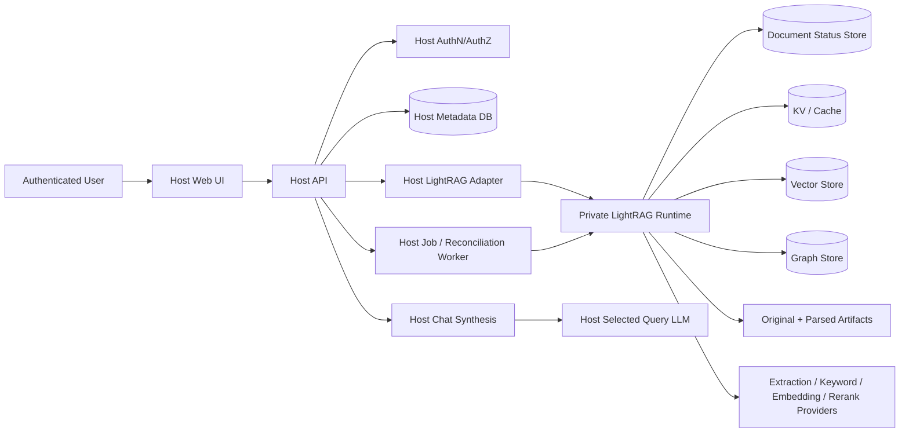
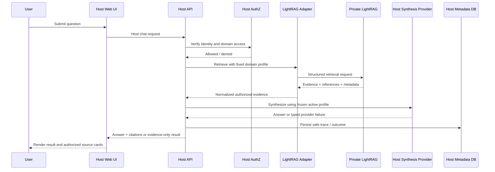
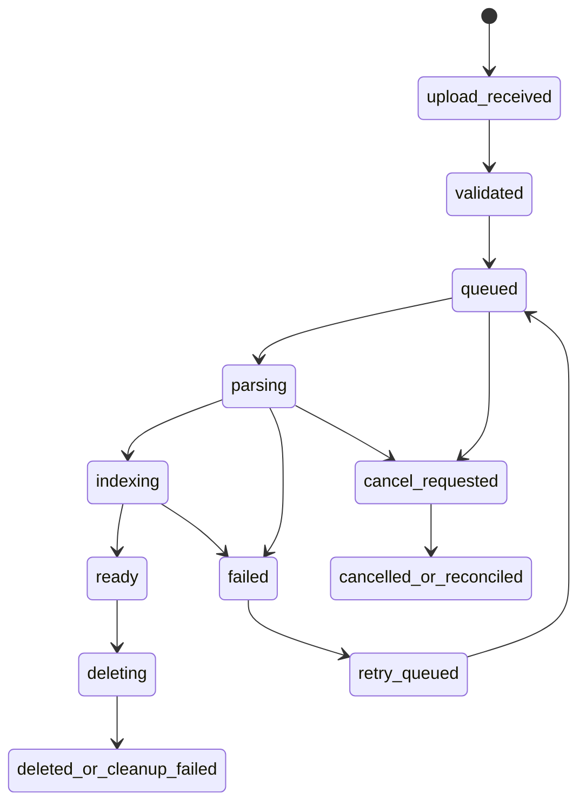

# Production-Readiness Review Report

## Small Multi-User Agentic RAG Application (Target: 5–10 Concurrent Users)

---

# 0. Review Contract

## Repository

| Field | Value |
|---|---|
| **Repository** | `https://github.com/HKUDS/LightRAG.git` |
| **Branch / commit SHA reviewed** | Release `v1.5.4`, commit `9a45b64` (release target). Route-level source was inspected at this tag; selected deployment/config documentation was reviewed from current upstream documentation on 2026-06-25 and must be rechecked during implementation. |
| **Review date** | 2026-06-25 |
| **Reviewer / coding agent** | Production architecture review, source-and-documentation inspection |
| **Application name** | LightRAG upstream server, assessed as a retrieval/indexing subsystem |
| **Primary deployment environment** | Docker / private service network recommended; no actual deployment was supplied for certification |
| **Target users** | Small internal team using a host application such as Context Engine |
| **Expected concurrency** | 5–10 simultaneous interactive users |
| **Write permissions** | Recommended: host application admin-only; LightRAG service-to-service only |
| **Primary unit of isolation** | Knowledge domain, with a stable LightRAG workspace and preferably one private runtime per domain |

## Review Scope

This report evaluates the **upstream LightRAG repository** as the retrieval and indexing component of a small multi-user RAG product. It does not certify a particular container image, cloud account, reverse proxy, secret store, database instance, customer data set, or host application implementation.

The review prioritizes:

1. Correct user and domain isolation
2. Reliable document ingestion and cleanup
3. Grounded retrieval and source traceability
4. Stable chat synthesis under LLM/provider failure
5. Safe concurrency for simultaneous chats and uploads
6. Clear operational visibility for administrators
7. Minimal architecture and operational complexity

## Evidence Standard

- **Verified** — directly supported by a tagged upstream source file, official documentation, or the v1.5.4 release notes.
- **Inferred** — a likely operational consequence of verified behavior, not proven by a live deployment.
- **Missing** — no deployment/runtime evidence was supplied or executed.
- **Legacy / inactive** — not used in this review unless explicitly stated.
- **Recommendation** — proposed host-application integration shape, not a claim about current LightRAG behavior.

> **Important limitation:** no LightRAG instance was launched, no upload/query/delete test was run, and no host application code was provided in this review. “Ready” means source-level readiness for the stated boundary—not proof of operational safety.

---

# 1. Executive Production-Readiness Assessment

## What the System Does

**[Verified]** LightRAG is a graph-enhanced RAG engine and API server. It indexes documents into chunks, embeddings, entities, and relations; supports `local`, `global`, `hybrid`, `naive`, and `mix` retrieval modes; exposes query, structured retrieval-data, document-processing, graph, WebUI, and Ollama-compatible API surfaces. It supports source references and asynchronous document tracking. It is best treated as an **upstream retrieval/indexing engine**, not as the complete identity, authorization, product-session, or user-facing chat policy layer.

**Evidence:**
- File: `lightrag/api/routers/query_routes.py` at `v1.5.4`
- Symbol / route / model: `QueryRequest`, `/query`, `/query/stream`, `/query/data`, `QueryDataResponse`
- Relevant call path: client request → authenticated query router → `aquery_llm` or `aquery_data`
- Runtime role: retrieval/query API
- Confidence: High

## Production Readiness Verdict

**Overall status:** **Conditionally Ready** as a private retrieval/indexing subsystem behind a host API. **Not Ready** as the standalone trust boundary for a small multi-user product.

| Area | Status | Confidence | Main Reason |
|---|---|---:|---|
| Multi-user isolation | Risk | High | Workspace is a runtime/storage namespace; it is not a host-level authorization policy. |
| Authentication and authorization | Risk | High | Upstream supports API keys/JWT, but host resource/domain authorization must remain outside LightRAG. |
| Chat and retrieval reliability | Conditionally Ready | Medium | Structured retrieval and query APIs exist; host must normalize failures and own final synthesis policy. |
| Document ingestion lifecycle | Conditionally Ready | Medium | Track IDs, status polling, retry and cancellation routes exist; end-to-end cleanup guarantees were not runtime-verified. |
| Evidence/citation traceability | Conditionally Ready | High | Structured data returns references, paths and chunks; host still needs canonical source mapping and authorization. |
| Concurrent workload handling | Conditionally Ready | Medium | Upstream documents worker and async limits; aggregate limits across domain runtimes are absent from LightRAG. |
| External provider resilience | Risk | High | Query fields and upstream failures are flexible/direct; host needs bounded retries, error classification and frozen profiles. |
| Observability and diagnostics | Conditionally Ready | Medium | Health/pipeline status and route logs exist; host correlation and safe admin diagnostics are still required. |
| Backup/recovery/deletion safety | Risk | Medium | Storage options and deletion capabilities exist; no chosen backend, backup, restore or reconciliation test was supplied. |
| Test coverage | Risk | High | Upstream test tooling exists, but neither upstream tag tests nor integration tests were executed for this review. |

## Top Risks

| Priority | Risk | User/Operator Impact | Recommended Next Action |
|---|---|---|---|
| P0 | Browser or public ingress reaches LightRAG directly | A client-held upstream credential can expose broad document/query/admin API capability for a runtime. | Private networking; server-only credentials; host API is the sole caller. |
| P0 | Index-shaping configuration changes after indexing | Mixed embedding semantics, inconsistent parser/chunk behavior and a required destructive re-index. | Persist and lock a `DomainIndexProfile` before first upload. |
| P1 | Host forwards browser-controlled LightRAG query fields | Users can choose `bypass`, change token/retrieval budgets, supply upstream prompt/history fields, or raise provider cost/latency. | One strict host retrieval adapter with a request allowlist and bounds. |
| P1 | Host does not own upload/delete reconciliation | Failed, cancelled, retried or deleted documents can leave misleading status or orphaned upstream/host artifacts. | Host job state machine, idempotency keys, deletion fencing and reconciliation. |
| P1 | Per-runtime limits multiply across domains | Several domain runtimes can collectively exceed provider capacity even when each local limit is safe. | Global host admission control for chat, embeddings, ingestion and lifecycle actions. |
| P2 | Floating upstream version/image | Parser, auth, storage and query behavior can change between releases. | Pin a SHA/image digest; stage upgrades against a representative corpus. |

## Architecture Direction

### What should remain unchanged

- **[Recommendation]** Keep LightRAG’s graph + vector retrieval, document processing pipeline, status tracking, and structured retrieval-data response as the engine layer.
- **[Recommendation]** Keep one stable domain workspace per isolated knowledge domain. A private runtime per domain is a reasonable defence-in-depth choice at the stated scale.

### What should be simplified

- **[Recommendation]** Expose one controlled host retrieval integration, not a generic proxy of LightRAG’s entire API surface.
- **[Recommendation]** Use the LightRAG WebUI only for development/operator troubleshooting; do not make it the production end-user UI.
- **[Recommendation]** Do not duplicate upstream chunks, entities and graph data into a second host database. Store only host metadata, domain registry, jobs, citations and audit records.

### What must be fixed before production use

1. Private network boundary and server-only LightRAG credentials.
2. Host server-side authorization for every domain, document, source preview and job action.
3. Immutable domain index configuration and deterministic retrieval/synthesis profile selection.
4. Typed, sanitized upstream failure contract with safe evidence-only fallback after synthesis failure.
5. Upload → ready → retrieve → cite → delete → verify-cleanup integration tests against the pinned image.

### What should explicitly not be added yet

- Kubernetes, service mesh, multi-region deployment, a distributed workflow engine, generic agent tool execution inside LightRAG, automatic multi-provider failover, or a second copy of all LightRAG retrieval data.

---

# 2. Runtime Topology and Ownership Map

## Active Runtime Components

The following is the recommended deployment topology for the intended host product. “Active” means required in the recommended shape, not proven in a supplied deployment.

| Component | Responsibility | Entry Point | Runtime Process | Active? | Evidence |
|---|---|---|---|---|---|
| Web client | Authenticated UI, chat and admin workflows | Browser → host UI | Host frontend | Yes | Recommendation; not part of LightRAG repo review |
| API service | AuthZ, domain routing, chat policy, evidence normalization | Browser → host API | Host API | Yes | Recommendation; not part of LightRAG repo review |
| RAG/retrieval service | Index, retrieve, graph/vector evidence | Host adapter → LightRAG | LightRAG server | Yes | Verified route and API surface |
| Background worker | Host job reconciliation and lifecycle coordination | Host DB/queue | Host worker | Recommended | Missing from upstream-as-host boundary |
| Scheduler/poller | Health and upstream track-status polling | Host worker → LightRAG | Host poller | Recommended | `/track_status/{track_id}` verified |
| Application database | Users, roles, domain grants, job/audit records | Host API/worker | Host DB | Yes | Recommendation; outside LightRAG |
| Retrieval/vector/graph storage | Chunks, vectors, graph, cache/status | LightRAG internal providers | LightRAG configured backend(s) | Yes | Official storage architecture |
| Cache/queue | Upstream processing/cache and host work coordination | Internal | Backend-dependent | Optional | Upstream storage configuration; host queue recommended |
| File/object storage | Original files and parsed artifacts | LightRAG pipeline | Volume/object storage | Yes | Document pipeline / storage dependent |
| LLM/embedding/reranking provider | Extraction, query keywords, embeddings, reranking, optional synthesis | LightRAG/host → provider | External/local provider | Yes | Official configuration docs |

## System Diagram



**Boundary rule:** the browser must never select a LightRAG endpoint, workspace, raw query parameters, upstream API key, file path, storage backend, parser route, or provider model.

## Data Ownership Matrix

| Data Type | Canonical Owner | Read By | Written By | Cleanup Owner | Risk |
|---|---|---|---|---|---|
| User/account | Host application | Host UI/API | Host auth service | Host | High if delegated upstream |
| Domain/workspace registry | Host application | Host API/worker | Host admin flow | Host | High if implicit/env-only |
| Document metadata | Host application + upstream document status | Host UI/API/adapter | Host upload flow + LightRAG | Host reconciliation | Medium |
| Original uploaded file | Host policy; stored by chosen pipeline design | LightRAG, authorized host preview | Host/LightRAG pipeline | Host deletion saga | High if direct path is exposed |
| Parsed document artifacts | LightRAG | LightRAG; host preview adapter if needed | LightRAG pipeline | Host invokes/reconciles upstream cleanup | Medium |
| Chunks | LightRAG | LightRAG adapter | LightRAG | LightRAG, verified by host reconciliation | Medium |
| Embeddings | LightRAG | LightRAG | LightRAG | LightRAG/rebuild workflow | High if embedding profile changes |
| Graph entities/relations | LightRAG | LightRAG | LightRAG | LightRAG/rebuild/delete workflow | Medium |
| Ingestion job/status | Host job record + upstream Track ID | Host UI/API | Host worker + LightRAG | Host reconciliation | High if either is treated as sole truth |
| Chat/session context | Host application | Host API/synthesis | Host API | Host | High if passed uncontrolled upstream |
| Retrieval evidence | LightRAG raw; host normalized evidence | Host API/UI | LightRAG → host adapter | Host evidence lifecycle | Medium |
| Chat answer/synthesis trace | Host application | Host UI/admin diagnostics | Host synthesis service | Host | Medium |
| Provider configuration | Host secret/config store and immutable domain profile | Host runtime only | Admin lifecycle | Host | High if browser visible |
| Audit/operational logs | Host plus LightRAG logs | Admin/operator | Host/LightRAG | Retention policy | Medium |

---

# 3. Identity, Authorization, and Domain Isolation

## Identity Model

| Concern | Current Implementation | Evidence | Production Risk | Recommendation |
|---|---|---|---|---|
| Login/authentication | **Verified:** LightRAG documents API key and JWT account credentials; it can run without authentication by default. | Official server docs and `env.example` | High if network-exposed or browser-accessible | Host owns user identity; LightRAG is private service-to-service only. |
| Session/token storage | **Verified:** JWT token configuration/renewal exists upstream. | `env.example` token settings | Medium; upstream sessions do not equal host role/domain grants | Do not use upstream token as browser product session. |
| Token expiration/refresh | **Verified:** expiry/renewal settings exist. | `env.example` | Low for private service; unnecessary browser coupling otherwise | Use host session lifecycle for users. |
| Logout/revocation | **Missing:** not inspected/proven for host use. | No runtime test | Medium | Keep LightRAG credentials server-side and rotate operationally. |
| Password/OAuth/SSO handling | **Verified:** configured account credentials/JWT; **Missing:** no complete enterprise identity lifecycle was evaluated. | Official auth docs | High if assumed to be host IAM | Use host auth provider; do not expand LightRAG into IdP. |
| Service-to-service authentication | **Verified:** `X-API-Key` is supported. | `env.example`, API docs | Medium if shared too widely | Unique server-side secret per runtime, least-privilege network policy, rotation process. |

## Authorization Matrix

The table states the recommended enforcement model for the intended product.

| Action | Anonymous | Standard User | Admin | Worker/System | Enforcement Point |
|---|---:|---:|---:|---:|---|
| View accessible domains | No | Granted domains only | Yes | N/A | Host API policy |
| Query a domain | No | Granted domains only | Yes | N/A | Host API before runtime resolution |
| View source evidence | No | Only cited/authorized source | Yes | N/A | Host source-preview route |
| Upload a document | No | No | Yes | Host only | Host admin API + job service |
| Cancel ingestion | No | No | Yes | Host only | Host job/lifecycle policy |
| Retry ingestion | No | No | Yes | Host only | Host job service |
| Delete document | No | No | Yes | Host only | Host deletion saga |
| Create/start/stop/delete domain | No | No | Yes | Host only | Host lifecycle service |
| Change providers/models | No | No | Yes | Host only | Host config service |
| View operational logs | No | No | Yes | Host worker | Host admin diagnostics |
| View another user’s session/context | No | No | Only if policy permits | N/A | Host application only |

## Isolation Review

| Resource | User-Controlled Identifier? | Server-Side Ownership Check? | Cross-Domain Leakage Risk | Evidence |
|---|---:|---:|---:|---|
| Domain | Yes at host API | **Missing in upstream-as-host context** | High if direct routing by browser domain ID | Recommendation: host resolves allowed runtime from trusted registry |
| Document | Yes | **Missing in upstream-as-host context** | High if direct document endpoints are exposed | Upstream docs/routes are instance/workspace scoped, not host grant scoped |
| Source chunk/evidence | Indirectly via query/source path | **Missing in upstream-as-host context** | High if raw `file_path` is rendered as a link | `/query/data` exposes `file_path`, `chunk_id`, `reference_id` |
| Chat session | Host-specific | N/A upstream | High if forwarded as unrestricted history | Upstream accepts `conversation_history`; host must own it |
| Job/operation | Yes | **Missing in upstream-as-host context** | Medium–High | Upstream exposes Track IDs and pipeline operations, not host ownership semantics |
| Uploaded artifact | Indirectly | **Missing in upstream-as-host context** | High if storage path endpoint becomes a browser URL | Host preview/download must reauthorize |

## Required Security Findings

- **Verified:** LightRAG’s server can be accessed without authentication by default; official docs recommend configuring both API key and account credentials for exposed use, and narrowing `WHITELIST_PATHS` to `/health` when the Ollama-compatible API is not required.
- **Verified:** v1.5.4 release notes include a fix preventing guest tokens from bypassing API-key authentication. This makes pinning the patched release important; it does not remove the need for a private host boundary.
- **Inferred:** An upstream API key proves access to a LightRAG runtime, not authorization to a host domain/document/source action.
- **Recommendation:** Never pass a LightRAG API key to the browser. Never render raw LightRAG `file_path` as a browser-accessible URL. Recheck host domain/document permission on every source preview/download.
- **Missing:** No deployment-level proof was supplied for CORS, ingress rules, TLS, secret rotation, file-serving routes, or log redaction.

---

# 4. Core User and Admin Flows

## 4.1 User Chat and Evidence Flow



| Step | Code Path | Input | Output | Failure Behavior | Evidence |
|---|---|---|---|---|---|
| Request validation | Host API — recommended | Question; host domain ID | Validated command | `validation_failed` | Recommendation |
| Domain authorization | Host policy — required | Authenticated actor + trusted grant | Allowed runtime | `forbidden` / `not_found` | Missing from upstream-as-host boundary |
| Retrieval | `POST /query/data` via adapter | Question + fixed retrieval profile | Entities, relations, chunks, refs | `retrieval_unavailable` / `retrieval_failed` | Verified upstream route |
| Context assembly | Host adapter | Raw retrieval data | Bounded, normalized evidence | Exclude unmapped/unauthorized refs; log safe diagnostic | Recommendation |
| Synthesis | Host chat service | Evidence + frozen profile | Answer | One bounded transient retry; then `evidence_only` | Recommendation |
| Evidence mapping | Host registry | Upstream ref/path/chunk IDs | Host evidence IDs | Omit unsafe/unmapped items | Recommendation |
| Streaming/non-streaming response | Host response contract | Typed result | UI-safe event/result | Typed terminal state | Recommendation |
| UI result rendering | Host UI | Answer + evidence | Chat/citation/source cards | Retain question, show safe status | Recommendation |

### Chat flow assessment

- **Verified:** `/query/data` provides structured entities, relationships, chunks, references and metadata. It calls `rag.aquery_data`, while `/query` and `/query/stream` call `rag.aquery_llm`.
- **Verified:** `QueryRequest` permits multiple fields beyond a normal end-user question, including mode, `bypass`, token budgets, keyword lists, conversation history, `user_prompt`, reranking and chunk-content flags.
- **Recommendation:** host chat should accept a question and trusted domain/session only. It should not pass arbitrary upstream fields through.
- **Missing:** whether the exact pinned build’s `aquery_data` triggers an upstream keyword-generation LLM in every default configuration must be measured in an integration test before cost/latency assumptions are made.

## 4.2 Document Upload and Ingestion Flow



| Phase | Owner | Persisted State | Retry Safe? | Cancel Safe? | Cleanup Verified? |
|---|---|---|---:|---:|---:|
| File intake | Host upload API + LightRAG | Host upload intent + upstream Track ID | Only with idempotency key | N/A | Missing |
| Validation | Host then upstream | Host job state | Yes | Yes | N/A |
| Parsing | LightRAG | Upstream status; host mirror | Only explicit retry using same content/profile | Needs reconciliation | Missing runtime proof |
| Artifact creation | LightRAG | Upstream storage/artifact path | Depends on pinned behavior | Needs reconciliation | Missing runtime proof |
| Chunking/indexing | LightRAG | Upstream data stores | Explicit retry only | Needs reconciliation | Missing runtime proof |
| Knowledge graph extraction | LightRAG | Graph/vector/KV/status stores | Explicit retry only | Needs reconciliation | Missing runtime proof |
| Status synchronization | Host poller | Host job state + Track ID | Idempotent polling | Yes | Recommendation |
| Completion | Host validates ready state | Host document ready state | N/A | N/A | Missing runtime proof |
| Deletion | Host deletion saga → LightRAG | `delete_requested` / cleanup steps | Reconciliation retry only | Fence writes first | Missing runtime proof |

### Ingestion flow assessment

- **Verified:** the document routes include Track ID status polling, failed document processing/reprocessing and a pipeline cancellation route. Duplicate content can be detected asynchronously, after a successful initial acceptance response, so the host cannot equate “upload accepted” with “document ready.”
- **Verified:** the cancellation route is named `/cancel_pipeline` and describes cancellation of the currently running pipeline, not a host-owned per-document authorization action.
- **Inferred:** if multiple documents share a runtime, exposing this cancellation directly as a per-row UI action could affect unrelated work.
- **Recommendation:** scope one active ingestion per domain; map the host job record to upstream IDs; treat cancel/retry/delete as host state transitions with a reconciliation pass.

## 4.3 Domain Lifecycle Flow

| Operation | Preconditions | Side Effects | Locking | Failure Recovery | Cleanup | Evidence |
|---|---|---|---|---|---|---|
| Create domain | Admin authorization; immutable index profile selected | Registry row; workspace/runtime declaration | Host lifecycle lock | Mark `create_failed`; no partial ready state | Remove partial registry/runtime only after inspection | Recommendation |
| Start domain | Registry profile + secret reference exists | Runtime starts; storage initialized | Per-domain lifecycle lock | Health/retry with bounded attempts | Keep metadata; surface failed operation | Recommendation |
| Stop domain | No conflicting lifecycle action | Runtime stopped | Per-domain lifecycle lock | Restart later from same profile | N/A | Recommendation |
| Delete domain | Admin authorization; write fence set | Cancel/reconcile jobs; upstream delete/clear; artifacts/storage cleanup | Per-domain lifecycle lock + job fence | `cleanup_failed` is visible/retriable | Host row removed last | Recommendation |
| Recover after restart | Registry and storage still match expected profile | Reconnect, health check, reconcile jobs | Host lifecycle lock | Mark drift/mismatch and block writes | No blind reindex | Recommendation |

**[Verified]** official upstream documentation says different `WORKSPACE` values are required to avoid data confusion/corruption when instances share external storage. **[Recommendation]** a host runtime must not be declared “ready” until its expected workspace/storage identity, image/SHA, and health are verified.

---

# 5. RAG Retrieval, Synthesis, and Agent Behavior

## Retrieval Architecture

| Stage | Current Behavior | Inputs | Outputs | Scope Enforcement | Risk |
|---|---|---|---|---|---|
| Query normalization | **Verified:** Pydantic validates a minimum query length and maps request fields to `QueryParam`. | Query + extensive optional fields | `QueryParam` | Upstream auth only; no host scope policy | High if browser fields pass through |
| Retrieval mode selection | **Verified:** modes include `local`, `global`, `hybrid`, `naive`, `mix`, `bypass`. | Caller supplied `mode` | Retrieval behavior | No host constraint in upstream route | High |
| Vector retrieval | **Verified:** structured result can include chunks. | Query/profile | Chunks + IDs/paths | Runtime/workspace boundary only | Medium |
| Graph retrieval | **Verified:** structured result can include entities/relations. | Query/profile | Entities/relations + provenance fields | Runtime/workspace boundary only | Medium |
| Hybrid merge | **Verified:** `mix` is an upstream mode. | Query/profile | Combined data | Upstream | Medium |
| Reranking | **Verified:** caller can set `enable_rerank`; config supports rerank providers. | Query/config | Ranked chunks | Upstream | Medium/Cost |
| Context budget/truncation | **Verified:** caller may set retrieval/token budgets. | `top_k`, `chunk_top_k`, token limits | Context candidate size | Upstream validation only | High if unbounded at host |
| Prompt assembly | **Verified:** query route accepts `user_prompt` and history fields. | Browser-controlled fields if proxied | Upstream behavior | No host policy in upstream | High |
| Final synthesis | **Verified:** `/query` and `/query/stream` call `aquery_llm`. | QueryParam | LLM answer + refs | Upstream route auth only | High for host policy/control |
| Citation/evidence attachment | **Verified:** data includes references, file paths, chunk IDs, and reference IDs. | Retrieval result | Raw upstream provenance | No host source preview check | Medium |

## Retrieval Safety Requirements

| Requirement | Verified? | Evidence | Gap / Recommendation |
|---|---:|---|---|
| Prevent cross-domain retrieval | No, as host requirement | Workspace is runtime-level; no host grants inspected | Host must authorize before selecting one fixed runtime/workspace. |
| Exclude deleted/failed documents | Missing | No runtime delete/status test | Host only marks ready after terminal success; deletion fence + reconciliation. |
| Prevent unavailable citations | Partial | References and paths are returned | Normalize through host document registry; suppress unmapped refs. |
| Prevent generated sources not retrieved | Partial | Upstream returns retrieval references | Host stores and renders evidence independently from generated prose. |
| Bound context overflow | Partial | Token/top-k validation exists | Host hard caps fixed by profile; do not accept browser overrides. |
| Prevent prompt scope override | No at host boundary | `user_prompt`, history and `bypass` accepted by route | Strict adapter request schema. |
| Prevent client model/provider overrides | No at host boundary | Upstream flexible env/config/query behavior | Host never receives such fields from browser. |
| Avoid silent stale/unscoped fallback | Missing | No deployed health/failure test | No local fallback; return typed failure/evidence-only result. |

## Evidence and Citation Contract

| Requirement | Verified? | Evidence | Gap / Recommendation |
|---|---:|---|---|
| Every source has a stable reference ID | Partial | `ReferenceItem.reference_id`; data references/chunks expose IDs | Stable only inside upstream semantics; host should create `evidence_id`. |
| Evidence maps to document/page/chunk/asset | Partial | `file_path`, `chunk_id`, `reference_id` exposed | Page/asset mapping depends on parser/host document registry. |
| UI can open cited source | Missing | No host preview implementation reviewed | Host-only preview route must reauthorize each request. |
| Citations survive restart | Missing | No storage/restart test | Test persisted mappings and document hash/version. |
| Deleted documents cannot remain cited | Missing | No deletion/retrieval test | Reconcile host evidence/source references after delete. |
| Retrieval evidence is distinct from generated prose | Partial | `/query/data` structured output exists | Keep host evidence data separate from answer text/schema. |
| Evidence-only fallback | Missing upstream-as-product | Not a documented host UX policy | Host returns citations/evidence when synthesis fails. |

### Recommended host evidence shape

```json
{
  "retrieval_trace_id": "uuid",
  "domain_id": "uuid",
  "evidence": [
    {
      "evidence_id": "uuid",
      "document_id": "uuid",
      "document_title": "manual.pdf",
      "source_path": "trusted-logical-source-path",
      "upstream_reference_id": "LightRAG-reference-id",
      "chunk_id": "upstream-chunk-id",
      "page_number": 12,
      "asset_id": null,
      "excerpt": "controlled short excerpt",
      "content_hash": "optional-integrity-hash"
    }
  ]
}
```

## Synthesis Failure Policy

| Failure Type | Current Behavior | Safe User Result | Diagnostic Capture | Recommended Behavior |
|---|---|---|---|---|
| No active model profile | Host concern; not an upstream invariant | `configuration_unavailable` | Active profile state | Keep composer text; show admin-required toast. |
| Invalid provider configuration | Upstream may return error detail | `synthesis_failed` or `retrieval_failed` | Profile ID + safe status category | Do not expose raw upstream error body. |
| Provider timeout | Not runtime-tested | Typed failure | Provider/model profile, duration, attempt | One bounded retry only if transient. |
| Rate limit | Not runtime-tested | Typed failure/evidence-only | Status category, retry count | One bounded retry; no model switching. |
| Provider 5xx | Not runtime-tested | Typed failure/evidence-only | Status category, duration | Bounded retry; same frozen profile. |
| Context too large | Query budgets are configurable | `context_limit_exceeded` / safe truncated result | Applied profile limits | Host fixed hard caps and logs selected evidence counts. |
| Retrieval succeeds, synthesis fails | Host concern | `evidence_only` | Retrieval trace + safe synthesis error | Render sources; no user “retry synthesis” button. |
| Streaming disconnect | Upstream stream can emit partial content/error | Host terminates delivery safely | Trace + terminal state | Do not treat browser disconnect as upstream cancellation. |

## Agentic Tooling Review

**Status: Not applicable to LightRAG upstream.** LightRAG exposes RAG/document/graph/server capabilities, not a general autonomous agent tool-execution framework in the scope reviewed. The host application must own any future tools, browsing, actions, sub-agents, confirmations, limits and audit trails.

---

# 6. Data Model, Storage, and Lifecycle Review

## Canonical Entity Model

| Entity | Purpose | Canonical Store | Primary Key | Ownership Key | Lifecycle State |
|---|---|---|---|---|---|
| User | Product identity | Host DB | `user_id` | Org/user | active/disabled |
| Domain/workspace | Domain registry + upstream routing | Host DB | `domain_id` | Host domain grant | creating/running/stopped/deleting/deleted |
| Document | Host-visible metadata | Host DB + LightRAG doc status | `document_id`; upstream Track ID | `domain_id` | uploading/processing/ready/failed/deleting/deleted |
| Source file | Original input reference | Host policy + selected storage | Content hash/path | `document_id` | retained/deleting/deleted |
| Parsed artifact | Parser output | LightRAG artifact storage | Upstream ID/path | upstream document | processing/ready/failed/deleting |
| Chunk | Retrieval content unit | LightRAG | `chunk_id` | upstream doc/workspace | indexed/deleted |
| Retrieval reference | Citation bridge | Host normalized evidence | `evidence_id` | `domain_id`,`document_id` | active/stale/removed |
| Ingestion job | User-visible lifecycle truth | Host DB | `job_id` | `domain_id`,`document_id` | queued/running/failed/cancelled/complete/reconciling |
| Chat session | Product interaction context | Host DB/session store | `session_id` | user/domain | active/expired |
| Chat turn | Answer/retrieval trace | Host DB | `turn_id` | session/domain | completed/failed |
| Synthesis profile | Admin-selected final answer profile | Host DB/config | `profile_id` | global | active/inactive |
| Domain runtime/lifecycle record | Runtime/image/workspace identity | Host DB | `runtime_id` | `domain_id` | creating/healthy/unhealthy/stopped/deleted |

## Storage Boundary Review

| Store | What It Holds | Source of Truth? | Rebuildable? | Backup Required? | Cleanup Path |
|---|---|---:|---:|---:|---|
| Host application DB | Identity, grants, registry, jobs, audit/citations | Yes | No | Yes | Host migration/retention process |
| LightRAG KV/cache | Extraction/cache/chunk support data | LightRAG operational source | Often rebuildable from source, validate chosen backend | Yes for recovery speed/consistency | Upstream delete/reindex; host reconciliation |
| Vector store | Embeddings/chunk/entity/relation vectors | LightRAG derived index | Yes from originals using same profile | Recommended | Delete/rebuild under profile lock |
| Graph store | Entities/relations | LightRAG derived index | Yes from originals using same profile | Recommended | Upstream delete/rebuild |
| Document status store | Upstream processing status | LightRAG operational source | No for in-flight audit; host mirrors key state | Yes | Host job reconciliation |
| File/artifact storage | Originals and parsed sidecars | Deployment policy | Originals: no; derivatives: typically yes | Yes | Host deletion saga + upstream cleanup |
| Cache | Response cache / transient state | No | Yes | Not normally | TTL/clear operations |

## Schema and Integrity Checks

| Concern | Verified? | Evidence | Risk |
|---|---:|---|---|
| Foreign-key or ownership integrity | Missing at host layer | No host schema reviewed | High |
| Unique document identity / deduplication key | Partial | Upstream can detect content duplication asynchronously | Medium; host must own content hash/idempotency key |
| Safe retry identity | Missing | No host job model reviewed | High |
| Idempotent ingestion | Partial | Track IDs/status processing exist | High until host test proves duplicate behavior |
| Soft vs permanent delete clarity | Partial | Delete/clear routes exist; no deployment policy reviewed | Medium |
| Artifact cleanup after delete | Missing | No runtime test | High |
| Orphan detection/reconciliation | Missing | No host job reconciler reviewed | High |
| Migration ownership/rollback | Missing | No selected storage backend/ops docs supplied | Medium–High |
| Indexes for primary user/domain queries | Missing | Host database not reviewed | Medium |

### Data-model conclusion

**[Recommendation]** Store host metadata and references to upstream IDs, but do not replicate the full LightRAG graph/chunk/vector model into host tables. The host needs a small canonical registry and job/evidence layer; LightRAG remains the owner of derived retrieval structures.

---

# 7. Concurrent Use and Capacity Review

## Capacity Profile

| Workload | Expected Peak | Current Limit | Queue/Lock Strategy | Risk |
|---|---:|---:|---|---|
| Concurrent chat requests | 5–10 | Upstream configurable; exact deployed values not supplied | Host global + per-domain semaphore | Medium |
| Concurrent streamed responses | 5–10 | Upstream stream route exists; deployment capacity unknown | Host request deadline/cancellation discipline | Medium |
| Concurrent document uploads | 1–2 recommended | Upstream pipeline accepts async work; limits configurable | One active ingest per domain | Medium |
| Concurrent ingestion jobs | 1–2 global; 1/domain recommended | Upstream process settings configurable | Host admission + per-domain lock | Medium–High |
| Concurrent LLM requests | Provider-dependent | `MAX_ASYNC_LLM` documented upstream; actual config unknown | Host global provider limiter | High |
| Concurrent embedding requests | Provider-dependent | Backend-dependent | Host global limiter; upstream local cap | High |
| Concurrent reranker requests | Provider-dependent | Backend-dependent | Host profile/limiter | Medium |
| Concurrent agent/tool runs | None in upstream scope | N/A | N/A | N/A |

## Contention and Blocking Review

| Shared Resource | Lock / Limit | Scope | Release Condition | Deadlock / Starvation Risk | Recommendation |
|---|---|---|---|---|---|
| Domain ingestion | Host lease/lock | One domain | Terminal upstream/host job state or lease expiry/reconciliation | Medium | One job/domain; durable job state; TTL + renewal. |
| Domain runtime lifecycle | Host operation lock | One domain | Operation terminal state | Medium | Serialize create/start/stop/delete. |
| Retrieval database | Chosen backend connection pool | Runtime/backend | Request completion | Unknown | Validate capacity at pinned deployment. |
| Provider client | Host semaphore + upstream caps | Global across all domains | Call completion/cancel | High | Use global provider admission control. |
| File/artifact writes | Host job lock + upstream pipeline state | Domain/document | Terminal/reconciled state | Medium | Delete fences future writes first. |
| Session context | Host turn/session version | User/domain/session | Turn completion | Low–Medium | Append/version in host, never use upstream as session database. |

## Required Concurrency Findings

- **Verified:** current official docs state Gunicorn + Uvicorn multi-worker mode is intended to keep document indexing from blocking RAG queries; `MAX_PARALLEL_INSERT`, `MAX_ASYNC_LLM`, worker and parser concurrency settings exist.
- **Inferred:** per-runtime caps do not prevent aggregate provider overload when multiple domain runtimes are active.
- **Missing:** measured latency, provider quota, CPU/memory, queue behavior, file parser capacity, storage connection pool behavior and multi-domain failure isolation.
- **Recommendation:** start with host caps of 6 concurrent retrieval/chat operations globally, 2 per domain, 1–2 ingests globally and 1 per domain. Treat these as initial test values, not throughput guarantees.

---

# 8. Reliability, Retries, and Failure Recovery

## Failure Matrix

| Failure Scenario | Detection | User Result | Retry Policy | Cleanup / Reconciliation | Operator Visibility |
|---|---|---|---|---|---|
| API process restart | Host health/restart check | Temporary unavailable state | Restart lifecycle only | Reconcile in-flight jobs | Runtime operation ID |
| Worker restart during ingestion | Host job lease + Track ID poll | Processing/reconciling, not false success | Explicit safe retry only | Reconcile upstream status/artifacts | Job ID + Track ID |
| Retrieval service unavailable | Adapter timeout/connection error | `retrieval_unavailable` | One bounded internal retry only for transient connection/5xx | No fallback to unscoped store | Trace ID + status category |
| LLM provider timeout | Provider timeout/adapter error | `synthesis_failed` or evidence-only | One bounded retry using same frozen profile | N/A | Profile/attempt/duration |
| Embedding provider failure | Ingestion job failure/status | Failed job | Admin retry, same content/profile | Reconcile partial upstream artifacts | Job + upstream error class |
| Reranker failure | Retrieval/synthesis trace | Safe degraded behavior only if policy explicitly allows | No silent setting change | N/A | Profile/route/status |
| Database unavailable | Health/connection failure | Domain unavailable | No browser retry loop | Block writes; reconcile later | Runtime/storage health |
| Disk/object storage unavailable | Upload/parser failure | Failed job | Explicit retry after restore | Check temp/orphan artifacts | Job + storage category |
| User cancels upload | Host state transition | Cancel requested/terminal result | No blind restart | Verify pipeline stopped/cleaned | Job action/event |
| User deletes indexing document | Host deletion saga | Deleting/cleanup failed/removed | Reconcile-only | Fence writes then cleanup | Deletion operation ID |
| Domain deleted while job runs | Lifecycle lock + job fence | Deleting/blocked | No independent job retry | Cancel/reconcile upstream then delete registry last | Operation + job IDs |
| Browser disconnect during stream | Host connection state | Delivery ended | No automatic upstream retry | Do not infer upstream cancellation | Trace terminal status |

## Retry Design Review

| Operation | Retry Allowed? | Retry Count | Backoff | Idempotency Key | Same Configuration Frozen? | Risk |
|---|---:|---:|---|---|---:|---|
| Chat synthesis | Yes, transient failures only | 1 | Short bounded exponential/jitter | Turn/attempt ID | Yes | Medium |
| Retrieval | Yes, connection/transient 5xx only | 1 | Short bounded exponential/jitter | Retrieval trace ID | Yes | Medium |
| Upload | Yes, explicit admin retry | N/A automatic | Manual/start job | Content hash + upload intent ID | Yes | High |
| Parsing | Yes, explicit job retry | N/A automatic | Manual/start job | Job ID + upstream Track ID | Yes | High |
| Indexing | Yes, explicit job retry | N/A automatic | Manual/start job | Job ID + profile fingerprint | Yes | High |
| Domain start | Yes, bounded health retries | 2–3 | Backoff | Operation ID | Yes | Medium |

**Retry rule:** no retry may silently alter workspace, retrieval limits, parser/chunker, embedding settings, LLM/provider/model profile, authorization scope or source set.

---

# 9. Configuration, Models, and Provider Lifecycle

## Configuration Ownership

| Configuration | Source of Truth | Editable By | Applied When | Locked After Creation? | Risk |
|---|---|---|---|---:|---|
| LLM provider credentials | Host secret store / deployment environment | Admin/operator only | Runtime start | N/A; rotate operationally | High |
| LLM model profile | Host active synthesis profile | Admin only | Per new chat turn | No; freeze per attempt | Medium |
| Embedding model | `DomainIndexProfile` | Admin at domain creation | First index | **Yes** after first upload | High |
| Reranker | Host retrieval profile / runtime config | Admin only | Retrieval | Version/bound policy | Medium |
| Parser | `DomainIndexProfile` | Admin at domain creation | New document processing | **Yes** for current corpus | High |
| Retrieval defaults | Host retrieval profile | Admin only | Retrieval | Versioned | Medium |
| Domain runtime configuration | Host runtime registry | Admin/system | Start/restart | Immutable fingerprint per deployed runtime | High |
| Auth/security settings | Host deployment/IaC | Operator | Deploy/start | Controlled change | High |

## Configuration Safety Requirements

- **Verified:** official upgrade guidance says changing embedding model, dimension, asymmetric behavior, query/document prefixes or parser routing changes stored-data semantics and can require clearing/re-indexing or delete/re-upload.
- **Recommendation:** persist a `DomainIndexProfile` with source SHA/image digest, workspace, storage namespace, parser routing/version, chunker config, embedding model/dimension/prefixes, extraction/keyword roles, reranker settings and a fingerprint.
- **Recommendation:** lock the profile atomically at first upload. Any incompatible change is a rebuild/new-domain decision, never an ordinary “Save Settings” action.
- **Missing:** no actual configuration persistence or audit workflow was reviewed.

---

# 10. API and UI Contract Review

## Core API Contract

| API Flow | Request Contract | Response Contract | Typed Failure States | Caller | Evidence |
|---|---|---|---|---|---|
| Authenticate/session restore | Host identity/session only | Host user/roles | `unauthenticated` | Browser → host | Recommendation |
| List domains | No free-form runtime/workspace | Authorized domain list | `forbidden` | Browser → host | Recommendation |
| Query/chat | Question + trusted host domain/session | Answer + evidence + typed result | `retrieval_unavailable`, `synthesis_failed`, `evidence_only` | Browser → host | Recommendation |
| Retrieve evidence | Internal normalized request | Evidence list | `retrieval_failed` | Host → LightRAG | `/query/data` verified |
| Upload document | File + trusted host domain | Host job ID/progress | `validation_failed`, `upload_failed` | Admin → host | Upstream document routes verified |
| Poll job status | Host job ID | Host normalized status | `not_found`, `forbidden` | Browser → host | Upstream Track ID used internally |
| Cancel/retry job | Host job ID | Host state/action result | `conflict`, `not_cancellable` | Admin → host | Recommendation |
| Delete document | Host document ID | Host deletion operation | `conflict`, `cleanup_failed` | Admin → host | Recommendation |
| Domain lifecycle action | Host domain ID | Operation result | `conflict`, `runtime_unavailable` | Admin → host | Recommendation |
| Provider/settings update | Host admin settings only | Version/fingerprint | `rebuild_required` | Admin → host | Recommendation |

## UI State Contract

| UI State | Backend State | User Action | Expected UI Behavior | Failure Behavior |
|---|---|---|---|---|
| No active synthesis profile | `configuration_unavailable` | Submit chat | Keep typed question; show admin-required toast | No upstream call |
| Retrieval in progress | `retrieving` | Wait/cancel UI delivery | Render progress subtly; request stays bounded | Show `retrieval_failed` if terminal error |
| Synthesis failed, evidence available | `evidence_only` | View sources | Render evidence/citations; explain answer unavailable | No “retry synthesis” action |
| Upload queued | `queued` | Reopen progress | Reopen details/progress dialog | Show safe status, job ID in admin details |
| Upload parsing/indexing | `processing` | Cancel | Admin cancel requests host transition | Show cancellation/reconciliation state |
| Upload failed | `failed` | Retry/remove | Explicit admin action | Preserve safe error category/details |
| Document ready | `ready` | Open preview | Authorized host preview | If preview fails, keep document state unchanged |
| Document deleting | `deleting` | Wait | Disable conflicting actions | Surface `cleanup_failed` safely |
| Domain unavailable | `unavailable` | Request/retry via admin | Users see domain unavailable | Admin sees sanitized diagnostic |

---

# 11. Observability and Operator Experience

## Traceability Requirements

| Signal | Present? | Identifier | Storage/Tool | Gap |
|---|---:|---|---|---|
| HTTP request trace | Missing in review | `trace_id` | Host logs/tracing | Add host middleware/correlation. |
| Chat turn ID | Missing in review | `turn_id` | Host DB | Host-owned. |
| Retrieval trace ID | Missing in review | `retrieval_trace_id` | Host adapter | Map to upstream route/runtime. |
| Provider request ID | Provider-dependent | Provider request ID | Safe host trace field | Capture when available. |
| Ingestion job ID | Partial upstream | Upstream Track ID | Host job + LightRAG status | Host UUID required. |
| Domain operation ID | Missing upstream-as-host | `operation_id` | Host operations table | Add durable lifecycle record. |
| Document ID | Partial upstream | Upstream docs/Track IDs | Host document registry | Map IDs/hashes explicitly. |
| User/admin actor ID | Missing upstream-as-host | `actor_id` | Host audit log | Add to every state change. |

## Operator Diagnostic Matrix

| Incident | Can Admin Diagnose From UI/Logs? | Missing Detail | Safe Improvement |
|---|---|---|---|
| Provider timeout | Partial | Profile/attempt/duration in host trace | Log safe provider category and latency. |
| Retrieval service failure | Partial | Runtime/workspace/route/health correlation | Adapter emits typed category + trace. |
| Ingestion failure | Partial | Host job lifecycle and cleanup result | Persist Track ID + terminal reconciliation. |
| Document stuck processing | Partial | Poll age and last upstream status | Stuck-job threshold + explicit reconciling state. |
| Authorization denial | Missing upstream-as-host | Actor/domain/resource policy decision | Host audit event without sensitive payload. |
| Domain start failure | Missing upstream-as-host | Image/config/workspace fingerprint | Durable lifecycle operation log. |
| Artifact cleanup failure | Missing | Paths/IDs/step result without exposing raw paths | Cleanup checklist + admin retry. |

## Logging Review

**Capture:** trace/job/domain/document IDs; runtime ID/workspace fingerprint; provider/model profile identifier; retry attempt; state transition; upstream status category; duration/timeout; safe error code.

**Do not routinely capture:** API keys, JWTs, cookies, raw private documents, full prompts, full retrieved chunks, unredacted provider responses or user-identifying metadata beyond operational need.

**[Verified]** query/document route error handlers can convert exception text into `HTTPException(detail=str(e))`. **[Recommendation]** the host adapter must classify and sanitize upstream errors before a browser response or normal user-visible log entry.

---

# 12. Testing, Evaluation, and Release Safety

## Test Coverage Matrix

| Area | Unit | Integration | End-to-End | Failure Test | Missing Coverage |
|---|---:|---:|---:|---:|---|
| Authentication | Upstream docs/code inspected only | No | No | No | Host auth/ingress tests required |
| Authorization/isolation | No host code reviewed | No | No | No | Cross-domain/resource policy tests required |
| Domain lifecycle | No | No | No | No | Start/stop/delete/restart verification required |
| Upload/ingestion | Route inspection only | No | No | No | File/status/duplicate/large-doc tests required |
| Cancellation/retry/delete | Route inspection only | No | No | No | Per-domain cancel/delete cleanup tests required |
| Retrieval scoping | Route inspection only | No | No | No | Wrong-domain / deleted-document tests required |
| Evidence/citations | Structured fields inspected | No | No | No | Preview/citation/restart/delete consistency tests required |
| Synthesis fallback | No | No | No | No | Host policy test required |
| Provider failures | No | No | No | No | Timeout/rate-limit/5xx tests required |
| Concurrent operations | Docs/config inspected only | No | No | No | 10 chats + ingestion load test required |
| Schema migration | No chosen backend reviewed | No | No | No | Backup/migration/rollback test required |

## RAG Evaluation Readiness

| Requirement | Present? | Evidence | Gap |
|---|---:|---|---|
| Curated representative question set | Missing | Not supplied | Create domain-specific eval set. |
| Expected source/evidence set | Missing | Not supplied | Version expected citations/chunks/pages. |
| Groundedness/faithfulness checks | Upstream supports evaluation/tracing integrations in current docs; not verified for tag/deployment | Repository README mentions RAGAS/Langfuse integration | Decide host-owned evaluation contract. |
| Retrieval precision/recall checks | Missing | Not supplied | Measure retrieval evidence before answer quality. |
| Regression suite before provider/model changes | Missing | Not supplied | Require before profile/image promotion. |
| Failure-case evaluation set | Missing | Not supplied | Include no-results, corrupt doc, provider timeout, deletion. |
| Evaluation results retained over time | Missing | Not supplied | Store release/eval artefacts with profile/version. |

## Release Checklist

- [ ] Pin LightRAG image digest or v1.5.4 source SHA in deployment registry.
- [ ] Fresh private deployment works from documented configuration.
- [ ] Host → LightRAG service credential is server-only and rotation-tested.
- [ ] Existing domain restart validates expected workspace/storage fingerprint.
- [ ] Upload → ready → retrieve → cite → delete lifecycle passes with a representative PDF/document.
- [ ] Failed ingestion can be retried without duplicate host records, vectors or graph entries.
- [ ] Cancellation behavior is proven safe for the chosen one-domain-per-runtime or shared-runtime design.
- [ ] 10 concurrent chats plus 1–2 ingests meet latency/error-budget targets.
- [ ] Provider timeout, rate-limit and 5xx result in typed, sanitized host outcomes.
- [ ] Admin authorization tests reject cross-domain document/job/source access.
- [ ] Secrets are absent from browser bundles, telemetry and regular logs.
- [ ] Backup/restore and destructive delete verification are documented and tested.
- [ ] Rollback and reindex decision procedure is documented.

---

# 13. Findings Register

## Finding RAG-001 — Keep LightRAG off the browser trust boundary

**Priority:** P0  
**Category:** Auth / Isolation  
**Status:** Verified + Recommendation  
**Production impact:** Blocking if LightRAG is directly exposed to end users  
**Affected users:** All users and all domains of an exposed runtime

### Evidence

- File: `env.example`; official server docs
- Symbol / endpoint / table: `LIGHTRAG_API_KEY`, `AUTH_ACCOUNTS`, `WHITELIST_PATHS`, `/health`, `/api/*`
- Runtime call path: browser/network client → LightRAG route → upstream auth dependency
- Reproduction or failure scenario: an exposed runtime without correct auth/whitelist/network policy receives direct query or document requests
- Confidence: High

### Current Behavior

LightRAG documents API-key and JWT account authentication but may be accessible without authentication by default. The official documentation also says the Ollama-compatible `/api/*` routes remain whitelisted by default for compatibility unless the whitelist is narrowed.

### Risk

A browser-held API key or direct public route turns LightRAG into the effective authorization boundary. It cannot know the host application’s domain grants, admin-only write rules, source-preview permissions or future session policy.

### Minimal Safe Fix

Put LightRAG on private networking. The browser calls only the host API. The host stores one server-side credential per runtime and resolves the permitted domain before every upstream call.

### Recommended Long-Term Shape

Maintain a host runtime registry mapping `domain_id → private endpoint, credential reference, workspace, immutable index profile`. No generic browser proxy.

### Acceptance Criteria

- [ ] Browser bundles and network calls contain no LightRAG endpoint or credential.
- [ ] Public ingress cannot reach LightRAG document/query/admin routes.
- [ ] Host authorization is rechecked before retrieve, source preview, upload, retry and delete.

### Test Plan

- Unit: host domain authorization dependency.
- Integration: direct upstream route unavailable from browser network.
- End-to-end: user with no grant cannot query or preview another domain.
- Failure/retry: expired/rotated runtime secret yields sanitized failure.
- Authorization/isolation: negative tests for every domain/document/job/source route.

### Estimated Effort

Medium

### Change Risk

Low–Medium

### Dependencies

Host auth policy, networking/ingress, secret store, runtime registry.

---

## Finding RAG-002 — Treat the workspace as a storage namespace, not tenancy

**Priority:** P0  
**Category:** Isolation / Data  
**Status:** Verified + Inferred  
**Production impact:** Blocking for multi-domain correctness  
**Affected users:** All users of shared or incorrectly configured runtimes

### Evidence

- File: official `LightRAG-API-Server.md`; `env.example`
- Symbol / endpoint / table: `WORKSPACE`
- Runtime call path: server starts with configured workspace → storage implementations use workspace namespace
- Reproduction or failure scenario: two instances share external storage and workspace identity, causing data confusion/corruption as upstream documentation warns
- Confidence: High

### Current Behavior

Official LightRAG documentation describes `WORKSPACE` as the namespace for all storage types and warns that distinct instances must use distinct workspaces when external storage is shared.

### Risk

Workspace does not encode a host user, role, document grant or per-request authorization decision. Treating it as multi-tenant security can cause either cross-domain data exposure or operational data confusion.

### Minimal Safe Fix

Assign one stable, validated workspace per host domain and route all upstream calls through a trusted host registry.

### Recommended Long-Term Shape

Use a private runtime per domain plus its own workspace as defence in depth. Keep host authorization independent of workspace selection.

### Acceptance Criteria

- [ ] Domain registry stores a unique validated workspace.
- [ ] Startup health confirms expected workspace/storage mapping.
- [ ] No browser request can supply or override a workspace.

### Test Plan

- Unit: workspace validation/uniqueness.
- Integration: two domains with independent data never cross-retrieve.
- End-to-end: wrong domain ID cannot affect selected upstream runtime.
- Failure/retry: mismatch blocks runtime readiness.
- Authorization/isolation: cross-domain query/upload/delete negatives.

### Estimated Effort

Medium

### Change Risk

Low

### Dependencies

Host domain registry, lifecycle service, storage configuration.

---

## Finding RAG-003 — Constrain the broad upstream query control surface

**Priority:** P1  
**Category:** Retrieval / Synthesis / Provider  
**Status:** Verified + Recommendation  
**Production impact:** High Risk  
**Affected users:** All chat users

### Evidence

- File: `lightrag/api/routers/query_routes.py` at `v1.5.4`
- Symbol / endpoint / table: `QueryRequest`, `/query`, `/query/stream`, `/query/data`
- Runtime call path: request → `QueryRequest.to_query_params` → `aquery_llm` or `aquery_data`
- Reproduction or failure scenario: browser sends `mode=bypass`, high token budgets, `user_prompt`, arbitrary history or `include_chunk_content=true`
- Confidence: High

### Current Behavior

`QueryRequest` accepts retrieval modes including `bypass`, context/prompt-only flags, output format, retrieval/token limits, keyword overrides, conversation history, `user_prompt`, reranking, source/chunk content flags and streaming. `/query/data` returns structured retrieval data through `aquery_data`.

### Risk

Generic proxying gives browser inputs control over retrieval cost, latency, data volume, prompt shaping and potentially whether retrieval happens. Raw chunk content can unnecessarily expose sensitive source content.

### Minimal Safe Fix

Create `LightRAGRetrievalAdapter` as the only host caller. Its request schema accepts host question + resolved domain/profile only and sends fixed allowed values to `/query/data`.

### Recommended Long-Term Shape

Use host-owned final synthesis. Normalize structured LightRAG evidence, then pass only controlled excerpts to a frozen host synthesis profile.

### Acceptance Criteria

- [ ] Browser cannot select `bypass`, `user_prompt`, upstream history, raw token budgets or reranker settings.
- [ ] Host bounds top-k/context size and defaults to one approved retrieval mode/profile.
- [ ] Chunk text is never returned to a user unless the host explicitly authorizes/redacts it.
- [ ] A pinned-build test records exactly which provider calls `/query/data` makes.

### Test Plan

- Unit: adapter schema rejects unapproved fields.
- Integration: adapter always sends fixed profile values.
- End-to-end: chat response contains only authorized normalized citations.
- Failure/retry: budget/provider failure maps to typed host result.
- Authorization/isolation: unsafe references are removed before UI response.

### Estimated Effort

Medium

### Change Risk

Low–Medium

### Dependencies

Domain retrieval profile, evidence mapper, host chat service.

---

## Finding RAG-004 — Lock index-shaping configuration after first upload

**Priority:** P0  
**Category:** Data / Provider / Retrieval  
**Status:** Verified + Recommendation  
**Production impact:** Blocking for stable index semantics  
**Affected users:** Any domain that changes model/parser/chunk/storage-related configuration

### Evidence

- File: official `LightRAG-API-Server.md` upgrade guidance
- Symbol / endpoint / table: embedding model/dimension/asymmetric/prefix configuration; parser routing; `CHUNK_*`; storage migration guidance
- Runtime call path: config at server start → document processing/indexing → persisted vectors/chunks/graph
- Reproduction or failure scenario: update embedding dimension or parser/chunker after documents are indexed without a rebuild
- Confidence: High

### Current Behavior

Upstream documentation explicitly states that several embedding changes alter vector semantics and require clear/reindex, parser routing changes affect new uploads, and chunk setting changes may require reprocessing old documents.

### Risk

A normal settings form can silently create a corpus indexed under incompatible assumptions. Retrieval quality, evidence traceability and delete/rebuild behavior become hard to reason about.

### Minimal Safe Fix

Persist an immutable `DomainIndexProfile`; lock it atomically at first upload. Display “rebuild required” for incompatible changes.

### Recommended Long-Term Shape

A new profile creates an explicit reindex/new-domain lifecycle with a documented migration and retention decision.

### Acceptance Criteria

- [ ] First upload stores a profile fingerprint and locks it.
- [ ] Incompatible change cannot be silently saved/applied.
- [ ] Every runtime and retrieval trace records profile fingerprint + image digest/SHA.

### Test Plan

- Unit: fingerprint/hash comparison.
- Integration: incompatible config update is rejected with `rebuild_required`.
- End-to-end: reindexed domain returns evidence from only one profile.
- Failure/retry: restart preserves locked profile.
- Authorization/isolation: only admins can initiate rebuild flow.

### Estimated Effort

Medium

### Change Risk

Low

### Dependencies

Domain registry, migration/reindex policy, admin settings.

---

## Finding RAG-005 — Host must own ingestion, cancellation, deletion and reconciliation

**Priority:** P1  
**Category:** Ingestion / Data / Operations  
**Status:** Verified + Recommendation  
**Production impact:** High Risk  
**Affected users:** Admins and users of changing domains

### Evidence

- File: `lightrag/api/routers/document_routes.py` at `v1.5.4`
- Symbol / endpoint / table: `/track_status/{track_id}`, `/cancel_pipeline`, failed-document reprocessing, destructive busy handling
- Runtime call path: upload/processing → upstream Track ID → status polling/retry/cancel/delete operations
- Reproduction or failure scenario: UI marks upload ready after acceptance even though asynchronous duplicate/processing failure appears later; cancel affects a currently running pipeline
- Confidence: High for route behavior; Medium for full cleanup semantics

### Current Behavior

LightRAG supports asynchronous tracking and documents that duplicate content can be discovered later. It exposes a route to request cancellation of the running pipeline. The source also includes destructive-operation coordination for clear/delete paths.

### Risk

Without a host job record, an admin UI cannot reliably distinguish accepted, processing, duplicate, failed, cancelling, deleted and cleanup-failed states. In a shared runtime, a pipeline-level cancellation may not match a user’s per-document intent.

### Minimal Safe Fix

Host-owned `IngestionJob` and `DeletionOperation` records, idempotency keys, one active ingest per domain, upstream Track ID storage, polling/reconciliation, and a write fence before delete.

### Recommended Long-Term Shape

Keep LightRAG as executor/status source; make the host lifecycle state machine the user-visible truth and audit record.

### Acceptance Criteria

- [ ] Every upload has host job ID, content hash, profile fingerprint and upstream Track ID.
- [ ] Accepted upload is not displayed as ready until terminal upstream success is reconciled.
- [ ] Delete blocks new writes and leaves host metadata until cleanup is verified or marked `cleanup_failed`.
- [ ] Cancellation scope is safe for the selected runtime topology.

### Test Plan

- Unit: host job state transitions/idempotency.
- Integration: Track ID polling maps every terminal state.
- End-to-end: upload → fail/duplicate → retry → ready → delete → no stale source.
- Failure/retry: worker restart and storage/provider failure during indexing.
- Authorization/isolation: non-admin cannot cancel/retry/delete another domain’s job.

### Estimated Effort

Medium–Large

### Change Risk

Medium

### Dependencies

Host DB, worker/poller, domain lock, adapter and storage cleanup route verification.

---

## Finding RAG-006 — Enforce global concurrency above per-domain LightRAG processes

**Priority:** P1  
**Category:** Concurrency / Provider  
**Status:** Verified + Inferred + Recommendation  
**Production impact:** High Risk during concurrent chat/ingestion  
**Affected users:** All concurrent users

### Evidence

- File: official `LightRAG-API-Server.md` and `env.example`
- Symbol / endpoint / table: Gunicorn/Uvicorn worker guidance; `MAX_PARALLEL_INSERT`, `MAX_ASYNC_LLM`, token/query settings
- Runtime call path: each runtime process applies local concurrency values → external LLM/embedding/rerank providers
- Reproduction or failure scenario: five domain runtimes with four async LLM calls each can produce 20 provider requests despite a small provider quota
- Confidence: High for local controls; High for aggregate multiplication inference

### Current Behavior

Upstream provides process-level worker/concurrency knobs designed to avoid indexing blocking query work. These limits are not a global scheduler across separate host domain runtimes.

### Risk

Multiple domains can multiply LLM/embedding load, rate-limit failures and latency. Ingestion may starve interactive chat.

### Minimal Safe Fix

Host-level semaphores/admission control for retrieval, synthesis, embedding and ingestion; prioritize interactive chat over ingestion.

### Recommended Long-Term Shape

Expose small queue/backpressure states in host admin diagnostics rather than adding a general workflow platform.

### Acceptance Criteria

- [ ] Global caps apply across all LightRAG runtimes.
- [ ] Per-domain ingestion is serialized.
- [ ] Queued/backpressured work is visible to admins.
- [ ] Load test: 10 chats + 1–2 ingests complete without starvation or duplicate submissions.

### Test Plan

- Unit: limiter fairness/release.
- Integration: cross-runtime global cap is respected.
- End-to-end: mixed chat + ingestion load test.
- Failure/retry: provider 429/timeout does not cause retry storm.
- Authorization/isolation: domain workload does not access another domain’s queue metadata.

### Estimated Effort

Medium

### Change Risk

Low

### Dependencies

Host API/worker concurrency manager, provider quota data, observability.

---

## Finding RAG-007 — Sanitize upstream errors before users see them

**Priority:** P1  
**Category:** Observability / Security / API  
**Status:** Verified + Recommendation  
**Production impact:** High Risk if LightRAG responses are proxied directly  
**Affected users:** All browser users and operators

### Evidence

- File: `lightrag/api/routers/query_routes.py` and `lightrag/api/routers/document_routes.py` at `v1.5.4`
- Symbol / endpoint / table: exception handlers that log errors and raise `HTTPException(..., detail=str(e))`
- Runtime call path: provider/storage/parser exception → route handler → HTTP error body
- Reproduction or failure scenario: provider/path/storage exception message reaches direct API consumer
- Confidence: High

### Current Behavior

The route handlers preserve exception text in HTTP error details. This is practical for an upstream developer API but is not a safe product error contract by itself.

### Risk

Provider endpoint names, internal file paths, query details, storage errors or other implementation information may reach users or ordinary logs.

### Minimal Safe Fix

Host adapter maps upstream failures to a small typed error taxonomy and stores sanitized diagnostic context for admin-only visibility.

### Recommended Long-Term Shape

Use correlation IDs that join host request, LightRAG route, provider attempt and job/runtime state without duplicating raw sensitive payloads.

### Acceptance Criteria

- [ ] Browser receives only typed safe failures, never raw upstream `detail` values.
- [ ] Admin can locate trace/job/runtime and safe upstream status category.
- [ ] Logs redact keys, tokens, raw documents and full prompt/context by default.

### Test Plan

- Unit: error classifier/redactor.
- Integration: upstream 500/timeout/path error maps to approved public response.
- End-to-end: provider failure retains evidence when retrieval completed.
- Failure/retry: retry count/profile recorded without raw secret/error body.
- Authorization/isolation: diagnostics are admin-only.

### Estimated Effort

Medium

### Change Risk

Low

### Dependencies

Host adapter, logging/tracing, admin diagnostics UI.

---

## Finding RAG-008 — Normalize provenance and reauthorize source previews

**Priority:** P1  
**Category:** Retrieval / Isolation / UI Contract  
**Status:** Verified + Recommendation  
**Production impact:** High Risk for source integrity and access control  
**Affected users:** All chat users

### Evidence

- File: `lightrag/api/routers/query_routes.py` at `v1.5.4`
- Symbol / endpoint / table: `ReferenceItem`, `QueryDataResponse`, chunk/reference fields `file_path`, `chunk_id`, `reference_id`
- Runtime call path: LightRAG retrieval result → host evidence mapper → UI citation/source preview
- Reproduction or failure scenario: UI renders raw `file_path` as a link or accepts upstream `reference_id` without host document mapping
- Confidence: High

### Current Behavior

Structured retrieval data returns upstream provenance fields. These are useful integration inputs but do not themselves authorize a browser download/preview or guarantee the host has a stable document/page/asset identity.

### Risk

Users can receive unusable citations, stale citations after delete/reindex, or raw storage paths. A future file route may leak cross-domain content if it trusts those values.

### Minimal Safe Fix

Map every upstream reference to a host `document_id` and `evidence_id`; recheck domain grant when the user opens a source. Suppress unmapped/unauthorized references.

### Recommended Long-Term Shape

Persist a small normalized evidence record per retrieval/chat turn with document version/hash and page/asset mapping where available.

### Acceptance Criteria

- [ ] No raw LightRAG `file_path` is a browser URL.
- [ ] Every visible citation maps to an authorized host document ID.
- [ ] Delete/reindex invalidates or removes stale evidence mappings.

### Test Plan

- Unit: reference mapper and reject-unmapped cases.
- Integration: upstream references map to host document/source metadata.
- End-to-end: source preview rechecks authorization and opens correct document/page.
- Failure/retry: deleted source cannot be previewed/cited as current.
- Authorization/isolation: manipulated reference IDs cannot cross domains.

### Estimated Effort

Medium

### Change Risk

Low–Medium

### Dependencies

Host document registry, source preview route, retrieval adapter.

---

## Finding RAG-009 — Pin and stage the fast-moving upstream release

**Priority:** P2  
**Category:** Deployment / Testing  
**Status:** Verified + Recommendation  
**Production impact:** Moderate–High risk during upgrades  
**Affected users:** Admins, ingestion and query-quality users

### Evidence

- File: GitHub release `v1.5.4` (`9a45b64`); official server upgrade guidance
- Symbol / endpoint / table: parser, chunker, storage and auth changes documented across v1.5 releases
- Runtime call path: image/tag upgrade → runtime config/schema/parser/query behavior → existing corpus
- Reproduction or failure scenario: floating `main`/latest updates behavior without regression corpus/rollback decision
- Confidence: High

### Current Behavior

The current upstream release includes parser, storage, WebUI, auth and sidecar-related changes; official documentation warns about rebuild/reprocess implications for several configuration changes.

### Risk

An unpinned image or broad upgrade can change ingestion/citation/retrieval behavior, with no easy rollback after an index/data transformation.

### Minimal Safe Fix

Pin release SHA/image digest. Upgrade only after a staged representative-corpus evaluation, operational lifecycle test and rollback/reindex decision.

### Recommended Long-Term Shape

Record per-domain deployed image digest and index-profile fingerprint so any answer/evidence can be related to the exact engine/configuration.

### Acceptance Criteria

- [ ] Deployment uses immutable image digest/SHA, not floating `latest`/`main`.
- [ ] Upgrade runbook includes backup, migration, eval, rollback and reindex criteria.
- [ ] Staging passes retrieval/source-validity/failure tests before promotion.

### Test Plan

- Unit: deployment profile validation.
- Integration: version fingerprint persists/reports correctly.
- End-to-end: corpus is upgraded then rollback/reindex path is exercised.
- Failure/retry: failed migration leaves prior runtime usable or clearly blocked.
- Authorization/isolation: upgrade does not change domain grants/routing.

### Estimated Effort

Small–Medium

### Change Risk

Low

### Dependencies

Deployment/IaC, release pipeline, representative corpus/evals.

---

# 14. Implementation Backlog

| ID | Priority | Task | Likely Files/Modules | Acceptance Criteria | Test Requirement | Complexity |
|---|---|---|---|---|---|---|
| RAG-P0-001 | P0 | Private LightRAG network policy and server-only credential handling | Compose/IaC, secret store, host runtime registry | Browser cannot reach or authenticate to LightRAG directly | Ingress + negative credential tests | Medium |
| RAG-P0-002 | P0 | Domain runtime registry + immutable `DomainIndexProfile` | Host DB migrations, domain lifecycle service | First upload locks profile; runtime resolution is trusted/server-side | Profile mismatch/rebuild tests | Medium |
| RAG-P0-003 | P0 | Host authorization gates for domain/document/source/job operations | Host auth dependency/service policy | Cross-domain requests consistently fail | Full authorization matrix E2E | Medium |
| RAG-P1-001 | P1 | `LightRAGRetrievalAdapter` with strict request allowlist | Host retrieval service/DTOs | No browser LightRAG parameters pass through; typed/sanitized errors | Adapter integration tests | Medium |
| RAG-P1-002 | P1 | Evidence normalization + authorized source preview | Document registry, source route, UI citations | Each citation maps to host document/source; raw file paths hidden | Cite/preview/delete E2E | Medium |
| RAG-P1-003 | P1 | Host ingestion/deletion state machine + reconciliation | Jobs table, worker/poller, admin document routes | Track IDs and terminal cleanup are reconciled | Upload/fail/retry/cancel/delete E2E | Large |
| RAG-P1-004 | P1 | Per-domain lifecycle lock and durable operation records | Operations service, DB, lock provider | Create/start/stop/delete are serialized and recoverable | Restart/concurrent operation tests | Medium |
| RAG-P1-005 | P1 | Global provider admission control | API/worker limiter | Ten chats + ingestion obey aggregate caps | Mixed load/429 test | Medium |
| RAG-P1-006 | P1 | Frozen synthesis profile + evidence-only fallback | Host chat service/result schema | One bounded retry; no model switch; evidence remains viewable | Provider failure E2E | Medium |
| RAG-P2-001 | P2 | Representative RAG regression corpus | Fixtures/evals | Expected evidence/citations are versioned | Pre/post upgrade eval | Medium |
| RAG-P2-002 | P2 | Pin image/SHA and upgrade runbook | Deployment docs/registry | Staging, rollback, rebuild procedure exists | Drill/test | Small |
| RAG-P2-003 | P2 | Admin-safe diagnostics | Tracing, job/operation UI | Correlation IDs and sanitized error categories visible | Observability tests | Medium |

## Recommended Delivery Phases

### Phase 0 — Production Blockers

Private service boundary, host authorization, runtime registry and immutable index configuration.

### Phase 1 — Reliable Daily Operations

Controlled adapter/evidence mapping, durable ingestion/delete lifecycle, concurrency limits, safe diagnostics and synthesis fallback.

### Phase 2 — Retrieval and Answer Quality

Representative evaluation corpus, citation regression checks, retrieval-profile tuning and source-preview polish.

### Phase 3 — Simplification and Hardening

Remove unused direct-proxy paths, pin upgrades, document backup/recovery and routinely test failure/cleanup operations.

---

# 15. Final Decision

## Safe to Operate Today?

**Decision:** **Yes with conditions** — only as a private LightRAG service behind a host API that owns identity, domain authorization, document lifecycle, evidence mapping and chat synthesis policy.

## Conditions Before Real Multi-User Use

1. The browser cannot directly reach LightRAG or obtain an upstream credential; all calls pass through server-side host authorization and a runtime registry.
2. Each domain has a locked index profile and stable workspace; incompatible settings require an explicit rebuild/reindex flow.
3. A host adapter normalizes structured retrieval evidence, bounds upstream behavior and returns typed/sanitized failures.
4. Upload, cancel, retry and delete are host-owned reconciled operations with tests proving no stale sources or artifacts remain.
5. The pinned release passes concurrent chat/ingestion, provider-failure, source-preview and deletion lifecycle tests.

## Highest-Leverage Next Change

Implement the **host-side LightRAG Retrieval Adapter** as the sole caller of LightRAG. It is the smallest boundary that simultaneously controls authorization, domain routing, allowed query parameters, evidence normalization, typed failures, diagnostics and provider-cost exposure.

## Explicitly Defer

- Kubernetes and multi-region deployment
- Premature microservices/service mesh
- Distributed workflow engines
- General multi-agent orchestration inside LightRAG
- Automatic provider/model failover
- Direct browser access to LightRAG/WebUI
- Replicating all chunks/entities/graph records into host Postgres
- Enterprise tenancy abstractions beyond the required host domain registry and grants
- Complex event buses

---

# Appendix A — Research Consulted

1. LightRAG GitHub release `v1.5.4` (`9a45b64`), accessed 2026-06-25.
2. `lightrag/api/routers/query_routes.py` at tag `v1.5.4`.
3. `lightrag/api/routers/document_routes.py` at tag `v1.5.4`.
4. Official `docs/LightRAG-API-Server.md`, accessed 2026-06-25.
5. Official `env.example`, accessed 2026-06-25.
6. Repository README, accessed 2026-06-25.

# Appendix B — Facts to Re-Verify at Implementation Pin Time

- Exact image digest/SHA and generated OpenAPI for deployed tag.
- Whether `/query/data` uses any provider call under the selected keyword/configuration path and its cost/timeout characteristics.
- Exact delete/reprocess/cancel semantics and cleanup completeness for the selected storage backend.
- Workspace behavior for the selected storage implementation.
- Performance/resource limits for real documents, chosen parser, LLM, embedding and reranker providers.
- Backup, restore, migration and rollback procedure for the selected backend.
