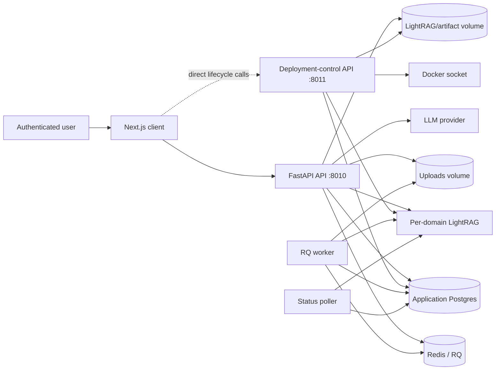
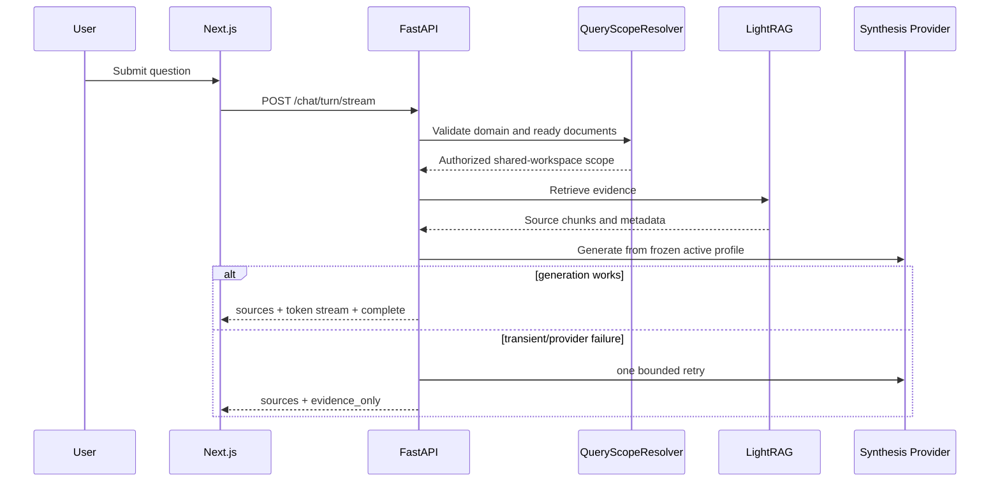
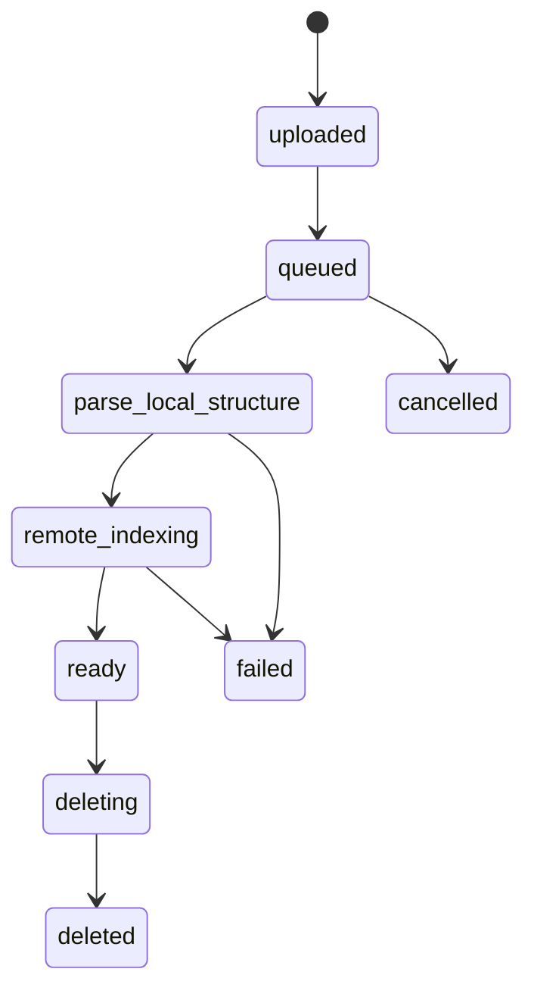

# Context Engine v1 — Production-Readiness Review

I used your production-readiness template and evidence-based reverse-engineering requirements.  

## 0. Review Contract

| Item                   | Review basis                                                                               |
| ---------------------- | ------------------------------------------------------------------------------------------ |
| Repository             | `tabesink/context_engine`                                                                  |
| Branch snapshot        | `v1`, pinned for this review to commit `127279b` (“june update,” June 25, 2026)            |
| Review date            | June 25, 2026                                                                              |
| Method                 | Static source, configuration, Docker, route, model, and client-call-path review            |
| Runtime execution      | Not performed: Compose, tests, LightRAG, providers, and migrations were not run            |
| Target operating model | 5–10 concurrent users; shared trusted workspace; admin-only write and lifecycle operations |
| Isolation model        | Shared corpus, not tenant/private-document isolation                                       |

`v1` was actively changing during review, so every deployment should be pinned to an immutable commit or image tag rather than the branch name. ([GitHub][1])

**Areas inspected:** `docker-compose.yml`, `app/main.py`, auth dependencies/routes, chat and retrieval routes, RAG scope policy, LightRAG deployment service, document ingestion worker/service/status layer, SQLAlchemy repositories/migrations, client API/auth modules, and test/CI structure.

---

# 1. Executive Production-Readiness Assessment

## What the system does

Context Engine is a Docker-composed, multi-user RAG application. The Next.js client authenticates users against a FastAPI backend; the backend owns users, document metadata, processing structures, operational records, model settings, and source navigation. LightRAG is deployed per knowledge domain and performs semantic/graph retrieval. Documents are uploaded by admins, parsed locally, converted into source-aware chunks, ingested into a domain LightRAG runtime, and later queried through a streaming chat synthesis path that can return evidence-only results when generation fails. ([GitHub][2])

## Production readiness verdict

**Overall status: Not Ready for real multi-user production.**

The architecture has several good foundations: server-side admin guards, shared document-access policy, per-domain LightRAG runtimes, source-aware chunks, a bounded synthesis retry, and typed evidence-only fallback. However, there is one P0 deployment-control defect and several P1 integrity/security/lifecycle gaps that can affect administrators, document correctness, or retrieval trustworthiness. ([GitHub][3])

| Area                             | Status          | Main reason                                                                                               |
| -------------------------------- | --------------- | --------------------------------------------------------------------------------------------------------- |
| Multi-user isolation             | **Conditional** | Correct only for the explicitly shared-corpus model; not safe for private/team tenant documents           |
| Authentication and authorization | **Risk**        | JWT is returned to the browser and stored in `localStorage`; no real logout/revocation path               |
| Chat and retrieval reliability   | **Risk**        | Active legacy chat endpoint allows browser-controlled model/retrieval controls                            |
| Document ingestion lifecycle     | **Risk**        | Job creation/enqueue is non-transactional; cancellation/deletion are cooperative across systems           |
| Evidence/citation traceability   | **Risk**        | Primary chat path is structured, but strict rejection of unknown generated citation IDs is not verified   |
| Concurrent workload handling     | **Risk**        | Per-domain lock exists, but manifest updates are unlocked and job idempotency is weak                     |
| External provider resilience     | **Conditional** | Bounded synthesis fallback is good; runtime secrets are copied into domain env files                      |
| Observability and diagnostics    | **Conditional** | Request/job IDs and structured logs exist; no verified metrics, tracing, backup, or persistent chat trace |
| Backup/recovery/deletion safety  | **Risk**        | Docker volumes are canonical for uploads/artifacts; no verified backup/restore or reconciliation path     |
| Test coverage and release safety | **Risk**        | Tests exist, but no GitHub Actions workflow was found and no release test run was available               |

## Top risks

| Priority | Risk                                                                                 | Impact                                                                                                                           | Next action                                                        |
| -------- | ------------------------------------------------------------------------------------ | -------------------------------------------------------------------------------------------------------------------------------- | ------------------------------------------------------------------ |
| P0       | Browser-facing lifecycle control cannot safely reach the Docker-socket control plane | Admins cannot reliably create/start/stop/delete domains remotely; exposing the control port would expose a highly privileged API | Make lifecycle control server-to-server only                       |
| P1       | Deprecated chat route remains active and accepts model/retrieval overrides           | Any authenticated user can bypass the intended global active synthesis profile and retrieval policy                              | Remove or hard-disable `/chat/query/stream`                        |
| P1       | Job dispatch, retry, cancellation, and deletion lack a durable cross-system contract | Duplicate, stuck, or orphaned ingestion; deleted documents can continue remote work                                              | Add deterministic job identity, reconciliation, and delete fencing |
| P1       | Browser token storage and logout are incomplete                                      | XSS exposure, persistent cookie session, no immediate revocation                                                                 | Use HTTP-only browser session only and implement server logout     |
| P1       | Retrieval scope differs between `/chat/turn/stream` and `/retrieve`                  | Stale/failed/non-ready document IDs can be passed to retrieval                                                                   | Reuse one authorized retrieval-scope resolver                      |

## Architecture direction

Keep the current **FastAPI + Postgres + Redis/RQ + remote LightRAG per-domain** shape. It is appropriate for 5–10 concurrent users.

Simplify before adding anything:

* Keep only one supported user query path: `/chat/turn/stream`.
* Keep only one server-side authorized retrieval scope implementation.
* Keep the Docker-socket deployment control plane private and callable only by the main API.
* Use the existing Postgres database for job idempotency, outbox/reconciliation, operations, and audit records rather than adding a workflow platform.
* Do **not** add Kubernetes, microservices, multi-provider auto-failover, event buses, or agent orchestration yet.

---

# 2. Runtime Topology and Ownership Map

## Active runtime components

| Component              | Responsibility                                                     |          Active | Evidence                                                              |
| ---------------------- | ------------------------------------------------------------------ | --------------: | --------------------------------------------------------------------- |
| Next.js web client     | Authentication UI, chat, documents, admin/domain UI                |             Yes | Client API modules call FastAPI routes and attach browser credentials |
| FastAPI API            | Public application API, auth, documents, retrieval, chat, settings |             Yes | `app.main:create_app`, port `8010`                                    |
| Deployment-control API | Same FastAPI application, but with Docker socket mounted           | Yes, privileged | Bound to `127.0.0.1:8011`                                             |
| Postgres               | Application metadata, users, documents, jobs, settings, logs       |             Yes | Compose `postgres`, Alembic migration service                         |
| Redis                  | RQ queue and ingestion locks                                       |             Yes | Compose `redis`, RQ worker                                            |
| RQ worker              | Local parse/chunk/remote-ingest jobs                               |             Yes | `python -m app.workers.worker`                                        |
| Status poller          | Refreshes remote LightRAG document statuses                        |             Yes | `python -m app.workers.status_poller`                                 |
| Per-domain LightRAG    | Retrieval, graph/vector storage, remote document indexing          |             Yes | Generated Compose/domain manifests                                    |
| Persistent files       | Original uploads and LightRAG domain artifacts                     |             Yes | Named Docker volumes                                                  |
| LLM/embedding provider | Synthesis and embedding provider selected by settings              |             Yes | Active profile + provider-secret configuration                        |

The control-plane separation is not currently complete: API, worker, and poller use the socket execution mode but only `deployment-control` mounts `/var/run/docker.sock`; meanwhile the browser client tries to call the deployment-control base directly. ([GitHub][2])

## Data ownership matrix

| Data type                  | Canonical owner                                | Main writers                 | Main cleanup owner             | Main risk                                 |
| -------------------------- | ---------------------------------------------- | ---------------------------- | ------------------------------ | ----------------------------------------- |
| Users / roles              | Application Postgres                           | Auth/admin flows             | Application DB                 | No session revocation model               |
| Domain manifest            | JSON manifest plus app lifecycle records       | Deployment-control service   | Domain lifecycle service       | No cross-process manifest lock            |
| Original upload            | Upload volume + document row                   | Admin upload route           | Document/domain purge services | Volume backup/recovery not verified       |
| Parsed structure / chunks  | App DB + artifact files                        | Worker                       | Document cleanup               | Cross-store cleanup is non-atomic         |
| Semantic retrieval / graph | Per-domain LightRAG storage                    | LightRAG ingestion           | LightRAG domain delete         | Remote work can outlive local deletion    |
| Ingestion jobs             | `JobRow` in app DB + RQ queue                  | Upload/job service           | Purge/status services          | DB commit and enqueue are separate        |
| Provider secrets           | Encrypted application DB, then domain env file | AI settings + domain service | Domain deletion                | Runtime secrets copied to persistent file |
| Chat session/context       | Browser state                                  | Client                       | Browser                        | Not durable or auditable server-side      |
| Query/operation logs       | Application DB/log stream                      | API/workers                  | Retention logic                | Full chat trace not persisted             |

---

# 3. Identity, Authorization, and Domain Isolation

## Identity model

| Concern                 | Current implementation                                                      | Assessment                                |
| ----------------------- | --------------------------------------------------------------------------- | ----------------------------------------- |
| Login                   | Username/password validates user and returns JWT                            | Verified                                  |
| Browser auth            | JWT is both returned in response and set as HTTP-only cookie                | Risk: two parallel auth modes             |
| Client token storage    | JWT stored in `localStorage` and sent as Bearer token                       | P1                                        |
| Cookie                  | HTTP-only, `SameSite=Lax`; secure only by environment/configuration         | Conditional                               |
| Token lifetime          | Configured access-token lifetime; no refresh-session model found            | P1                                        |
| Logout                  | Client clears local storage; no verified server logout or cookie clear      | P1                                        |
| Admin enforcement       | `require_admin` checks role server-side                                     | Good                                      |
| Object/domain isolation | Shared-corpus policy deliberately ignores user identity for ready documents | Correct only for shared trusted workspace |

The backend accepts either a Bearer token or cookie, but the client explicitly persists the same access token in `localStorage`; its logout path only removes client storage. ([GitHub][4])

## Authorization matrix

| Action                              | Standard user | Admin | Enforcement                                |
| ----------------------------------- | ------------: | ----: | ------------------------------------------ |
| List ready documents                |           Yes |   Yes | `DocumentAccessPolicy`                     |
| Read source structure/assets        |           Yes |   Yes | Document route policy                      |
| Query active domain                 |           Yes |   Yes | Authenticated route + query scope          |
| Upload document                     |            No |   Yes | Admin route group                          |
| Retry/cancel/delete document        |            No |   Yes | Admin route group                          |
| Create/start/stop/delete domain     |            No |   Yes | `require_admin`                            |
| Change providers/model profiles     |            No |   Yes | Admin settings routes                      |
| View operations/audit data          |            No |   Yes | Admin routes                               |
| View another user’s durable session |           N/A |   N/A | No durable server chat-session model found |

The intended policy is explicit: any authenticated user may read **ready** documents from active domains. That is suitable for one shared trusted knowledge base but must not be represented as tenant or document-owner isolation. ([GitHub][5])

## Isolation findings

| Resource                           | User-controlled identifier | Server validation                                                              | Result                |
| ---------------------------------- | -------------------------: | ------------------------------------------------------------------------------ | --------------------- |
| Chat domain                        |                        Yes | Domain availability validated server-side                                      | Good                  |
| Chat document filter               |                        Yes | Requires ready document in selected domain                                     | Good on new chat path |
| Document preview/assets            |                        Yes | Readability policy applied before retrieval                                    | Good                  |
| Admin lifecycle                    |                        Yes | Admin role dependency                                                          | Good                  |
| Legacy chat route                  |                        Yes | Scope validation exists, but model/retrieval controls remain client-controlled | Risk                  |
| Direct `/retrieve` document filter |                        Yes | Domain checked, but ready/active document policy is not reused                 | Risk                  |
| User/document ownership            |                        Yes | Deliberately not used in shared-corpus policy                                  | Product limitation    |

The new chat path uses `QueryScopeResolver`, which requires selected documents to be ready and in the requested available domain. The separate `/retrieve` service validates only document-domain membership, not the same ready/active policy. ([GitHub][6])

---

# 4. Core User and Admin Flows

## 4.1 User chat and evidence flow

The current supported chat route accepts only domain, client turn ID, question, and bounded conversation history. It resolves the active synthesis profile server-side, emits source evidence first, then streams either an answer or an evidence-only result. ([GitHub][6])

### Verified concern: a second active chat path remains

`POST /chat/query/stream` is marked deprecated but remains active. It accepts browser-supplied retrieval mode, top-k, token budgets, rerank choice, selected model profile, response type, and user prompt. That conflicts with the intended global synthesis profile and server-controlled retrieval policy. ([GitHub][6])

## 4.2 Document upload and ingestion flow

| Phase               | Owner                   | Persisted state             | Notes                                                          |
| ------------------- | ----------------------- | --------------------------- | -------------------------------------------------------------- |
| Upload registration | Admin API + JobService  | Document + `JobRow`         | Job row is committed before RQ enqueue                         |
| Local parse/chunk   | RQ worker               | Structure/chunks/artifacts  | Uses Docling/text parser and source-aware chunk builder        |
| Remote ingestion    | LightRAG adapter        | LightRAG tracking metadata  | Per-domain Redis lock                                          |
| Status refresh      | Status poller           | Document/job status         | Poller refreshes pending remote statuses                       |
| Completion          | Worker/poller           | Ready/failed document state | Embedding locks after first success                            |
| Cancellation        | Admin/service           | Job/document state          | Cooperative, not guaranteed to stop in-flight remote operation |
| Deletion            | Domain/document service | DB/files/LightRAG domain    | Non-transactional across stores                                |

The worker marks the job running, builds local structure, sends source chunks to LightRAG, and either marks success or waits for remote indexing. The ingestion service uses a Redis lock scoped to one domain with a 1,800-second timeout. ([GitHub][7])

## 4.3 Domain lifecycle flow

| Operation        | Current behavior                                                                          | Risk                                                      |
| ---------------- | ----------------------------------------------------------------------------------------- | --------------------------------------------------------- |
| Create           | Creates domain paths, per-domain Postgres identity, env file, manifest, generated Compose | Multiple side effects before a durable operation boundary |
| Start            | Writes env/Compose, builds, starts, then polls health up to five times                    | Synchronous and potentially slow admin request            |
| Stop             | Runs Docker Compose stop                                                                  | Reasonable                                                |
| Delete/archive   | Removes manifest, rewrites Compose, then archives/removes root directory                  | Does not explicitly stop/down the running service first   |
| Permanent delete | Disabled unless config allows it                                                          | Good safeguard                                            |

`remove()` deletes the domain from the manifest and filesystem/archive path but does not first invoke `stop()` or `down()` for the existing service. A running domain container may therefore survive configuration removal until separately handled. ([GitHub][8])

---

# 5. RAG Retrieval, Synthesis, and Agent Behavior

## Retrieval architecture

| Stage                | Current behavior                                                 | Risk                                                    |
| -------------------- | ---------------------------------------------------------------- | ------------------------------------------------------- |
| Scope normalization  | New chat route uses server-side domain/document scope            | Good                                                    |
| Shared-corpus access | User identity intentionally discarded for readable documents     | Fine only for trusted shared workspace                  |
| Direct retrieval     | Validates domain and requested document-domain relationship      | Does not reuse ready/active document policy             |
| LightRAG retrieval   | Remote per-domain retrieval                                      | Depends on remote availability and metadata consistency |
| Source mapping       | Source locator maps document/chunk/section/page/asset identities | Good foundation                                         |
| Synthesis            | Active profile resolved server-side                              | Good on current chat route                              |
| Provider failure     | Bounded retry then evidence-only fallback                        | Good                                                    |
| Legacy direct RAG    | Client can influence model/retrieval controls                    | P1                                                      |

Source evidence is structured around `document_id`, `chunk_id`, `workspace_node_id`, metadata, and source locators. This is the correct direction for opening citations in the document/context panel. ([GitHub][9])

## Evidence and citation contract

| Requirement                                 |       Status | Finding                                                              |
| ------------------------------------------- | -----------: | -------------------------------------------------------------------- |
| Stable evidence IDs                         |  Conditional | Depends on LightRAG metadata being preserved                         |
| Document/chunk locator                      |     Verified | Source-locator mapping exists                                        |
| UI can navigate source                      |     Verified | Document, structure, asset, and chunk routes enforce document policy |
| Deleted document cannot be read in preview  |     Verified | Document policy requires ready/active document                       |
| Deleted/failed document cannot be retrieved |         Risk | `/retrieve` does not reuse readiness policy                          |
| Answer can fall back to evidence-only       |     Verified | New streaming chat route supports it                                 |
| Generated citation ID strictly validated    | Not verified | Treat as a P1 until strict allow-list enforcement is confirmed       |

---

# 6. Data Model, Storage, and Lifecycle Review

## Canonical entity map

| Entity                         | Canonical store                          | Ownership/lifecycle                                         |
| ------------------------------ | ---------------------------------------- | ----------------------------------------------------------- |
| User                           | Application Postgres                     | Authenticated user with role and active flag                |
| Domain runtime                 | Manifest + application lifecycle records | Admin-managed LightRAG domain                               |
| Document                       | `DocumentRow`                            | Shared readable when ready and domain active                |
| Original file                  | Upload Docker volume                     | Linked by document storage path                             |
| Parsed structure/chunks/assets | Application DB + artifact storage        | Produced by worker                                          |
| Retrieval/graph data           | LightRAG per-domain storage              | Derived from source chunks                                  |
| Job/operation                  | Application `JobRow` + RQ                | Queue execution and user-facing status are separate systems |
| Provider secret                | Encrypted application DB                 | Copied into domain runtime env file                         |
| Chat session                   | Browser memory/client state              | Not durable server-side                                     |
| Query logs                     | Application DB/logging                   | Optional raw query persistence by config                    |

## Integrity concerns

* `JobRepository.create()` commits a job row before `JobService` enqueues it in RQ. If enqueue fails, a queued-looking DB job can exist without a queued worker task. ([GitHub][10])
* No active-job uniqueness or durable idempotency lookup is visible in the job repository path. Browser refreshes, retries, or race conditions can create more than one ingestion job for one document. ([GitHub][10])
* Domain manifests use atomic temp-file replacement, which avoids torn writes, but concurrent read-modify-write lifecycle operations can still overwrite each other because no manifest lock is present. ([GitHub][11])
* Original uploads, parsed artifacts, application metadata, remote LightRAG state, and generated Compose files have independent cleanup paths. There is no verified reconciliation scan or transaction boundary spanning them.

---

# 7. Concurrent Use and Capacity Review

| Workload                            | Current mechanism                    | Assessment                                                                            |
| ----------------------------------- | ------------------------------------ | ------------------------------------------------------------------------------------- |
| Concurrent chat requests            | Async API plus upstream HTTP clients | Likely sufficient for 5–10 users, but provider concurrency is not explicitly governed |
| Concurrent uploads                  | Admin routes and RQ queue            | Needs duplicate-submission protection                                                 |
| Concurrent ingestion in same domain | Redis domain lock                    | Good serialization intent                                                             |
| Concurrent ingestion across domains | Separate locks                       | Good in principle                                                                     |
| Lock expiry                         | 1,800 seconds                        | Risk if parse/remote work exceeds lock TTL                                            |
| Worker capacity                     | One Compose worker service           | Single-worker default; capacity not documented                                        |
| Remote status polling               | One poller service                   | No verified leader election if scaled                                                 |
| Domain lifecycle                    | Manifest and Compose mutations       | No lock/serialized operation guard                                                    |
| Redis durability                    | No Redis persistence volume declared | Queue/lock recovery risk after restart                                                |

The domain ingestion lock protects one LightRAG domain from parallel ingestion, but it is time-bounded and does not make job submission idempotent. The main Compose file also does not persist Redis data with a declared volume. ([GitHub][12])

---

# 8. Reliability, Retries, and Failure Recovery

| Failure scenario                             | Current behavior                                     | Gap                                  |
| -------------------------------------------- | ---------------------------------------------------- | ------------------------------------ |
| LLM transient failure                        | One bounded retry, then evidence-only result         | Good                                 |
| Missing active synthesis profile             | Typed configuration failure                          | Good                                 |
| LightRAG retrieval unavailable               | Typed 502/503/504 mapping                            | Good                                 |
| RQ enqueue fails after DB commit             | Job can remain recorded but undispatched             | P1                                   |
| Worker crash during ingestion                | No verified reconciliation of stale running jobs     | P1                                   |
| Redis restart                                | Queue/locks may be lost                              | P1/P2                                |
| Remote ingest continues after local deletion | Cooperative cancellation only                        | P1                                   |
| Domain delete while service running          | Manifest/files removed without explicit service stop | P1                                   |
| Browser disconnect during stream             | Stream closes; no durable turn/resume record         | Acceptable for now, but no recovery  |
| Restart/recovery                             | Compose restarts services                            | No verified end-to-end recovery test |

## Retry design

| Operation      | Current policy                                                        | Assessment                            |
| -------------- | --------------------------------------------------------------------- | ------------------------------------- |
| Chat synthesis | One retry using same resolved profile                                 | Good                                  |
| Retrieval      | Typed error; no verified bounded retry                                | Acceptable initially                  |
| Ingestion      | RQ work plus status polling; no explicit durable retry contract found | Risk                                  |
| Domain start   | Build/start then five health probes                                   | Limited                               |
| Cancellation   | Cooperative status checks                                             | Insufficient once remote ingest began |
| Delete         | Multi-store best effort                                               | Needs reconciliation                  |

---

# 9. Configuration, Models, and Provider Lifecycle

| Configuration                       | Source of truth                                          | Risk                   |
| ----------------------------------- | -------------------------------------------------------- | ---------------------- |
| App settings                        | Pydantic/environment variables                           | Good baseline          |
| Active synthesis profile            | Application DB/settings repository                       | Good                   |
| Embedding profile                   | Domain snapshot, locked after first successful ingestion | Good                   |
| Provider secret at rest             | Encrypted application DB                                 | Good direction         |
| Provider secret at runtime          | Per-domain `domain.env` file                             | P1                     |
| Domain Compose/manifest             | Generated files and manifest                             | Concurrent update risk |
| Browser-visible deployment endpoint | `NEXT_PUBLIC_LIGHTRAG_DEPLOY_CONTROL_URL`                | P0 control-plane risk  |
| Legacy query controls               | Request payload on deprecated route                      | P1 invariant bypass    |

The domain deployment service fetches provider-secret values and writes them into domain runtime environment files alongside domain configuration. This creates persistent plaintext runtime secret material in the LightRAG data volume unless file permissions and volume access are tightly controlled. ([GitHub][8])

---

# 10. API and UI Contract Review

## Material API contract map

| API flow                | Active route                | Caller                     | Main concern                                    |
| ----------------------- | --------------------------- | -------------------------- | ----------------------------------------------- |
| Login                   | `POST /auth/login`          | Client login               | Returns token and cookie                        |
| Session identity        | `GET /auth/me`              | Client bootstrap           | Client still relies on local token              |
| Supported chat          | `POST /chat/turn/stream`    | Chat UI                    | Correct direction                               |
| Legacy chat             | `POST /chat/query/stream`   | Any client with token      | Deprecated but functionally active              |
| Direct retrieval        | `POST /retrieve`            | Retrieval UI/API consumers | Scope policy mismatch                           |
| Documents               | `/documents/*`              | Read UI/context panel      | Stronger read policy                            |
| Admin documents         | `/admin/documents/*`        | Admin UI                   | Requires server-side admin guard                |
| Domains                 | `/admin/lightrag-domains/*` | Admin domain UI            | Browser/control-plane routing defect            |
| Model/provider settings | Admin settings routes       | Admin UI                   | Profile invariant bypassed by legacy chat route |
| Operations/audit        | Admin operations routes     | Admin UI                   | Useful, but not a full telemetry system         |

The browser client resolves an optional public deployment-control URL; when absent it falls back to the normal API. The normal API service does not mount the Docker socket, while the socket-capable control service is loopback-only. ([GitHub][2])

## UI state contract

| UI state                            | Backend support                           | Assessment                   |
| ----------------------------------- | ----------------------------------------- | ---------------------------- |
| No active synthesis profile         | `/chat/capability` and typed chat failure | Good                         |
| Retrieval failure before generation | Typed HTTP errors                         | Good                         |
| Synthesis failure with evidence     | `evidence_only` SSE event                 | Good                         |
| Upload progress                     | Processing-status read model              | Good                         |
| Domain processing busy              | Aggregated processing status              | Good                         |
| Upload retry                        | Failed state supports retry               | Needs idempotency protection |
| Upload cancel                       | Partial/cooperative semantics             | Needs clearer contract       |
| Domain unavailable                  | Registry error/status                     | Good direction               |

---

# 11. Observability and Operator Experience

## What exists

| Signal                      | Status                                                     |
| --------------------------- | ---------------------------------------------------------- |
| Request ID                  | Present via middleware                                     |
| Query ID                    | Present in retrieval logs                                  |
| Chat turn ID                | Present in synthesis logs/SSE                              |
| Job/operation ID            | Present in job model and processing status                 |
| Provider request identifier | Captured for some retrieval errors                         |
| Domain lifecycle state      | Manifest/lifecycle records                                 |
| Safe document status output | Hides LightRAG tracking ID from standard document response |
| Admin operation visibility  | Present                                                    |

The main application creates/propagates request IDs and the chat route logs turn IDs, profile metadata, evidence count, timing, and evidence-only failure state. ([GitHub][6])

## Missing or weak operator capabilities

* No verified central metrics, trace backend, alerting, or dashboard.
* No persisted answer/synthesis trace suitable for incident replay.
* No verified health/readiness checks for API, worker, or poller in Compose.
* No verified backup/restore procedure for Postgres, uploads, LightRAG artifacts, and manifests.
* No verified reconciliation report for documents, jobs, remote LightRAG state, and files.
* No verified release CI pipeline.

---

# 12. Testing, Evaluation, and Release Safety

| Area                      | Evidence                                                   | Assessment            |
| ------------------------- | ---------------------------------------------------------- | --------------------- |
| Python tests              | Test directory exists and recent commit changed test files | Present, not executed |
| Client tests              | Vitest-related client tooling exists                       | Present, not executed |
| Linting                   | Client scripts include lint; Python includes Ruff tooling  | Present, not executed |
| CI                        | No `.github/workflows` path found                          | Missing               |
| Compose E2E               | No executed evidence                                       | Missing               |
| Auth/isolation tests      | Not independently verified                                 | Unknown               |
| Delete/cancel/retry tests | Not independently verified                                 | Unknown               |
| Concurrency tests         | Not verified                                               | Missing               |
| Provider failure tests    | Some code paths exist; runtime proof absent                | Unknown               |
| RAG evaluation suite      | No curated benchmark/evidence regression set found         | Missing               |

No GitHub Actions workflow directory was found on the reviewed branch, and this review did not run the existing tests. 

---

# 13. Findings Register

## Finding RAG-001 — Public browser client cannot safely reach the privileged domain lifecycle control plane

**Priority:** P0
**Category:** Deployment / Security / Operations
**Status:** Verified
**Production impact:** Blocking
**Affected users:** Admins; all domains

### Evidence

* File: `docker-compose.yml`
* File: `client/src/lib/api/knowledge-graph-admin.ts`
* Runtime path: Admin UI → browser fetch → deployment-control URL or normal API → Docker Compose runner
* Confidence: High

Compose binds the Docker-socket-enabled control API to `127.0.0.1:8011`. The browser client directly targets `NEXT_PUBLIC_LIGHTRAG_DEPLOY_CONTROL_URL`, otherwise it falls back to the normal API. The standard API lacks the Docker socket. ([GitHub][2])

### Risk

Remote administrators cannot reliably perform domain lifecycle actions. Exposing port `8011` to make the browser call work would expose an application surface capable of Docker Compose lifecycle operations.

### Minimal safe fix

Remove browser-direct deployment-control calls.

Make the public API call the private deployment-control service server-to-server over the Docker network after enforcing `require_admin`. Use a private service token or network-only route.

### Acceptance criteria

* [ ] Browser never receives a deployment-control base URL.
* [ ] Port `8011` remains unpublished or loopback-only.
* [ ] Public API verifies admin role before forwarding lifecycle operations.
* [ ] A Compose E2E test verifies create/start/stop/delete from a remote browser origin.

**Estimated effort:** Medium
**Change risk:** Medium

---

## Finding RAG-002 — Deprecated direct-RAG endpoint bypasses intended global synthesis and retrieval policy

**Priority:** P1
**Category:** Synthesis / Retrieval / Authorization
**Status:** Verified
**Production impact:** High Risk
**Affected users:** All authenticated users

### Evidence

* File: `app/api/routes/chat_query.py`
* Route: `POST /chat/query/stream`
* File: `app/query/models.py`
* File: `app/query/policy.py`
* Confidence: High

The legacy route is marked deprecated but active. It accepts client-selected `model_profile_id`, retrieval mode, top-k, token budgets, reranking flag, response type, and `user_prompt`. ([GitHub][6])

### Risk

A normal authenticated user can select a model profile other than the intended global active synthesis profile and can modify retrieval behavior outside the current chat contract.

### Minimal safe fix

Remove the route from `app/main.py`, or return `410 Gone` with a migration error. Remove its client types and direct-RAG policy modules after confirming no internal caller requires them.

### Acceptance criteria

* [ ] Only `/chat/turn/stream` remains available to browser users.
* [ ] Browser cannot choose model, provider, prompt profile, top-k, or reranking.
* [ ] Every chat turn resolves the active synthesis profile server-side.
* [ ] Regression test confirms legacy route returns `410`.

**Estimated effort:** Small
**Change risk:** Low

---

## Finding RAG-003 — Browser JWT storage and logout behavior leave a persistent session exposure

**Priority:** P1
**Category:** Auth / Security
**Status:** Verified
**Production impact:** High Risk
**Affected users:** All users

### Evidence

* File: `app/api/routes/auth.py`
* File: `app/api/deps.py`
* File: `client/src/lib/api/client.ts`
* Confidence: High

Login returns an access token and sets it as a cookie. The client stores the returned token in `localStorage` and attaches it as a Bearer token. No server logout route or token revocation state was found. ([GitHub][4])

### Risk

An XSS issue could access persisted bearer credentials. Logging out removes client storage but may leave the valid session cookie/token usable until expiry.

### Minimal safe fix

For browser clients, stop returning/storing bearer tokens in JavaScript. Use an HTTP-only cookie session, add `POST /auth/logout` to clear it, and add a lightweight session/version claim so administrators can invalidate active sessions.

### Acceptance criteria

* [ ] No browser JWT in `localStorage`.
* [ ] Logout clears the cookie server-side.
* [ ] Deactivated users and revoked sessions fail immediately.
* [ ] State-changing cookie-authenticated routes have explicit origin/CSRF protections.

**Estimated effort:** Medium
**Change risk:** Medium

---

## Finding RAG-004 — `/retrieve` does not enforce the same readiness policy as chat and document read routes

**Priority:** P1
**Category:** Retrieval / Data lifecycle
**Status:** Verified
**Production impact:** High Risk
**Affected users:** All query users

### Evidence

* File: `app/api/routes/retrieve.py`
* File: `app/services/retrieval_service.py`
* File: `app/query/scope.py`
* File: `app/services/document_access_policy.py`
* Confidence: High

The new chat flow rejects selected documents unless they are ready and in the active requested domain. `/retrieve` checks only that selected document IDs map to the supplied LightRAG domain. ([GitHub][13])

### Risk

A client can attempt retrieval against failed, stale, or no-longer-readable document IDs if LightRAG still retains their chunks.

### Minimal safe fix

Create one `AuthorizedRetrievalScope` service used by both `/retrieve` and `/chat/turn/stream`. It must validate domain availability, document readiness, deletion state, and domain membership.

### Acceptance criteria

* [ ] `/retrieve` and chat share the same scope resolver.
* [ ] Failed/deleted/non-ready documents are rejected before remote retrieval.
* [ ] Domain inactivity suppresses documents from retrieval.
* [ ] Tests cover stale LightRAG chunks after local document deletion.

**Estimated effort:** Small
**Change risk:** Low

---

## Finding RAG-005 — Ingestion job submission and cancellation are not durable enough for safe retry/delete behavior

**Priority:** P1
**Category:** Ingestion / Concurrency / Reliability
**Status:** Verified
**Production impact:** High Risk
**Affected users:** Admins and all users querying domains

### Evidence

* File: `app/services/job_service.py`
* File: `app/storage/repositories/jobs.py`
* File: `app/workers/tasks.py`
* File: `app/services/lightrag_ingestion_service.py`
* Confidence: High

The job record is committed before the RQ enqueue call. The repository creates jobs without an idempotency lookup or visible uniqueness guard. Worker cancellation is cooperative, while remote LightRAG work can already have started. ([GitHub][10])

### Risk

Duplicate uploads/retries can enqueue duplicate ingestion. A queue failure can leave a persisted but undispatched job. A document/domain delete can mark local work cancelled while remote LightRAG indexing continues.

### Minimal safe fix

Add:

1. A unique active-ingestion constraint per document.
2. A deterministic RQ job ID derived from the operation ID.
3. A reconciliation worker that finds queued jobs without a valid RQ dispatch record.
4. A delete fence: mark document/domain deleting before remote actions, reject future status promotion, and reconcile any remote completion.

### Acceptance criteria

* [ ] Repeated upload/retry calls produce one active ingestion job.
* [ ] Every queued job is either dispatched or marked failed with a visible reason.
* [ ] Delete prevents a later poller result from restoring a document to ready.
* [ ] Forced worker restart test leaves no permanently stuck job.

**Estimated effort:** Medium
**Change risk:** Medium

---

## Finding RAG-006 — Domain delete can remove configuration before stopping the active LightRAG service

**Priority:** P1
**Category:** Lifecycle / Cleanup
**Status:** Verified
**Production impact:** High Risk
**Affected users:** Admins and domain users

### Evidence

* File: `app/lightrag_deploy/service.py`
* Symbol: `LightRAGDomainService.remove`
* Confidence: High

The delete path removes the manifest entry and archives/deletes filesystem artifacts without explicitly calling the Docker stop/down operation first. ([GitHub][8])

### Risk

A LightRAG container can survive without a canonical manifest/configuration record. This creates resource leaks, confusing diagnostics, and possible stale retrieval state.

### Minimal safe fix

Implement one delete saga:

`mark deleting → reject new jobs/queries → cancel/fence jobs → stop/down container → delete remote domain data → archive/delete files → delete DB rows → mark deleted`.

### Acceptance criteria

* [ ] A delete operation always stops the service before manifest removal.
* [ ] Delete is idempotent after partial failure.
* [ ] Reconciliation reports orphan containers, manifests, folders, databases, and documents.
* [ ] Admin can see deletion stage and safe remediation action.

**Estimated effort:** Medium
**Change risk:** Medium

---

## Finding RAG-007 — Provider secrets are encrypted in the app database but copied as plaintext into persistent domain configuration

**Priority:** P1
**Category:** Secret management / Deployment
**Status:** Verified
**Production impact:** High Risk
**Affected users:** Admins; all provider-backed domains

### Evidence

* File: `app/lightrag_deploy/service.py`
* File: `docker-compose.yml`
* Runtime path: encrypted provider secret → profile resolver → `write_domain_env` → persistent LightRAG volume
* Confidence: High

The domain deployment service retrieves provider-secret values and writes runtime environment files. The LightRAG data volume is shared by several services. ([GitHub][8])

### Risk

Secrets may be readable from persistent deployment artifacts, backups, support bundles, or containers with shared volume access.

### Minimal safe fix

Use a dedicated runtime-secret mount or protected env injection mechanism. At minimum, apply `0600` permissions, restrict read access to the deployment-control/LightRAG runtime, and exclude env files from diagnostics/export/archive behavior.

### Acceptance criteria

* [ ] Provider values do not appear in manifests, logs, operations, or UI responses.
* [ ] Domain env files are mode `0600`.
* [ ] Worker/API containers cannot read provider secret files unless required.
* [ ] Secret rotation regenerates only affected runtime configuration.

**Estimated effort:** Medium
**Change risk:** Medium

---

# 14. Implementation Backlog

| ID         | Priority | Task                                                                                          | Likely modules                           | Complexity |
| ---------- | -------- | --------------------------------------------------------------------------------------------- | ---------------------------------------- | ---------- |
| RAG-P0-001 | P0       | Replace browser-direct deployment-control access with private API-to-control-plane forwarding | Compose, admin client, lifecycle routes  | Medium     |
| RAG-P1-001 | P1       | Disable/remove legacy `/chat/query/stream` and direct control payload                         | Chat route, query policy/models, client  | Small      |
| RAG-P1-002 | P1       | Move browser auth to HTTP-only session with real logout/revocation                            | Auth route, deps, client auth store      | Medium     |
| RAG-P1-003 | P1       | Consolidate chat and retrieval scope validation                                               | Query scope, retrieval service, tests    | Small      |
| RAG-P1-004 | P1       | Add ingestion uniqueness, deterministic dispatch, and queued-job reconciler                   | Jobs, migrations, worker                 | Medium     |
| RAG-P1-005 | P1       | Implement delete saga and orphan reconciliation                                               | Domain/document services, operations UI  | Medium     |
| RAG-P1-006 | P1       | Harden runtime secret delivery                                                                | Deployment service, Compose, diagnostics | Medium     |
| RAG-P2-001 | P2       | Serialize manifest/domain lifecycle operations                                                | Manifest store, lifecycle service        | Small      |
| RAG-P2-002 | P2       | Add worker/poller health checks and backup/restore runbook                                    | Compose, docs, scripts                   | Small      |
| RAG-P2-003 | P2       | Add Compose E2E and concurrency tests to CI                                                   | Tests, GitHub Actions                    | Medium     |
| RAG-P2-004 | P2       | Add RAG regression dataset with expected evidence references                                  | Evaluation fixtures/tools                | Medium     |

## Recommended delivery phases

### Phase 0 — Production blockers

* RAG-P0-001: private control-plane routing.
* RAG-P1-001: remove legacy direct-RAG endpoint.
* RAG-P1-003: unify retrieval scope enforcement.

### Phase 1 — Reliable daily operations

* RAG-P1-004: durable ingestion dispatch/idempotency.
* RAG-P1-005: delete/cancel fencing and reconciliation.
* RAG-P1-002: browser auth/logout hardening.

### Phase 2 — Retrieval trust and evidence quality

* Strict citation allow-list validation.
* RAG evaluation fixtures with expected source IDs.
* Persist safe chat-turn/synthesis outcome metadata.

### Phase 3 — Operational hardening

* Runtime secret isolation.
* Manifest operation locking.
* Backup/restore procedure.
* CI Compose test matrix, failure injection, and limited concurrency tests.

---

# 15. Final Decision

## Safe to operate today?

**Decision: No, not for real multi-user production.**

It is usable as a tightly supervised internal development/pilot environment where administrators understand that lifecycle control, deletion recovery, and job consistency are not yet production-grade.

## Conditions before real multi-user use

1. Fix the deployment-control routing so privileged Docker operations are never browser-addressable.
2. Remove the legacy direct-RAG route and centralize retrieval scope enforcement.
3. Add durable ingestion idempotency, delete fencing, and reconciliation.
4. Replace browser `localStorage` JWT persistence with a server-controlled session/logout model.
5. Run Compose E2E tests covering upload → ready → query → cite → delete, provider failure, worker restart, and domain lifecycle.

## Highest-leverage next change

**Make the public FastAPI API the only browser-facing backend and have it forward admin lifecycle commands privately to deployment-control after server-side authorization.**

That resolves the P0 issue while creating a clean boundary for future audit logging, lifecycle locking, secret handling, and safer Docker-socket isolation.

[1]: https://github.com/tabesink/context_engine/commit/127279b "june update · tabesink/context_engine@127279b · GitHub"
[2]: https://raw.githubusercontent.com/tabesink/context_engine/v1/docker-compose.yml "raw.githubusercontent.com"
[3]: https://raw.githubusercontent.com/tabesink/context_engine/v1/app/api/deps.py "raw.githubusercontent.com"
[4]: https://raw.githubusercontent.com/tabesink/context_engine/v1/client/src/lib/api/client.ts "raw.githubusercontent.com"
[5]: https://raw.githubusercontent.com/tabesink/context_engine/v1/app/services/document_access_policy.py "raw.githubusercontent.com"
[6]: https://raw.githubusercontent.com/tabesink/context_engine/v1/app/api/routes/chat_query.py "raw.githubusercontent.com"
[7]: https://raw.githubusercontent.com/tabesink/context_engine/v1/app/workers/tasks.py "raw.githubusercontent.com"
[8]: https://raw.githubusercontent.com/tabesink/context_engine/v1/app/lightrag_deploy/service.py "raw.githubusercontent.com"
[9]: https://raw.githubusercontent.com/tabesink/context_engine/v1/app/retrieval/evidence_mapper.py "raw.githubusercontent.com"
[10]: https://raw.githubusercontent.com/tabesink/context_engine/v1/app/storage/repositories/jobs.py "raw.githubusercontent.com"
[11]: https://raw.githubusercontent.com/tabesink/context_engine/v1/app/lightrag_deploy/manifest.py "raw.githubusercontent.com"
[12]: https://raw.githubusercontent.com/tabesink/context_engine/v1/app/services/lightrag_ingestion_service.py "raw.githubusercontent.com"
[13]: https://raw.githubusercontent.com/tabesink/context_engine/v1/app/api/routes/retrieve.py "raw.githubusercontent.com"
