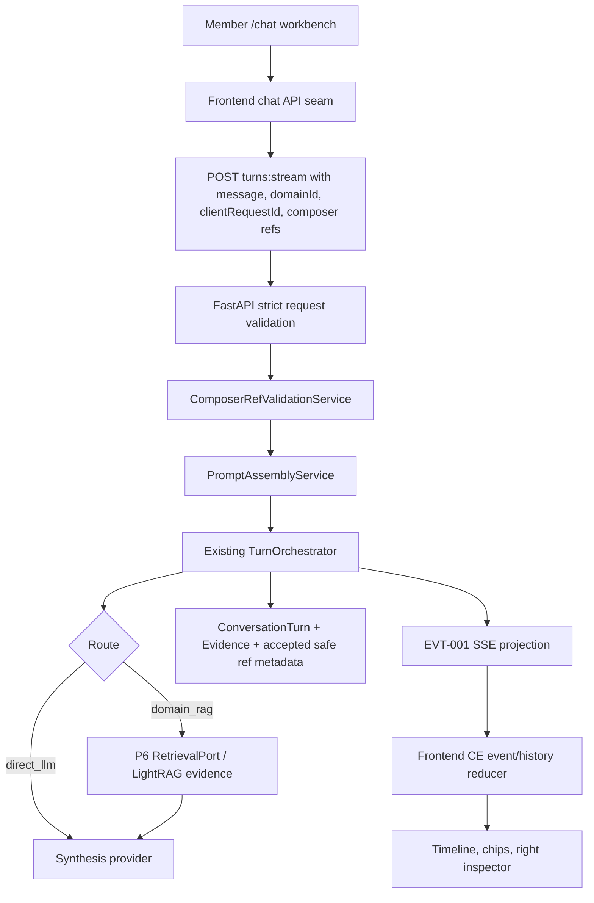
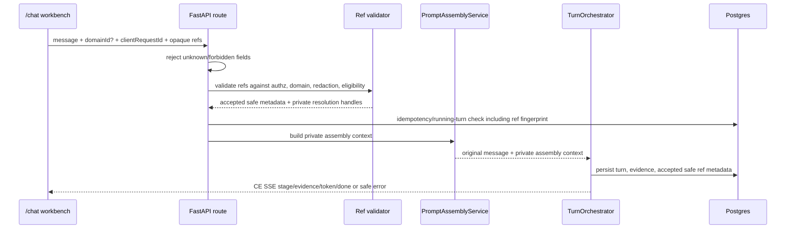

# Governed Context Assembly - Plan

## Goal Capsule

**Objective:** Deliver the next merged Context Engine product slice: governed composer refs, approved template refs, server-owned prompt assembly, Local Studio-style turn-harness ergonomics, and a clear three-region `/chat` workbench over the existing P7 chat path.

**Product authority:** `STRATEGY.md`, `CONTEXT.md`, `AGENTS.md`, `specs/04-features/F-007-grounded-streaming-chat/spec.md`, `specs/04-features/F-009-frontend-delivery/spec.md`, `specs/04-features/F-011-knowledge-curation-workspace/spec.md`, and the affected API/SSE/data/AI contracts.

**Contract gates:** Implementation starts with F-012 plus API-001, AI-001, DATA-001, EVT-001, F-009, and F-011 patches. No backend, frontend, migration, or SSE behavior may ship before the relevant contract text and acceptance evidence are updated.

---

## Product Contract

### Summary

Context Engine v1 for governed context assembly adds source/wiki/evidence mentions as opaque backend-validated composer refs, approved prompt-template refs, and Local Studio-style composer ergonomics on the existing server-persisted Conversation model. The browser submits ref selections with the user message; the backend validates refs, assembles the prompt through a server-owned `PromptAssemblyService`, then runs the existing TurnOrchestrator, LightRAG evidence path, Postgres turn persistence, and Context Engine SSE stream. The slice also clarifies `/chat` as a three-region workbench so Members can discover context, compose turns, and inspect evidence without gaining browser authority over prompts, retrieval, models, tools, or runtime state.

### Problem Frame

P1-P8 delivered governed domain RAG, evidence, citations, idempotency, safe direct chat, and streaming chat, but P7 turn input is still a thin question box: `message`, optional `domainId`, and `clientRequestId`. P9 currently allows Local Studio timeline/composer/streaming ergonomics while blocking uncontracted attachments, source mentions, model-profile controls, prompt controls, and extra context tabs. P11 introduces governed wiki curation, but its first slice is manual-only and explicitly defers Smart Composer AI/SSE behavior.

Local Studio proves the ergonomic shape users want: load context, ask, stream, inspect, stop, retry, and keep session state understandable. Context Engine must adapt those ideas into FastAPI-owned, multi-user RAG contracts rather than porting Pi runtime, JSONL session files, host filesystem tools, browser tools, local skills, or a second retrieval stack.

### Key Decisions

**KD-1 - Governed refs and templates first, not full Local Studio local context pipeline.** Start with governed composer refs and approved template refs, not the full Local Studio local context pipeline. Context Engine can adopt source/wiki/evidence mentions, server-persisted sessions, and Local Studio-style composer ergonomics, but all refs are opaque and backend-validated, and prompt assembly remains server-owned. Managed attachments, queue/steer/compact, member model choice, and filesystem-like wiki navigation are later contracts; host filesystem skills, local session authority, browser tools, and browser-side RAG stay outside CE's identity.

**KD-2 - `PromptAssemblyService` is the CE equivalent of Local Studio context assembly.** Local Studio `composer-context.ts` assembles local skills, plugins, attachments, and prompt content for a local agent. Context Engine maps that idea to a backend-owned `PromptAssemblyService` that resolves only approved CE refs and templates, applies AI-001 caps and ordering, and passes assembled context to the existing TurnOrchestrator without exposing raw prompt text.

**KD-3 - CE SSE is the harness stream, not raw Pi events.** Local Studio's Pi event stream maps to EVT-001 product events and persisted turn replay, not to raw Pi frames, tool-call events, or browser-owned runtime state. Any reconnect, replay, reducer, stop, retry, or running/idle UX must project from CE's safe SSE/history model.

**KD-4 - Conversations and Turns remain the session model.** Local Studio JSONL sessions map to Context Engine's Postgres Conversations and Turns. This slice does not introduce local JSONL authority, browser-held turn truth, session files, Pi session ids, or filesystem-derived session identity.

**KD-5 - Three-region `/chat` is the target workbench shape.** The desired product direction is a left context/discovery region, center conversation/composer region, and right evidence/ref/source/wiki inspector region inside the existing authenticated shell and compact icon rail. This requires an explicit F-009 update because current F-009 keeps the two-column `LightRagChatShell` plus `ContextPanelShell` until a different layout is accepted.

**KD-6 - Local Studio tab patterns guide UI structure, not runtime scope.** The right-side inspector should adapt Local Studio's "Computer tabs" / side-panel tab registry pattern first. Multi-pane PaneGrid, terminal/files/browser/Git tabs, and agent workspace runtime surfaces remain outside v1.

**KD-7 - `.reference-LS-frontend` is the frontend slice scaffold package.** Context Engine frontend planning should use the extracted Local Studio template slices as agent-facing scaffolds for layout, tokens, hook/API seams, and state reducers. Repo `DESIGN.md` remains the CE visual authority; `.reference-LS-frontend/DESIGN.md`, `_shared/styles/local-studio-tokens.css`, `chat-shell`, and `agent-workspace` are evidence for how to implement the CE workbench without importing Local Studio runtime authority.

### Local Studio Pipeline And Harness Adaptation

| Local Studio behavior | Context Engine adaptation | v1 status |
| --- | --- | --- |
| Composer context from skills/plugins/attachments | Governed source/wiki/evidence/template refs assembled by FastAPI | In scope |
| Prompt assembly in browser/Next local runtime | Server-owned `PromptAssemblyService` | In scope |
| Pi SDK turn loop | Existing CE TurnOrchestrator over P6 RetrievalPort and synthesis provider | In scope as existing spine |
| Pi runtime SSE frames | EVT-001 `stage`, `evidence`, `token`, `done`, `error` plus safe history/replay | In scope through CE events only |
| JSONL session logs | Postgres Conversations, Turns, and safe ref metadata | In scope through CE persistence |
| Event reducer | Frontend CE SSE/history reducer for running/idle, evidence, accepted refs, terminal outcomes | In scope |
| Stop/retry UX | CE client cancel/retry behavior over existing P7 settlement and idempotency rules | In scope |
| Context usage and assembly metadata | Safe labels/counts only; no raw prompt/source/provider content | In scope if contracted |
| Attachments | Managed CE attachment refs with upload/storage contract | Later contract |
| Queue / steer / follow-up | CE-owned server turn controls | Later contract |
| Compaction | CE-owned conversation summarization or context budget feature | Later contract |
| Member model choice | Approved CE model/profile selection policy | Later contract |
| Host filesystem skills and local `SKILL.md` discovery | Not adapted | Outside CE identity |
| Browser terminal/filesystem/Git/browser automation tools | Not adapted | Outside CE identity |

### Actors

| Actor | Role in this slice |
| --- | --- |
| Member | Composes turns with a message, optional Knowledge Domain, and validated composer refs; inspects evidence and safe ref metadata. |
| Administrator | Curates Knowledge Domains, Source Documents, wiki readiness, and approved templates so refs resolve safely. |
| Context Engine backend | Validates refs, assembles prompts, runs turns, persists safe metadata, enforces authorization/redaction/audit. |
| Frontend `/chat` workbench | Renders discovery, composer chips, streaming state, stop/retry affordances, and safe evidence/ref inspection without resolving private content locally. |
| Contract owners | Patch API-001, AI-001, DATA-001, EVT-001, F-009, and F-011 before implementation. |

### Requirements

**Composer refs and prompt assembly**

- R-001. A turn may include zero or more composer refs with the existing user message, domain selection, and client request id semantics after API-001 defines the request shape.
- R-002. V1 composer ref kinds are source, wiki, evidence, and template; exact token format, discovery surfaces, and error codes are deferred to contract work.
- R-003. The browser receives opaque ref tokens from server-owned discovery or validation surfaces; it never constructs refs from paths, raw ids, source text, prompt text, or host filesystem state.
- R-004. The backend validates every submitted ref before turn execution: existence, caller authorization, query eligibility, effective-domain compatibility, redaction/delete invalidation, and kind-specific rules.
- R-005. Invalid refs fail closed before unsafe prompt assembly; silent partial dropping is not allowed unless a later contract defines a safe degradation.
- R-006. Composer refs do not bypass the existing P7 route gate. Domain-specific, source-specific, operational, or ambiguous knowledge questions still require a selected Knowledge Domain.
- R-007. Resolved ref content remains server-private. Public API, SSE, logs, fixtures, traces, and UI may show only approved safe labels and metadata.
- R-008. `PromptAssemblyService` runs after ref validation and before TurnOrchestrator execution. Assembly ordering, caps, and conflict handling belong in AI-001.
- R-009. Prompt assembly preserves P7 guarantees: one running turn per conversation, idempotency, pre-stream validation, evidence/citation safety, redaction, and safe terminal outcomes.

**Approved templates**

- R-010. Approved prompt templates are CE-owned records or catalog entries selected by ref, not raw prompt text edited in the browser.
- R-011. Template discovery shows safe names and descriptions only. Template body, injection position, and interaction with Evidence remain server-owned.
- R-012. Template authoring, Smart Composer AI assist, and template-driven wiki writes remain outside this slice unless F-011 and contracts explicitly promote them.

**Agent harness ergonomics**

- R-013. The frontend may present turn submission as fire-and-forget only where it preserves P7's accepted turn semantics, pre-stream failures, idempotency, and one-running-turn rule.
- R-014. SSE progress and reconnect UX must reduce CE events and history state, not Local Studio Pi events. The UI tracks running/idle/terminal state from safe CE truth.
- R-015. Stop and retry UX must use contracted CE cancel/retry/idempotency behavior and must preserve user text and selected refs after safe pre-stream failures.
- R-016. Context usage or assembly metadata, if shown, must be safe aggregate metadata only and must not reveal prompt text, raw source text, template bodies, retrieval payloads, or provider state.
- R-017. Queue, steer, follow-up, compact, multi-pane comparison, and member model choice are explicitly future CE contracts, not v1 defaults.

**Frontend main layout**

- R-018. `/chat` targets a three-region workbench inside the existing authenticated shell and compact icon rail.
- R-019. The left region provides compact Chats plus governed Sources/Wiki/Templates discovery. It does not become a local project tree, host filesystem browser, or plugin explorer.
- R-020. The center region owns the active Conversation timeline and anchored composer with selected ref chips, running/disabled state, keyboard submit, stop/retry, and safe error recovery.
- R-021. The right region is a tabbed inspector for current-turn Evidence, accepted refs, and safe source/wiki metadata. It adapts Local Studio right-side tab grammar but does not port terminal, browser, files, Git, or tool panels.
- R-022. Mobile and narrow layouts keep the active chat/composer primary and collapse left/right regions into drawers or tabs without exposing extra browser authority.
- R-023. Components consume typed Context Engine API/SSE wrappers only. No frontend component may call LightRAG, provider APIs, storage paths, runtime URLs, Docker, database, or controller routes.

**Local Studio frontend slice usage**

- R-024. Frontend implementation planning should start from `.reference-LS-frontend/templates/nextjs-feature-demos/features/chat-shell/` for the center conversation/composer surface and `.reference-LS-frontend/templates/nextjs-feature-demos/features/agent-workspace/` for the three-region shell, right-side tab grammar, session/search affordances, and reducer patterns.
- R-025. Agents may copy or adapt the slice folder contract (`components/`, `hooks/`, `api/`, `types/`, `fixtures/`, `constants/`, `index.ts`, `README.md`) when building CE slices, but CE contracts replace Local Studio fixture/API/runtime shapes.
- R-026. The per-slice `api/index.ts` seam maps to Context Engine typed API/SSE wrappers. Components never fetch directly; hooks call the slice API seam only.
- R-027. Shared Local Studio visual materials from `.reference-LS-frontend/DESIGN.md`, `.reference-LS-frontend/templates/nextjs-feature-demos/_shared/styles/local-studio-tokens.css`, and `_shared/ui` should inform tokens, primitives, chip grammar, dense rows, tabs, and compact workstation geometry, while repo `DESIGN.md` remains the governing CE design document.
- R-028. Local Studio-only runtime affordances must be stripped, hidden, or left unimplemented unless a later CE contract promotes them: PaneGrid multi-pane comparison, terminal/filesystem/Git/browser panels, Pi event frames, local session ids, model picker/provider controls, host path display, queue/steer/follow-up, compact, and local plugin/skill discovery.

### Frontend Main Layout

```text
Authenticated shell + compact icon rail
┌───────────────┬──────────────────────────────────────┬──────────────────────┐
│ Left workbench│ Center conversation                  │ Right inspector      │
│               │                                      │                      │
│ Chats         │ Conversation title / state           │ [Evidence][Refs]     │
│ Sources       │ Timeline                             │ [Source][Wiki]       │
│ Wiki          │ SSE progress / terminal state        │                      │
│ Templates     │ Anchored composer                    │ Evidence list        │
│               │ Ref chips + message input            │ Accepted refs        │
└───────────────┴──────────────────────────────────────┴──────────────────────┘
```

The left region is for discovery and navigation, the center region is for the active turn, and the right region is for inspection. This is a product-shape decision for the brainstorm artifact, not a permission to implement before F-009 accepts the layout change.

The right inspector should reuse the Local Studio tab-system lesson from `.references/local-studio-tab-patterns.md`: a single tab registry, a tab-to-panel router, and stable state for open/active tabs. The plan explicitly selects that side-panel pattern and excludes Local Studio's PaneGrid/multi-pane workspace behavior from v1.

The visual system must follow `DESIGN.md` and `.references/local-studio-visual-parity-package.md`: dark-first compact workstation, Geist typography, dense rows, restrained borders, tokenized tabs/chips/status rows, and no generic white dashboard or broad shadcn redesign.

### Frontend Slice Package Usage

`.reference-LS-frontend` is the implementation scaffold package for agents building CE frontend slices. It is not product authority and its runtime/API contracts do not supersede Context Engine specs.

| Package source | CE use | Do not port |
| --- | --- | --- |
| `.reference-LS-frontend/DESIGN.md` | Token-first Local Studio parity rules, dark-first workstation grammar, dense typography, compact controls, and primitive guidance to reconcile with repo `DESIGN.md`. | Any rule that conflicts with CE `DESIGN.md`, AGENTS.md, or Context Engine contracts. |
| `templates/nextjs-feature-demos/_shared/styles/local-studio-tokens.css` and `_shared/ui` | Shared token and primitive reference for CE chips, tabs, status rows, panels, and dense lists. | A new standalone template design system that bypasses CE styling constraints. |
| `templates/nextjs-feature-demos/features/chat-shell/` | Center conversation/composer slice: timeline, lifted composer, chips, streaming/error/stop/retry states, and status reduction patterns. | Attachments, local project status bar, model picker, local context/plugin/skill semantics, or LS runtime endpoint shapes. |
| `templates/nextjs-feature-demos/features/agent-workspace/` | Three-region shell evidence: left navigation/discovery ideas, center chat pane, right tabbed inspector, sessions/search/palette patterns, and event reducer organization. | PaneGrid multi-pane as v1 default, nine "computer" tool tabs, terminal/browser/filesystem/Git/canvas tools, Pi frames, compact/queue/steer behavior. |
| `docs/feature-parity/backend-wiring.md` | API seam discipline: components render hook state, hooks call `api/*`, and the API seam is where FastAPI/SSE wiring belongs. | Local Studio endpoint paths, Pi event grammar, session ids, or fixture response shapes as CE public contracts. |

For CE implementation, the practical rule is: reuse the slice architecture and visual grammar, replace the data plane. Local Studio fixture streams become CE EVT-001 streams; Local Studio agent-session data becomes Postgres Conversation/Turn history; Local Studio context chips become opaque CE composer refs.

### Key Flows

- F-1. Member composes a grounded turn with refs: select a Knowledge Domain, type a message, add source/wiki/evidence/template refs, submit, backend validates refs pre-execution, `PromptAssemblyService` assembles safe context, and the existing P7 turn path streams evidence before grounded answer tokens.
- F-2. Ref validation fails closed: a stale, unauthorized, redacted, deleted, or out-of-domain ref fails before unsafe prompt assembly; the frontend preserves editable text and selected chips for correction.
- F-3. Direct LLM turn with template ref: a non-domain general message may attach an approved template ref; the backend validates the template and runs direct LLM without retrieval or citations.
- F-4. Reconnect and replay: the frontend rebuilds running/idle/terminal state from CE SSE/history, not Pi event frames, and does not replay unsafe prompt/source/provider content.
- F-5. Stop and retry: stopping a running turn follows CE cancel settlement; retry uses existing idempotency/request-conflict rules and resubmits only contracted safe inputs.

### Scope Boundaries

**In v1**

- Source/wiki/evidence/template composer refs.
- Approved template refs.
- Server-persisted Conversations and Turns.
- Server-owned `PromptAssemblyService`.
- Local Studio-style composer ergonomics.
- Fire-and-forget turn UX where compatible with P7.
- SSE progress, reconnect/replay clarity, and frontend CE event reduction.
- Stop/retry UX.
- Running/idle state display.
- Context usage or assembly metadata as safe labels only.
- Three-region `/chat` workbench.

**Later contracts**

- Managed attachments.
- Queue, steer, and follow-up.
- Compaction.
- Member model choice.
- Filesystem-like wiki navigation as a CE-owned knowledge-library metaphor.
- Extra right-panel tabs beyond evidence/ref/source/wiki inspection.
- Multi-pane chat comparison.
- Advanced session actions such as pin/archive/export.

**Outside CE identity**

- Pi SDK runtime.
- JSONL session authority.
- Host filesystem skills.
- Local `SKILL.md` discovery from user machines.
- Browser tools: terminal, filesystem editor, Git, browser automation.
- Browser-side RAG.
- Local vector store or second retrieval stack.
- Plugin framework or extension loading.
- Raw prompt editor.
- Arbitrary browser model/provider/retrieval controls.

### Dependencies and Assumptions

| Dependency | Why it matters |
| --- | --- |
| API-001 | Must define turn input extension, ref discovery/validation, safe history metadata, and canonical ref errors. |
| AI-001 | Must define prompt assembly ordering, template injection, ref-to-context mapping, caps, and route-gate interaction. |
| DATA-001 | Must define accepted composer-ref persistence, template catalog records, and redaction invalidation behavior. |
| EVT-001 | Needs a patch only if accepted ref metadata appears in SSE or replay projections beyond history fetch. |
| F-007 | Supplies the existing TurnOrchestrator, idempotency, one-running-turn rule, safe SSE, evidence, and redaction spine. |
| F-009 | Must accept the three-region `/chat` layout, composer chips/picker, and visual acceptance before frontend implementation. |
| F-011 | Must define wiki ref eligibility and the template vs Smart Composer boundary before wiki/template behavior ships. |
| `DESIGN.md` | Governs Local Studio visual parity for the workbench, chips, tabs, rows, and panels. |
| `.reference-LS-frontend` | Provides extracted Local Studio template slices, shared tokens/primitives, feature guides, and backend seam examples for agents to adapt under CE contracts. |

Assumptions:

- The next buildable slice is refs, templates, turn-harness ergonomics, and layout clarity, not attachments or full Local Studio runtime behavior.
- Wiki/source/evidence refs are allowed as product intent but require contracts before code.
- Filesystem-like wiki navigation is a future CE knowledge-library metaphor, not host filesystem access.
- Existing P7 idempotency and replay semantics remain the starting point; new event-log cursor behavior must be specified as CE behavior before implementation.
- No raw source text, raw prompt text, template body, raw answer, private id, path, runtime URL, provider payload, or raw LightRAG hit may appear in public artifacts.

### Success Criteria

- SC-001. A measurable share of grounded turns use at least one composer ref.
- SC-002. Ref validation failures fail before SSE and do not leak private content.
- SC-003. Grounded turns with refs preserve P7 stream ordering and terminal outcomes.
- SC-004. Members can inspect evidence and accepted safe ref metadata after a grounded turn.
- SC-005. `/chat` visually reads as a Local Studio-parity workbench without terminal/filesystem/Git/browser/model-controller controls.
- SC-006. Contract reviewers can identify every API/SSE/data/AI behavior change before implementation begins.

### Acceptance Examples

- AE-001. Given an authorized source ref in an available Knowledge Domain, when a Member submits a grounded turn with that ref, then the turn either completes with evidence/citations or returns a safe terminal outcome, and history shows safe source-ref metadata.
- AE-002. Given a redacted or deleted source backing a held ref token, when the Member submits, then the API returns a pre-stream error and the composer preserves editable state.
- AE-003. Given a non-domain general message with only an approved template ref, when submitted without a domain, then the direct LLM path completes with no Evidence rows and safe template-ref metadata.
- AE-004. Given a forbidden client control field such as raw prompt text or provider selection, when submitted with refs, then validation rejects the request regardless of otherwise valid refs.
- AE-005. Given the three-region `/chat` workbench, when visually inspected, then left discovery, center conversation/composer, and right inspector are visible on desktop, while forbidden Local Studio runtime panels are absent.
- AE-006. Given a reconnect after a completed or failed turn, when the frontend rehydrates state, then it uses CE history/SSE replay semantics and does not duplicate displayed events or expose raw runtime frames.

### Planning Decisions And Deferred Questions

**Resolved for this plan**

- PD-001. V1 keeps the existing `POST /conversations/{conversation_id}/turns:stream` transport. Fire-and-forget is a frontend ergonomics model over CE SSE, not a new `202 Accepted` turn queue.
- PD-002. V1 composer ref kinds are source, evidence, template, and wiki. Wiki discovery can ship only after F-011 defines a query-eligible safe read surface; if that gate is not ready, wiki chips remain disabled while the backend contract remains prepared.
- PD-003. Accepted ref metadata is persisted as safe labels on the turn and may appear in conversation history and approved terminal/replay projections only. There is no raw prompt/context SSE event.
- PD-004. Approved templates are CE-owned catalog records. Members select template refs; template bodies remain server-private. Admin CRUD can be minimal, but template approval cannot be browser-local.
- PD-005. Evidence refs in v1 are restricted to owner-scoped, completed, non-redacted evidence, with active-conversation discovery as the first UI surface. Cross-conversation evidence discovery is deferred unless the contract explicitly promotes it.

**Deferred to implementation**

- OQ-006. Exact DTO names, token encoding, table names, indexes, and migration filenames.
- OQ-007. Exact mention trigger characters and keyboard UX.
- OQ-008. Assembly caps for many refs and long template bodies.
- OQ-009. Desktop and mobile breakpoint behavior for the three-region layout.

### Sources and Research

| Source | Use |
| --- | --- |
| `STRATEGY.md` | Governs target problem, approach, metrics, and tracks for context assembly and turn harness. |
| `AGENTS.md` | Defines backend authority, browser thinness, contract safety, and Local Studio visual parity constraints. |
| `CONTEXT.md` | Defines Knowledge Domain, Evidence, Conversation, Turn, Wiki Page, and Smart Composer vocabulary. |
| `DESIGN.md` | Governs compact dark-first Local Studio visual parity. |
| `specs/04-features/F-007-grounded-streaming-chat/spec.md` | Existing chat, TurnOrchestrator, SSE, idempotency, and out-of-scope harness boundaries. |
| `specs/04-features/F-009-frontend-delivery/spec.md` | Current frontend shell, chat-layout gate, typed API/SSE wrappers, and blocked surfaces. |
| `specs/04-features/F-011-knowledge-curation-workspace/spec.md` | Wiki/Smart Composer boundaries and manual-only first slice. |
| `specs/03-contracts/api/context-engine-v1.md` | Current API catalog and P7 turn request constraints. |
| `specs/03-contracts/ai/grounded-answering.md` | Current AI route ownership and browser control restrictions. |
| `specs/03-contracts/events/context-engine-sse-v1.md` | Current CE SSE event names, ordering, payload safety, and replay constraints. |
| `specs/03-contracts/data/context-engine-data.md` | Current Conversation, Turn, Evidence ref, Wiki, and redaction persistence model. |
| `.references/local-studio-tab-patterns.md` | Reference for right-side tab registry/router pattern and excluded PaneGrid scope. |
| `.references/local-studio-visual-parity-package.md` | Reference for Local Studio visual parity extraction and acceptance constraints. |
| `.reference-LS-frontend/AGENTS.md` | Defines the extracted frontend slice package rules: fixture-backed slices, folder contract, API seam discipline, token-first styling. |
| `.reference-LS-frontend/DESIGN.md` | Extracted Local Studio template design guide for tokens, primitives, layout geometry, and prohibited visual drift. |
| `.reference-LS-frontend/docs/feature-parity/backend-wiring.md` | Documents the `components -> hooks -> api -> FastAPI/SSE` seam and why CE wiring belongs in typed API wrappers. |
| `.reference-LS-frontend/docs/feature-parity/features/chat-shell.md` | Reference for center conversation/composer slice, streaming states, stop/retry, and blocked tool panels. |
| `.reference-LS-frontend/docs/feature-parity/features/agent-workspace.md` | Reference for three-region shell, right tab grammar, sessions/search affordances, and runtime features to exclude from CE v1. |
| `.reference-LS-frontend/templates/nextjs-feature-demos/features/chat-shell/` | Copy/adaptation source for CE chat-shell component/hook/API slice structure. |
| `.reference-LS-frontend/templates/nextjs-feature-demos/features/agent-workspace/` | Copy/adaptation source for CE workbench shell, inspector, and reducer structure. |
| `.reference-LS-frontend/templates/nextjs-feature-demos/_shared/styles/local-studio-tokens.css` | Shared token evidence for dense Local Studio visual parity. |
| `.references/code/local-studio/` | Read-only source evidence for Local Studio composer, runtime, event, and shell patterns. |
---

## Planning Contract

**Product Contract preservation:** changed: KD-7 and R-024 through R-028 were added from the user's explicit `.reference-LS-frontend` and DESIGN.md direction; the existing Product Contract IDs, scope boundaries, and non-goals are otherwise preserved.

### Key Technical Decisions

- KTD-001. **Create F-012 as the owning feature slice.** This work is larger than a patch to F-009 or F-011 because it changes API, AI assembly, data persistence, SSE/history projection, and frontend chat shape. F-009 and F-011 are dependencies that receive targeted contract patches, while F-012 owns the vertical slice.
- KTD-002. **Keep P7 stream transport for v1.** Fire-and-forget ergonomics are implemented as UI state over `turns:stream`; a separate accepted-turn queue is deferred to the later queue/steer/follow-up contract. This avoids introducing a second turn lifecycle while still borrowing Local Studio's submit/progress feel.
- KTD-003. **Persist accepted refs as safe turn metadata.** Idempotency and replay must compare message, effective domain, route, and accepted composer-ref fingerprint. Public history and approved terminal projections show safe labels only; raw resolved content, template bodies, and assembly text remain private.
- KTD-004. **PromptAssemblyService sits between validation and TurnOrchestrator.** Ref validation resolves permissions and eligibility first, prompt assembly builds private model context second, then the existing TurnOrchestrator streams through the same direct/direct-domain routes. `ConversationTurn.user_message` remains the user's original message, not the assembled prompt.
- KTD-005. **Use `.reference-LS-frontend` as scaffold, not contract.** Frontend folders, hook/API seam, reducer structure, and visual grammar may be copied or adapted. Local Studio endpoint paths, Pi event frames, tool panels, model picker, local paths, skills/plugins, and JSONL session semantics are replaced by CE contracts.
- KTD-006. **Templates are CE catalog objects.** Template refs point to approved server records. Members can discover safe names/descriptions; Administrators can curate the catalog through the minimal contract approved for F-012 or through seeded records if admin CRUD is deferred.

### High-Level Technical Design





### Sequencing

1. Contract and feature-spec patch first: create F-012 and close API/AI/DATA/EVT/F-009/F-011 drift before code.
2. Backend persistence and validation second: tables/models/services must exist before API request expansion.
3. Prompt assembly and turn integration third: extend the existing P7 spine without creating a new runtime.
4. Frontend API seam and reducer fourth: keep components free of raw `fetch` and raw SSE payload ownership.
5. Workbench layout last: adapt the LS slices once typed wrappers and fixtures exist.
6. Acceptance and traceability closeout after backend/frontend evidence is captured.

### Assumptions

- The feature number `F-012` is available for this merged slice. If a concurrent plan claims it first, use the next feature id and preserve the same title and scope.
- Existing P7 direct/domain route behavior remains authoritative; refs influence assembly context, not route selection controls exposed to the browser.
- The first frontend implementation can ship wiki discovery disabled when P11 query-eligible wiki ref discovery is not ready, as long as the disabled state is explicit and contract-backed.
- Template catalog administration can be minimal for the first slice, but template approval cannot be represented as browser-local fixtures in production.

### Risks And Mitigations

| Risk | Mitigation |
| --- | --- |
| Public DTOs leak raw source, template body, prompt, private ids, or provider content. | Contract-first safe DTOs, focused API/SSE tests, safety scan over fixtures/logs/screenshots. |
| Ref validation changes idempotency semantics and creates duplicate or conflicting turns. | Include accepted-ref fingerprint in conflict checks and replay tests before widening the request body. |
| Frontend ports Local Studio runtime controls by accident. | Use `.reference-LS-frontend` only through the slice/folder seam and add acceptance scans for absent terminal/filesystem/Git/browser/model/local-path controls. |
| Wiki refs depend on incomplete F-011 read/eligibility behavior. | Gate wiki discovery behind a contract flag/disabled state until F-011 proves safe query-eligible wiki reads. |
| Prompt assembly becomes a hidden second retrieval stack. | Restrict assembly to validated CE refs/templates and existing P6 retrieval; no browser RAG, vector store, tools, or host filesystem access. |

---

## Implementation Units

### U1. Define F-012 And Patch Contracts

- **Goal:** Establish the feature home and public contracts for governed composer refs, approved templates, prompt assembly, safe metadata, and three-region chat layout before any code relies on them.
- **Requirements:** R-001 through R-028; SC-006; AE-004, AE-005, AE-006.
- **Dependencies:** None.
- **Files:** `specs/04-features/F-012-governed-context-assembly/spec.md`, `specs/04-features/F-012-governed-context-assembly/plan.md`, `specs/04-features/F-012-governed-context-assembly/tasks.md`, `specs/04-features/F-012-governed-context-assembly/test-plan.md`, `specs/04-features/F-012-governed-context-assembly/acceptance.md`, `specs/04-features/F-012-governed-context-assembly/ux.md`, `specs/04-features/F-012-governed-context-assembly/implementation-log.md`, `specs/03-contracts/api/context-engine-v1.md`, `specs/03-contracts/ai/grounded-answering.md`, `specs/03-contracts/data/context-engine-data.md`, `specs/03-contracts/events/context-engine-sse-v1.md`, `specs/04-features/F-009-frontend-delivery/spec.md`, `specs/04-features/F-009-frontend-delivery/test-plan.md`, `specs/04-features/F-011-knowledge-curation-workspace/spec.md`, `specs/07-traceability/feature-register.md`.
- **Approach:** Add F-012 as the owner slice. API-001 defines the turn input extension, ref discovery/validation surfaces, template catalog shape, safe errors, safe history fields, and forbidden fields. AI-001 defines `PromptAssemblyService`, assembly ordering/caps, template placement, and route-gate interaction. DATA-001 defines accepted turn-ref persistence and template catalog persistence. EVT-001 defines whether safe ref metadata appears in terminal/replay events or only history. F-009 accepts the three-region layout and LS slice package adaptation. F-011 defines wiki-ref eligibility or keeps wiki discovery disabled.
- **Execution note:** Contract-first. Do not implement backend/frontend code until this unit lands.
- **Patterns to follow:** `specs/04-features/F-007-grounded-streaming-chat/`, `specs/04-features/F-009-frontend-delivery/`, `specs/04-features/F-011-knowledge-curation-workspace/`, existing API/DATA/AI/EVT contract sections.
- **Test scenarios:**
  - Contract review confirms every new public field has safe semantics and no raw prompt/source/template/provider/private id exposure.
  - Contract review confirms F-009 no longer blocks the specific three-region `/chat` layout and composer refs, while still blocking LS runtime tools.
  - Contract review confirms F-011 either approves wiki ref eligibility or explicitly gates wiki discovery off.
- **Verification:** F-012 specs exist, contracts cite F-012 behavior, feature register includes F-012, and no implementation unit depends on uncontracted public fields.

### U2. Add Data Model For Templates And Accepted Turn Refs

- **Goal:** Persist approved template catalog records and accepted composer-ref metadata for turns without storing raw assembled prompts or raw resolved context.
- **Requirements:** R-001 through R-011, R-016, R-024; SC-001, SC-002, SC-004.
- **Dependencies:** U1.
- **Files:** `context_engine/models.py`, `migrations/versions/20260708_0009_governed_context_assembly.py`, `tests/test_governed_context_assembly.py`, `specs/04-features/F-012-governed-context-assembly/implementation-log.md`.
- **Approach:** Add contract-approved persistence for approved prompt templates and accepted turn refs. Accepted refs store kind, safe display metadata, ordering, invalidation/redaction state, and the backend-owned linkage needed for replay/audit. They do not store raw source text, template body in turn rows, raw prompt text, source paths, private block ids in public-facing columns, or raw provider/retrieval payloads. Add constraints that preserve one turn's ref ordering and redaction clearing rules.
- **Execution note:** Start with migration/model tests because DATA-001 requires fresh-upgrade proof for data changes.
- **Patterns to follow:** `migrations/versions/20260706_0006_conversations_and_turns.py`, `migrations/versions/20260707_0008_wiki_curation_workspace.py`, `tests/test_conversations.py`, `tests/test_wiki_curation.py`.
- **Test scenarios:**
  - Fresh migration creates the template and accepted-ref persistence with required constraints and without forbidden raw-content columns.
  - Redacting or invalidating an accepted ref clears public labels according to DATA-001 while preserving private audit linkage only where approved.
  - Deleting a conversation cascades accepted-ref rows without orphaning public metadata.
- **Verification:** Migration tests pass on a fresh database and model constraints prevent unsafe or duplicate accepted-ref rows.

### U3. Implement Composer Ref Validation And Template Catalog Services

- **Goal:** Provide backend services and API surfaces for discovering, validating, and resolving opaque source/wiki/evidence/template refs before turn execution.
- **Requirements:** R-001 through R-007, R-010 through R-012, R-019; AE-001, AE-002, AE-003.
- **Dependencies:** U1, U2.
- **Files:** `context_engine/services/composer_refs.py`, `context_engine/services/prompt_templates.py`, `context_engine/services/wiki.py`, `context_engine/services/sources.py`, `context_engine/services/evidence.py`, `context_engine/api/routes.py`, `tests/test_governed_context_assembly.py`, `tests/snapshots/f012_openapi.json`.
- **Approach:** Introduce a validation service that accepts only opaque ref tokens issued by CE discovery/catalog surfaces. Validate existence, caller authorization, effective-domain compatibility, source/index/wiki eligibility, evidence ownership/redaction, template approval, and delete/redaction invalidation before any prompt assembly. Expose only safe names, descriptions, labels, and disabled reasons through discovery responses. Keep raw template bodies and source/wiki/evidence content server-private.
- **Execution note:** Prove fail-closed behavior before adding happy-path assembly.
- **Patterns to follow:** `context_engine/services/wiki.py` evidence-ref validation, `context_engine/services/evidence.py` mapped evidence safety, strict DTOs in `context_engine/api/routes.py`, OpenAPI snapshot tests used by prior phases.
- **Test scenarios:**
  - Authorized source/template/evidence refs validate and return accepted safe metadata.
  - Missing, redacted, deleted, unauthorized, out-of-domain, or not-query-eligible refs fail before SSE opens with canonical API errors.
  - Evidence refs from another owner fail as not found/unauthorized without disclosing ownership.
  - Wiki ref discovery is disabled or filtered when F-011 eligibility is not satisfied.
  - Template discovery returns safe metadata only and never the template body to Members.
- **Verification:** API/service tests prove validation, authz, redaction, discovery safety, and OpenAPI snapshot changes.

### U4. Add PromptAssemblyService And Integrate With P7 Turns

- **Goal:** Assemble validated refs/templates into private model context and run the existing P7 TurnOrchestrator without exposing prompt assembly to the browser.
- **Requirements:** R-008, R-009, R-013 through R-017; F-1 through F-5; AE-001 through AE-004.
- **Dependencies:** U1, U2, U3.
- **Files:** `context_engine/services/prompt_assembly.py`, `context_engine/services/chat_turns.py`, `context_engine/api/routes.py`, `tests/test_governed_context_assembly.py`, `tests/test_grounded_streaming_chat.py`.
- **Approach:** Extend the turn start path so strict request validation rejects unknown/forbidden controls, then composer refs validate, then idempotency/running-turn checks include the accepted-ref fingerprint, then `PromptAssemblyService` builds private assembly context for direct or domain RAG execution. Preserve `ConversationTurn.user_message` as the original user text. Pass assembly context to synthesis without changing public route selection or retrieval controls. Persist accepted safe ref metadata with the turn.
- **Execution note:** Strengthen existing P7 idempotency tests before changing turn claim behavior.
- **Patterns to follow:** `start_or_replay_turn`, `TurnOrchestrator.stream_turn`, `_replay_events`, `safe_turn_summary`, and `tests/test_grounded_streaming_chat.py`.
- **Test scenarios:**
  - Covers AE-001. Domain-grounded turn with a valid source ref streams evidence before answer tokens and history shows accepted source metadata.
  - Covers AE-002. Deleted/redacted ref fails pre-stream and no turn row is created or mutated.
  - Covers AE-003. Direct LLM general message with a valid template ref completes without evidence rows.
  - Covers AE-004. Forbidden fields such as `systemPrompt`, provider/model controls, source paths, or raw prompt fragments still return `422` even when refs are valid.
  - Same `clientRequestId` plus different refs returns request conflict; same request and same refs replays persisted safe state without provider/retrieval calls.
  - Provider failure and cancel settlement keep accepted-ref metadata safe and do not leak assembly content.
- **Verification:** Existing grounded chat tests still pass; new tests prove assembly integration, idempotency/ref fingerprinting, pre-stream failures, and safe replay.

### U5. Project Safe Ref Metadata Through History, SSE, Logs, And Audit

- **Goal:** Make accepted refs inspectable where contracted while keeping SSE, logs, traces, audit, fixtures, and snapshots free of private content.
- **Requirements:** R-007, R-011, R-014 through R-016, R-021; SC-002, SC-004, SC-006; AE-006.
- **Dependencies:** U1, U2, U4.
- **Files:** `context_engine/services/chat_turns.py`, `context_engine/services/structured_logging.py`, `context_engine/services/tracing.py`, `context_engine/services/audit.py`, `context_engine/api/routes.py`, `tests/test_governed_context_assembly.py`, `tests/test_observability.py`, `tests/snapshots/f012_openapi.json`.
- **Approach:** Add approved safe accepted-ref metadata to conversation history and any EVT-001-approved terminal/replay projection. Keep mid-stream events limited to CE product events. Update logging/tracing/audit allowlists only with aggregate counts, safe ref kind labels, and approved identifiers. Do not log raw submitted refs if the token format is private.
- **Patterns to follow:** `safe_turn_summary`, EVT-001 terminal replay rules, P8 safe logging/tracing tests.
- **Test scenarios:**
  - Conversation detail returns accepted refs as safe chips with kind/order/label only.
  - SSE terminal or replay projection includes safe metadata only when EVT-001 approves it; otherwise history fetch is the sole source.
  - Logs/traces/audit include counts or safe labels but no prompt text, template body, source text, provider payload, raw LightRAG hit, path, or private ids.
  - Redacted turns return no usable accepted-ref labels when the underlying context is invalidated.
- **Verification:** Safe DTO/log/trace tests and OpenAPI snapshot prove the projection boundary.

### U6. Build Frontend Chat API Seam And CE Event Reducer

- **Goal:** Create typed frontend wrappers and reducer state for conversations, composer refs, accepted ref metadata, and CE SSE without components directly fetching or interpreting raw Local Studio/Pi frames.
- **Requirements:** R-013 through R-017, R-023 through R-028; AE-006.
- **Dependencies:** U1, U3, U5.
- **Files:** `frontend/src/lib/api/chat.ts`, `frontend/src/features/chat/types.ts`, `frontend/src/features/chat/api.ts`, `frontend/src/features/chat/reducer.ts`, `frontend/src/features/chat/hooks/use-chat-workbench.ts`, `frontend/tests/chat.test.mjs`, `frontend/src/lib/api/client.ts`.
- **Approach:** Mirror `.reference-LS-frontend` slice structure at the CE feature boundary: components render hook state, hooks call the slice API seam, and the API seam uses `ceFetch`/SSE helpers. The reducer consumes CE `stage/evidence/token/done/error` plus history snapshots, not Pi events. Preserve composer state after pre-stream errors, track running/idle/terminal state, and expose safe accepted-ref summaries to UI components.
- **Execution note:** Keep fixture tests focused on reducer/event ordering before wiring visual components.
- **Patterns to follow:** `.reference-LS-frontend/templates/nextjs-feature-demos/features/chat-shell/`, `.reference-LS-frontend/templates/nextjs-feature-demos/features/agent-workspace/hooks/use-agent-workspace.ts`, `frontend/src/lib/api/client.ts`, `frontend/tests/foundation.test.mjs`.
- **Test scenarios:**
  - Direct LLM SSE stream reduces to a completed assistant message with no evidence rows.
  - Domain RAG stream reduces evidence before answer tokens and exposes accepted ref chips after completion/history.
  - Pre-stream validation error preserves composer text and selected chips.
  - Duplicate/replay stream does not duplicate displayed events.
  - Static/import scan confirms components do not call `fetch` directly and frontend code imports no LightRAG/provider/Docker/controller/runtime/path modules.
- **Verification:** Frontend node tests and typecheck pass; reducer fixtures cover CE event ordering and safe error states.

### U7. Implement Three-Region `/chat` Workbench With LS Visual Parity

- **Goal:** Replace the empty `/chat` placeholder with the governed three-region workbench: left discovery, center conversation/composer, and right evidence/ref/source/wiki inspector.
- **Requirements:** R-018 through R-028; SC-005; AE-005.
- **Dependencies:** U1, U6.
- **Files:** `frontend/src/app/chat/page.tsx`, `frontend/src/features/chat/components/ChatWorkbench.tsx`, `frontend/src/features/chat/components/ChatSidebar.tsx`, `frontend/src/features/chat/components/ConversationTimeline.tsx`, `frontend/src/features/chat/components/ComposerFrame.tsx`, `frontend/src/features/chat/components/InspectorPanel.tsx`, `frontend/src/features/chat/components/RefChips.tsx`, `frontend/src/features/chat/constants.ts`, `frontend/src/app/globals.css`, `frontend/tests/chat.test.mjs`, `specs/04-features/F-012-governed-context-assembly/ux.md`.
- **Approach:** Adapt the Local Studio `chat-shell` and `agent-workspace` slice grammar while stripping runtime-only features. Desktop uses left/center/right regions in the authenticated shell and compact rail. Narrow layouts keep conversation/composer primary and collapse side regions into drawers or tabs. The composer shows selected source/wiki/evidence/template chips, mention/discovery affordances, running/disabled state, stop/retry, and safe errors. The right inspector uses a CE tab registry for Evidence, Refs, Source, and Wiki only.
- **Execution note:** Browser/visual verification is required because this is user-visible UI.
- **Patterns to follow:** repo `DESIGN.md`, `.reference-LS-frontend/DESIGN.md`, `.reference-LS-frontend/templates/nextjs-feature-demos/_shared/styles/local-studio-tokens.css`, `.reference-LS-frontend/templates/nextjs-feature-demos/features/chat-shell/`, `.reference-LS-frontend/templates/nextjs-feature-demos/features/agent-workspace/`, `frontend/src/components/layout/AppLayout.tsx`, `frontend/src/components/layout/AppPageFrame.tsx`.
- **Test scenarios:**
  - Desktop `/chat` shows left discovery, center timeline/composer, and right inspector without overlapping text or controls.
  - Narrow viewport keeps composer usable and collapses side regions without losing selected chip visibility.
  - Attachment upload, terminal, filesystem, Git, browser, Pi session id, host path, model picker, queue, steer, compact, and plugin/skill controls are absent.
  - Evidence inspector populates from CE evidence/history and does not expose private source/block ids or raw source text outside approved excerpts.
  - Member role cannot see admin template controls if admin CRUD ships.
- **Verification:** Typecheck, frontend tests, and desktop/mobile visual checks satisfy F-009/F-012 acceptance.

### U8. Close Acceptance, Safety, And Traceability Evidence

- **Goal:** Converge contracts, tests, screenshots/manual evidence, implementation logs, and traceability so F-012 is reviewable and future agents can see what shipped.
- **Requirements:** All success criteria and AE-001 through AE-006.
- **Dependencies:** U1 through U7.
- **Files:** `specs/04-features/F-012-governed-context-assembly/acceptance.md`, `specs/04-features/F-012-governed-context-assembly/implementation-log.md`, `specs/04-features/F-012-governed-context-assembly/test-plan.md`, `specs/07-traceability/feature-register.md`, `specs/07-traceability/change-log.md`, `tests/snapshots/f012_openapi.json`.
- **Approach:** Update acceptance evidence as each backend/frontend criterion is proven. Record skipped or blocked browser checks explicitly. Regenerate OpenAPI snapshots after contract-backed route changes. Run safety scans over API examples, fixtures, logs/traces, frontend fixtures, and screenshots.
- **Patterns to follow:** F-007/F-009/F-011 acceptance and implementation-log style; `specs/07-traceability/change-log.md`.
- **Test scenarios:**
  - Each AE has automated or explicit manual evidence linked from acceptance.
  - Safety scan finds no forbidden private data in public artifacts.
  - Feature register marks F-012 status and dependencies accurately.
- **Verification:** Acceptance, implementation log, traceability, snapshots, and safety scan evidence are complete before the feature is claimed done.

---

## Verification Contract

| Gate | Applies to | Verification |
| --- | --- | --- |
| Contract/spec gate | U1 | F-012 exists; API-001, AI-001, DATA-001, EVT-001, F-009, and F-011 contain the approved behavior before code depends on it. |
| Migration/data gate | U2 | Fresh-upgrade migration test proves new tables/constraints and forbidden-column absence. |
| Backend behavior gate | U3-U5 | Focused pytest coverage for ref validation, prompt assembly, idempotency/ref conflicts, safe replay, redaction, and safe projections. |
| P7 regression gate | U4-U5 | Existing grounded streaming chat tests still pass for direct LLM, domain RAG, no-grounded-context, evidence-only, cancel, forbidden fields, and replay. |
| Frontend API/reducer gate | U6 | Frontend tests prove CE SSE reduction, pre-stream errors, replay dedupe, and no direct component fetch. |
| Frontend visual gate | U7 | Typecheck and browser/visual checks cover desktop, tablet-ish, and narrow `/chat` layouts in dark/light where supported. |
| Safety gate | U1-U8 | Safety scan over API/SSE examples, fixtures, logs, traces, screenshots, and docs finds no raw prompt, raw source text, template body, private ids, paths, provider payloads, secrets, or raw LightRAG hits. |
| Traceability gate | U8 | F-012 acceptance, implementation log, feature register, and change log are updated with evidence and remaining limits. |

Concrete checks to run during implementation include `.venv/bin/python -m pytest tests/test_governed_context_assembly.py tests/test_grounded_streaming_chat.py tests/test_wiki_curation.py tests/test_conversations.py`, `.venv/bin/python -m alembic upgrade head` through the repo migration test pattern, `cd frontend && npm run typecheck && npm test`, OpenAPI snapshot regeneration/checks, and the repo safety scan used by recent feature slices. Browser visual verification is required for U7; if Playwright is not configured in the repo, record explicit manual evidence in F-012 acceptance.

---

## Definition of Done

- F-012 and all affected contracts are updated before dependent code lands.
- Composer refs and template refs validate server-side, fail closed, and never expose raw resolved context.
- `PromptAssemblyService` runs on the server before the existing TurnOrchestrator and preserves P7 route, idempotency, SSE, redaction, and replay guarantees.
- Accepted ref metadata is persisted and projected only as contract-approved safe labels.
- `/chat` renders the three-region Local Studio-parity CE workbench using typed CE wrappers and without LS runtime/tool/model/local-session controls.
- Backend tests, frontend tests, migration tests, OpenAPI snapshots, safety scans, and visual evidence pass or have explicit accepted blockers recorded.
- Acceptance, implementation logs, and traceability identify what shipped, what stayed deferred, and any remaining contract limits.
- Dead-end implementation artifacts, temporary fixtures, and abandoned experimental code are removed before claiming completion.
