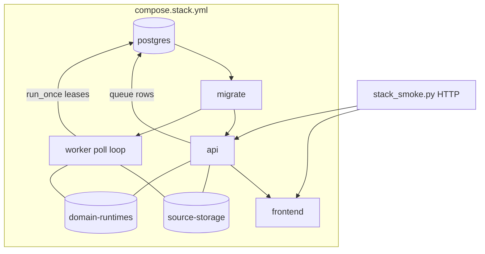

# Runnable Stack Workers - Plan

## Goal Capsule

- **Objective:** Make the local runnable stack process Source Document prepare/index/delete work end-to-end, and rename phase-coded `p10` fixtures to durable `stack` names.
- **Product authority:** F-010 owns the runnable stack; this slice reopens the deferred worker gate and hard-renames fixtures. Product language stays in `CONTEXT.md` (Knowledge Domain, Source Document, Query Eligibility).
- **Open blockers:** None.
- **Execution:** `code`

---

## Product Contract

### Summary

Ship one compose `worker` service that claims Postgres-leased prepare, index, and delete work, and deepen stack smoke to the full pilot path (upload → prepare → index → chat turn → delete → redaction). Hard-cut rename all `p10` stack fixtures, env files, ports, volumes, and project names to `stack`. Keep local domain-runtime and LightRAG fakes for this gate.

### Problem Frame

Today the compose stack starts Postgres, API, and frontend, but no process runs the existing lease-backed workers. Upload/prepare/index/delete therefore never complete in the runnable stack, so the product behaves like a login shell rather than a RAG app. Fixture names still encode the delivery phase (`p10`), which obscures that this is the canonical local stack.

### Key Decisions

- **Extend F-010, do not mint a new feature ID.** The runnable stack and its worker deferral already live under F-010; this slice finishes that gate.
- **One worker service.** A single process round-robins prepare / index / delete `run_once` claims. Matches Context Engine’s Postgres-lease lifecycle identity and the pilot single-worker assumption; rejects Redis/RQ/Celery.
- **Full pilot-path smoke.** Stack smoke must prove upload → prepare → index → chat turn → delete → redaction against real Postgres with workers running.
- **Local fakes for this gate.** Keep local domain-runtime and LightRAG clients in compose for Slice 0 acceptance. Live Docker LightRAG stays a separate proof (already covered by F-005).
- **Hard-cut rename to `stack`.** Canonical names: `compose.stack.yml`, `.env.stack.example`, `.env.stack.local`, `scripts/stack_smoke.py`, `scripts/stack_safety_scan.py`, `STACK_API_PORT`, `STACK_FRONTEND_PORT`, volume `stack-postgres-data`, project `context_engine_stack`. Delete old `p10` names; no aliases.

### Actors

- **A1. Developer / operator** — starts the stack, runs smoke, uses the runbook.
- **A2. Administrator (seeded)** — authenticates through the stack; drives upload, domain, and delete actions in smoke.
- **A3. Worker process** — claims and completes queued prepare, index, and domain-delete work via Postgres leases.

### Key Flows

- F1. Stack lifecycle with workers
  - **Trigger:** Operator starts compose with `.env.stack.local`.
  - **Actors:** A1, A3
  - **Steps:** Postgres healthy → migrate → API ready → frontend ready → worker running and claiming leases when work exists.
  - **Outcome:** Background prepare/index/delete can complete without in-process test harnesses.
  - **Covered by:** R1, R2

- F2. Full pilot smoke on the stack
  - **Trigger:** Operator runs stack smoke against a reset or clean project.
  - **Actors:** A1, A2, A3
  - **Steps:** Auth → domain ready → upload → worker prepares → worker indexes → one domain-grounded chat turn → delete → redaction verified.
  - **Outcome:** Safe evidence artifact records pass/fail without secrets or raw content.
  - **Covered by:** R3, R4, R7

- F3. Hard-cut fixture rename
  - **Trigger:** Slice lands in the repo.
  - **Actors:** A1
  - **Steps:** Old `p10` compose/env/script/port/volume/project names removed; runbook and F-010 docs point only at `stack` names; local `.env.stack.local` replaces `.env.p10.local`.
  - **Outcome:** No phase-coded stack filenames remain as canonical entry points.
  - **Covered by:** R5, R6


### Requirements

**Worker and stack**

- R1. The runnable compose stack includes exactly one `worker` service that continuously claims and runs prepare, index, and domain-delete work through the existing Postgres-lease `run_once` workers.
- R2. The stack must not introduce Redis, RQ, Celery, or any generic job bus.
- R3. Stack smoke proves the full path: upload → prepare → index → chat turn → delete → redaction, with workers running against Postgres in compose.
- R4. Slice 0 stack acceptance uses local domain-runtime and LightRAG client kinds; live Docker LightRAG is out of this slice’s acceptance.

**Rename**

- R5. Canonical stack artifacts use `stack` naming only: `compose.stack.yml`, `.env.stack.example`, `.env.stack.local`, `scripts/stack_smoke.py`, `scripts/stack_safety_scan.py`, `STACK_API_PORT`, `STACK_FRONTEND_PORT`, volumes `stack-postgres-data`, `stack-source-storage`, `stack-domain-runtimes`, compose project `context_engine_stack`.
- R6. All former `p10` stack filenames, env keys, volume names, and project defaults are removed (hard cut, no compatibility aliases). Docs and runbooks that referenced them are updated in the same change.

**Evidence and safety**

- R7. Smoke evidence remains safe: no secrets, source text, prompts, answers, runtime URLs, paths, or provider payloads in committed or recorded evidence.
- R8. F-010 spec, plan, tasks, acceptance, implementation log, pilot runbook, and traceability are updated to record workers-in-stack, the rename, and the deepened smoke gate.

### Acceptance Examples

- AE1. Covers R1, R3
  - **Given:** Stack is up with worker running and local fakes configured.
  - **When:** Smoke uploads a source and waits for prepare then index.
  - **Then:** Source reaches `state=prepared` and `indexState=ready` without manually invoking workers in the smoke process.

- AE2. Covers R3, R7
  - **Given:** A domain-grounded chat turn cited a source that is then deleted (or domain deleted per existing redaction rules).
  - **When:** Smoke checks the affected turn.
  - **Then:** Turn is redacted per product rules; evidence artifact contains only safe ids/statuses.

- AE3. Covers R5, R6
  - **Given:** A clean checkout of the slice.
  - **When:** An operator follows the pilot runbook.
  - **Then:** Instructions reference only `stack` names; `compose.p10.yml` and `scripts/p10_*.py` are absent.

### Success Criteria

- Operator can start the stack and complete the full pilot smoke without in-process worker calls.
- F-010 acceptance no longer records worker containers as deferred for the runnable stack.
- No canonical `p10` stack fixture names remain in the repo entry points or runbook.

### Scope Boundaries

**In scope**

- One worker service in the renamed compose stack
- Deepened stack smoke to full pilot path
- Hard-cut rename of stack fixtures/env/ports/volumes/project
- F-010 and RUN-001 doc/evidence updates

**Deferred for later**

- Live Docker LightRAG / native runtime in compose acceptance
- Playwright / browser E2E (F-009)
- Runtime Node, Usage, storage, Docker environment operator UI/API
- Multiple worker replicas or per-kind worker services
- Chat attachments, wiki UI, graph API

**Outside this product's identity**

- Redis/RQ/Celery or browser-started jobs
- Browser access to worker internals, runtime URLs, or storage paths

### Deferred to Follow-Up Work

- Optional compose profile for live Docker LightRAG (separate gate; do not fold into Slice 0 acceptance).
- Obsidian vault notes that still mention `p10` fixture names (non-canonical; update opportunistically).

### Dependencies / Assumptions

- Existing `SourcePreparationWorker`, `SourceIndexWorker`, and `DomainDeleteWorker` `run_once` lease behavior remains the claim mechanism.
- Compose already defaults to local domain-runtime and LightRAG client kinds; Slice 0 keeps that for acceptance (stack fixture exception; production Settings default remains native per LD-006).
- Hard-cut volume rename implies a fresh local database unless the operator manually migrates data (call out in runbook).
- Developers must recreate local env from `.env.stack.example` (old `.env.p10.local` is not read).

### Sources / Research

- `compose.p10.yml` — current stack services; local runtime/LightRAG kinds; no worker.
- `specs/04-features/F-010-shared-node-operations/` — worker container deferral (T-050) and first-gate limits.
- `scripts/pilot_gate.py` / `scripts/pilot_flow.py` — in-process full flow proof to port onto compose+worker.
- `scripts/p10_stack_smoke.py` / `scripts/p10_safety_scan.py` — current auth/proxy smoke and safety scan surface (today forbids any compose `worker:` service — must be revised).
- `specs/06-delivery/runbooks/pilot-launch.md` — F-010 runnable stack procedure and known first-gate limits.
- `docs/residual-review-findings/a85eb030.md` — single-worker pilot deployment assumption.
- `obsidian/Lessons/Backend-Owned Lifecycle.md` — lease-vs-job-platform framing.

---

## Planning Contract

### Assumptions

- Stack smoke drives the API over HTTP (cookie jar pattern already in `scripts/p10_stack_smoke.py`) and **never** calls `run_once` itself; the compose worker must advance state.
- In-process `scripts/pilot_flow.py` / `scripts/compose_smoke.py` remain for non-Docker CI; they are not the F-010 stack acceptance gate.
- Provider credential setup for smoke mirrors `pilot_gate` (`PUT` provider credential) using a throwaway local value never written into evidence.

### Key Technical Decisions

- **KTD-1. Worker loop as a Python module entrypoint.** Add a small poll loop (e.g. `python -m context_engine.worker`) that constructs Settings from env, opens a DB session per pass, and round-robins `SourcePreparationWorker.run_once`, `SourceIndexWorker.run_once`, `DomainDeleteWorker.run_once`. Idle when all return false; sleep a short configurable interval. On unexpected exceptions: log a safe structured error and continue the loop (lease reclaim handles stuck work). Index readiness may need multiple index `run_once` passes across loop iterations (submit then ready). No Redis, no task queue library.
- **KTD-2. One compose `worker` service.** Same backend image as `api`/`migrate`; override command to the worker module. Depends on migrate success and postgres healthy. Shares `CONTEXT_ENGINE_DATABASE_URL` and the same local client kinds as `api`.
- **KTD-3. Shared durable volumes for API + worker.** Mount named volumes for source storage and domain runtime roots on both `api` and `worker` (and set `CE_SOURCE_STORAGE_ROOT` / `CE_DOMAIN_RUNTIME_ROOT` explicitly). Without this, prepare/delete fail across containers.
- **KTD-4. Single operator smoke script.** Rename and extend to `scripts/stack_smoke.py`: keep existing auth/proxy checks, then add HTTP steps aligned to `pilot_gate.run_pilot_flow` (provider → domain → upload → poll source until prepared/indexed → evidence → domain chat SSE → source delete + redaction → domain delete accept + wait for domain gone). Poll with timeout; do not invoke workers in-process.
- **KTD-5. Safety scan allows CE lease worker only.** Update forbidden compose patterns: keep banning `redis`, `status-poller`, `deployment-control`, Celery/RQ, old entrypoints; **stop** treating the service name `worker` as forbidden when it is the lease poller. Scan targets move to `compose.stack.yml`, `.env.stack.example`, `scripts/stack_*.py`.
- **KTD-6. Hard-cut rename in the same change as the worker.** No transitional aliases. Update `.gitignore`, `.dockerignore`, `scripts/dev.sh`, RUN-001, F-010 docs, and traceability together.

### High-Level Technical Design



Worker loop (directional, not implementation):

```text
loop forever:
  open session
  did = prep.run_once(db) or index.run_once(db) or delete.run_once(db)
  commit/close
  if not did: sleep(idle_seconds)
```

### Open Questions

**Deferred to implementation**

- Exact idle sleep default and whether compose healthcheck uses process liveness vs a heartbeat file.
- Precise HTTP poll intervals/timeouts for prepare/index readiness in smoke (tune against local fakes).
- Whether domain-delete smoke waits on admin domain list 404 vs status endpoint (follow existing API-001 shapes).

---

## Implementation Units

### U1. Worker poll-loop entrypoint

- **Goal:** Provide a runnable process that continuously claims prepare, index, and domain-delete work via existing `run_once` workers.
- **Requirements:** R1, R2
- **Dependencies:** None
- **Files:**
  - create: `context_engine/worker.py` (or equivalent module package entry)
  - modify: `context_engine/config.py` (optional idle-seconds setting if not hardcoded)
  - create: `tests/test_stack_worker_loop.py`
- **Approach:** Module `__main__` / `-m` entry constructs Settings, builds the three workers once, and loops `run_once` with idle sleep. Reuse existing worker constructors and DB session factory patterns from tests/`pilot_gate`. Log only safe structured events (no source text).
- **Execution note:** Start with a unit test that injects fake workers / DB and proves one busy pass and one idle sleep path.
- **Patterns to follow:** `SourcePreparationWorker` / `SourceIndexWorker` / `DomainDeleteWorker` constructors; Settings env loading; JSON logging allowlist from F-008.
- **Test scenarios:**
  - Happy path: when prep returns true, loop records work and does not sleep before next iteration (or sleeps only after a full idle round — document chosen behavior in test).
  - Idle path: all three `run_once` return false → sleep invoked once.
  - Error path: `run_once` raises → loop logs safe error and continues (does not exit).
  - Integration: constructing real workers with `testing=True` Settings does not import Redis/Celery.
  - Note: index submit then ready may require two successful index `run_once` returns across iterations.
- **Verification:** Focused pytest for the loop module passes; `python -m context_engine.worker --help` or module import succeeds.

### U2. Hard-cut stack rename + compose worker service

- **Goal:** Replace `p10` fixtures with `stack` names and add the worker service with shared storage/runtime volumes and local client kinds.
- **Requirements:** R1, R2, R4, R5, R6
- **Dependencies:** U1
- **Files:**
  - create: `compose.stack.yml`
  - delete: `compose.p10.yml`
  - create: `.env.stack.example`
  - delete: `.env.p10.example`
  - modify: `.gitignore`, `.dockerignore` (`.env.stack.local`)
  - modify: `scripts/dev.sh`
- **Approach:** Copy compose shape; rename ports/volume/project defaults to `STACK_*` / `stack-postgres-data` / `context_engine_stack`. Add named volumes `stack-source-storage` and `stack-domain-runtimes`. Add `worker` service using backend Dockerfile, command = worker module, same DB URL and `CE_*_KIND=local` as API, plus shared mounts of those volumes on `api` and `worker` with explicit `CE_SOURCE_STORAGE_ROOT` / `CE_DOMAIN_RUNTIME_ROOT`. Document postgres volume rename = fresh DB in example comments.
- **Execution note:** Prefer `docker compose -f compose.stack.yml config` as first smoke of the fixture shape.
- **Patterns to follow:** Current `compose.p10.yml` healthchecks and migrate gate; residual review single-worker assumption.
- **Test scenarios:**
  - Test expectation: none for pure compose YAML — verification is compose config render + later U4 stack smoke.
  - Manual/script check: `docker compose … config` lists services `postgres`, `migrate`, `api`, `worker`, `frontend` and no `redis`.
- **Verification:** Compose config renders; old `compose.p10.yml` / `.env.p10.example` absent.

### U3. Rename smoke/safety scripts and allow CE worker

- **Goal:** Canonical `scripts/stack_smoke.py` and `scripts/stack_safety_scan.py` with defaults pointing at stack fixtures; safety scan permits the lease worker while still rejecting job-platform compose.
- **Requirements:** R2, R5, R6, R7
- **Dependencies:** U2
- **Files:**
  - create: `scripts/stack_smoke.py` (from `scripts/p10_stack_smoke.py`)
  - create: `scripts/stack_safety_scan.py` (from `scripts/p10_safety_scan.py`)
  - delete: `scripts/p10_stack_smoke.py`, `scripts/p10_safety_scan.py`
  - modify: safety-scan default target list and forbidden-service regex
- **Approach:** Update defaults (`compose.stack.yml`, `.env.stack.local`, project `context_engine_stack`, `STACK_*_PORT`). Change forbidden top-level services to exclude blanket `worker` ban; keep `redis|status-poller|deployment-control` and Celery/RQ/old entrypoint checks. Ensure scan still fails if Redis appears.
- **Patterns to follow:** Existing `p10_safety_scan.py` structure and evidence JSON safety rules.
- **Test scenarios:**
  - Safety scan passes against the new compose fixture that includes `worker`.
  - Safety scan fails if a `redis:` service is injected in a temp compose fixture (or equivalent unit assertion on the regex/helper).
  - Smoke script defaults resolve to stack paths (import/attribute or CLI dry check).
- **Verification:** `python scripts/stack_safety_scan.py` against stack compose passes; old `p10_*.py` scripts absent.

### U4. Full pilot-path HTTP stack smoke

- **Goal:** Extend `scripts/stack_smoke.py` so one operator command proves upload → prepare → index → evidence → domain chat → delete → redaction with the compose worker advancing state.
- **Requirements:** R3, R4, R7
- **Dependencies:** U1, U2, U3
- **Files:**
  - modify: `scripts/stack_smoke.py`
  - optional create: `tests/test_stack_smoke_helpers.py` for pure helpers (SSE parse, poll predicate) if extracted
- **Approach:** After existing auth/proxy checks, mirror `pilot_gate.run_pilot_flow` over HTTP: configure provider, create/start domain, upload markdown source, poll admin source DTO until `state=prepared` and `indexState=ready` (timeout), retrieve evidence, create conversation + one domain-grounded turn stream, assert safe SSE terminal, delete source and assert redacted turn, accept domain delete and wait until domain is gone. Reuse cookie jar + forbidden-key checks. Never call workers in-process. Evidence JSON stays status/id only.
- **Execution note:** Prefer smoke-first verification against a real compose project; keep helper unit tests for parsers/pollers without Docker when practical.
- **Patterns to follow:** `scripts/p10_stack_smoke.py` HTTP helpers; `scripts/pilot_gate.py` step order and assertions; safe evidence shape from F-008/F-010.
- **Test scenarios:**
  - Covers AE1: upload then poll reaches `state=prepared` and `indexState=ready` without in-process `run_once`.
  - Covers AE2: after source/domain delete path, turn status is redacted and evidence artifact has no raw content keys.
  - Error path: if prepare/index never becomes ready before timeout, smoke fails with a safe check name/note (no source text).
  - Negative path: with worker service stopped/absent, prepare/index poll times out with a safe failure note.
  - Regression: existing auth/proxy checks still run and pass.
- **Verification:** `python scripts/stack_smoke.py --env-file … --reset-state --write-evidence _tmp/stack-smoke.json` passes; safety scan on that evidence passes.

### U5. F-010 / RUN-001 / traceability evidence update

- **Goal:** Reverse worker deferral in F-010 docs, document the rename and deepened smoke, update the pilot runbook and traceability.
- **Requirements:** R5, R6, R8
- **Dependencies:** U4
- **Files:**
  - modify: `specs/04-features/F-010-shared-node-operations/{spec,plan,tasks,test-plan,acceptance,implementation-log}.md`
  - modify: `specs/06-delivery/runbooks/pilot-launch.md`
  - modify: `specs/07-traceability/{feature-register,traceability-matrix,change-log}.md`
- **Approach:** Replace T-050 deferral language with workers-in-stack completion; rewrite AC-006 so “no worker” becomes “no Redis/RQ/Celery/status-poller/deployment-control” while allowing the CE lease worker; update all commands/paths to `stack` names; record volume rename caveat; note local fakes for this gate vs native production default.
- **Test scenarios:**
  - Covers AE3: runbook and acceptance reference only `stack` names; grep for `compose.p10` / `p10_stack_smoke` in specs returns no canonical hits.
- **Verification:** Specs and runbook consistent; feature register outcome mentions workers + rename; change-log entry added.

---

## Verification Contract

| Gate | Command / check | Applies to |
| --- | --- | --- |
| Worker loop unit | `pytest tests/test_stack_worker_loop.py` | U1 |
| Compose render | `docker compose --env-file .env.stack.local -f compose.stack.yml config` | U2 |
| Safety scan | `python scripts/stack_safety_scan.py` (+ optional smoke evidence) | U3, U4 |
| Full stack smoke | `python scripts/stack_smoke.py --env-file .env.stack.local --reset-state --write-evidence _tmp/stack-smoke.json` | U4 |
| Forbidden rename residue | ripgrep for `compose.p10`, `.env.p10`, `p10_stack_smoke`, `P10_API_PORT`, `context_engine_p10` in canonical entrypoints | U2–U5 |
| Doc consistency | F-010 acceptance + RUN-001 updated; no “worker deferred” for runnable stack | U5 |

---

## Definition of Done

- [ ] U1–U5 complete with verifications above
- [ ] One `worker` service in `compose.stack.yml` advances prepare/index/delete via Postgres leases
- [ ] Full pilot-path stack smoke passes without in-process worker calls
- [ ] Hard-cut `stack` naming; no canonical `p10` stack fixtures remain
- [ ] Safety scan allows CE lease worker and still rejects Redis/job-platform compose
- [ ] F-010 / RUN-001 / traceability record the new gate; worker deferral reversed
- [ ] Known limits explicit: local fakes for this gate; live Docker LightRAG deferred; volume rename = fresh DB

---

## Risks & Dependencies

| Risk | Mitigation |
| --- | --- |
| Worker cannot see uploaded files | Shared named volumes + explicit `CE_SOURCE_STORAGE_ROOT` / `CE_DOMAIN_RUNTIME_ROOT` on api and worker |
| Safety scan still bans `worker` | U3 revises regex; DoD/safety gate only pass after U3 lands |
| Smoke flakes on poll timing | Bounded retries with clear timeout failure; local fakes keep path deterministic |
| Developers lose local DB on volume rename | Runbook call-out; hard cut accepted in Product Contract |
| Local LightRAG vs LD-006 production default | Document stack fixture exception; do not change production Settings default |
