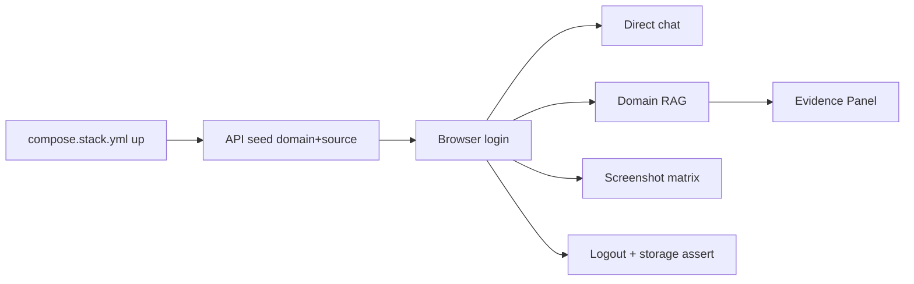
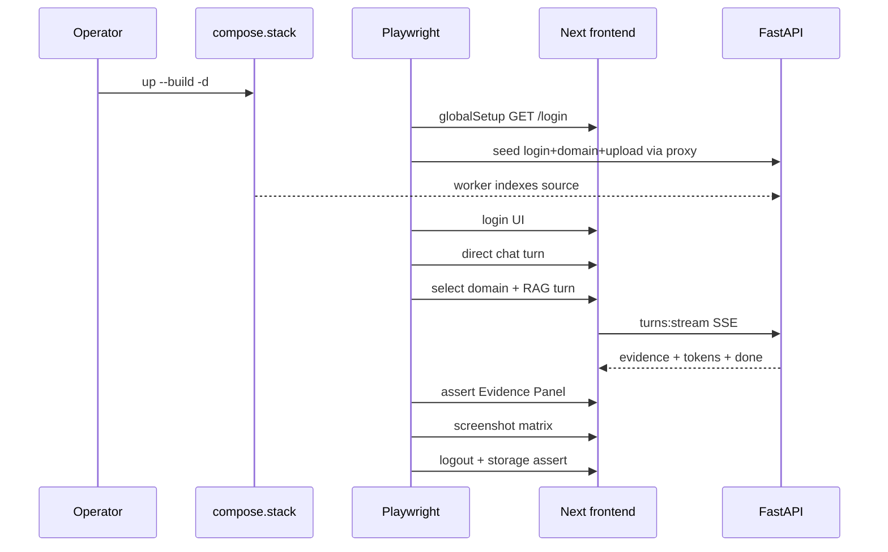

# feat: Playwright happy-path browser proof (F-009)

## Goal Capsule

- **Objective:** Prove the pilot-critical browser path against the runnable stack — login, direct chat, domain RAG with Evidence Panel, logout — with runtime storage checks and DESIGN screenshot matrix evidence that closes F-009 AC-001 (browser), AC-007 (pilot subset), and AC-008.
- **Product authority:** F-009 owns frontend delivery and Playwright; F-010/`compose.stack.yml` owns the stack under test. Product language stays in `CONTEXT.md`.
- **Open blockers:** None (stack workers already present on this branch).
- **Execution:** `code`

---

## Product Contract

### Summary

Add Playwright to the frontend package and run 3–4 live-stack E2E tests for login → direct chat → domain RAG + Evidence Panel → logout, plus a DESIGN viewport/theme screenshot matrix. Assert no auth token in `localStorage`/`sessionStorage`. Update F-009 acceptance with command output and screenshot evidence. Skip documents preview, graph, wiki, and non-pilot routes.

### Problem Frame

F-009 shell and chat-shell are implemented and statically tested, but AC-007 (Playwright) and AC-008 (screenshot matrix) remain open, and AC-001 is only proven by source scan — not by a live browser. Pilot runbook step 4 needs browser proof against a real stack, not pytest alone.

### Key Decisions

- **Pilot-critical subset of AC-007.** Spec AC-007 also names documents preview and graph; those stay deferred until preview/graph contracts exist. This slice closes login/chat/evidence/logout and records remaining AC-007 gaps explicitly.
- **Against running stack, not in-process mocks.** Tests use Playwright `baseURL` from `PLAYWRIGHT_BASE_URL` (default `http://127.0.0.1:3000`, matching compose `STACK_FRONTEND_PORT`). Operator (or CI job) starts `compose.stack.yml` first.
- **Seed domain corpus via API before RAG UI.** E2E setup authenticates as seeded admin, ensures provider/domain/source reach `indexState=ready` (workers already in stack), then browser tests select that Knowledge Domain.
- **Full DESIGN visual matrix.** Capture `1440×900` dark + light, `1280×800` dark, and narrow-width layout for login and `/chat` (with evidence open on the RAG path). Manual visual review; no pixel-diff CI in this slice.
- **Prefer existing a11y selectors.** Use `#username`, `#password`, `aria-label="Knowledge Domain"`, Evidence panel `aria-label="Evidence"`, Logout button text. Add `data-testid` only if a control is otherwise flaky.

### Actors

- A1. Administrator (env-seeded) — signs in through the UI; drives chat and domain RAG.
- A2. Developer / CI operator — starts the stack and runs Playwright.
- A3. Member (implicit) — not required for this slice’s happy path; member-only authz browser proof stays deferred.

### Key Flows

- F1. Auth and storage safety
  - **Trigger:** A1 opens `/login` and signs in with seeded credentials.
  - **Steps:** Submit form → land on `/chat` → assert no auth token keys in storage → Logout → back on `/login`.
  - **Outcome:** Cookie session works; AC-001 runtime proof.
  - **Covered by:** R1, R2, R6

- F2. Direct chat turn
  - **Trigger:** Authenticated A1 on `/chat` with Knowledge Domain set to Direct chat.
  - **Steps:** Send a short general question → wait for assistant text → Evidence Panel stays closed/empty.
  - **Outcome:** Direct LLM path works in browser (AC-011 live subset).
  - **Covered by:** R3

- F3. Domain RAG + Evidence Panel
  - **Trigger:** Authenticated A1 selects an available Knowledge Domain with indexed sources.
  - **Steps:** Ask a domain question → wait for evidence event / panel auto-open → see at least one evidence row with safe labels (no private ids).
  - **Outcome:** Domain RAG + Evidence Panel proven live (AC-010 live subset).
  - **Covered by:** R4, R5

- F4. Screenshot matrix
  - **Trigger:** After happy-path UI is reachable.
  - **Steps:** Capture DESIGN viewports/themes for login and chat surfaces.
  - **Outcome:** AC-008 evidence for visual review.
  - **Covered by:** R7

### Requirements

- R1. Add `@playwright/test` and a Playwright config under `frontend/` with `baseURL` from env (default `http://127.0.0.1:3000`).
- R2. E2E covers login with seeded admin credentials from env (same values as stack `CE_ADMIN_*`), reaches `/chat`, and logs out.
- R3. E2E covers one direct chat turn; Evidence Panel does not open with evidence rows for that turn.
- R4. E2E covers one domain RAG turn against a pre-seeded indexed Knowledge Domain; Evidence Panel opens and shows safe evidence rows.
- R5. Screenshots and assertions must not capture or assert on secrets, raw source text beyond safe excerpts already in the Evidence DTO, prompts, or provider payloads.
- R6. After login (and after logout), browser `localStorage`/`sessionStorage` contain no auth token / bearer / session-token keys; only allowlisted `ce.*` UI keys may appear.
- R7. Capture DESIGN matrix: `1440×900` dark, `1440×900` light, `1280×800` dark, and narrow viewport for changed responsive surfaces (login + chat).
- R8. Update F-009 `acceptance.md`, `tasks.md`, `implementation-log.md`, and feature register notes so AC-001 runtime, AC-007 pilot subset, and AC-008 cite Playwright evidence; remaining AC-007 items (documents preview, graph) stay explicit gaps.

### Acceptance Examples

- AE1. Covers R2, R6
  - **Given:** Stack is up; admin credentials in env.
  - **When:** Playwright logs in and inspects storage.
  - **Then:** `/chat` loads; no forbidden token keys in storage; logout returns to `/login`.

- AE2. Covers R3
  - **Given:** Authenticated session; domain picker on Direct chat.
  - **When:** User sends a general question.
  - **Then:** Assistant answer appears; Evidence Panel stays closed or empty.

- AE3. Covers R4
  - **Given:** Seeded domain with `indexState=ready` source.
  - **When:** User selects that domain and asks a domain question.
  - **Then:** Evidence Panel opens with ≥1 row showing safe `citationLabel`/`sourceLabel`/`excerpt` fields only.

- AE4. Covers R7
  - **Given:** Login and chat surfaces reachable.
  - **When:** Screenshot matrix runs.
  - **Then:** Artifacts exist for each required viewport/theme; acceptance records paths and review note.

### Success Criteria

- `npx playwright test` (or npm script) passes against a healthy stack.
- F-009 acceptance marks AC-007 pilot subset and AC-008 with real evidence; AC-001 gains live browser proof alongside the static scan.
- No secrets in committed screenshots or acceptance notes.

### Scope Boundaries

**In scope**

- Playwright dependency, config, npm scripts
- 3–4 E2E specs for auth/chat/evidence/logout
- API seed helper for domain RAG prerequisite
- Screenshot matrix + gitignore for local artifacts
- F-009 acceptance / tasks / implementation-log / feature-register updates

**Deferred for later**

- Documents PDF preview and graph Playwright (blocked on contracts)
- Member vs admin authz browser matrix (AC-004 live)
- 403 redirect-loop live proof (AC-003)
- Pixel-diff / visual regression CI
- Wiki UI, attachments, source-ref inspector
- Auth hardening (rate limit, CORS, `/docs`) — separate production slice

**Outside this product's identity**

- Browser-owned RAG, terminal/Git/filesystem panels, Pi runtime
- Tests that talk to LightRAG, Docker, or DB directly from the browser process

### Deferred to Follow-Up Work

- Wire Playwright into GitHub Actions once stack-up CI is stable.
- Expand AC-007 to documents/graph when preview and graph DTOs ship.

### Dependencies / Assumptions

- `compose.stack.yml` includes worker; stack can prepare/index sources (already true on `feat/runnable-stack-workers`).
- Local LightRAG/domain-runtime fakes in stack are sufficient for evidence events (same as stack smoke).
- Seeded admin via `CE_ADMIN_USERNAME` / `CE_ADMIN_PASSWORD` in `.env.stack.local`.
- Provider credential must be set for chat (seed helper mirrors stack smoke / pilot_gate `PUT` provider credential with a throwaway local value never written into evidence).
- Direct chat and domain RAG need a working synthesis profile in runtime settings — seed helper configures whatever stack smoke already requires.

### Sources / Research

- `specs/04-features/F-009-frontend-delivery/acceptance.md` — AC-001/007/008 gaps
- `specs/04-features/F-009-frontend-delivery/test-plan.md` — required evidence types
- `DESIGN.md` § Visual Regression — viewport/theme matrix
- `frontend/src/app/login/page.tsx`, `frontend/src/features/chat-shell/ChatShell.tsx`, `EvidencePanel.tsx` — selectors and flows
- `frontend/src/lib/storage.ts` — allowlisted `ce.*` keys
- `compose.stack.yml`, `docs/plans/2026-07-10-001-feature-runnable-stack-workers-plan.md` — stack under test
- `docs/solutions/architecture-patterns/runnable-stack-postgres-lease-workers.md` — workers-in-stack guidance
- `specs/06-delivery/runbooks/pilot-launch.md` — browser storage and visual check gates

---

## Planning Contract

### Assumptions

- Confirmed scope: gate on stack workers (present), full DESIGN matrix, `stack` fixture names.
- Playwright does not start compose itself in v1; docs/scripts state “stack must be up.” Optional later: a wrapper script that brings stack up, runs tests, tears down.
- Screenshot artifacts live under `frontend/tests/e2e/artifacts/` and are gitignored; acceptance cites the command and a short visual-review note (paths may be local).
- Narrow viewport ≈ `390×844` or `375×667` (mobile shell); exact size is an implementation detail as long as the mobile drawer/app-bar layout is exercised.
- F-009 is not marked fully `implemented` until remaining AC-007 gaps (preview/graph) are either done or explicitly waived by contract update — this slice only closes the pilot-critical subset.

### Key Technical Decisions

- **KTD-1. `@playwright/test` as a frontend devDependency.** Add config `frontend/playwright.config.ts`, scripts `test:e2e` / `test:e2e:headed`, and `frontend/tests/e2e/`. Keep existing `node --test` unit/static suites unchanged.
- **KTD-2. External stack baseURL.** `use: { baseURL: process.env.PLAYWRIGHT_BASE_URL ?? 'http://127.0.0.1:3000' }`. Fail fast in global setup if `/login` is unreachable.
- **KTD-3. API seed in Playwright globalSetup or `beforeAll`.** Use request context (cookie jar) against same-origin `/api/v1` (frontend proxy) or `STACK_API_PORT` only if same-origin fails — prefer same-origin to match real browser. Steps: login → ensure provider credential → create/start domain if needed → upload small fixture file → poll source until prepared + indexed → expose `domainId` / display name via env or a JSON fixture file for tests.
- **KTD-4. Stable selectors without redesign.** Prefer `#username`, `#password`, role/label queries (`getByLabel('Knowledge Domain')`, `getByRole('button', { name: 'Logout' })`, `getByLabel('Evidence')`). Add minimal `data-testid` only for composer send or timeline assistant bubble if needed.
- **KTD-5. SSE wait strategy.** Wait on UI outcomes (assistant text visible; Evidence panel `aria-expanded` / visible region with rows), not on raw EventSource internals. Use generous but bounded timeouts suitable for local fakes.
- **KTD-6. Storage assertion helper.** After login, enumerate `localStorage`/`sessionStorage` keys; forbid substrings `token`, `bearer`, `password`, `session` except allowlisted `ce.*` preference keys. After logout, same check plus unauthenticated route.
- **KTD-7. Screenshot safety.** Mask or avoid capturing password fields with filled values in committed/reviewed shots; prefer post-login chat shots and empty login form. Do not assert on answer/source full text in tests beyond presence/length or safe evidence labels.
- **KTD-8. Acceptance honesty.** Mark AC-007 as partial-pass for pilot paths; list documents preview + graph as still planned. AC-008 pass with matrix artifacts + review note. AC-001 add Playwright storage assertion evidence.

### High-Level Technical Design

### Alternative Approaches Considered

| Approach | Why not |
| --- | --- |
| Mock Service Worker / fixture-only Playwright | Does not satisfy pilot runbook live-stack proof |
| Playwright `webServer` starts Next only against empty API | Domain RAG and evidence cannot pass without stack+worker |
| Full AC-007 including documents/graph now | Preview and graph APIs still contract-blocked |

---

## Implementation Units

### U1. Playwright scaffold and npm scripts

**Goal:** Install Playwright and make `test:e2e` runnable against a configured baseURL.

**Requirements:** R1

**Dependencies:** None

**Files:**
- modify: `frontend/package.json`
- create: `frontend/playwright.config.ts`
- create: `frontend/tests/e2e/.gitkeep` (or README)
- modify: `frontend/.gitignore` or root `.gitignore` (ignore `frontend/tests/e2e/artifacts/`, `test-results/`, `playwright-report/`)

**Approach:** Add `@playwright/test` devDependency; config with one Chromium project; `fullyParallel: false` for shared seeded domain; timeout budget suitable for SSE; document required env vars in a short `frontend/tests/e2e/README.md` (stack up, `CE_ADMIN_*`, optional `PLAYWRIGHT_BASE_URL`).

**Execution note:** Prefer install/runtime smoke (`npx playwright install chromium` once) over unit coverage for this packaging unit.

**Patterns to follow:** Existing frontend npm scripts; stack env naming from `.env.stack.example`.

**Test scenarios:**
- Happy path: `npm run test:e2e -- --list` lists specs after U2+ exist.
- Error path: global setup fails clearly when baseURL is down.

**Verification:** Config loads; chromium install documented; gitignore covers artifacts.

---

### U2. API seed helper for indexed Knowledge Domain

**Goal:** Before browser RAG tests, ensure one available domain with a ready indexed source exists.

**Requirements:** R4, R5

**Dependencies:** U1

**Files:**
- create: `frontend/tests/e2e/helpers/stack-seed.ts`
- create: `frontend/tests/e2e/fixtures/seed-source.md` (tiny safe markdown fixture)
- create: `frontend/tests/e2e/global-setup.ts` (wired from playwright config)

**Approach:** Request-context login as admin; PUT throwaway provider credential if needed; create/start domain; upload fixture; poll admin sources until prepared + `indexState=ready` (timeout ~2–3 minutes); write `frontend/tests/e2e/artifacts/seed.json` with `{ domainId, displayName }` for tests. Never log passwords or credential values.

**Patterns to follow:** HTTP cookie flow in `scripts/stack_smoke.py`; poll patterns from stack smoke.

**Test scenarios:**
- Happy path: seed completes when stack+worker healthy; `seed.json` written.
- Failure path: timeout produces actionable error (“source not ready”).
- Integration: subsequent test can `selectOption` the seeded domain by display name.

**Verification:** Running global setup against a live stack produces `seed.json` without secrets.

---

### U3. Happy-path E2E specs (auth, direct chat, domain RAG, logout)

**Goal:** Automate F1–F3 with storage assertions.

**Requirements:** R2, R3, R4, R5, R6

**Dependencies:** U1, U2

**Files:**
- create: `frontend/tests/e2e/helpers/storage.ts`
- create: `frontend/tests/e2e/helpers/auth.ts`
- create: `frontend/tests/e2e/pilot-happy-path.spec.ts`
- modify (only if needed): `frontend/src/features/chat-shell/ChatShell.tsx` — minimal `data-testid` on send control / assistant turn

**Approach:** One spec file, 3–4 tests (or serial steps in one describe):
1. login → storage assert → logout → storage assert
2. login → direct chat → no evidence rows
3. login → select seeded domain → domain question → Evidence Panel visible with ≥1 row
4. Optional combined flow test if flakiness prefers fewer logins

Use serial mode if shared auth state helps; otherwise independent logins.

**Execution note:** Start with failing tests against the live stack (red), then stabilize waits — characterization of real SSE latency before tightening timeouts.

**Patterns to follow:** Login form ids; `aria-label="Knowledge Domain"`; Evidence `aria-label="Evidence"`; Logout button in `NavigationSidebar`.

**Test scenarios:**
- Happy path: AE1, AE2, AE3.
- Edge: direct chat leaves panel without evidence rows (AC-011).
- Error/failure: invalid login shows safe error (optional single assertion; not blocking).
- Integration: domain option disabled when unavailable must not be selected; seed guarantees available.

**Verification:** `npm run test:e2e` green against stack; no forbidden storage keys; evidence assertions use safe DTO fields only.

---

### U4. Screenshot matrix (AC-008)

**Goal:** Capture DESIGN viewport/theme shots for login and chat.

**Requirements:** R7, R5

**Dependencies:** U3

**Files:**
- create: `frontend/tests/e2e/visual-matrix.spec.ts`
- modify: `frontend/tests/e2e/README.md` (how to review artifacts)

**Approach:** For each viewport/theme combo, set viewport, set `document.documentElement.dataset.theme` to `zai-dark` / `zai-light` (match app bootstrap), navigate, screenshot to `artifacts/`. Include: login empty form; chat after domain RAG with Evidence Panel open (mask dynamic answer text if needed via CSS clip or crop to shell chrome + panel chrome). Record filenames in acceptance.

**Test scenarios:**
- Happy path: AE4 — four (or more) PNG files written.
- Edge: narrow viewport shows mobile app bar (not desktop rail only).

**Verification:** Artifacts present after run; visual review note added to F-009 acceptance.

---

### U5. F-009 evidence and traceability

**Goal:** Close acceptance gaps for this slice honestly.

**Requirements:** R8

**Dependencies:** U3, U4

**Files:**
- modify: `specs/04-features/F-009-frontend-delivery/acceptance.md`
- modify: `specs/04-features/F-009-frontend-delivery/tasks.md`
- modify: `specs/04-features/F-009-frontend-delivery/implementation-log.md`
- modify: `specs/07-traceability/feature-register.md` (F-009 outcome note)
- modify: `specs/07-traceability/traceability-matrix.md` (BR-011 / AC-007 notes if present)

**Approach:** Paste command outcomes (pass counts, date); link artifact naming convention; state AC-007 remaining: preview blob, graph DTOs. Do not mark entire F-009 `implemented` unless all ACs are truly done — keep `in_progress` with narrowed remaining list.

**Test expectation:** none — documentation evidence unit.

**Verification:** Acceptance table updated; register reflects Playwright pilot proof landed.

---

## Verification Contract

### Feature gates

- Stack up: `docker compose --env-file .env.stack.local -f compose.stack.yml up --build -d` (or equivalent) until frontend+api+worker healthy.
- Seed + E2E: from `frontend/`, `npm run test:e2e`.
- Static suite still green: `npm test`, `npm run typecheck`.
- Safety: screenshots/acceptance contain no passwords, tokens, or raw private payloads.

### Regression

- Existing `frontend/tests/foundation.test.mjs` and `chat.test.mjs` still pass.
- Stack smoke still passes if run (workers unchanged by this slice).

### Traceability

- F-009 acceptance cites Playwright commands and AC status.
- Feature register F-009 outcome mentions browser pilot proof.

---

## Definition of Done

- All units U1–U5 complete.
- AE1–AE4 satisfied with recorded evidence.
- AC-001 has live browser storage proof; AC-007 pilot subset pass; AC-008 pass with matrix + review note.
- Remaining F-009 gaps (preview, graph, some live authz) explicitly listed — not silently claimed done.
- No committed secrets; e2e artifacts gitignored.

---

## Risks & Dependencies

| Risk | Mitigation |
| --- | --- |
| Flaky SSE / slow index | Bounded polls; serial RAG test; reuse seed across tests |
| Local fake returns zero evidence | Align seed question with fixture content; fail with clear message if zero rows |
| Theme tokens not applied in screenshot | Set `data-theme` explicitly before shot |
| Spec AC-007 over-claim | Acceptance marks partial; preview/graph remain open |
| Stack not running | Global setup hard-fail with runbook pointer |

---

## Open Questions

- None blocking. Deferred: CI wiring for Playwright (follow-up).

---

## Appendix

### Selector cheat sheet (implementation aid)

| Control | Locator |
| --- | --- |
| Username | `#username` |
| Password | `#password` |
| Sign in | `getByRole('button', { name: 'Sign in' })` |
| Domain | `getByLabel('Knowledge Domain')` |
| Composer | `textarea` with “Ask anything” placeholder |
| Evidence panel | `getByLabel('Evidence')` |
| Logout | `getByRole('button', { name: 'Logout' })` |
