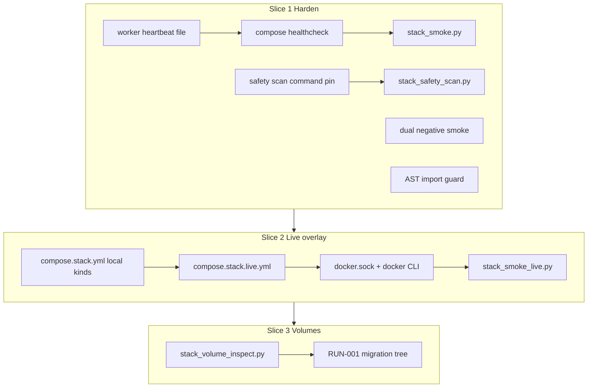

# Stack Follow-Ups - Plan

## Goal Capsule

- **Objective:** Sequence three follow-up slices after runnable-stack workers: harden the local-fake acceptance gate, add an optional live Docker LightRAG compose overlay as a separate proof, and improve the operator story for volume rename / fresh-database recovery.
- **Product authority:** F-010 owns the runnable stack. F-005 owns native/LightRAG proof contracts. LD-006 keeps production Settings default native; stack default acceptance stays local-fake.
- **Open blockers:** None. Slice 2 live path uses overlay + Docker socket mount (planning decision).
- **Execution:** `code`

---

## Product Contract

### Summary

The runnable-stack workers slice shipped with known limits: local domain-runtime and LightRAG fakes for default acceptance, live Docker LightRAG deferred, and volume rename implying a fresh database. This plan orders three independent follow-ups — stack hardening first, then optional live Docker overlay, then volume migration operator support — without folding live Docker into default stack smoke.

### Problem Frame

Default `compose.stack.yml` now proves the full pilot path with local fakes and a CE lease worker. That gate is trustworthy for day-to-day development but leaves accepted review residuals, a production-fidelity gap (LD-006 native default vs local stack), and a one-time operator pain when `p10` volumes were renamed. Operators need clearer failure modes, optional native-fidelity proof in compose, and a documented path when they must keep local Postgres data across fixture renames.

### Key Decisions

- **Three slices, fixed priority order.** Slice 1 stack hardening → Slice 2 live Docker overlay → Slice 3 volume migration. Each slice ships as its own change in priority order (later slices depend on earlier units completing); do not combine into one mega-change.
- **Extend F-010; do not mint a new feature ID.** All three slices deepen the runnable stack under F-010. Slice 2 reuses F-005 Slice A proof patterns without modifying F-005 contracts.
- **Default stack smoke stays local-fake.** `CE_DOMAIN_RUNTIME_CONTROLLER_KIND=local` and `CE_LIGHTRAG_CLIENT_KIND=local` remain the canonical default gate. Live Docker is opt-in via compose overlay and a dedicated smoke entrypoint — never the default `scripts/stack_smoke.py` path.
- **No Redis/RQ/Celery.** Same job-platform bans as the workers slice; CE lease worker remains the only `worker` service.
- **Volume migration is operator support, not product behavior.** Slice 3 documents and provides an inspect helper; it does not change backend lifecycle or API contracts.

### Actors

- **A1. Developer / operator** — runs stack, smoke, optional live overlay, migration helper.
- **A2. CI / release gate owner** — relies on hardened default smoke unit coverage; compose proofs remain operator/manual or opt-in Docker-marked pytest in this plan (no PR-blocking stack-smoke workflow).

### Slice 1 — Stack Hardening (first)

**Intent:** Close accepted residuals from `docs/residual-review-findings/feat-runnable-stack-workers.md` and make the local-fake gate more trustworthy without changing the happy-path contract.

**In scope**

- Worker liveness beyond Docker `Status==running` (healthcheck + heartbeat file).
- Safety scan pins CE lease worker command to `python -m context_engine.worker` (not any `worker:` service).
- Negative smoke coverage: worker absent at start fails liveness; worker stopped mid-pilot fails prepare/index poll with a safe failure note (no source text).
- AST/import guard that `scripts/stack_smoke.py` never imports or calls in-process `run_once` / worker classes.

**Out of scope**

- Switching default stack to native/LightRAG.
- New compose services beyond worker health signal.
- New full stack-smoke CI workflow (unit hardening only in existing pytest).

**Success signals**

- Default stack smoke still passes unchanged on local fakes.
- New negative/hardening tests pass in CI (unit/AST/safety-scan).
- Safety scan fails if `worker` command is not the CE lease module.

### Slice 2 — Live Docker LightRAG Compose Overlay (second)

**Intent:** Bridge the LD-006 gap with an optional compose path that exercises native LightRAG fidelity without destabilizing the default local-fake gate.

**In scope**

- Optional compose overlay enabling live Docker domain runtime and native LightRAG client kinds for api/worker, with Docker socket mount and Docker CLI available in those services.
- Separate acceptance gate via dedicated smoke script — not merged into default `stack_smoke.py`.
- Reuse existing F-005 Slice A proof patterns where practical (`tests/test_slice_a_runtime_integration.py` live Docker gate is evidence, not the stack fixture).
- Runbook section: when to use live overlay, prerequisites (Docker, credentials, resource cost), and known limits.
- Default safety scan continues to target base `compose.stack.yml` only (keeps `docker.sock` forbidden there); optional overlay scan path for live proof runs.

**Out of scope**

- Making live Docker the default stack acceptance gate.
- Changing production Settings default away from native (LD-006).
- Runtime Node, Logs, Usage, storage UI/API (still contract-blocked).
- Controller sidecar architecture (rejected in favor of overlay + socket).

**Success signals**

- Operator can start stack with live overlay and complete a bounded proof path (upload → index → evidence) with native LightRAG kinds.
- Default local-fake smoke remains the canonical F-010 gate.
- Safety scan on base compose still rejects Redis/job-platform services and `docker.sock`.

### Slice 3 — Volume Migration Operator Story (third)

**Intent:** Reduce silent data loss when developers move from former `p10` volumes to `stack-*` volumes or reset compose projects.

**In scope**

- Runbook expansion: when rename implies fresh DB, how to inspect old volumes, optional `pg_dump`/`pg_restore` or attach-old-volume steps, and when to accept empty state. Cover all three volume families (Postgres, source storage, domain runtimes) and encryption-key continuity after restore.
- Read-only inspect helper under `scripts/` with safe defaults (no secrets).
- Cross-link from `docs/solutions/architecture-patterns/runnable-stack-postgres-lease-workers.md` and F-010 implementation log.

**Out of scope**

- Automatic migration in compose up.
- Guided migrate script that runs `pg_dump`/`pg_restore` (runbook steps only).
- Changing volume names again.
- Backend schema or migration tooling changes.

**Success signals**

- Operator following runbook can preserve or intentionally discard Postgres data across volume rename.
- No new product API or lifecycle behavior.

### Requirements (cross-slice)

| ID | Requirement | Primary slice |
| --- | --- | --- |
| R1 | Default stack acceptance remains local-fake with full pilot-path smoke | All (preserve) |
| R2 | Worker liveness and safety-scan pinning improve gate trust | Slice 1 |
| R3 | Negative path proves worker is required (liveness fail and mid-pilot poll timeout) | Slice 1 |
| R4 | Optional live Docker LightRAG compose overlay exists as separate gate | Slice 2 |
| R5 | Live overlay does not become default stack smoke | Slice 2 |
| R6 | Volume rename / fresh-DB migration path is documented with inspect helper | Slice 3 |
| R7 | No Redis/RQ/Celery; single CE lease worker | All |
| R8 | F-010 / RUN-001 / traceability updated per slice | All |

### Acceptance Examples

- **AE1 (Slice 1):** Given default stack with worker healthy, smoke passes as today. Given worker never started / stopped before smoke waits, smoke fails at worker liveness with a safe note. Given worker dies after upload, smoke fails at prepare/index poll with a safe timeout note.
- **AE2 (Slice 1):** Safety scan fails if compose `worker` command is not `python -m context_engine.worker`.
- **AE3 (Slice 2):** Given live overlay enabled and Docker available, bounded native path completes; default smoke without overlay still uses local kinds.
- **AE4 (Slice 3):** Given operator with old `p10-postgres-data` volume, runbook steps recover data or document intentional fresh start.

### Success Criteria

- Slice 1 shipped: hardened gate with residuals #1–#4 addressed; default smoke unchanged.
- Slice 2 shipped: optional live overlay documented and provable separately.
- Slice 3 shipped: volume migration story in runbook (+ inspect helper).
- LD-006 production default unchanged throughout.

### Scope Boundaries

**Deferred beyond these three slices**

- Playwright / browser E2E (F-009).
- Runtime Node, Logs, Usage, storage, Docker environment operator UI/API.
- Multiple worker replicas.
- Per-domain native LightRAG lifecycle locking (F-008 deferral).
- Full stack-smoke CI workflow on every PR.

**Outside product identity**

- Redis/RQ/Celery job platforms.
- Browser access to worker internals, runtime URLs, or storage paths.

### Dependencies / Assumptions

- Runnable-stack workers slice (`docs/plans/2026-07-10-001-feature-runnable-stack-workers-plan.md`) is complete on branch `feat/runnable-stack-workers`.
- Compound learning: `docs/solutions/architecture-patterns/runnable-stack-postgres-lease-workers.md`.
- F-005 live Docker proof exists outside compose (`test_slice_a_live_docker_controller_native_index_and_evidence`).
- Residuals source: `docs/residual-review-findings/feat-runnable-stack-workers.md`.
- ARCH-002: API process does not import Docker. Live overlay mounts the socket so the private `CE_DOMAIN_CONTROLLER_COMMAND` subprocess can invoke the Docker CLI. This is a deliberate local single-operator exception to ARCH-002’s “API Forbidden: Docker socket” table row — not production or shared multi-tenant use. Import/subprocess boundary remains mandatory even when the socket is mounted.

### Sources / Research

- `docs/plans/2026-07-10-001-feature-runnable-stack-workers-plan.md` — deferred follow-ups.
- `docs/residual-review-findings/feat-runnable-stack-workers.md` — Slice 1 inputs.
- `specs/04-features/F-010-shared-node-operations/spec.md` — OD-006, FR-010.
- `specs/06-delivery/runbooks/pilot-launch.md` — volume rename caveat, known limits.
- `tests/test_slice_a_runtime_integration.py` — live Docker evidence outside compose.
- `tests/test_sources.py` — AST import-guard precedent.
- `scripts/stack_safety_scan.py` — `docker.sock` forbidden on base compose targets.

---

## Planning Contract

### Assumptions

- Default happy-path `scripts/stack_smoke.py` remains the F-010 regression oracle; Slice 1 must not change its pass criteria on a healthy stack.
- Compose negative proofs and live overlay smoke stay operator/manual (or opt-in Docker marks); this plan does not add a PR-blocking stack-smoke workflow.
- Live overlay is a separate compose file included with `-f compose.stack.yml -f compose.stack.live.yml`, not a `profiles:` block inside the base file (keeps base scan targets free of `docker.sock`).
- Native LightRAG in live overlay needs optional image deps and provider credentials; live smoke documents prerequisites and uses a longer pilot timeout than local-fake defaults.
- Volume inspect helper is read-only; guided dump/restore stays copy-paste runbook commands.

### Key Technical Decisions

- **KTD-1. Worker liveness = heartbeat file + compose healthcheck.** Worker touches a heartbeat file on the shared `stack-domain-runtimes` volume each successful loop iteration. Compose `worker` healthcheck verifies file freshness. Smoke switches from `wait_for_service_running` to `wait_for_service_health` for worker. Process-alive-only (`pgrep`) is insufficient for residual #4.
- **KTD-2. Safety scan pins worker command.** Extend `scan_compose()` to require the `worker` service command to match `python -m context_engine.worker` (YAML-aware or equivalent structured check). Keep existing job-platform bans.
- **KTD-3. Dual negative proofs for AE1.** (a) Worker absent/stopped before smoke liveness wait → fail at worker health/liveness check. (b) Worker stopped after upload (or equivalent mid-pilot) → fail at `prepare_index_timeout` with safe note. Both are automated where Docker is available; unit-level helpers cover predicates without Docker when practical.
- **KTD-4. AST guard on stack smoke.** Pytest walks `scripts/stack_smoke.py` AST and forbids imports of `context_engine.worker` / lease worker classes and calls to `run_once` (mirror `tests/test_sources.py` LightRAG import guard).
- **KTD-5. Live path = overlay file + socket + Docker CLI + host-visible runtime dir.** Add `compose.stack.live.yml` that overrides api/worker env to `CE_DOMAIN_RUNTIME_CONTROLLER_KIND=docker`, `CE_LIGHTRAG_CLIENT_KIND=native`, sets `CE_DOMAIN_CONTROLLER_COMMAND=python -m context_engine.tools.domain_runtime_controller`, mounts `/var/run/docker.sock`, and ensures Docker CLI is present (live Dockerfile build-arg or live-stage image). Because the controller bind-mounts `runtimeDir` into sibling containers via the host Docker daemon, live overlay must expose `CE_DOMAIN_RUNTIME_ROOT` on an identical host and container path (bind-mount a host directory — do not rely on the named `stack-domain-runtimes` volume alone for live). Keep the named volume for default local-fake compose. No new LightRAG compose service — native client stays in-process under the domain runtime dir (Slice A pattern). Live image also installs `.[lightrag-runtime]` extras; default slim image stays `pip install .` only.
- **KTD-6. Dedicated `scripts/stack_smoke_live.py`.** Separate entrypoint reuses shared HTTP helpers from `stack_smoke.py`; bounded proof upload → prepare → index → evidence (chat optional). Asserts live kinds are active. Default `stack_smoke.py` never enables the overlay.
- **KTD-7. Safety scan split for live.** Default `stack_safety_scan.py` targets remain base fixtures only (`docker.sock` still forbidden). Optional flag/target list includes the live overlay for live proof runs and must still reject Redis/job-platform services.
- **KTD-8. Volume story = runbook + inspect-only helper.** Expand RUN-001 with decision tree (fresh start vs Postgres preserve vs files-only), `pg_dump`/`pg_restore` recipes, encryption-key preserve/verify (copy original `CONFIG_ENCRYPTION_KEY`; regenerating after restore bricks credentials), and all three volume families. Add `scripts/stack_volume_inspect.py` to list `p10-*` vs `stack-*` volumes (name/existence/size/labels only — no host Mountpoint paths) with dry-run-safe defaults.

### High-Level Technical Design



Live overlay relationship (directional):

```text
docker compose -f compose.stack.yml -f compose.stack.live.yml ...
  api/worker:
    CE_*_KIND = docker / native
    CE_DOMAIN_CONTROLLER_COMMAND = python -m context_engine.tools.domain_runtime_controller
    volumes += /var/run/docker.sock
    CE_DOMAIN_RUNTIME_ROOT = identical host+container bind path (not named volume alone)
  default stack_smoke.py: NEVER passes live overlay files
  stack_smoke_live.py: passes both compose files + asserts native path + scans _tmp/stack-smoke-live.json
```

### Open Questions

**Deferred to implementation**

- Exact heartbeat path under `CE_DOMAIN_RUNTIME_ROOT` and freshness window for the healthcheck (including `start_period` vs long `run_once`).
- Canonical host path for live domain-runtimes bind (fixed convention vs operator-supplied env var).
- Whether live image installs Docker CLI via apt in a build-arg stage or mounts a host docker binary (prefer image install for reproducibility).
- Live smoke timeout defaults and whether chat is included when credentials allow (bounded evidence path is the minimum).
- Whether negative mid-pilot test uses `compose stop worker` under `--skip-up` or a dedicated helper flag.
- Whether live overlay may run on shared CI runners or is workstation-only.

---

## Implementation Units

### U1. Worker heartbeat and compose healthcheck

- **Goal:** Prove worker liveness beyond Docker `Status==running` via heartbeat + healthcheck, and teach default smoke to wait on healthy worker.
- **Requirements:** R2, R1
- **Dependencies:** None
- **Files:**
  - modify: `context_engine/worker.py`
  - modify: `compose.stack.yml`
  - modify: `scripts/stack_smoke.py`
  - modify: `tests/test_stack_worker_loop.py`
- **Approach:** On each loop iteration (after a pass, including idle), touch a heartbeat file under the shared domain-runtimes root. Add compose `worker` healthcheck that fails when the file is missing or stale. Change smoke's worker gate from `wait_for_service_running` to `wait_for_service_health`. Keep structured logs safe (no source text).
- **Execution note:** Extend existing worker-loop unit tests for heartbeat write; compose healthcheck verified via `docker compose … config` then full smoke regression.
- **Patterns to follow:** Existing api/postgres/frontend healthchecks in `compose.stack.yml`; idle-sleep-on-error behavior in `context_engine/worker.py`.
- **Test scenarios:**
  - Happy path: loop iteration updates heartbeat mtime.
  - Edge: first boot creates heartbeat before healthcheck retries exhaust.
  - Error path: if heartbeat write fails, loop still continues (log safe error) — do not exit the process.
  - Integration: default stack smoke still records worker healthy and completes pilot path on local fakes.
- **Verification:** Worker unit tests pass; default stack smoke passes; compose config shows worker healthcheck.

### U2. Safety scan pins CE lease worker command

- **Goal:** Fail safety scan when compose `worker` command is not the CE lease module entrypoint.
- **Requirements:** R2, R7
- **Dependencies:** None (can parallel U1)
- **Files:**
  - modify: `scripts/stack_safety_scan.py`
  - modify: `tests/test_stack_safety_scan.py`
- **Approach:** In `scan_compose()`, parse or regex-match the `worker` service `command` and require `python -m context_engine.worker`. Keep existing `COMPOSE_FORBIDDEN_PATTERNS`. Do not scan live overlay by default.
- **Patterns to follow:** `test_safety_scan_rejects_redis_service` fixture style.
- **Test scenarios:**
  - Covers AE2: injected compose with wrong worker command fails scan.
  - Happy path: canonical `compose.stack.yml` still passes.
  - Edge: missing `worker` service fails (or is explicitly reported) — document chosen behavior in test.
  - Regression: Redis / `docker.sock` on base compose still fail.
- **Verification:** Focused pytest for safety scan passes.

### U3. Dual negative proofs and AST import guard

- **Goal:** Automate residual negative paths and permanently guard HTTP-only smoke.
- **Requirements:** R3, R7, R8
- **Dependencies:** U1, U2
- **Files:**
  - modify: `scripts/stack_smoke.py` (if helper extraction needed)
  - create: `tests/test_stack_smoke_imports.py`
  - create: `tests/test_stack_smoke_worker_negative.py` (or equivalent; mark Docker-dependent cases)
  - modify: `specs/04-features/F-010-shared-node-operations/{acceptance,implementation-log,test-plan}.md`
  - modify: `docs/residual-review-findings/feat-runnable-stack-workers.md` (mark Slice 1 residuals closed when done)
- **Approach:** AST-walk `stack_smoke.py` forbidding worker/`run_once` imports and calls. Add Docker-marked tests: (a) stop/absent worker before smoke → liveness failure; (b) stop worker after upload under `--skip-up` → `prepare_index_timeout` (or equivalent safe check name). Update F-010 evidence for Slice 1.
- **Execution note:** AST test runs in normal pytest CI; compose negative tests may skip without Docker.
- **Patterns to follow:** `tests/test_sources.py` AST guard; existing `prepare_index_timeout` failure note in `stack_smoke.py`; P8 `workerUnavailable` evidence shape for safe notes.
- **Test scenarios:**
  - Covers AE1: absent worker fails at liveness with safe note (no source text).
  - Covers AE1: mid-pilot worker stop fails at prepare/index poll with safe timeout note.
  - Happy path: AST guard passes on current `stack_smoke.py`.
  - Error path: fixture that imports `run_once` into a temp copy of smoke would fail the AST test (unit-level).
  - Integration: default happy-path smoke still passes after U1–U3.
- **Verification:** AST + safety-scan unit tests pass; Docker negative tests pass or skip cleanly; F-010 Slice 1 evidence updated.

### U4. Live compose overlay and Docker-capable image path

- **Goal:** Provide an opt-in compose overlay that flips api/worker to docker/native kinds with socket + Docker CLI, without polluting base compose.
- **Requirements:** R4, R5, R7
- **Dependencies:** U3 (Slice 1 first)
- **Files:**
  - create: `compose.stack.live.yml`
  - modify: `Dockerfile` (build-arg / stage for Docker CLI; default image behavior unchanged for local-fake)
  - modify: `.env.stack.example` (comment-only live prerequisites)
  - modify: `scripts/stack_safety_scan.py` (optional overlay target; default targets unchanged)
  - modify: `tests/test_stack_safety_scan.py`
- **Approach:** Overlay overrides api/worker environment and mounts `/var/run/docker.sock`. Bind-mount a host-visible domain-runtimes directory to the same absolute path inside api/worker (and set `CE_DOMAIN_RUNTIME_ROOT` to that path) so the controller’s Docker bind mounts resolve on the host daemon. Ensure controller command uses `python -m context_engine.tools.domain_runtime_controller` (image includes `context_engine/`, not host `scripts/`). Default Dockerfile path for local-fake remains slim without Docker CLI or LightRAG extras. Live build path installs Docker CLI and `pip install '.[lightrag-runtime]'`. Default safety scan still forbids `docker.sock` on base targets; optional overlay scan allows socket only in the live file while still rejecting Redis/job platforms. Document live overlay as local single-operator only (not production).
- **Execution note:** Prefer `docker compose -f compose.stack.yml -f compose.stack.live.yml config` before live smoke.
- **Patterns to follow:** Slice A settings shape in `tests/test_slice_a_runtime_integration.py`; F-003 controller command boundary (API does not import Docker).
- **Test scenarios:**
  - Happy path: compose config with both files renders api/worker with docker/native kinds, socket mount, and identical host/container runtime path.
  - Covers AE3 (partial): default single-file compose config still has local kinds, named volumes, and no socket.
  - Safety: default scan of base compose still fails if `docker.sock` is injected into `compose.stack.yml`.
  - Safety: optional overlay scan accepts live file socket but rejects injected `redis:`.
  - Error path: live build without Docker CLI or without `lightrag-runtime` extras fails as a clear prerequisite error, not a silent local-fake fallback.
- **Verification:** Dual-file compose config renders; base safety scan green; overlay optional scan behaves as specified; live image can import native LightRAG deps.

### U5. Live smoke entrypoint and runbook live section

- **Goal:** Dedicated live smoke proves bounded native path; runbook documents when/how to use the overlay.
- **Requirements:** R4, R5, R8
- **Dependencies:** U4
- **Files:**
  - create: `scripts/stack_smoke_live.py`
  - modify: `scripts/stack_smoke.py` (extract shared helpers if needed; keep default CLI unchanged)
  - optional create: `tests/test_stack_smoke_live_helpers.py`
  - modify: `specs/06-delivery/runbooks/pilot-launch.md`
  - modify: `specs/04-features/F-010-shared-node-operations/{acceptance,implementation-log,test-plan}.md`
  - modify: `docs/residual-review-findings/feat-runnable-stack-workers.md` (mark residual #5 closed when live overlay ships)
- **Approach:** Live script invokes compose with both files, waits for healthy services including worker, runs bounded HTTP path (upload → prepare → index → evidence), asserts live kinds via compose env / existing safe smoke markers only (no new admin or API fields), writes safe evidence to `_tmp/stack-smoke-live.json`, and runs `stack_safety_scan.py --smoke-evidence` on that path. Reuse `assert_safe_json` / public evidence shape from `stack_smoke.py`. Forbid dumping compose env secrets, credentials, encryption keys, runtime URLs, storage paths, or `docker.sock` into evidence notes. Runbook adds Live overlay section: prerequisites (host-visible runtime path, Docker CLI image, `lightrag-runtime` extras, credentials), commands, resource cost, known limits, local single-operator threat note for socket mount, and explicit “not the default F-010 gate.”
- **Execution note:** Smoke-first against real Docker when available; helper unit tests without Docker for shared parsers.
- **Patterns to follow:** `scripts/stack_smoke.py` HTTP cookie-jar flow; Slice A bounded proof outcomes; `.github/workflows/integration-docker.yml` as CI precedent for host Docker (do not make live stack smoke PR-blocking in this plan).
- **Test scenarios:**
  - Covers AE3: live smoke with overlay completes bounded native path when Docker + credentials available; skips cleanly otherwise.
  - Covers AE3: default `stack_smoke.py` without overlay still uses local kinds and does not reference live compose file.
  - Error path: missing Docker socket / CLI / LightRAG extras fails with safe operator-facing note.
  - Edge: longer timeout than local-fake defaults for native index.
  - Regression: base safety scan + default smoke still pass after live files land; live evidence path passes safety scan.
- **Verification:** Live smoke passes or skips with clear reason; live evidence scanned; runbook live section present; F-010 Slice 2 evidence updated; residual #5 marked closed.

### U6. Volume inspect helper and migration runbook

- **Goal:** Operators can inspect old vs new volumes and follow documented preserve-or-fresh-start steps without automatic compose migration.
- **Requirements:** R6, R8
- **Dependencies:** None (technically independent of Slice 2; prefer shipping after U5 only by `priority_order`, not as a hard prerequisite). Docs-only portions may start earlier.
- **Files:**
  - create: `scripts/stack_volume_inspect.py`
  - optional create: `tests/test_stack_volume_inspect.py`
  - modify: `specs/06-delivery/runbooks/pilot-launch.md`
  - modify: `docs/solutions/architecture-patterns/runnable-stack-postgres-lease-workers.md`
  - modify: `specs/04-features/F-010-shared-node-operations/implementation-log.md`
  - modify: `specs/07-traceability/{feature-register,change-log}.md`
- **Approach:** Inspect script lists presence/size of `p10-*` and `stack-*` volumes (and project labels when available); never mutates volumes; no secrets and no host `Mountpoint` paths in default output or committed fixtures. Runbook expands volume rename caveat into a decision tree: intentional fresh start; Postgres preserve via temp-container `pg_dump`/`pg_restore`; files-only notes for source-storage and domain-runtimes. Encryption-key continuity recipe: copy `CONFIG_ENCRYPTION_KEY` from the env file that originally wrote the ciphertext (e.g. former `.env.p10.local` → `.env.stack.local`); validate it is a Fernet key before restore; regenerating the key after restore permanently loses stored credentials and requires re-entry. Cross-link solution doc §rename and F-010 impl log. Traceability notes all three slices complete.
- **Patterns to follow:** Existing RUN-001 reset/stop sections; solution doc hard-cut rename table.
- **Test scenarios:**
  - Covers AE4: inspect script reports missing vs present volume names without requiring Docker mutate privileges beyond `docker volume ls/inspect` (skip if Docker unavailable).
  - Happy path: runbook contains fresh-start and preserve paths for Postgres plus notes for the other two volumes.
  - Edge: inspect handles zero matching volumes without crashing.
  - Error path: Docker daemon unavailable → clear non-zero exit / message, no traceback dump in committed docs.
  - Test expectation for guided migrate automation: none — runbook-only by design.
- **Verification:** Inspect script unit/smoke check passes; runbook + solution doc + F-010/traceability updated.

---

## Verification Contract

| Gate | Command / check | Applies to |
| --- | --- | --- |
| Worker loop + heartbeat | `pytest tests/test_stack_worker_loop.py` | U1 |
| Safety scan pin | `pytest tests/test_stack_safety_scan.py` | U2, U4 |
| AST import guard | `pytest tests/test_stack_smoke_imports.py` | U3 |
| Negative worker proofs | `pytest tests/test_stack_smoke_worker_negative.py` (skip without Docker) | U3 |
| Default stack smoke | `python scripts/stack_smoke.py --env-file .env.stack.local --reset-state --write-evidence _tmp/stack-smoke.json` | U1, U3 |
| Base safety scan | `python scripts/stack_safety_scan.py --smoke-evidence _tmp/stack-smoke.json` | U2–U5 |
| Live compose config | `docker compose --env-file .env.stack.local -f compose.stack.yml -f compose.stack.live.yml config` | U4 |
| Live smoke (opt-in) | `python scripts/stack_smoke_live.py --env-file .env.stack.local …` then `python scripts/stack_safety_scan.py --smoke-evidence _tmp/stack-smoke-live.json` | U5 |
| Volume inspect | `python scripts/stack_volume_inspect.py` | U6 |
| Doc / residual closeout | F-010 + RUN-001 + solution doc + residuals file updated per slice | U3, U5 |

---

## Definition of Done

### Slice 1 (U1–U3)

- [ ] U1–U3 complete with verifications above
- [ ] Residuals #1–#4 closed; default local-fake smoke still passes
- [ ] Safety scan pins `python -m context_engine.worker` and still bans Redis/job platforms / base `docker.sock`
- [ ] Dual negative proofs exist (liveness + mid-pilot timeout) with safe failure notes
- [ ] LD-006 production default unchanged; no Redis/RQ/Celery

### Slice 2 (U4–U5)

- [ ] U4–U5 complete with verifications above
- [ ] Residual #5 closed (optional live overlay; default remains local-fake)
- [ ] Live overlay uses host-visible runtime bind + socket + Docker CLI + `lightrag-runtime` extras
- [ ] `stack_smoke_live.py` proves bounded native path; live evidence passes safety scan; default smoke unchanged
- [ ] Runbook documents local single-operator socket exception and prerequisites

### Slice 3 (U6)

- [ ] U6 complete with verifications above
- [ ] Volume inspect helper + expanded RUN-001 migration story (including encryption-key preserve/verify); no automatic compose migration
- [ ] F-010 / RUN-001 / traceability / solution doc updated for Slice 3
- [ ] Abandoned spike code (unused Dockerfile stages, dead helpers) removed before claiming done

---

## Risks & Dependencies

| Risk | Mitigation |
| --- | --- |
| Live overlay violates ARCH-002 socket ban | Document as local single-operator exception; ban production/shared multi-tenant use; keep base compose socket-free; import/subprocess boundary still mandatory |
| Live named volume breaks controller binds | Live overlay bind-mounts host-visible `CE_DOMAIN_RUNTIME_ROOT`; named volume remains default local-fake only |
| Heartbeat on shared volume rejected or races with healthcheck | Tune freshness window and `start_period`; create file early in worker boot; keep idle-touch so idle workers stay healthy; account for long `run_once` passes |
| Live image bloat / default gate regression | Docker CLI + `lightrag-runtime` only on live build-arg path; default slim image unchanged |
| Live smoke flakes on native index timing | Longer timeouts; bounded evidence path; skip-without-Docker policy |
| Operators restore DB with wrong encryption key | Runbook preserve/verify recipe for `CONFIG_ENCRYPTION_KEY`; inspect helper never prints key material |
| Scope creep into PR stack-smoke CI | Explicitly deferred; unit hardening only in this plan |

---

## System-Wide Impact

- **Operators / developers:** clearer failure modes on default gate; optional higher-fidelity live proof; volume recovery path.
- **CI:** new unit/AST/safety-scan tests only; no new required compose workflow.
- **Security / boundaries:** live overlay introduces a committed `docker.sock` mount in a non-default file as a documented local single-operator exception to ARCH-002; base scan must keep forbidding socket on canonical compose.
- **F-005 / F-003:** live overlay reuses controller + native client patterns; does not replace host Slice A pytest gate.
