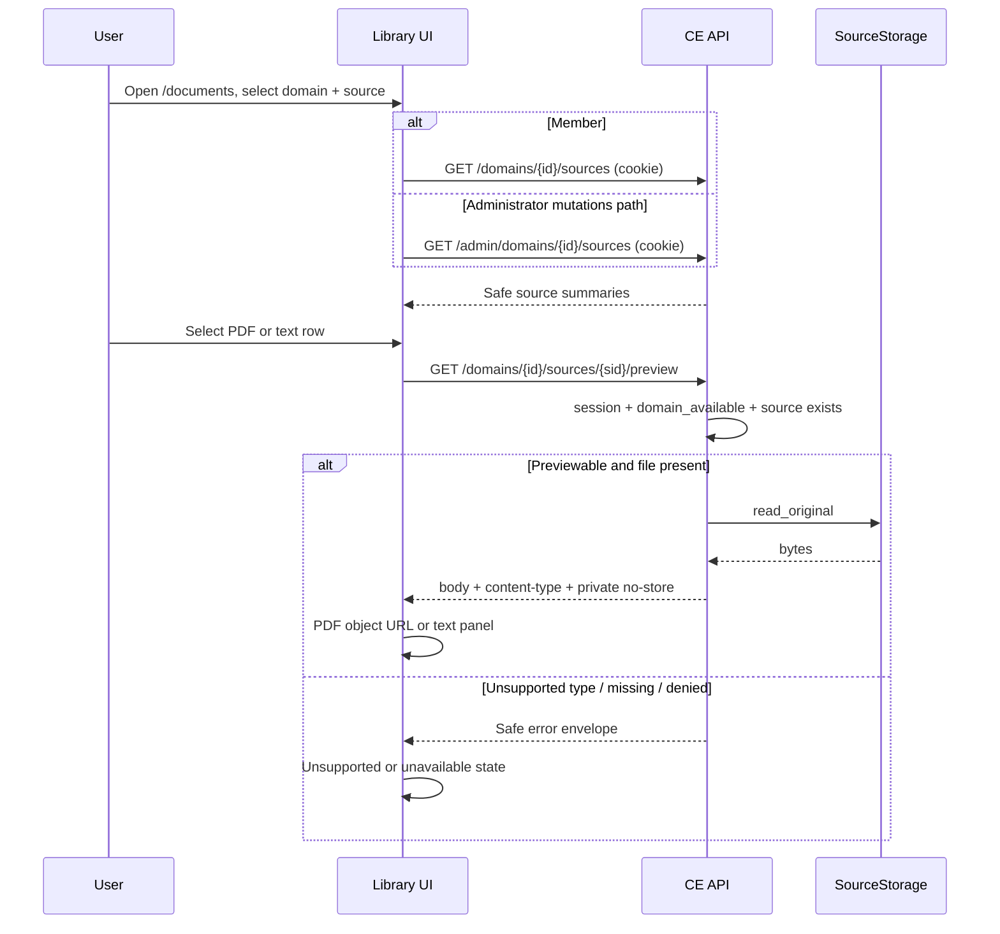

# Document source preview - Plan

## Goal Capsule

- **Objective:** Let domain readers open Library (`/documents`), select a Source Document, and inline-preview the stored original (PDF viewer or plain/markdown text) via a safe same-origin blob API, with concurrent multi-user reads and member read-only access.
- **Product authority:** F-009 owns the Library UI and preview wiring; API-001 / DATA-001 own the safe preview (and member-readable list) contract; F-004 owns Source Document storage of the original. Product language stays in `CONTEXT.md`.
- **Open blockers:** None. Route shape, member-list policy, and large-text rendering are resolved in Planning Contract.
- **Execution:** `code`

---

## Product Contract

### Summary

Ship safe Source Document preview for Knowledge Domain readers: cookie-authenticated blob fetch of the stored original, inline PDF or text rendering in the existing Library split panel, member list+preview without mutation controls, and no exclusive single-viewer lock.

### Problem Frame

The Library page already has an inline preview shell, but F-009 blocks blob fetch until API-001 captures a safe preview route. Admins and members cannot confirm what was uploaded without leaving the app. Old Context Engine solved this with `GET /documents/{id}/preview` → blob → `<object type="application/pdf">`.

### Key Decisions

- **Same-origin blob, not signed URL.** Cookie session auth; frontend creates an object URL and revokes it on switch/unmount. Matches old CE and F-009 port notes.
- **Domain readers, not admin-only.** Any authenticated user who can see that domain’s sources may list and preview. Concurrent viewers of the same source are allowed (read-only; no checkout lock).
- **Preview as soon as the original is stored.** Not gated on preparation or index eligibility. Fail closed if the file is missing, unauthorized, deleted, or unsupported.
- **PDF + plain/markdown; docx unsupported.** PDF uses the browser PDF object; plain/markdown render as text. Docx keeps metadata and an unsupported message.
- **Open `/documents` to members as read-only.** Same Library route; hide upload/retry/cancel/delete for non-admins. Nav already exposes Library to all authenticated users.
- **Preview only — no Download control.** Do not add a download button or `Content-Disposition: attachment`. Browser PDF chrome may still allow save; that is accepted.
- **Member-safe list is in scope.** Today list APIs and the page are admin-gated; this slice must make list+preview usable for members, not preview alone.

### Actors

- **Member** — lists sources for domains they can see; opens preview; cannot mutate sources.
- **Administrator** — same preview plus existing upload / retry / cancel / delete.
- **Backend** — authorizes domain access, streams original bytes (or text body) without exposing storage paths or runtime targets.

### Key Flows

1. **Open preview (happy path)** — User opens Library → selects domain → selects a PDF or text source → panel loads preview while prepare/index may still be running.
2. **Concurrent readers** — Two users select the same source; both receive successful previews independently.
3. **Unsupported / unavailable** — Docx or missing file shows a clear unsupported/unavailable state; metadata panel remains.
4. **Member vs admin** — Member sees list+preview only; admin still sees mutation controls.

```text
[Library list] --select--> [Preview panel]
                              |-- PDF --> blob --> <object type="application/pdf">
                              |-- text/md --> text body in panel
                              |-- docx/missing --> unsupported / unavailable
```

### Requirements

**Access and concurrency**

- R1. Authenticated domain readers (members and administrators) can open Library and list Source Documents for domains they are allowed to see.
- R2. Members cannot upload, retry, cancel, or delete sources from Library; administrators retain those controls.
- R3. Multiple users may preview the same Source Document concurrently; the product must not serialize or lock preview to a single viewer.

**Preview delivery**

- R4. Preview is delivered as a same-origin, cookie-authenticated fetch of the stored original (blob for PDF; readable text body for plain/markdown).
- R5. Preview succeeds once the original file is stored, independent of preparation or index state.
- R6. PDF renders inline in the existing Library preview panel (desktop ~50% split; mobile drawer/overlay pattern retained).
- R7. Plain text and markdown render as readable text in the preview panel.
- R8. Docx and other non-previewable types show an unsupported state without inventing a viewer.
- R9. Missing file, unauthorized domain/source, or deleted source fails closed with a safe unavailable/error state (no storage path, runtime URL, or secret in the UI).
- R10. The UI does not offer a Download control or attachment disposition for this slice.

**Safety and contracts**

- R11. API responses, logs, and client errors for preview must not expose private storage paths, runtime URLs, credentials, or raw provider/LightRAG payloads.
- R12. API-001 (and F-009 acceptance) must capture the safe preview contract and member-readable list behavior before or with implementation; OpenAPI snapshot and tests prove it.
- R13. Playwright covers upload (admin) → member or admin opens Library → selects source → sees PDF or text preview.

### Acceptance Examples

- AE1. When an admin uploads a PDF and the original is stored, selecting that row shows an inline PDF preview even if preparation is still running.
- AE2. When two authenticated domain readers select the same PDF at the same time, both previews succeed.
- AE3. When a member opens Library, they can list and preview but see no upload/retry/cancel/delete controls.
- AE4. When the selected source is docx, the panel shows unsupported preview and still shows safe metadata.
- AE5. When the stored original is missing, the panel shows unavailable/error without revealing a filesystem path.
- AE6. When a user without access to the domain requests preview, the API denies access with a safe error and the UI does not render bytes.

### Success Criteria

- F-009 preview gate closes: contract captured, panel wired, Playwright preview path recorded in acceptance.
- Members can use Library for read+preview without admin role.
- Safety scan / forbidden-field checks still pass for the new surfaces.

### Scope Boundaries

**In scope**

- Safe preview API for stored originals (PDF blob; plain/markdown text).
- Member-readable source list for Library.
- Wire existing Library preview panel; role-split mutation controls.
- Concurrent read-only preview.
- Contract, OpenAPI, integration, and Playwright evidence.

**Deferred for later**

- Citation / opaque source-ref inspector (later production slice).
- PDF highlight overlays / pdf.js viewer.
- Docx (or other Office) inline preview.
- Signed short-lived URLs.
- Explicit download / export of originals.
- Graph visualization and wiki UI.

**Outside this product's identity**

- Browser talking to storage paths, LightRAG, or Docker directly.
- Browser-side RAG or local vector preview.

### Dependencies / Assumptions

- Runnable stack can store originals (upload path + private source storage) so preview has a file to serve.
- Domain membership / visibility rules for “can see this domain’s sources” already exist for chat/domain selection; preview reuses that authority model rather than inventing a new ACL.
- Library nav remains available to all authenticated users; page-level admin hard-block is removed in favor of R1/R2.

### Outstanding Questions

**Resolved in Planning Contract**

- Exact API-001 path shape for preview and member list → KTD-1.
- Whether member list is a new non-admin route family or an expanded read policy on existing list endpoints → KTD-2.
- Exact text rendering rules for large plain/markdown files → KTD-3.

---

## Planning Contract

### Key Technical Decisions

- KTD-1. **Domain-nested member routes.** Capture and implement:
  - `GET /domains/{domain_id}/sources` — member-readable source list
  - `GET /domains/{domain_id}/sources/{source_id}/preview` — original bytes
  Mirror the existing P6 evidence pattern (`/domains/{domain_id}/…`) and reject copying old CE’s flat `/documents/{id}/preview`.
- KTD-2. **New non-admin route family; do not relax admin sources.** Keep all `/admin/domains/{domain_id}/sources*` routes `require_admin`. Member list+preview use `require_current_session` + `domain_available()` (same gate as evidence). Admins keep using admin list/mutation APIs for Library mutations; members use member list + shared preview route (admins may also call the member preview route).
- KTD-3. **Full original within upload cap; scrollable text.** Server streams the full stored original up to the existing 25 MiB upload limit with no preview truncation. Plain/markdown render as preformatted readable text in the existing scrollable panel (not HTML markdown render, not evidence-excerpt 500-char caps). Docx and other non-previewable types return a safe unsupported error; UI shows unsupported state + metadata.
- KTD-4. **Contract-first, then code.** Patch API-001 (and DATA-001 delivery notes only — no schema change) before or in the same change as routes. OpenAPI snapshot must update with the new paths.
- KTD-5. **FileResponse / binary body with private cache headers.** Preview returns the stored `contentType` for PDF / text / markdown; `Cache-Control: private, no-store`; no `Content-Disposition: attachment`. Errors use existing safe envelopes; never put storage paths in headers, bodies, or logs.
- KTD-6. **Frontend blob lifecycle.** Dedicated credentials-included fetch (not JSON-only `ceFetch`) → blob → `URL.createObjectURL` for PDF `<object>`; revoke on row switch, domain switch, unmount, and after source delete. Text/md: decode body into scrollable panel. Remove page-level admin hard-block; hide mutation controls when `user.role !== "administrator"`.

### High-Level Technical Design



**Authz matrix (planning):**

| Caller | List sources | Preview | Upload/retry/cancel/delete |
|---|---|---|---|
| Member, domain available | Member list route | Preview route | Denied (admin routes 403) |
| Admin | Admin list (mutations UI) | Preview route | Admin routes |
| Session without domain access | Denied | Denied | Denied |

### Assumptions

- “Domains they are allowed to see” means the existing member available-domain set (`domain_available` / `GET /domains`), not a new per-user ACL table.
- Admins previewing from Library may use the member preview route; they do not need a duplicate admin preview path.
- Markdown is shown as readable source text, not rendered HTML (avoids XSS and matches “readable text” in R7).

### Sequencing

1. U1 contract capture (API-001 / DATA-001 notes / F-009 gate language)
2. U2 backend routes + service
3. U3 frontend Library wiring
4. U4 tests, OpenAPI snapshot, Playwright, acceptance evidence

---

## Implementation Units

### U1. Capture member list and preview contracts

**Goal:** Close the F-009 preview gate in specs so implementation has an approved route shape, authz, headers, errors, and member-list behavior.

**Requirements:** R1, R4, R5, R8–R12; AE4–AE6

**Dependencies:** None

**Files:**
- Modify: `specs/03-contracts/api/context-engine-v1.md`
- Modify: `specs/03-contracts/data/context-engine-data.md` (delivery notes only — preview reads existing original bytes; no new tables)
- Modify: `specs/04-features/F-009-frontend-delivery/spec.md`
- Modify: `specs/04-features/F-009-frontend-delivery/ce-client-port-and-parity.md`
- Modify: `specs/04-features/F-009-frontend-delivery/test-plan.md`
- Optional note: `specs/04-features/F-004-source-documents-preparation/ux.md` or implementation-log (member viewer now owned by this slice)

**Approach:**
- Document KTD-1/KTD-2 routes under the member `/domains` family alongside evidence.
- Specify previewable content types (`application/pdf`, `text/plain`, `text/markdown`), unsupported types (docx), fail-closed missing file, `Cache-Control: private, no-store`, no attachment disposition, no path/runtime leakage.
- State list DTO reuses safe source summary fields (same safety bar as `SourceAdminSummary` / `safe_source()`), without outline/operations admin endpoints.
- Update F-009 open-decision / gate language to point at the captured contract.

**Patterns to follow:** Existing API-001 admin vs member split (`GET /admin/domains` vs `GET /domains`); P6 evidence authz prose; forbidden-field language already on source DTOs.

**Test scenarios:**
- Test expectation: none for this unit alone — contract text is verified by U2/U4 OpenAPI and integration tests. Reviewer checks route names, authz, and safety clauses are present.

**Verification:** API-001 catalog lists both routes with auth, response types, and error cases; F-009 no longer says “preview blocked until contract captured.”

---

### U2. Backend member list and preview endpoints

**Goal:** Serve member-readable source lists and stream stored originals through the approved preview route without leaking storage paths.

**Requirements:** R1, R3–R5, R8–R11; AE1, AE2, AE5, AE6

**Dependencies:** U1

**Files:**
- Modify: `context_engine/api/routes.py`
- Modify: `context_engine/services/sources.py` (preview helper using `SourceStorage.read_original` / existing `safe_source` / `list_sources`)
- Modify: `context_engine/services/domains.py` (reuse `domain_available` only — no new ACL)
- Test: `tests/test_sources.py` (extend; or adjacent new test module if file size warrants)
- Modify: `tests/snapshots/f008_openapi.json`

**Approach:**
- Add `GET /domains/{domain_id}/sources` with `require_current_session` + domain exists + `domain_available`; return safe summaries via existing list/safe helpers.
- Add `GET /domains/{domain_id}/sources/{source_id}/preview`: same authz; load source; if content type not previewable → safe unsupported error; if original missing → safe unavailable; else return file body with stored content type and `Cache-Control: private, no-store`.
- Prefer FastAPI `FileResponse` or equivalent streaming of bytes already read via `read_original`; wrap `SourceStorageError` into safe API errors (no path in message).
- Leave all `/admin/domains/.../sources*` handlers on `require_admin`.
- Update OpenAPI snapshot in the same change as routes.

**Execution note:** Start with failing integration tests for member list 200, member admin-list 403 still holds, PDF preview 200, docx unsupported, missing file unavailable, and forbidden-field scans on JSON error envelopes.

**Patterns to follow:** `tests/test_scoped_evidence_retrieval.py` member/admin evidence access; `tests/test_sources.py` `_assert_safe_payload` and `test_source_admin_routes_forbid_members`; `SourceStorage.read_original` error message style.

**Test scenarios:**
- Happy path: admin uploads PDF; member `GET .../sources` returns the source; member `GET .../preview` returns `application/pdf` bytes with private no-store.
- Happy path: plain/markdown upload; preview returns matching text content type and body.
- Edge: two sequential preview requests for the same source both succeed (no lock).
- Error: member calling any `/admin/domains/.../sources*` still 403.
- Error: preview for docx → unsupported safe error; no bytes.
- Error: original file removed from storage → unavailable safe error; payload/headers have no path substrings.
- Error: domain not available / wrong domain id → denied safe error; UI-facing body has no storage path.
- Integration: OpenAPI snapshot includes the two new paths; forbidden-key scan still passes on list JSON.

**Verification:** New routes green under pytest; admin-only proofs unchanged; snapshot updated; no path/runtime keys in list or error JSON.

---

### U3. Library member access and preview panel wiring

**Goal:** Open `/documents` to members as read-only and wire the existing inline preview panel to the approved blob/text preview API.

**Requirements:** R1, R2, R6, R7, R8–R10; AE1, AE3, AE4

**Dependencies:** U1, U2

**Files:**
- Modify: `frontend/src/features/documents/DocumentsPage.tsx`
- Modify: `frontend/src/features/documents/api.ts`
- Possibly modify: `frontend/src/lib/api/client.ts` or add a small blob helper beside documents API
- Possibly modify: `frontend/src/features/domains/api.ts` (reuse `listMemberDomains` for members)
- Test: `frontend/tests/foundation.test.mjs` (route/shell expectations if they assert admin-only Library)
- Optional component extract: preview subcomponents under `frontend/src/features/documents/` if the page becomes unwieldy

**Approach:**
- Remove page-level admin hard-block. Members load domains via `listMemberDomains()`; admins may keep `listAdminDomains()` for mutation workflows.
- Members list sources via the new member list route; admins keep admin list for upload/ops UI.
- Hide upload / retry / cancel / delete controls unless role is administrator (UI-only; backend remains authority).
- On row select: if content type is PDF, fetch preview with `credentials: "include"`, create object URL, render `<object type="application/pdf">`; if text/plain or text/markdown, show body in scrollable preformatted panel; if docx/other, show unsupported without fetching bytes (or handle unsupported API error).
- Revoke object URLs on selection change, domain change, unmount, and after successful delete.
- No Download button; do not set attachment disposition on the client.

**Patterns to follow:** `ce-client-port-and-parity.md` PDF blob lifecycle; existing split/drawer layout in `DocumentsPage.tsx`; member vs admin domain list helpers already in `features/domains/api.ts`.

**Test scenarios:**
- Happy path: selecting a PDF row mounts an object with a blob URL; switching rows revokes the previous URL.
- Happy path: selecting a markdown/plain source shows readable text in the panel.
- Edge: member session sees list + preview chrome without upload/retry/cancel/delete controls.
- Error: unsupported type shows unsupported state while metadata remains visible.
- Error: preview fetch failure shows unavailable/error without raw path text.

**Verification:** Typecheck/build pass; manual or component-level proof of revoke-on-unmount; members can open Library without forbidden page.

---

### U4. Playwright preview path and F-009 evidence closeout

**Goal:** Prove admin upload → Library preview for admin and member, and record acceptance so the F-009 preview gate is closed.

**Requirements:** R12, R13; AE1, AE3; Success Criteria

**Dependencies:** U2, U3

**Files:**
- Modify or create: `frontend/tests/e2e/` preview/documents spec (extend pilot suite or add focused spec)
- Modify: `frontend/tests/e2e/helpers/stack-seed.ts` if a PDF fixture seed is needed
- Add fixture: small PDF and/or reuse `frontend/tests/e2e/fixtures/seed-source.md` for text preview
- Modify: `specs/04-features/F-009-frontend-delivery/acceptance.md`
- Modify: `specs/04-features/F-009-frontend-delivery/implementation-log.md`
- Modify: `specs/07-traceability/feature-register.md` (and change-log if required by repo convention)

**Approach:**
- Seed or upload a previewable source via admin API against the compose stack.
- Log in as admin and as member; open Library; select source; assert PDF object or text preview visible.
- Assert member UI lacks mutation controls.
- Record AC-007 documents-preview evidence links and dates in acceptance; note remaining graph gaps if still open so F-009 status stays honest.

**Execution note:** Prefer smoke/runtime Playwright against the runnable stack over pure unit coverage for the end-to-end preview path.

**Patterns to follow:** `frontend/tests/e2e/pilot-happy-path.spec.ts`, `stack-seed.ts`, F-009 acceptance table style.

**Test scenarios:**
- Covers AE1. Admin uploads PDF (or seed); selecting the row shows inline PDF preview.
- Covers AE3. Member opens Library, lists/previews, and has no upload/retry/cancel/delete controls.
- Integration: text/markdown source preview shows readable text (if fixture available in the same run).
- Edge: docx unsupported path may remain API-level only if E2E fixture cost is high — then cite U2 test as AE4 evidence in acceptance.

**Verification:** Playwright preview path green; acceptance.md marks documents preview evidence; forbidden-field posture unchanged for new surfaces.

---

## Verification Contract

| Gate | Command / check | Applies to | Done signal |
|---|---|---|---|
| Contract present | Review API-001 member list + preview sections | U1 | Routes, authz, headers, errors documented |
| Backend unit/integration | `pytest` targeting source/preview tests | U2, U4 | Member list/preview cases green; admin forbid still green |
| OpenAPI drift | Snapshot test for `tests/snapshots/f008_openapi.json` | U2 | Snapshot matches new paths |
| Frontend typecheck/build | Frontend package typecheck/build used by F-009 | U3 | Pass |
| Playwright preview | `npm run test:e2e` (or focused documents preview spec) against compose stack | U4 | Preview + member read-only assertions pass |
| Safety | Forbidden-field / path leakage checks on list JSON and preview error envelopes | U2, U4 | No path/runtime/secret leakage |
| Traceability | F-009 acceptance + feature-register updated | U4 | Preview gate evidence recorded |

---

## Definition of Done

- All Product Contract requirements R1–R13 have automated or explicit manual evidence cited in F-009 acceptance.
- API-001 and OpenAPI snapshot include member list + preview; admin source mutation routes remain admin-only.
- Library works for members (list + preview) without mutation controls; admins retain mutations.
- PDF and plain/markdown preview render in the existing inline panel; docx shows unsupported; missing/unauthorized fail closed safely.
- Object URLs are revoked on switch/unmount; no Download control added.
- No storage paths, runtime URLs, or secrets in API responses, logs, or UI errors for these surfaces.
- Deferred items (source-ref, pdf.js, docx viewer, signed URLs, download) remain explicitly out of scope.

---

## System-Wide Impact

- **Members:** First approved read path into Source Document originals (Restricted data class). Library becomes usable without admin role; mutation remains admin-only.
- **Administrators:** Upload/retry/cancel/delete unchanged on admin routes; preview uses the shared member preview route.
- **API consumers / OpenAPI:** Two new public paths; snapshot and any generated clients must update. Admin source catalog unchanged.
- **Security/privacy:** Preview streams Restricted originals under cookie session + domain availability; expands the attack surface for path leakage and unauthorized domain reads — covered by KTD-5 and U2 safety tests.
- **F-004 / F-009:** Closes the F-009 preview gate; does not change F-004 preparation lifecycle. Source-ref / citation navigation stays blocked.

---

## Risks and Dependencies

| Risk | Mitigation |
|---|---|
| First binary `FileResponse` surface leaks path via headers/errors | Safe error wrappers; forbid attachment disposition; extend `_assert_safe_payload`-style checks; assert Cache-Control |
| Member list accidentally widens admin DTOs or admin routes | Parallel `/domains/...` routes only; keep existing member-forbid tests |
| Stale blob URL after delete/domain switch | Explicit revoke on selection/domain/unmount/delete (KTD-6) |
| Playwright without PDF fixture | Seed small PDF or prove text preview in E2E and PDF via API integration (document split evidence in acceptance) |
| Runnable stack / storage prerequisite missing | Depends on F-010 stack + F-004 upload path already storing originals |

**Depends on:** F-004 private original storage; F-010 runnable stack for E2E; existing domain availability model.

---

## Sources and Research

- Product contract: this file (ce-brainstorm requirements-only enrichment)
- API-001: `specs/03-contracts/api/context-engine-v1.md`
- DATA-001: `specs/03-contracts/data/context-engine-data.md`
- F-009: `specs/04-features/F-009-frontend-delivery/` (spec, acceptance, test-plan, ce-client-port-and-parity)
- Design gates: `.devnotes/P8-post-impl-REVIEW/ID-A-documents-preview-and-source-ref.md`, `.devnotes/P8-post-impl-REVIEW/F-009-P9-reconciled-design-gates.md`
- Implementation anchors: `context_engine/services/sources.py`, `context_engine/api/routes.py`, `frontend/src/features/documents/DocumentsPage.tsx`
- Test anchors: `tests/test_sources.py`, `tests/test_scoped_evidence_retrieval.py`, `frontend/tests/e2e/pilot-happy-path.spec.ts`
- Strategy alignment: `STRATEGY.md` Domain operations readiness + Member primary persona
- Institutional `docs/solutions/`: minimal preview-specific entries; stack prerequisite in `docs/solutions/architecture-patterns/runnable-stack-postgres-lease-workers.md`
