# Domain deploy settings UI - Plan

## Goal Capsule

- **Objective:** Let Administrators deploy a new Knowledge Domain and control Start/Stop/Delete from a clean Settings Domains surface that reuses Local Studio environment-controls / connections-panel grammar—accordion rows, Deploy footer—without exposing Docker, ports, URLs, or other runtime operator guts.
- **Product authority:** F-009 owns Settings Domains UX; F-003 owns domain lifecycle APIs and safe DTOs; F-010 owns deferred Runtime Node / Docker / storage-summary operator surfaces; DESIGN.md owns SettingsRow / StatusPill / quiet-danger delete patterns.
- **Open blockers:** None.
- **Execution:** `code`

---

## Product Contract

### Summary

Ship one Settings **Knowledge Domains** group styled like the Controllers list: chevron **accordion** rows (status pill + Start/Stop XOR + quiet Delete), safe expanded details (display name, domain id, locked embedding), and a compact **Deploy** footer (id, display name, embedding). Deploy = create + start. No ports, URLs, container ids, or storage bars in this slice.

### Problem Frame

Admins need to deploy and control domains from Settings. The annotated Controllers mockup is the visual target (accordion + add row + status pills), but Context Engine contracts forbid showing host ports, runtime URLs, and container ids. Storage quota bars need a safe summary API that does not exist yet (F-010-adjacent). This plan keeps the mockup’s interaction grammar while stripping operator guts.

### Key Decisions

- **Safe accordion, not radio Controllers.** Chevron expands/collapses a domain row; there is no “active backend” radio—domains are not controller URLs.
- **Expanded body = safe facts only.** Display name, domain id, embedding profile (locked after create). No port, no `http://…`, no container id.
- **Storage bars deferred.** Total / raw docs / Postgres volume and 5 GB warnings wait for a safe storage-summary contract; do not fake bars from browser guesses.
- **Deploy = create + start.** One Deploy action means the domain is coming up, not parked stopped.
- **One group + Deploy footer.** Environment-controls list + add-row grammar; not a second section or a create modal.
- **Start-failure keeps the domain.** If create succeeds and start fails, keep the row, show a safe danger notice, and let Start retry. Do not roll back/delete.
- **LS error grammar.** `SettingsNotice` + `StatusPill` danger; no Docker/compose dumps.
- **Quiet Delete + `UiModal` confirm.** Start/Stop is primary; Delete is quiet danger until confirm.
- **Refresh after action, not live polling.**
- **No logs/diagnostics on this panel.**

### Actors

- **Administrator** — deploys domains and runs Start/Stop/Delete from Settings Domains.
- **Backend** — owns create/start/stop/delete lifecycle; returns safe admin domain summaries only.
- **Member** — not an actor on this surface (admin-only).

### Key Flows

- F1. Deploy new domain
  - **Trigger:** Admin fills id, display name, and embedding profile, then clicks Deploy.
  - **Steps:** Create → start → refresh list → row appears with busy/starting then running (or failed with notice if start fails after create).
  - **Outcome:** Domain is deployed from Settings without leaving the panel or seeing operator guts.

- F2. Start / Stop existing domain
  - **Trigger:** Admin clicks Start or Stop on a row header.
  - **Steps:** Action runs with busy pill and disabled controls → refresh list → terminal state pill.
  - **Outcome:** Day-to-day lifecycle control stays on the same clean rows.

- F3. Delete domain
  - **Trigger:** Admin clicks quiet Delete.
  - **Steps:** Confirm modal → delete accepted → refresh list (deleting/removed per backend semantics).
  - **Outcome:** Destructive action is explicit and recoverable only via confirm, not accidental click.

- F4. Start fails after create
  - **Trigger:** Deploy create succeeds; start fails.
  - **Steps:** Domain remains in list → `SettingsNotice` danger with safe message → Admin can Start again.
  - **Outcome:** Recoverable deploy without silent rollback.

- F5. Expand domain details
  - **Trigger:** Admin clicks the row chevron (or equivalent expand control).
  - **Steps:** Row expands to show safe details (name, id, locked embedding); collapse hides the body. Header keeps status pill and lifecycle actions.
  - **Outcome:** Details without leaving Settings or leaking infra.

### Visualizations

```text
Settings → Domains
┌ Knowledge Domains ─────────────────────────────────────────┐
│ Lifecycle on backend. No Docker / port / URL details.      │
├────────────────────────────────────────────────────────────┤
│ ▸ Fatigue Manuals        [running]      [Stop]  Delete     │
│   fatigue                                                  │
├────────────────────────────────────────────────────────────┤
│ ▾ Homelab                [stopped]     [Start]  Delete     │
│   ┌ expanded (safe) ─────────────────────────────────────┐ │
│   │ Domain: Homelab                                      │ │
│   │ Id: homelab                                          │ │
│   │ Embedding: <profile label> · locked                  │ │
│   │ (storage bars: deferred — not shown)                 │ │
│   └──────────────────────────────────────────────────────┘ │
├────────────────────────────────────────────────────────────┤
│ [id____] [name____] [embedding ▾]              [Deploy]    │
└────────────────────────────────────────────────────────────┘

  error → SettingsNotice tone=danger (safe copy only)
  ok    → SettingsNotice tone=good (optional short confirm)

MOCKUP DELIBERATELY OMITTED FROM UI
  port / auto URL  ·  radio "active"  ·  storage 5GB bars
```

### Requirements

**Surface and layout**

- R1. Settings Domains is one `SettingsGroup` of accordion domain rows plus a compact Deploy footer (environment-controls / connections-panel grammar), not a multi-card create form and not a Controllers radio list.
- R2. Each row **header** shows a chevron, display name, safe domain id subtitle, lifecycle `StatusPill`, primary Start **or** Stop (XOR), and quiet Delete.
- R12. Expanding a row shows only safe details: display name, domain id, and locked embedding label (resolved from known profiles when possible). Collapsed by default.
- R3. The Deploy footer requires domain id, display name, and embedding profile before Deploy is enabled.

**Lifecycle behavior**

- R4. Deploy performs create then start as one admin gesture and refreshes the list afterward.
- R5. Start and Stop remain available on row headers for later control and refresh the list afterward.
- R6. Delete uses quiet danger treatment and an explicit confirmation modal before requesting deletion, then refreshes the list.
- R7. While an action is in flight, the row shows a busy/transition pill (for example starting, stopping, deleting) and disables conflicting controls on that row.

**Safety and errors**

- R8. The browser never displays host ports, Docker/compose targets, runtime URLs, container ids, reachability dumps, manifest/lifecycle operator dumps, or storage quota bars on this surface.
- R9. Action failures use Local Studio settings error grammar: panel `SettingsNotice` danger with a safe message; failed domain state uses `StatusPill` danger.
- R10. If create succeeds and start fails, the domain remains listed and Start remains available; the product does not auto-delete the created domain.

**Access**

- R11. This surface remains Administrator-only; Members do not get deploy or lifecycle controls here.

### Scope Boundaries

**In scope**

- Settings Domains accordion + Deploy + Start/Stop/Delete using Local Studio settings primitives and existing safe admin domain APIs.
- Visual grammar adapted from environment-controls (list + add row), with chevron accordion instead of radio activation.

**Deferred for later**

- Per-domain storage visualization (total / raw docs / Postgres volume, 5 GB limit, warning) until a safe storage-summary contract exists.
- Runtime Node / Docker environment consoles and other F-010 operator dashboards.
- Per-domain logs/diagnostics entry points from this panel.
- Continuous live status polling beyond refresh-after-action.
- Host-port selection, auto-increment URL fields, or any infra field in create/deploy UI.
- Renaming the product concept to “LightRAG Containers” (keep **Knowledge Domains** vocabulary).

**Outside this product's identity**

- Browser talking to Docker, compose, controller URLs, or storage paths directly.
- Showing ports/URLs as if domains were Controllers.
- Porting the old Knowledge Graph card chrome (white multi-line operator dumps) into Local Studio Settings.

### Acceptance Examples

- AE1. Happy deploy
  - **Covers:** R1, R3, R4, R7
  - **Given:** Admin is on Settings Domains with a valid embedding profile available.
  - **When:** Admin enters id, display name, embedding, and clicks Deploy.
  - **Then:** The domain appears in the list without a browser reload; pill shows a starting/busy state then running (or equivalent safe terminal success state).

- AE2. Start failure after create
  - **Covers:** R9, R10
  - **Given:** Create succeeds and start fails.
  - **When:** Deploy finishes the failed start.
  - **Then:** A danger `SettingsNotice` appears with safe copy; the domain remains listed; Start can be retried; no operator guts are shown.

- AE3. No operator leakage
  - **Covers:** R2, R8, R12
  - **Given:** Domains exist with backend runtime details.
  - **When:** Admin views and expands a Domains row.
  - **Then:** Header and expanded body show only safe name/id/state/embedding—no ports, URLs, container ids, reachability/manifest dumps, or storage bars.

- AE4. Delete confirm
  - **Covers:** R6
  - **Given:** A domain row is visible.
  - **When:** Admin clicks Delete then cancels the modal.
  - **Then:** The domain remains; only confirming the modal requests deletion.

- AE5. Accordion expand/collapse
  - **Covers:** R12, F5
  - **Given:** At least one domain row exists.
  - **When:** Admin toggles the chevron.
  - **Then:** Expanded body shows locked embedding (and name/id); header keeps status pill and Start/Stop/Delete; collapse hides the body.

### Assumptions

- Existing `POST /admin/domains` create and start/stop/delete endpoints remain the product surface; this work does not invent new public infra fields.
- Embedding profiles already available to admin Settings can populate the Deploy embedding control and expanded locked label.
- Admin-only gating for Settings Domains already matches product auth rules.
- Admin domain DTO may already include `embeddingProfileId`; expanded label resolves via runtime profiles when present, otherwise shows a safe fallback (profile id or “Locked”)—never a runtime URL.

---

## Planning Contract

### Key Technical Decisions

- **KTD-1. Extend `DomainsSection` in place.** Do not add a new Settings route or feature package. Pass embedding profiles from the parent runtime snapshot already loaded by Settings.
- **KTD-2. Client Deploy = `createDomain` then `startDomain`.** No new `/deploy` endpoint. Prefer a small `deployDomain` helper (create then start) so U3 can test outcomes without React RTL. On start failure after create: call `onError` with the safe API message and `reload()` so the created domain appears—do **not** also call `onChanged` (that would flash a success notice). Never auto-delete.
- **KTD-3. Delete uses `UiModal`.** Replace `window.confirm` for domain delete so R6 matches DESIGN quiet-danger + modal. Cancel closes without calling delete.
- **KTD-4. Busy presentation without live polling.** While a request is in flight, disable that row’s controls and show an in-flight label (starting/stopping/deleting/deploying). After the request settles, refresh via existing `reload()` and render the backend `state` pill. Do not invent continuous poll loops.
- **KTD-5. Embedding options from runtime model profiles.** Filter `runtime.modelProfiles` where `profileKind === "embedding"`; preselect a default embedding profile when present. Prefer compact native `<select>` or existing shared `Select` styled to Settings density—do not introduce a new form system.
- **KTD-6. Client id validation mirrors backend pattern.** Validate domain id against `^[a-z0-9][a-z0-9_-]{1,62}$` before POST; still surface API errors via `SettingsNotice`.
- **KTD-7. Test via extracted helpers + source scan.** Frontend has no React Testing Library; follow `documents-deep-link.test.mjs` style: pure helpers (including `deployDomain` outcome classification) + node:test. Source-scan forbids **DTO/field tokens** (`host_port`, `hostPort`, `container_id`, `runtime_url`, `base_url`, etc.)—not prose words like “Docker” in safe UI copy. Optional Playwright only if smoke needs interaction proof beyond helpers.
- **KTD-8. Accordion local UI state.** Track which domain id is expanded in component state. Chevron toggles expand; do not use radio “active controller” semantics from environment-controls. Visual density should still match environment-controls rows (hover, mono subtitle, StatusPill, quiet actions).
- **KTD-9. No storage UI stubs that imply real quotas.** Do not render placeholder progress bars that look like live 5 GB metering; omit the section until a safe API exists.

### High-Level Technical Design

```mermaid
sequenceDiagram
  participant Admin
  participant DomainsSection
  participant API as Admin domains API
  participant Panel as SettingsPanel reload

  Admin->>DomainsSection: Deploy(id, name, embedding)
  DomainsSection->>API: POST /admin/domains
  alt create fails
    DomainsSection-->>Admin: SettingsNotice danger
  else create ok
    DomainsSection->>API: POST .../start
    alt start fails
      DomainsSection-->>Admin: SettingsNotice danger
      DomainsSection->>Panel: reload (domain kept)
    else start ok
      DomainsSection->>Panel: reload
      DomainsSection-->>Admin: SettingsNotice good (optional)
    end
  end
```



```text
SettingsPanel (admin)
  runtime.modelProfiles ──filter embedding──► Deploy footer + expanded label
  domains[] ──accordion rows──► header (chevron, pill, Start XOR Stop, Delete)
                              └─ body (name, id, locked embedding)
  onChanged / onError / reload() ◄── DomainsSection actions

environment-controls reference
  list + add-row density  ✓
  radio "active"           ✗ → chevron accordion
  URL / API key fields     ✗ → id / name / embedding
```

### Assumptions

- `createDomain` / `startDomain` / `stopDomain` / `deleteDomain` in `frontend/src/features/domains/api.ts` stay the only client seams.
- Admin domain DTO remains safe (`id`, `displayName`, `state`, `embeddingProfileId`, `available`, timestamps)—no infra fields to strip in UI.
- Backend create leaves domain `stopped` until start; Deploy’s second call is what brings it up.
- `UiModal` / `UiModalHeader` in `frontend/src/_shared/ui` are acceptable for Settings confirm without a new modal primitive.
- Lucide chevron icons already used elsewhere in the frontend are fine for expand/collapse.

### Open Questions

- None blocking. Deferred: safe storage-summary DTO + UI; optional F-010 deep-link from failed rows.

### Risks & Dependencies

- **Start after create can fail** while create succeeded — UI must keep the domain (R10); covered in U1 tests.
- **Concurrent ops** may return `domain_operation_in_progress` — surface safe `isApiError` message; disable busy row.
- **No embedding profiles** — Deploy stays disabled with a quiet empty-state hint; do not invent profiles client-side.
- **Accordion vs SettingsRow** — may need a thin custom row shell inspired by environment-controls rather than forcing `SettingsRow` alone; keep tokens/primitives, avoid new design system.
- Depends on F-003 admin domain APIs and existing Settings admin gate; does not depend on F-010 Docker/storage UI.

### Alternative Approaches Considered

- **Mockup with ports/URLs/storage** — matches annotated image literally; rejected (contract + missing storage API).
- **Two Settings groups (Deploy | Domains)** — clearer split, more chrome; rejected for connections-panel cleanliness.
- **Deploy modal** — cleaner list, weaker “deploy from this surface” feel; rejected.
- **Backend single `/deploy` endpoint** — nicer atomicity, invents contract surface; rejected.
- **Keep `window.confirm`** — conflicts with R6/DESIGN modal language; rejected for `UiModal`.
- **Flat rows only (pre-mockup plan)** — simpler; superseded by user mockup choice for safe accordion.

---

## Implementation Units

### U1. Deploy footer and create-then-start

- **Goal:** Admins can Deploy (create + start) from a compact footer on the Knowledge Domains group, with embedding selection and refresh/error behavior.
- **Requirements:** R1, R3, R4, R7, R9, R10, R11; F1, F4; AE1, AE2
- **Dependencies:** None
- **Files:**
  - Modify: `frontend/src/features/settings-panel/SettingsPanel.tsx`
  - Modify: `frontend/src/features/domains/api.ts` (import/wire only if needed; create already exists)
  - Create: `frontend/src/features/settings-panel/domainSettingsHelpers.ts`
- **Approach:** Thread embedding profiles from parent `runtime` into `DomainsSection`. Add footer fields (id, display name, embedding select) and Deploy. Implement `deployDomain` helper that sequences create → start and returns a typed outcome (`success` | `create_failed` | `start_failed_keep`). On `start_failed_keep`: `onError` + `reload()` only. Clear draft fields on full success. Show in-flight disable/label during Deploy. Keep one `SettingsGroup`. When the domain list is empty, still render the Deploy footer under (or instead of only) the empty notice—do not early-return before the footer.
- **Execution note:** Extract helpers (id validity, embedding filter/default, `deployDomain`) first so U3 can lock orchestration without React RTL.
- **Patterns to follow:** `environment-controls` add-row density; Provider section `SettingsInput` + `SettingsButton`; panel `onChanged`/`onError`/`reload()`; `createDomain` in `frontend/src/features/domains/api.ts`; e2e seed create+start in `frontend/tests/e2e/helpers/stack-seed.ts`.
- **Test scenarios:**
  - Happy path (`deployDomain`): valid input → create then start → outcome `success`.
  - Covers AE2: create succeeds, start throws → outcome `start_failed_keep`; no delete call.
  - Create fails → outcome `create_failed`; start not called.
  - Deploy control disabled when any required field missing or no embedding profiles (helper predicate).
  - Invalid id rejected client-side before POST.
- **Verification:** Admin can Deploy from Settings Domains; empty list still shows Deploy footer; start-fail keeps domain; no new API routes.

### U2. Accordion rows, busy state, and UiModal delete

- **Goal:** Domain rows match the safe accordion mockup: chevron expand, status pill, Start XOR Stop, quiet Delete with modal, no operator guts.
- **Requirements:** R1, R2, R5, R6, R7, R8, R12; F2, F3, F5; AE3, AE4, AE5
- **Dependencies:** U1 (shared `DomainsSection` busy plumbing + embedding profiles)
- **Files:**
  - Modify: `frontend/src/features/settings-panel/SettingsPanel.tsx`
  - Modify: `frontend/src/features/settings-panel/domainSettingsHelpers.ts` (tone/busy/embedding-label helpers)
- **Approach:** Build accordion row headers inspired by environment-controls `ControllerRow` density (chevron instead of radio). Expanded body lists safe facts only. Replace `window.confirm` with `UiModal` for delete. Show Start XOR Stop from runtime state. Busy disables that row’s actions; then `reload()`. Resolve embedding label from `embeddingProfileId` + runtime profiles. Omit storage UI entirely.
- **Patterns to follow:** `.reference-LS-frontend/templates/nextjs-feature-demos/features/environment-controls/components/environment-controls-demo.tsx` row layout; `UiModal` / `UiModalHeader`; DESIGN quiet-danger delete; StatusPill tones.
- **Test scenarios:**
  - Covers AE4: delete opens modal; cancel does not call `deleteDomain`.
  - Confirm delete calls `deleteDomain` then reload.
  - Start/Stop set busy for that domain id and clear after settle.
  - Covers AE3/AE5: expanded body helper only exposes safe fields; source scan forbids operator field tokens.
  - Embedding label helper maps profile id → display label / locked fallback.
- **Verification:** Accordion expand shows embedding without ports/URLs; Delete requires modal; busy disables conflicting controls.

### U3. Helper and source-scan tests

- **Goal:** Automate deploy outcome rules, id/embedding helpers, and no-leakage guard without inventing a React test stack.
- **Requirements:** R3, R8, R10, R12; AE1–AE5 (logic coverage)
- **Dependencies:** U1, U2
- **Files:**
  - Create: `frontend/tests/domains-settings.test.mjs`
  - Modify: `frontend/src/features/settings-panel/domainSettingsHelpers.ts` (as needed for export surface)
- **Approach:** node:test module importing helpers (same loader pattern as `documents-deep-link.test.mjs`). Assert id validation, embedding filter/default/label, `deployDomain` outcomes, busy label mapping, and a source scan of Settings Domains UI files forbidding **field/DTO tokens** (not the word “Docker” in safe copy).
- **Execution note:** Keep tests fixture-free; mock `createDomain`/`startDomain` at the helper boundary. Do not require Playwright for the default gate.
- **Test scenarios:**
  - Id pattern accept/reject cases aligned with backend slug rules (`^[a-z0-9][a-z0-9_-]{1,62}$`).
  - Embedding filter returns only `profileKind === "embedding"`; default prefers `isDefault` when set.
  - `deployDomain`: start-fail after create → `start_failed_keep` (not rollback).
  - Source scan fails if Domains Settings UI introduces forbidden operator **field** tokens.
- **Verification:** `npm.cmd run test` from `frontend/` passes for the new file; typecheck clean for touched TS.

---

## Verification Contract

| Gate | Command / check | Applies to |
|---|---|---|
| Helper + scan tests | `npm.cmd run test` from `frontend/` (includes `tests/domains-settings.test.mjs`) | U1–U3 |
| Typecheck | `npm.cmd run typecheck` from `frontend/` | U1–U2 |
| Manual smoke | Admin Settings → Domains: Deploy; expand/collapse; Start/Stop; start-fail keep; Delete cancel/confirm; empty list still shows Deploy footer; confirm no ports/URLs/storage bars | AE1–AE5, F2, F5 |
| Leakage review | Expanded + collapsed UI show only safe fields | AE3 / R8 / R12 |

---

## Definition of Done

- [ ] All Product Contract requirements R1–R12 satisfied in Settings Domains
- [ ] U1–U3 complete with listed test scenarios green
- [ ] Accordion expand shows locked embedding only (no ports/URLs/storage bars)
- [ ] Delete uses `UiModal` confirm; Deploy is create-then-start with start-fail keep
- [ ] No host ports, Docker targets, runtime URLs, or container ids appear in Domains UI
- [ ] No live polling added; refresh-after-action only
- [ ] Mockup grammar adopted without silent F-010 / contract drift

---

## Appendix

### Sources & Research

- Origin Product Contract: this file (ce-brainstorm → ce-plan enrichment; mockup revision 2026-07-10)
- Visual reference: `.reference-LS-frontend/templates/nextjs-feature-demos/features/environment-controls/`
- Patterns: `frontend/src/features/settings-panel/SettingsPanel.tsx`, `frontend/src/features/domains/api.ts`, `frontend/src/_shared/ui/index.tsx` (`UiModal`, Settings primitives)
- Contracts: `specs/03-contracts/api/context-engine-v1.md`, `specs/03-contracts/data/context-engine-data.md` (safe domain fields)
- Boundaries: F-009 / F-010 deferred Docker, Runtime Node, storage summaries
- External research: skipped — strong local Settings + domain API patterns
