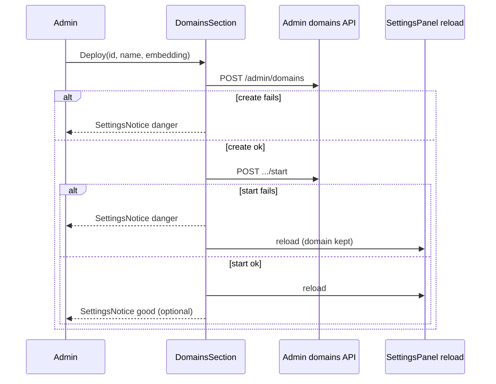

# Domain deploy settings UI - Plan

## Goal Capsule

- **Objective:** Let Administrators deploy a new Knowledge Domain and control Start/Stop/Delete from a clean Settings Domains surface that matches Local Studio connections-panel grammar—without exposing Docker or runtime operator guts.
- **Product authority:** F-009 owns Settings Domains UX; F-003 owns domain lifecycle APIs and safe DTOs; F-010 owns deferred Runtime Node / Docker operator surfaces; DESIGN.md owns SettingsRow / StatusPill / quiet-danger delete patterns.
- **Open blockers:** None.
- **Execution:** `code`

---

## Product Contract

### Summary

Ship one Settings **Knowledge Domains** group: lifecycle rows plus a compact **Deploy** footer. Deploy creates the domain and starts it in one gesture. Rows keep Start/Stop and quiet Delete-with-confirm. Busy pills and list refresh follow each action. Errors use Local Studio `SettingsNotice` / `StatusPill` only—no operator guts.

### Problem Frame

Admins need to deploy a new domain from the control surface they already use for lifecycle. The old Context Engine Knowledge Graph panel mixed create, host-port choices, reachability/manifest dumps, and start/stop into noisy cards. The new Settings Domains section already supports Start/Stop/Delete with LS row grammar but has no create/deploy path, so deploy still feels incomplete. Contracts forbid leaking host ports, runtime URLs, and container ids to the browser, so a clean LS-style surface is both a UX and a safety win.

### Key Decisions

- **Deploy = create + start.** One Deploy action means the domain is coming up, not parked stopped.
- **One group + Deploy footer.** Connections-panel grammar (list rows + compact add row), not a second section or a modal.
- **Start-failure keeps the domain.** If create succeeds and start fails, keep the row, show a safe danger notice, and let Start retry. Do not roll back/delete the half-created domain.
- **LS error grammar.** Panel errors use `SettingsNotice` danger/good; row failure uses `StatusPill` danger. No raw Docker/compose dumps.
- **Quiet Delete + confirm modal.** Start/Stop is the primary control; Delete stays secondary quiet danger text until confirmation.
- **Safe fields only on screen.** Rows show display name, domain id, and lifecycle state pill. No host ports, Docker/compose, runtime URLs, container ids, reachability, or manifest dumps.
- **Refresh after action, not live polling.** After Deploy/Start/Stop/Delete, refresh the domain list so busy → terminal state is visible without a browser reload.
- **No logs/diagnostics on this panel.** Those stay on deferred F-010 / logs surfaces.

### Actors

- **Administrator** — deploys domains and runs Start/Stop/Delete from Settings Domains.
- **Backend** — owns create/start/stop/delete lifecycle; returns safe admin domain summaries only.
- **Member** — not an actor on this surface (admin-only).

### Key Flows

- F1. Deploy new domain
  - **Trigger:** Admin fills id, display name, and embedding profile, then clicks Deploy.
  - **Steps:** Create → start → refresh list → row appears with busy/starting then running (or failed with notice if start fails after create).
  - **Outcome:** Domain is deployed from Settings without leaving the panel or seeing operator guts.

- F2. Start / Stop existing domain
  - **Trigger:** Admin clicks Start or Stop on a row.
  - **Steps:** Action runs with busy pill and disabled controls → refresh list → terminal state pill.
  - **Outcome:** Day-to-day lifecycle control stays on the same clean rows.

- F3. Delete domain
  - **Trigger:** Admin clicks quiet Delete.
  - **Steps:** Confirm modal → delete accepted → refresh list (deleting/removed per backend semantics).
  - **Outcome:** Destructive action is explicit and recoverable only via confirm, not accidental click.

- F4. Start fails after create
  - **Trigger:** Deploy create succeeds; start fails.
  - **Steps:** Domain remains in list → `SettingsNotice` danger with safe message → Admin can Start again.
  - **Outcome:** Recoverable deploy without silent rollback.

### Visualizations

```text
Settings → Domains
┌ Knowledge Domains ─────────────────────────────────────┐
│ Lifecycle on backend. No Docker details in UI.         │
├────────────────────────────────────────────────────────┤
│ Fatigue Manuals          [running]   [Stop]  Delete    │
│ fatigue                                                │
├────────────────────────────────────────────────────────┤
│ Ops Notes                [starting]  …busy…            │
│ ops-notes                                              │
├────────────────────────────────────────────────────────┤
│ [id____] [name____] [embedding ▾]          [Deploy]    │
└────────────────────────────────────────────────────────┘

  error → SettingsNotice tone=danger (safe copy only)
  ok    → SettingsNotice tone=good (optional short confirm)
```

### Requirements

**Surface and layout**

- R1. Settings Domains is one `SettingsGroup` of domain rows plus a compact Deploy footer (connections-panel style), not a multi-card create form.
- R2. Each row shows display name, safe domain id subtitle, lifecycle `StatusPill`, primary Start or Stop, and quiet Delete.
- R3. The Deploy footer requires domain id, display name, and embedding profile before Deploy is enabled.

**Lifecycle behavior**

- R4. Deploy performs create then start as one admin gesture and refreshes the list afterward.
- R5. Start and Stop remain available on rows for later control and refresh the list afterward.
- R6. Delete uses quiet danger treatment and an explicit confirmation modal before requesting deletion, then refreshes the list.
- R7. While an action is in flight, the row shows a busy/transition pill (for example starting, stopping, deleting) and disables conflicting controls on that row.

**Safety and errors**

- R8. The browser never displays host ports, Docker/compose targets, runtime URLs, container ids, reachability dumps, or manifest/lifecycle operator dumps on this surface.
- R9. Action failures use Local Studio settings error grammar: panel `SettingsNotice` danger with a safe message; failed domain state uses `StatusPill` danger.
- R10. If create succeeds and start fails, the domain remains listed and Start remains available; the product does not auto-delete the created domain.

**Access**

- R11. This surface remains Administrator-only; Members do not get deploy or lifecycle controls here.

### Scope Boundaries

**In scope**

- Settings Domains deploy + Start/Stop/Delete UX using Local Studio settings primitives and existing safe admin domain APIs.

**Deferred for later**

- Runtime Node / Docker environment consoles and other F-010 operator dashboards.
- Per-domain logs/diagnostics entry points from this panel.
- Continuous live status polling beyond refresh-after-action.
- Host-port selection or any infra field in create/deploy UI.

**Outside this product's identity**

- Browser talking to Docker, compose, controller URLs, or storage paths directly.
- Porting the old Knowledge Graph card chrome (white multi-line operator dumps) into Local Studio Settings.

### Acceptance Examples

- AE1. Happy deploy
  - **Covers:** R1, R3, R4, R7
  - **Given:** Admin is on Settings Domains with a valid embedding profile available.
  - **When:** Admin enters id, display name, embedding, and clicks Deploy.
  - **Then:** The domain appears in the list without a browser reload; pill shows a starting/busy state then running (or equivalent safe terminal success state).

- AE2. Start failure after create
  - **Covers:** R9, R10
  - **Given:** Create succeeds and start fails.
  - **When:** Deploy finishes the failed start.
  - **Then:** A danger `SettingsNotice` appears with safe copy; the domain remains listed; Start can be retried; no operator guts are shown.

- AE3. No operator leakage
  - **Covers:** R2, R8
  - **Given:** Domains exist with backend runtime details.
  - **When:** Admin views Settings Domains.
  - **Then:** Rows show only safe name/id/state controls—no ports, URLs, container ids, or reachability/manifest dumps.

- AE4. Delete confirm
  - **Covers:** R6
  - **Given:** A domain row is visible.
  - **When:** Admin clicks Delete then cancels the modal.
  - **Then:** The domain remains; only confirming the modal requests deletion.

### Assumptions

- Existing `POST /admin/domains` create and start/stop/delete endpoints remain the product surface; this work does not invent new public infra fields.
- Embedding profiles already available to admin Settings can populate the Deploy embedding control.
- Admin-only gating for Settings Domains already matches product auth rules.

---

## Planning Contract

### Key Technical Decisions

- **KTD-1. Extend `DomainsSection` in place.** Do not add a new Settings route or feature package. Pass embedding profiles from the parent runtime snapshot already loaded by Settings.
- **KTD-2. Client Deploy = `createDomain` then `startDomain`.** No new `/deploy` endpoint. Prefer a small `deployDomain` helper (create then start) so U3 can test outcomes without React RTL. On start failure after create: call `onError` with the safe API message and `reload()` so the created domain appears—do **not** also call `onChanged` (that would flash a success notice). Never auto-delete.
- **KTD-3. Delete uses `UiModal`.** Replace `window.confirm` for domain delete so R6 matches DESIGN quiet-danger + modal. Cancel closes without calling delete.
- **KTD-4. Busy presentation without live polling.** While a request is in flight, disable that row’s controls and show an in-flight label (starting/stopping/deleting/deploying). After the request settles, refresh via existing `reload()` and render the backend `state` pill. Do not invent continuous poll loops.
- **KTD-5. Embedding options from runtime model profiles.** Filter `runtime.modelProfiles` where `profileKind === "embedding"`; preselect a default embedding profile when present. Prefer compact native `<select>` or existing shared `Select` styled to Settings density—do not introduce a new form system.
- **KTD-6. Client id validation mirrors backend pattern.** Validate domain id against the known admin slug pattern before POST to avoid opaque 422s; still surface API errors via `SettingsNotice`.
- **KTD-7. Test via extracted helpers + source scan.** Frontend has no React Testing Library; follow `documents-deep-link.test.mjs` style: pure helpers (including `deployDomain` outcome classification) + node:test. Source-scan forbids **DTO/field tokens** (`host_port`, `hostPort`, `container_id`, `runtime_url`, `base_url`, etc.)—not prose words like “Docker” in safe UI copy. Optional Playwright only if smoke needs interaction proof beyond helpers.

### High-Level Technical Design



```text
SettingsPanel (admin)
  runtime.modelProfiles ──filter embedding──► Deploy footer select
  domains[] ────────────────────────────────► SettingsRow list
  onChanged / onError / reload() ◄─────────── DomainsSection actions
```

### Assumptions

- `createDomain` / `startDomain` / `stopDomain` / `deleteDomain` in `frontend/src/features/domains/api.ts` stay the only client seams.
- Admin domain DTO remains safe (`id`, `displayName`, `state`, `embeddingProfileId`, `available`, timestamps)—no infra fields to strip in UI.
- Backend create leaves domain `stopped` until start; Deploy’s second call is what brings it up.
- `UiModal` / `UiModalHeader` in `frontend/src/_shared/ui` are acceptable for Settings confirm without a new modal primitive.

### Open Questions

- None blocking. Deferred: whether a later F-010 surface should deep-link from a failed domain row (out of scope here).

### Risks & Dependencies

- **Start after create can fail** while create succeeded — UI must keep the domain (R10); covered in U1 tests.
- **Concurrent ops** may return `domain_operation_in_progress` — surface safe `isApiError` message; disable busy row.
- **No embedding profiles** — Deploy stays disabled with a quiet empty-state hint; do not invent profiles client-side.
- Depends on F-003 admin domain APIs and existing Settings admin gate; does not depend on F-010 Docker UI.

### Alternative Approaches Considered

- **Two Settings groups (Deploy | Domains)** — clearer split, more chrome; rejected for connections-panel cleanliness.
- **Deploy modal** — cleaner list, weaker “deploy from this surface” feel; rejected.
- **Backend single `/deploy` endpoint** — nicer atomicity, but invents contract surface; rejected in favor of existing create+start.
- **Keep `window.confirm`** — matches current DomainsSection, conflicts with R6/DESIGN modal language; rejected for `UiModal`.

---

## Implementation Units

### U1. Deploy footer and create-then-start

- **Goal:** Admins can Deploy (create + start) from a compact footer on the existing Knowledge Domains group, with embedding selection and refresh/error behavior.
- **Requirements:** R1, R3, R4, R7, R9, R10, R11; F1, F4; AE1, AE2
- **Dependencies:** None
- **Files:**
  - Modify: `frontend/src/features/settings-panel/SettingsPanel.tsx`
  - Modify: `frontend/src/features/domains/api.ts` (import/wire only if needed; create already exists)
  - Create: `frontend/src/features/settings-panel/domainSettingsHelpers.ts`
- **Approach:** Thread embedding profiles from parent `runtime` into `DomainsSection`. Add footer fields (id, display name, embedding select) and Deploy. Implement `deployDomain` helper that sequences create → start and returns a typed outcome (`success` | `create_failed` | `start_failed_keep`). On `start_failed_keep`: `onError` + `reload()` only. Clear draft fields on full success. Show in-flight disable/label during Deploy. Keep one `SettingsGroup`. When the domain list is empty, still render the Deploy footer under (or instead of only) the empty notice—do not early-return before the footer.
- **Execution note:** Extract helpers (id validity, embedding filter/default, `deployDomain`) first so U3 can lock orchestration without React RTL.
- **Patterns to follow:** Provider section’s `SettingsInput` + `SettingsButton` density; panel `onChanged`/`onError`/`reload()`; `createDomain` payload shape in `frontend/src/features/domains/api.ts`; e2e seed create+start in `frontend/tests/e2e/helpers/stack-seed.ts`.
- **Test scenarios:**
  - Happy path (`deployDomain`): valid input → create then start → outcome `success`.
  - Covers AE2: create succeeds, start throws → outcome `start_failed_keep`; no delete call.
  - Create fails → outcome `create_failed`; start not called.
  - Deploy control disabled when any required field missing or no embedding profiles (helper predicate).
  - Invalid id rejected client-side before POST.
- **Verification:** Admin can Deploy from Settings Domains; empty list still shows Deploy footer; start-fail keeps domain; no new API routes.

### U2. Busy rows and UiModal delete confirm

- **Goal:** Row Start/Stop/Delete match busy-pill + modal confirm product rules without operator guts.
- **Requirements:** R2, R5, R6, R7, R8, R9; F2, F3; AE3, AE4
- **Dependencies:** U1 (shared `DomainsSection` busy plumbing)
- **Files:**
  - Modify: `frontend/src/features/settings-panel/SettingsPanel.tsx`
  - Modify: `frontend/src/features/settings-panel/domainSettingsHelpers.ts` (tone/busy label helpers)
- **Approach:** Replace `window.confirm` with `UiModal` confirm for delete (cancel = no API call). Keep quiet danger Delete. Show **Start XOR Stop** from runtime state (running → Stop; otherwise Start)—not both. Map backend `state` through `domainTone`/`StatusPill`; while a row action is in flight, show transition label and disable that row’s actions. After settle, `reload()`. Do not render ports/URLs/containers/reachability.
- **Patterns to follow:** Existing `SettingsRow` `variant="resource"`; `SettingsNotice` at panel level; `UiModal` / `UiModalHeader` in `_shared/ui`; DESIGN quiet-danger delete.
- **Test scenarios:**
  - Covers AE4: delete opens modal; cancel does not call `deleteDomain`.
  - Confirm delete calls `deleteDomain` then reload.
  - Start/Stop set busy for that domain id and clear after settle.
  - Covers AE3: helper/source surface only safe fields (name, id, state)—no forbidden operator tokens in Domains UI source.
- **Verification:** Delete requires modal confirm; busy disables conflicting controls; list shows only safe fields.

### U3. Helper and source-scan tests

- **Goal:** Automate deploy outcome rules, id/embedding helpers, and no-leakage guard without inventing a React test stack.
- **Requirements:** R3, R8, R10; AE1–AE4 (logic coverage)
- **Dependencies:** U1, U2
- **Files:**
  - Create: `frontend/tests/domains-settings.test.mjs`
  - Modify: `frontend/src/features/settings-panel/domainSettingsHelpers.ts` (as needed for export surface)
- **Approach:** node:test module importing helpers (same loader pattern as `documents-deep-link.test.mjs`). Assert id validation, embedding filter/default, `deployDomain` outcomes (create-fail / start-fail-keep / success), busy label mapping, and a source scan of Settings Domains UI files forbidding **field/DTO tokens** (not the word “Docker” in safe copy).
- **Execution note:** Keep tests fixture-free; mock `createDomain`/`startDomain` at the helper boundary. Do not require Playwright for the default gate. Optional Playwright Domains smoke may be added later under F-009 AC matrix—not required to close this plan.
- **Test scenarios:**
  - Id pattern accept/reject cases aligned with backend slug rules (`^[a-z0-9][a-z0-9_-]{1,62}$`).
  - Embedding filter returns only `profileKind === "embedding"`; default prefers `isDefault` when set.
  - `deployDomain`: start-fail after create → `start_failed_keep` (not rollback).
  - Source scan fails if Domains Settings UI introduces forbidden operator **field** tokens.
- **Verification:** `npm.cmd run test` (or the domains-settings file under node:test) passes; typecheck still clean for touched TS.

---

## Verification Contract

| Gate | Command / check | Applies to |
|---|---|---|
| Helper + scan tests | `npm.cmd run test` from `frontend/` (includes `tests/domains-settings.test.mjs`) | U1–U3 |
| Typecheck | `npm.cmd run typecheck` from `frontend/` | U1–U2 |
| Manual smoke | Admin Settings → Domains: Deploy happy path; Start/Stop on an existing row; force start-fail keep; Delete cancel/confirm; empty list still shows Deploy footer | AE1, AE2, AE4, F2 |
| Leakage review | Confirm Domains UI shows only name/id/state controls | AE3 / R8 |

---

## Definition of Done

- [ ] All Product Contract requirements R1–R11 satisfied in Settings Domains
- [ ] U1–U3 complete with listed test scenarios green
- [ ] Delete uses `UiModal` confirm; Deploy is create-then-start with start-fail keep
- [ ] No host ports, Docker targets, runtime URLs, or container ids appear in Domains UI
- [ ] No live polling added; refresh-after-action only
- [ ] Product Contract IDs preserved; no silent F-010 operator scope creep

---

## Appendix

### Sources & Research

- Origin Product Contract: this file (ce-brainstorm → ce-plan enrichment)
- Patterns: `frontend/src/features/settings-panel/SettingsPanel.tsx`, `frontend/src/features/domains/api.ts`, `frontend/src/_shared/ui/index.tsx` (`UiModal`, Settings primitives)
- Contracts: `specs/03-contracts/api/context-engine-v1.md`, `specs/03-contracts/data/context-engine-data.md` (safe domain fields)
- Boundaries: F-009 / F-010 deferred Docker & Runtime Node; `.devnotes/ascii-mockups/settings.md` do-not-wire list
- External research: skipped — strong local Settings + domain API patterns
