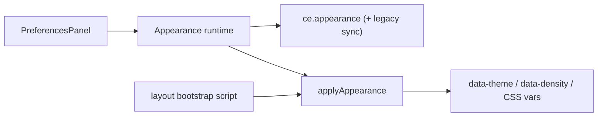

# Central theme preferences - Plan

## Goal Capsule

- **Objective:** Give every signed-in user a Local Studio–parity Settings → General appearance surface (Mode, Theme catalog, token editor, typography, Density, scale/radius/font-size) backed by one central theme runtime that owns persist + pre-paint apply for the whole app.
- **Product authority:** F-009 owns personal browser-local preferences and the Settings General section; DESIGN.md owns visual tokens and dark-first parity, with explicit Product Contract exceptions noted below; LS `user-preferences` demo is the interaction reference.
- **Open blockers:** None.
- **Execution:** `code`

---

## Product Contract

### Summary

Replace today’s thin Dark/Light + Density PreferencesPanel with a full appearance experience and a single theme runtime. The runtime is the only place that applies theme/mode/typography/density/scale to the document. Settings → General is a consumer UI: Mode (Light/Dark/System), Theme catalog (Workbench Dark/Light + Sky/Violet/Emerald/Rose), token editor, font family (Geist/Inter/System), font size / UI scale / radius sliders, and Compact/Comfortable Density. Preferences stay browser-local (no account API).

### Problem Frame

CE already applies `ce.theme` / `ce.density` at bootstrap, but General only offers a binary Dark/Light toggle. The LS reference shows Mode + a swatch Theme catalog + editor/typography controls, and apply is scattered if features set `data-theme` themselves. Users need one catalog and one apply path so appearance choices actually control the app without flash or drift.

### Key Decisions

- **One slice:** central theme runtime and full Settings General appearance surface ship together.
- **Approach A (catalog + CSS-variable runtime):** `data-theme` remains binary workbench dark/light; accent themes apply as catalog token / brand overrides (LS demo model), not separate full CSS theme packages per accent ID.
- **Runtime owns apply:** Settings UI only calls the runtime. No feature may set `data-theme` or appearance CSS variables directly.
- **Pre-paint bootstrap:** persisted preferences apply before first paint to avoid wrong-theme flash on reload.
- **Mode:** Light / Dark / System with LS demo parity — System is shown and persisted; live apply follows the reference demo’s themeId-driven behavior (not full OS `prefers-color-scheme` listening in this slice).
- **Theme catalog labels:** Workbench Dark, Workbench Light, Sky, Violet, Emerald, Rose (accents keep Accents tags). Internal IDs may stay LS-compatible (`zai-dark`, `zai-light`, `zai-sky`, …).
- **Token editor + Reset:** compact overrides on top of the selected theme; selecting a new theme clears overrides (LS behavior).
- **Typography:** font family Geist / Inter / System — intentional DESIGN exception to include Inter for literal appearance-control parity; default remains Geist. Also UI font size, UI scale, and radius sliders.
- **Density:** Compact / Comfortable remains and coexists with LS scale/radius/font-size sliders.
- **Browser-local only:** no account or server preference API.
- **Migration:** existing `ce.theme` = `zai-dark` / `zai-light` maps to Workbench Dark / Workbench Light without losing the user’s choice.

### Actors

- **Any signed-in user** — changes personal appearance on Settings → General; prefs apply only in this browser.
- **Theme runtime** — sole owner of read/persist/apply for appearance preferences.
- **Feature surfaces** — consume applied tokens only; do not write theme state.

### Key Flows

- F1. Change Mode
  - **Trigger:** User selects Light, Dark, or System on Settings → General.
  - **Steps:** UI calls runtime → Mode (and themeId coupling per LS demo rules) persists → document updates live.
  - **Outcome:** Mode choice is visible immediately and survives reload via pre-paint bootstrap.

- F2. Select a Theme row
  - **Trigger:** User clicks a Theme catalog row (Workbench Dark/Light or an Accents theme).
  - **Steps:** Runtime sets themeId, updates Mode coupling per LS rules, clears token overrides, applies catalog tokens live, shows active on the row.
  - **Outcome:** Whole app reflects the selected palette; accents are catalog-driven overrides on the dark workbench base.

- F3. Edit tokens / typography / density / scale
  - **Trigger:** User edits a token, font, slider, or Density.
  - **Steps:** Runtime patches prefs, persists, applies CSS variables / density attributes live.
  - **Outcome:** Fine-grained appearance changes without leaving Settings; Reset restores theme defaults for token overrides.

- F4. Reload / cold start
  - **Trigger:** User reloads or opens the app.
  - **Steps:** Pre-paint bootstrap reads persisted prefs and applies before first paint.
  - **Outcome:** No flash of the wrong theme or scale.

### Requirements

**Central control**

- R1. A single theme runtime owns persist and apply for Mode, themeId, token overrides, typography, Density, UI scale, radius, and font size.
- R2. Settings → General is the only product UI for these preferences and only goes through that runtime.
- R3. No other feature may write `data-theme` or appearance CSS variables directly.
- R4. Bootstrap applies persisted preferences before first paint.

**Settings General surface**

- R5. Mode group: Light / Dark / System segmented control (icons + labels as in LS).
- R6. Theme group: catalog rows with swatches, name, category tag (e.g. Accents), description, and active indicator.
- R7. Catalog entries: Workbench Dark, Workbench Light, Sky, Violet, Emerald, Rose.
- R8. Theme editor group: editable token colors with Reset.
- R9. Typography: font family select (Geist, Inter, System), UI font size, UI scale, and radius controls.
- R10. Density: Compact / Comfortable remains and coexists with the scale/radius/font-size controls.
- R11. Copy may note preferences are local (no account API), matching LS intent.

**Behavior and safety**

- R12. Preferences remain browser-local on an expanded CE storage allowlist; no secrets or server sync.
- R13. Selecting a new Theme clears token overrides.
- R14. Existing `zai-dark` / `zai-light` preferences migrate to Workbench Dark / Workbench Light equivalents.
- R15. System Mode is offered and persisted with LS demo parity (themeId-driven apply); full OS following is out of scope for this slice.

### Scope Boundaries

**In scope**

- Central theme runtime + pre-paint bootstrap.
- Full Settings → General appearance parity with the LS user-preferences Mode / Theme / editor / typography / density+scale surface (CE naming for base themes as above).
- Storage allowlist updates needed for the new preference fields.
- Migration of today’s binary `ce.theme` values.

**Deferred**

- True OS `prefers-color-scheme` listening when Mode is System.
- Account- or server-synced preferences.
- First-class per-accent CSS theme packages (full token sheets per `zai-sky`, etc.) instead of catalog overrides.
- Domains / Controllers mockup work and “LightRAG Containers” renaming.

**Outside identity**

- Inventing a new visual language beyond LS tokens + catalog accents.
- Letting individual features own theme application.

### Acceptance Examples

- AE1. Select Sky → app brand/accent updates live; Theme row shows active; reload keeps Sky without flash.
- AE2. Mode Light → Workbench Light applies; switching to an Accents theme returns to dark Mode coupling per LS rules.
- AE3. Token override then Reset → tokens return to the active theme defaults.
- AE4. Font family Inter is selectable and applies; default remains Geist for new browsers.
- AE5. Density Compact/Comfortable still works alongside UI scale / radius / font-size controls.
- AE6. Existing user with `ce.theme=zai-light` lands on Workbench Light after upgrade.

### Assumptions

- F-009 remains the feature home for personal appearance preferences.
- Density and UI scale both remain user-visible; composition is defined in Planning Contract KTD-3 (`--ui-scale = densityFactor × uiScale`).
- Visual regression continues to cover at least Workbench Dark and Workbench Light; accent themes get spot checks.

### Outstanding Questions

- None blocking. Storage layout and Density×scale composition are resolved in Planning Contract KTD-1 and KTD-3.

### Risks & Dependencies

- Expanding the browser storage allowlist must stay aligned with F-009 foundation tests.
- Inter as a selectable font is an explicit DESIGN exception — document it so agents do not “fix” it away.
- Literal System Mode may confuse users who expect OS following; deferred follow-up should be easy to add later without redesigning the Mode control.

---

## Planning Contract

### Key Technical Decisions

- **KTD-1. Single `ce.appearance` JSON blob + legacy migration.** Expand the F-009 allowlist with `ce.appearance`. Persist the full preference object there (themeMode, themeId, density, fontFamilyId, fontSize, uiScale, radiusBase, tokenOverrides). On read: if `ce.appearance` exists, use it; else migrate from legacy `ce.theme` / `ce.density` into defaults and write forward. Keep `ce.theme` and `ce.density` on the allowlist for one migration window and write-through sync (themeId → binary `zai-dark`/`zai-light` on `ce.theme`; density string on `ce.density`) so existing e2e/visual-matrix that sets `ce.theme` still works until updated.
- **KTD-2. Catalog + CSS-variable apply (Approach A).** Theme catalog mirrors LS fixtures (`zai-dark`/`zai-light` bases + accent variants via `withAccent`). `document.documentElement.dataset.theme` is only `zai-dark` or `zai-light`. Accent themes set inline CSS vars for brand/accent tokens from catalog + overrides (same shape as LS `use-user-preferences` apply effect). Do not add `.theme-zai-sky` CSS packages in this slice.
- **KTD-3. Density × UI scale composition.** Effective `--ui-scale = densityFactor * uiScale`, where `densityFactor` is `1` for compact and `1.05` for comfortable (matches today’s `globals.css` comfortable bump). Density still sets `data-density` for any density-specific rules (row heights already tied to comfortable). UI scale slider remains independent (default `1`, range ~0.85–1.25). Radius → `--radius-base`; font size → `--app-font-size` (or equivalent already used by tokens); font family → `--font-geist-sans` stack override when non-default.
- **KTD-4. Pre-paint bootstrap via inline script in root layout.** Before React hydrates, a tiny blocking script in `frontend/src/app/layout.tsx` reads `ce.appearance` (or legacy keys), runs the same pure `applyAppearance(document.documentElement, prefs)` helper used by the runtime, then React Providers stop writing theme/density themselves. Prevents FOUC (R4).
- **KTD-5. One module owns apply + Mode/Theme coupling.** Extract pure helpers (catalog, migrate, Mode↔themeId rules matching LS demo, `applyAppearance`) under `frontend/src/features/user-preferences/`. A small hook or context (`useAppearance` / `AppearanceProvider`) is the only React writer. `PreferencesPanel` only calls that API. Source-scan foundation tests forbid `dataset.theme =` / appearance CSS var writes outside the runtime module (and the layout bootstrap script that imports/inlines the same apply path).
- **KTD-6. Mode coupling matches LS demo.** Light Mode → `themeId = zai-light`. Dark Mode → if current is `zai-light`, switch to `zai-dark`, else keep accent themeId. Selecting a Theme row sets themeMode to `light` iff `zai-light`, else `dark`, and clears tokenOverrides. System is stored; apply remains themeId-driven (R15).
- **KTD-7. Inter is an allowlisted DESIGN exception.** Document in feature implementation-log / acceptance that Inter is available in the font picker for LS parity; default remains Geist. Do not load Inter as the product default font.
- **KTD-8. Tests follow helper + foundation scan pattern.** No React Testing Library. Use node:test on pure helpers (migrate, Mode coupling, apply outcome, density×scale) plus update `foundation.test.mjs` allowlist/bootstrap assertions. Update visual-matrix to set preferences through the new storage shape (or write-through `ce.theme`) without inventing Playwright for the default gate.

### High-Level Technical Design

```text
layout.tsx (blocking script)
  └─ applyAppearance(html, readAppearance())   ← before paint

AppearanceProvider / useAppearance
  ├─ read/write ce.appearance (+ sync ce.theme / ce.density)
  ├─ setThemeMode / setThemeId / patch / resetTokens
  └─ applyAppearance on every change

PreferencesPanel (Settings → General)
  ├─ Mode (SegmentedControl Light/Dark/System)
  ├─ Theme catalog rows (swatches + active pill)
  ├─ Theme editor + Reset
  ├─ Typography (font select + font size)
  └─ Density (Compact/Comfortable) + UI scale + radius

Token model (LS-shaped)
  catalog[themeId].tokens + tokenOverrides → CSS vars
  themeId === zai-light ? data-theme=zai-light : data-theme=zai-dark
```



### Assumptions

- LS demo fixtures under `.reference-ls-frontend/templates/nextjs-feature-demos/features/user-preferences/` remain the grammar and token-shape reference; CE renames display labels only (Workbench Dark/Light).
- Existing `--ui-*` / `zai-dark` / `zai-light` CSS in `local-studio-tokens.css` stays the base; accents are runtime overlays, not new theme classes.
- Comfortable density’s current row-height CSS in `globals.css` can remain; effective scale multiplies on top via `--ui-scale`.
- Signed-in vs anonymous: General preferences remain available wherever Settings General is shown today (personal section, not admin-gated).

### Open Questions

- None blocking.

### Risks & Dependencies

- **Foundation test drift:** `foundation.test.mjs` currently asserts Providers write `ce.theme`/`ce.density` directly — must update in the same change as the runtime.
- **Visual-matrix e2e** sets `localStorage.ce.theme` and `dataset.theme` — keep write-through sync or update the helper in the same slice.
- **FOUC if bootstrap script omitted** — U2 must land before claiming R4/AE1 reload.
- **Inter font loading:** if Inter is not already loaded, selecting it may fall back until web font is added; plan allows system fallback stack; optional follow-up to add Inter font files if missing.
- Depends on F-009 Settings shell + storage allowlist discipline; no backend contract changes.

### Alternative Approaches Considered

- **First-class CSS per accent ID** — clearer CSS ownership; rejected (Product Contract Approach A / LS demo model).
- **UI-only without central runtime** — faster panel; rejected (R1–R4).
- **True OS System Mode now** — better UX; deferred by Product Contract.
- **Drop Density for LS sliders only** — simpler; rejected (R10 both coexist).
- **Many allowlisted string keys instead of JSON blob** — flatter; rejected for coupling and partial-write risk; one blob + legacy sync preferred.

### Deferred to Implementation

- Exact CSS variable names for each ThemeTokens key (map LS `accent`/`hl1`/… onto CE `--ui-*` / brand tokens with smallest workable set that makes Sky/Violet/Emerald/Rose visibly different).
- Whether Inter needs an explicit `@font-face` / next/font registration in this slice or stack-only fallback is enough for AE4.

---

## Implementation Units

### U1. Catalog, storage migration, and pure apply helpers

- **Goal:** Define theme catalog (Workbench labels), preference types, read/migrate/write for `ce.appearance`, Mode↔themeId rules, density×scale math, and pure `applyAppearance` with no React.
- **Requirements:** R1, R7, R12, R13, R14, R15; AE2, AE6
- **Dependencies:** None
- **Files:**
  - Create: `frontend/src/features/user-preferences/themeCatalog.ts`
  - Create: `frontend/src/features/user-preferences/appearanceTypes.ts`
  - Create: `frontend/src/features/user-preferences/appearanceRuntime.ts` (read/migrate/write + applyAppearance + Mode helpers)
  - Modify: `frontend/src/lib/storage.ts` (allowlist `ce.appearance`)
- **Approach:** Port LS fixture token shapes and Mode coupling; rename display names to Workbench Dark/Light; Accents group unchanged. Migration: legacy `ce.theme`/`ce.density` → appearance object on first read. Write-through sync legacy keys for compatibility.
- **Execution note:** Proof-first on helpers — failing tests for migrate + Mode coupling + density×scale before wiring React.
- **Patterns to follow:** `.reference-ls-frontend/templates/nextjs-feature-demos/features/user-preferences/fixtures/index.ts`; `hooks/use-user-preferences.ts` Mode rules; `frontend/src/lib/storage.ts` allowlist.
- **Test scenarios:**
  - Happy: defaults → `zai-dark` / compact / geist.
  - Migrate: `ce.theme=zai-light` only → themeId `zai-light`, themeMode `light`.
  - Mode Light forces `zai-light`; Mode Dark from light → `zai-dark`; Mode Dark with sky keeps `zai-sky`.
  - setThemeId clears tokenOverrides; light theme sets themeMode light.
  - `--ui-scale` effective = densityFactor × uiScale (compact×1.1 = 1.1; comfortable×1.1 = 1.155).
  - applyAppearance sets `data-theme` binary only (`zai-dark`|`zai-light`).
- **Verification:** Helper module tests green; allowlist includes `ce.appearance`.

### U2. Pre-paint bootstrap and Appearance runtime provider

- **Goal:** Runtime is the only live writer; layout bootstrap applies prefs before paint; Providers no longer set theme/density ad hoc.
- **Requirements:** R1–R4; F4; AE1 reload
- **Dependencies:** U1
- **Files:**
  - Create: `frontend/src/features/user-preferences/AppearanceProvider.tsx` (or hook + thin provider)
  - Modify: `frontend/src/app/layout.tsx` (blocking bootstrap script / call into apply)
  - Modify: `frontend/src/app/providers.tsx` (remove direct dataset writes; mount AppearanceProvider if needed)
  - Modify: `frontend/tests/foundation.test.mjs` (bootstrap assertions)
  - Modify: `frontend/tests/e2e/visual-matrix.spec.ts` as needed for storage shape / write-through
- **Approach:** Inline or externalized bootstrap that shares `applyAppearance` logic. Provider hydrates from storage and re-applies on change. Source-scan: no `dataset.theme` assignments outside runtime + layout bootstrap.
- **Execution note:** Characterization — capture current foundation bootstrap test expectations, then update them to the new ownership model in the same unit.
- **Patterns to follow:** Current `providers.tsx` bootstrap intent; LS apply effect; F-009 storage isolation tests.
- **Test scenarios:**
  - Foundation: bootstrap path invokes appearance apply (not raw `readUiPreference("ce.theme")` in Providers).
  - Source scan: offenders for direct `dataset.theme` / `dataset.density` writes outside allowlisted files = empty.
  - Allowlist still blocks random localStorage keys.
- **Verification:** `npm.cmd run test` foundation suite green; cold reload smoke (manual) shows no theme flash for Workbench Light.

### U3. Settings General appearance UI

- **Goal:** PreferencesPanel matches LS Mode / Theme / editor / typography / Density+scale surface and only talks to the appearance runtime.
- **Requirements:** R2, R5–R11, R13; F1–F3; AE1–AE5
- **Dependencies:** U2
- **Files:**
  - Modify: `frontend/src/features/user-preferences/PreferencesPanel.tsx`
  - Optionally create small presentational helpers in the same feature folder (ThemeRow, SliderRow) if needed for clarity
- **Approach:** Mirror LS `user-preferences-demo.tsx` groups and ThemeRow swatch grammar with CE labels. Use shared `SegmentedControl`, `SettingsGroup`, `SettingsRow`, `SettingsButton`, `StatusPill`, `Select`. Wire Mode, Theme, editor Reset, font select, sliders, Density segmented control. No direct DOM/storage writes.
- **Patterns to follow:** `.reference-ls-frontend/.../user-preferences/components/user-preferences-demo.tsx`; DESIGN Settings density; existing PreferencesPanel placement in Settings General.
- **Test scenarios:**
  - Source/UI scan: PreferencesPanel imports runtime setters; does not call `writeUiPreference` for theme/density directly.
  - Manual smoke AE1–AE5 on Settings → General.
- **Verification:** Typecheck clean; visual smoke vs LS demo structure (Mode then Theme then editor then typography/density).

### U4. Helper tests and F-009 evidence

- **Goal:** Automate U1 logic + foundation gates; record Inter DESIGN exception and AC evidence.
- **Requirements:** R12–R14; AE1–AE6 (logic + allowlist)
- **Dependencies:** U1–U3
- **Files:**
  - Create: `frontend/tests/appearance-runtime.test.mjs`
  - Modify: `frontend/tests/foundation.test.mjs`
  - Modify: `specs/04-features/F-009-frontend-delivery/acceptance.md`
  - Modify: `specs/04-features/F-009-frontend-delivery/implementation-log.md`
  - Modify: `specs/04-features/F-009-frontend-delivery/spec.md` (storage allowlist) if required for contract alignment
- **Approach:** node:test importing appearanceRuntime helpers (same strip-types pattern as domains-settings). Update AC-013 / personal prefs notes for Mode+catalog+runtime. Log Inter as intentional DESIGN exception.
- **Execution note:** Keep Playwright optional; default gate is helper + foundation tests.
- **Test scenarios:**
  - All U1 scenarios in `appearance-runtime.test.mjs`.
  - Foundation allowlist includes `ce.appearance`; localStorage offenders still empty.
  - Bootstrap ownership assertions match U2.
- **Verification:** `npm.cmd run test` and `npm.cmd run typecheck` from `frontend/` pass; evidence docs updated.

---

## Verification Contract

| Gate | Command / check | Applies to |
|---|---|---|
| Helper + foundation tests | `npm.cmd run test` from `frontend/` | U1, U2, U4 |
| Typecheck | `npm.cmd run typecheck` from `frontend/` | U2–U3 |
| Manual smoke | Settings → General: Mode, Theme (incl. Sky), editor Reset, Inter font, Density + scale; reload Workbench Light without flash | AE1–AE5, F4 |
| Leakage / ownership scan | No feature outside appearance runtime writes `data-theme` / appearance CSS vars | R3 |
| Visual spot | Workbench Dark/Light + one accent at 1440×900 dark (optional light) | DESIGN checklist |

---

## Definition of Done

- [ ] R1–R15 satisfied for Settings General + central runtime
- [ ] U1–U4 complete with listed scenarios green
- [ ] Pre-paint bootstrap prevents wrong-theme flash on reload
- [ ] Theme catalog shows Workbench Dark/Light + Sky/Violet/Emerald/Rose with Accents tags
- [ ] Density and UI scale/radius/font-size coexist with documented composition
- [ ] Storage allowlist + foundation tests updated; legacy `ce.theme` migrates
- [ ] Inter picker exception recorded in F-009 evidence
- [ ] No account preference API; System Mode remains demo-parity (no OS listener)

---

## Appendix

### Sources & Research

- Origin Product Contract: this file (ce-brainstorm 2026-07-11)
- LS reference: `.reference-ls-frontend/templates/nextjs-feature-demos/features/user-preferences/`
- CE today: `frontend/src/features/user-preferences/PreferencesPanel.tsx`, `frontend/src/app/providers.tsx`, `frontend/src/lib/storage.ts`, `frontend/src/_shared/styles/local-studio-tokens.css`
- Contracts: F-009 browser storage allowlist; DESIGN.md theme + Settings grammar
- External research: skipped — strong local LS demo + CE foundation patterns
