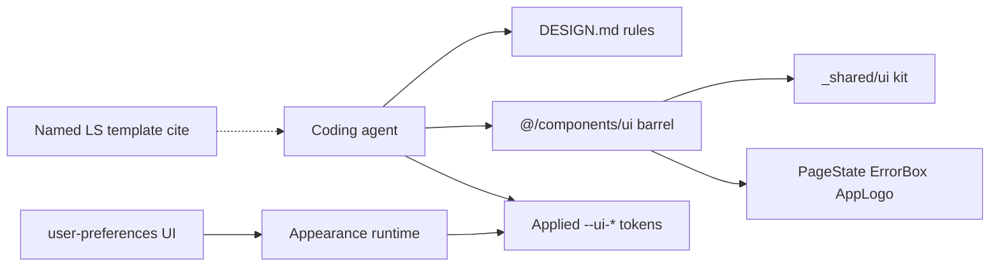

# Design kit contract inventory - Plan

## Goal Capsule

- **Objective:** Give coding agents one authoritative design contract: DESIGN.md owns visual/parity/coloring/gap rules; the app UI barrel owns the live primitive inventory; new UI work imports only from that barrel and colors only via the theme runtime / user-preferences token system.
- **Product authority:** F-009 owns frontend delivery; DESIGN.md owns Local Studio visual parity; `.reference-LS-frontend/templates/nextjs-feature-demos` (especially `user-preferences` and `_shared` kit evidence) is the grammar reference; central theme preferences plan owns the runtime apply path this contract consumes.
- **Open blockers:** None.
- **Execution:** `code`

---

## Product Contract

### Summary

Reconcile DESIGN.md with Local Studio themes, styles, and the shared kit so agents stop inventing one-off UI. Make the app-facing UI barrel the only allowed import path going forward. Keep inventory truthful to what that barrel exports, including explicit “not in kit yet” gaps. Document coloring rules so components consume applied theme tokens (user-preferences / central theme runtime) and never invent a palette. Defer scaffold/codegen and new Controllers primitives.

### Problem Frame

Agents and feature code already mix shared primitives with bespoke markup. Knowledge Graphs Settings is the concrete case: it uses some kit pieces but hand-rolls Controllers-style accordion/storage rows instead of a shared pattern. DESIGN.md, the live kit, and the dual UI surfaces can disagree, so agents cannot tell what is canonical. Without a single import path and coloring authority, new work drifts even when tokens are “mostly” respected.

### Key Decisions

- **Primary actor is coding agents.** Success is agent-enforced reuse, not human convenience alone.
- **Kit-first, inventory-only this ship.** Align DESIGN + kit contract now; scaffold/factory later only if agents still drift.
- **Approach B — split authority.** DESIGN owns rules (parity, coloring, import path, gap policy). The app UI barrel owns the live primitive inventory. DESIGN does not maintain a duplicate export list that can go stale.
- **App-facing barrel is the only allowed import path** for new agent/feature UI work. Shared kit internals stay an implementation detail behind that barrel.
- **Going-forward only.** Existing call sites that import the internal shared kit are not migrated in this slice; the contract forbids new ones.
- **Coloring authority is the theme runtime / user-preferences model.** Components paint with applied CSS variables and tones from the kit; no hardcoded palette; features do not set theme/document appearance themselves.
- **Gap policy: named template cite.** When inventory marks a pattern missing, agents may only hand-compose by adapting a cited `.reference-ls-frontend` feature template, still under token/coloring rules — not invent a parallel component API.
- **Knowledge Graphs is evidence, not remediation.** Controllers density polish and new list/accordion primitives stay outside this contract slice.

### Actors

- **Coding agent** — reads DESIGN rules + barrel inventory; builds new UI only through the allowed import path and coloring rules.
- **Human reviewer** — checks imports, inventory truthfulness, and gap citations against the contract.
- **Theme runtime / user-preferences surface** — sole owner of applying appearance tokens to the document; kit consumers read the result.

### Key Flows

- F1. Agent builds a new Settings or feature surface
  - **Trigger:** Agent needs UI for a CE feature.
  - **Steps:** Read DESIGN rules → check barrel inventory for a primitive → import from the app UI barrel only → style with applied `--ui-*` / kit tones → if gap, cite a named `.reference-ls-frontend` template and adapt under coloring rules.
  - **Outcome:** New UI reuses the kit or a documented template adaptation; no parallel palette or import path.

- F2. Inventory completeness check
  - **Trigger:** Contract update or PR that changes DESIGN / barrel exports.
  - **Steps:** Compare DESIGN’s gap/forbidden guidance to barrel exports → flag missing kit patterns as “not in kit yet” rather than claiming they exist → confirm agent checklist still names the single import path and coloring rules.
  - **Outcome:** Inventory cannot claim primitives the barrel does not export.

### Visualizations

```text
Authority split (this ship)

  DESIGN.md                    App UI barrel                 Theme runtime /
  (rules)                      (inventory SoT)               user-preferences
  ─────────                    ───────────────               ────────────────
  parity order                 exported primitives           Mode / Theme /
  coloring rules               "not in kit yet" gaps         token overrides
  import path rule             ──► agents import here only   ──► applied --ui-*
  gap → named template cite                                  on the document

  Agents/features ──consume──► barrel + tokens
  Agents/features ──do not──► set data-theme / invent palette / import internal kit
```

### Requirements

**Contract and authority**

- R1. DESIGN.md is updated so its themes, styles, and primitive guidance match Local Studio visual parity and the live kit’s actual capabilities, without claiming Controllers list/accordion/storage primitives that are not yet exported.
- R2. DESIGN.md states the authority split: rules live in DESIGN; live primitive inventory is whatever the app UI barrel exports.
- R3. Agent-facing UI guidance (including agent UI guidelines where they duplicate design rules) stays aligned with DESIGN on import path, coloring, and gap policy.

**Import path**

- R4. New agent/feature UI code may import shared primitives only from the app-facing UI barrel.
- R5. The internal shared kit remains an implementation detail behind that barrel; new direct imports of the internal kit are out of contract.
- R6. This slice does not require migrating existing internal-kit import call sites.

**Coloring**

- R7. Canonical components and feature UI consume applied theme tokens (CSS variables / kit tone APIs) owned by the theme runtime and the user-preferences appearance model.
- R8. Features must not hardcode colors, radii, or a parallel theme system, and must not set document appearance (`data-theme` or appearance CSS variables) outside the theme runtime.
- R9. Expert UIUX bar for coloring: dense workstation grammar; quiet accents from the theme catalog; tiny bordered swatches only on the appearance surface; no second design language in feature chrome.

**Inventory and gaps**

- R10. Success requires both: (a) agent checklist compliance for new UI (single import path + token coloring), and (b) inventory completeness — DESIGN’s gap/forbidden notes match barrel reality.
- R11. Patterns that exist in Local Studio / `.reference-ls-frontend` but are not exported (e.g. Controllers-style accordion/storage rows as used by Knowledge Graphs) are listed as “not in kit yet,” not as available primitives.
- R12. When a required pattern is marked missing, agents may adapt only a cited named template under `.reference-ls-frontend/templates/nextjs-feature-demos/`, still obeying R7–R9.

### Scope Boundaries

**In scope**

- DESIGN.md reconciliation for themes, styles, kit rules, coloring, import path, and gap policy.
- Making the app UI barrel the documented single import path (re-export/wrap as needed so the barrel is complete relative to the shared kit it fronts).
- Aligning agent-facing design guidance with those rules.
- Explicit inventory/gap honesty for Controllers-style patterns without implementing them.
- Foundation-style automated checks for inventory honesty and going-forward import path.

**Deferred for later**

- Scaffold/codegen “component factory” that emits feature slices from templates.
- New Controllers list/accordion/storage primitives in the kit.
- Knowledge Graphs Settings remediation onto those primitives (tracked by the Controllers density polish plan).
- Bulk migration of existing `@/_shared/ui` (or equivalent internal) call sites.
- Deduplicating or deleting the thin parallel `components/ui/*.tsx` implementations that overlap the shared kit.
- Implementing the central theme preferences runtime/UI (separate plan); this contract only consumes its coloring model.

**Outside this product's identity**

- A third standalone “kit card” document that duplicates DESIGN and the barrel.
- Generic shadcn/white-dashboard redesign or a CE-only palette independent of Local Studio / user-preferences.
- Browser talking to LightRAG, Docker, or other backend-forbidden surfaces.

### Acceptance Examples

- AE1. Agent checklist pass
  - **Covers:** R3, R4, R7, R8, R10
  - **Given:** An agent implements a new Settings subsection.
  - **When:** Review checks imports and styling.
  - **Then:** Shared primitives come only from the app UI barrel; colors/radii come from applied tokens; no feature-local theme apply.

- AE2. Inventory matches barrel
  - **Covers:** R1, R2, R10, R11
  - **Given:** DESIGN and the barrel are updated under this contract.
  - **When:** A reviewer compares claimed primitives to exports.
  - **Then:** Every claimed available primitive is exported; Controllers-style gaps are marked “not in kit yet,” not listed as ready.

- AE3. Gap uses named template
  - **Covers:** R11, R12, R9
  - **Given:** Inventory marks Controllers accordion rows missing.
  - **When:** An agent still needs that pattern.
  - **Then:** The change cites a specific `.reference-ls-frontend` template path and keeps token-only coloring — no new palette or parallel button/row API.

- AE4. Knowledge Graphs remains evidence-only
  - **Covers:** Scope Boundaries
  - **Given:** This contract ships.
  - **When:** Knowledge Graphs Settings is inspected.
  - **Then:** No requirement in this contract forces its remediation; drift may remain until a later kit/primitives slice.

### Dependencies / Assumptions

- F-009 frontend delivery and DESIGN.md remain the CE visual authority.
- `.reference-LS-frontend/templates/nextjs-feature-demos/` (including `user-preferences` and `_shared`) remains the Local Studio grammar evidence package.
- Central theme preferences (plan `2026-07-11-001`) defines or will define the runtime apply path; this contract documents consumption rules even if that plan lands in parallel.
- Knowledge Graphs Controllers polish (plan `2026-07-11-002`) remains a separate visual/density pass, not this contract’s remediation vehicle.
- App-facing UI barrel means `frontend/src/components/ui` with a new barrel entry that re-exports the shared kit plus CE-only surfaces (resolved in Planning Contract).

### Outstanding Questions

None for product scope.

---

## Planning Contract

### Key Technical Decisions

- **KTD-1 — Barrel path is `@/components/ui`.** New work imports from that module path (barrel `index`), not from `@/_shared/ui` and not from deep `components/ui/Button` paths for shared kit names.
- **KTD-2 — Inventory SoT is shared kit behind the barrel.** `frontend/src/components/ui/index.ts` re-exports `frontend/src/_shared/ui` (full primitive set) and also exports CE-only `PageState`, `ErrorBox`, and `AppLogo`. The thin parallel files under `components/ui/*.tsx` that duplicate shared names stay as legacy implementations for existing deep imports; they are not the inventory SoT.
- **KTD-3 — DESIGN does not duplicate the export list.** DESIGN states the import rule, coloring rules, gap policy, and a short “not in kit yet” / naming-alias table. Agents discover available primitives from the barrel exports (and a one-line pointer in DESIGN / agent guidelines), not from a second hand-maintained name dump that can go stale. Remove or correct false claims (`FormField`, `RightDetailPanel`, `Modal` vs `UiModal`).
- **KTD-4 — Going-forward import enforcement is automated.** Extend the `foundation.test.mjs` source-scan pattern: allowlist today’s `@/_shared/ui` call sites; fail if any *new* feature/app file imports `@/_shared/ui`. Existing allowlisted paths remain green without migration (R6).
- **KTD-5 — Gap cites stay template-path specific.** Document Controllers-style accordion/storage rows as not in kit; required cite is `.reference-LS-frontend/templates/nextjs-feature-demos/features/environment-controls/` (and settings-panel / user-preferences for shell/coloring). No new Controllers primitive in this slice.
- **KTD-6 — Coloring consumption only.** Docs and checklist point at appearance runtime / user-preferences as the only writers of `data-theme` / appearance CSS vars (already enforced by `foundation.test.mjs`); feature chrome must use applied `--ui-*` / kit tones.

### High-Level Technical Design

```text
Before                                      After (this ship)
──────                                      ─────────────────
@/_shared/ui  ←── SettingsPanel, …          @/_shared/ui  (internal kit; allowlisted legacy)
components/ui/*.tsx  ←── login deep imports components/ui/index.ts  ──re-export──► _shared/ui
                         (no barrel)        + PageState / ErrorBox / AppLogo
DESIGN §11.2 name list                      DESIGN rules + "not in kit yet" + pointer to barrel
guidelines → @_shared/ui                    guidelines → @/components/ui
(no import scan)                            design-kit-contract.test.mjs
                                            + going-forward @_shared allowlist scan
```



### Assumptions

- Re-exporting the full shared kit through the barrel is acceptable even while duplicate thin `components/ui` files remain; name collisions for *barrel* consumers resolve to shared-kit implementations.
- Existing deep imports like `@/components/ui/Button` continue to resolve to the thin local file until a later cleanup; new agent guidance forbids preferring those for shared names when the barrel export exists.
- Inventory completeness checks parse barrel export names (and optionally a machine-readable gap list in DESIGN or a small fixtures list in the test) without requiring TypeScript program analysis beyond source text.

### Sequencing

1. U1 barrel (inventory exists)
2. U2 DESIGN + U3 agent guidelines (can land together after U1)
3. U4 contract tests (depends on U1–U3 text anchors)

---

## Implementation Units

### U1. App UI barrel re-export

- **Goal:** Create the single app-facing inventory module that re-exports the shared kit and CE-only surfaces.
- **Requirements:** R2, R4, R5
- **Dependencies:** None
- **Files:**
  - Create: `frontend/src/components/ui/index.ts`
  - Modify only if needed for export hygiene: `frontend/src/components/ui/PageState.tsx`, `ErrorBox.tsx`, `AppLogo.tsx`
  - Test: covered by U4
- **Approach:** Add a barrel that `export *` from `@/_shared/ui` (or equivalent path) and re-exports CE-only components. Do not delete or rewrite the thin parallel `Button.tsx` / `StatusPill.tsx` files in this unit. Document in a short file comment that the barrel is the agent import path and `_shared/ui` is internal.
- **Patterns to follow:** Existing `@/_shared/ui` monolith exports; CE-only components already under `components/ui/`.
- **Test expectation:** none — barrel existence and export presence are asserted in U4.
- **Verification:** Shared kit names and CE-only surfaces resolve through `@/components/ui`; U4 locks that in tests.

### U2. DESIGN.md authority split and honest inventory

- **Goal:** Make DESIGN the rules authority: import path, coloring, gaps, and remove false primitive claims.
- **Requirements:** R1, R2, R7, R8, R9, R10, R11, R12
- **Dependencies:** U1 (so DESIGN can point at a real barrel)
- **Files:**
  - Modify: `DESIGN.md` (especially §11.2 Primitive First, §11.3–11.4, §13 agent prompt, Related Documentation table as needed)
- **Approach:** State Approach B authority split. Replace the stale available-primitive dump with: (1) pointer that live inventory is `@/components/ui` exports, (2) corrected naming aliases (`UiModal` not `Modal`; drop or mark missing `FormField` / `RightDetailPanel`), (3) “not in kit yet” including Controllers-style accordion/storage rows with named template cites (`environment-controls`, plus `settings-panel` / `user-preferences` for shell/coloring), (4) coloring consumption rules aligned with appearance runtime / user-preferences. Keep visual parity non-negotiables; do not invent Controllers primitives.
- **Patterns to follow:** Existing DESIGN §1 governing rule; plan 001 coloring ownership language; plan 002 Controllers density as gap evidence only.
- **Test scenarios:** Covered by U4 inventory honesty assertions against DESIGN anchors.
- **Verification:** DESIGN no longer claims unavailable primitives as ready; gap cites are path-specific; import path is `@/components/ui`.

### U3. Agent UI guidelines alignment

- **Goal:** Align the agent checklist with DESIGN and the barrel so agents are not steered to `@/_shared/ui`.
- **Requirements:** R3, R4, R7, R8, R12
- **Dependencies:** U1, U2
- **Files:**
  - Modify: `docs/design/context_engine_agent_ui_guidelines.md`
  - Modify if AGENTS.md or F-009 docs point agents at `_shared/ui` as the only path: `AGENTS.md` and/or `specs/04-features/F-009-frontend-delivery/` only where they contradict (minimal touch)
- **Approach:** Change primitive-first import to `@/components/ui`. Sync primitive map with barrel reality and DESIGN gap table. Add gap→named-template rule and coloring consumption (never set `data-theme` outside appearance runtime). Keep read-order: DESIGN first, then this checklist.
- **Patterns to follow:** Current guidelines structure; foundation appearance allowlist already encodes coloring writers.
- **Test scenarios:** Covered by U4 string anchors on guidelines path + import rule.
- **Verification:** Guidelines do not instruct `@/_shared/ui` as the agent import path; checklist matches DESIGN on gaps/coloring.

### U4. Design-kit contract tests

- **Goal:** Automate inventory honesty and going-forward import enforcement.
- **Requirements:** R4, R5, R6, R10, R11
- **Dependencies:** U1, U2, U3
- **Files:**
  - Create: `frontend/tests/design-kit-contract.test.mjs`
  - Modify: `frontend/tests/foundation.test.mjs` only if the going-forward allowlist scan fits better there than in the new file (prefer new file to keep foundation focused)
- **Approach:** Mirror `foundation.test.mjs` `sourceFiles()` scanning. Assert barrel file exists and exports expected CE-only names plus representative shared names (`SettingsGroup`, `StatusPill`, `UiModal`, `cx`). Assert DESIGN and agent guidelines contain the `@/components/ui` import rule and do not claim `FormField` / `RightDetailPanel` as available (or require them in an explicit “not in kit” section). Assert Controllers gap cite mentions `environment-controls`. Allowlist current `@/_shared/ui` import files; fail when any non-allowlisted `src/**/*.{ts,tsx}` file imports `@/_shared/ui`. Do not fail existing allowlisted SettingsPanel/etc.
- **Execution note:** Characterization-first on allowlist — capture today’s `_shared` importers before asserting the going-forward rule.
- **Patterns to follow:** `frontend/tests/foundation.test.mjs` walk + allowlist; `frontend/tests/domains-settings.test.mjs` source string asserts.
- **Test scenarios:**
  - Happy path: barrel exists; exports include shared + CE-only representatives.
  - Happy path: DESIGN/guidelines assert barrel import path and Controllers gap cite.
  - Edge: allowlisted legacy `@/_shared/ui` importers still pass.
  - Error: a synthetic non-allowlisted path importing `@/_shared/ui` would fail (implement as allowlist completeness — any file outside allowlist with that import fails).
  - Covers AE2: claimed-available primitives in DESIGN are either exported by the barrel or explicitly marked not in kit.
- **Verification:** `npm test` in `frontend/` passes including the new file.

---

## Verification Contract

| Gate | Command / check | Applies to |
| --- | --- | --- |
| Frontend unit/contract tests | From `frontend/`: `npm test` | U1–U4 |
| Typecheck (if already used in PR habit) | From `frontend/`: `npm run typecheck` when present | U1 barrel |
| Manual doc skim | DESIGN §11–13 + agent guidelines: import path, gaps, coloring | U2, U3 |
| No KG remediation | Knowledge Graphs Settings still may hand-roll rows; out of scope | AE4 |

---

## Definition of Done

- [ ] `@/components/ui` barrel re-exports shared kit + CE-only surfaces
- [ ] DESIGN.md states authority split, honest gaps, coloring consumption, barrel import path
- [ ] Agent guidelines point at `@/components/ui` and match DESIGN on gaps/coloring
- [ ] `design-kit-contract.test.mjs` (and/or foundation extension) enforces inventory honesty + going-forward `_shared` allowlist
- [ ] No new Controllers primitives; no scaffold factory; no bulk `_shared` migration; no KG remediation required by this plan
- [ ] F-009 / DESIGN evidence updated if the repo’s usual “docs and code move together” rule applies to this contract slice
- [ ] Product Contract R1–R12 satisfied without silent scope expansion

---

## Risks & Dependencies

| Risk | Mitigation |
| --- | --- |
| Barrel `export *` + remaining thin `components/ui/Button.tsx` confuse deep vs barrel imports | Docs forbid deep shared-name imports for new work; later cleanup deferred |
| Allowlist churn as features migrate | Going-forward only; shrinking allowlist is a follow-up, not this ship |
| DESIGN still drifts if someone edits prose without tests | U4 anchors key phrases/paths; keep assertions few and stable |
| Parallel with theme-preferences / KG polish plans | This plan only documents consumption and gaps; no ownership fight over runtime or KG markup |

---

## Sources & Research

- Origin Product Contract: this file (ce-brainstorm)
- Live kit: `frontend/src/_shared/ui/index.tsx`
- Partial parallel UI: `frontend/src/components/ui/*.tsx` (no barrel today)
- Agent checklist: `docs/design/context_engine_agent_ui_guidelines.md`
- Theme apply: `frontend/src/features/user-preferences/appearanceRuntime.ts`, `appearanceBootstrap.ts`; `frontend/tests/foundation.test.mjs`
- LS evidence: `.reference-LS-frontend/templates/nextjs-feature-demos/_shared/ui/`, `features/user-preferences/`, `features/environment-controls/`, `features/settings-panel/`
- Related plans: `docs/plans/2026-07-11-001-feature-central-theme-preferences-plan.md`, `docs/plans/2026-07-11-002-feature-knowledge-graphs-settings-parity-polish-plan.md`, `docs/plans/2026-07-08-001-feature-governed-context-assembly-plan.md` (KD-7)
