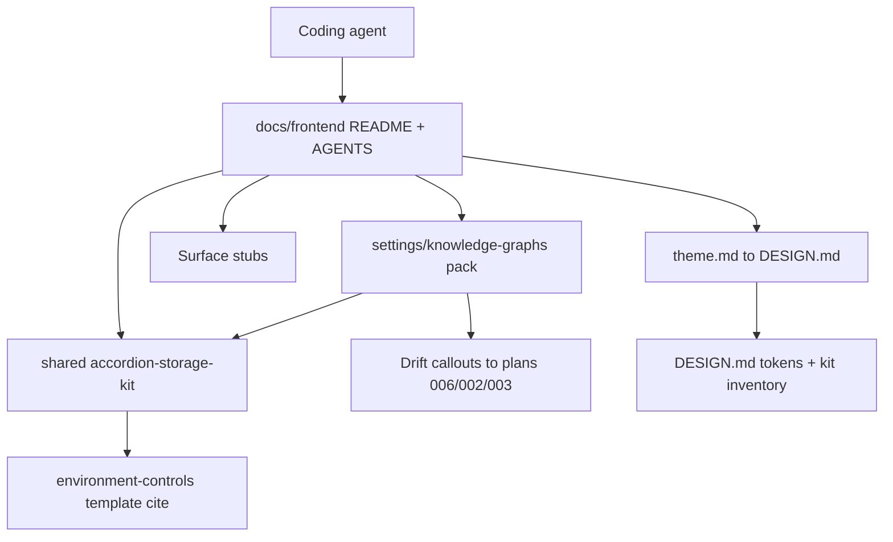

# Frontend UIUX Component Factory - Plan

## Goal Capsule

- **Objective:** Replace the foreign Analysis Dashboard `docs/frontend/` tree with a Context Engine UIUX factory so agents and juniors reuse Local Studio–aligned theme and composition instead of reinventing chrome — including a shared accordion/storage kit and a complete Settings → Knowledge Graphs pack as the first worked example for later routes.
- **Product authority:** `DESIGN.md` for tokens and kit inventory; this Product Contract for factory scope and pack completeness; Local Studio reference templates for Controllers-style accordion/storage grammar until kit export exists.
- **Open blockers:** None.
- **Execution:** code
- **Product Contract preservation:** unchanged

---

## Product Contract

### Summary

Wipe and rebuild `docs/frontend/` as the CE agent UIUX factory under Local Studio / `DESIGN.md` authority.
Ship short stubs for main workspaces, a shared accordion/storage kit marked **not exported yet**, and one complete Settings → Knowledge Graphs route pack that teaches the target grammar with live-code drift callouts.
No live UI remediation and no Controllers kit code export in this slice.

### Problem Frame

The app grew without a standardized UIUX component factory, so theme and style drift and chrome get reinvented per feature.
The current `docs/frontend/` tree was imported from another product (Analysis Dashboard, shadcn/zinc, anti–Local Studio rules, wrong code paths) and misleads agents.
Controllers-style accordion and storage bars used by Knowledge Graphs are still **not in kit yet** in `DESIGN.md`, so without a documented target grammar the next route will hand-roll again.

### Key Decisions

- **Docs factory only.** This slice rewrites `docs/frontend/`; it does not remediate live KG Settings UI or export Controllers primitives.
- **Replace wholesale.** Delete foreign packs and stubs; do not rewrite Analysis Dashboard content in place.
- **Deep where reuse matters.** Full docs for the shared accordion/storage kit and the Knowledge Graphs pack; other surfaces stay honest stubs.
- **Target grammar + drift callout.** The KG pack teaches the intended composition; it notes where live code still differs and points at existing polish plans rather than freezing hand-rolls as canonical.
- **Not exported yet stays honest.** Shared kit docs describe the reusable contract and require citing the named Local Studio / reference template until `@/components/ui` exports the primitives.
- **Later consumer unnamed.** The factory must make accordion/storage reusable for a future route; that route is not scoped here.

### Actors

- A1. Coding agent implementing or changing CE frontend UI
- A2. Junior developer learning the app’s UIUX language
- A3. Future agent/dev copying accordion/storage grammar onto another route

### Key Flows

- F1. Agent starts UI work
  - **Trigger:** Agent is asked to build or change a CE frontend surface.
  - **Actors:** A1, A2
  - **Steps:** Read `docs/frontend/` agent rules and theme pointer; open the matching surface folder; reuse `shared/` kits when applicable; follow `DESIGN.md` tokens and live `@/components/ui` inventory.
  - **Outcome:** Changes stay on CE theme and composition without inventing a parallel system.

- F2. Agent implements or extends Controllers-style accordion/storage
  - **Trigger:** Work needs expandable list rows and/or storage bars (Settings → Knowledge Graphs or a later route).
  - **Actors:** A1, A3
  - **Steps:** Read the shared accordion/storage kit; read the complete KG pack as the worked example; cite the named LS/reference template while status is **not exported yet**; do not invent a second visual system.
  - **Outcome:** New UI follows the factory grammar instead of one-off rows.

- F3. Agent encounters live KG drift
  - **Trigger:** Live Settings → Knowledge Graphs markup differs from the documented target grammar.
  - **Actors:** A1
  - **Steps:** Prefer the factory target grammar for new work; treat drift callouts as warnings not as the pattern to copy; leave visual remediation to the dedicated polish plan unless this slice’s scope changes.
  - **Outcome:** Hand-rolled live code does not become the documented standard.

### Requirements

**Factory foundation**

- R1. `docs/frontend/` is CE-owned: index, agent instructions, and a short theme primer that points to `DESIGN.md` as canonical tokens (Local Studio / `--ui-*` authority — not Analysis Dashboard / anti-LS rules).
- R2. Foreign Analysis Dashboard content is removed (Appearance plot-typography pack, wrong surface stubs, `client/src` pointers, and related foreign plans links that do not exist here).
- R3. Agent rules require: import shared UI from live `@/components/ui`; follow `DESIGN.md`; do not invent parallel tokens or primitives; prefer documented shared kits over one-off chrome.
- R4. `_templates/` provides a copy-paste README skeleton for future feature packs.
- R5. Kit status is documented: what is exported from `@/components/ui` vs patterns marked **not in kit yet** (at least Controllers-style accordion / expandable list rows + storage bars), aligned with `DESIGN.md`.

**Surface catalog**

- R6. Stub folders exist for main workspaces: app shell / navigation, chat, documents, graph, settings shell, and user-preferences (theme/appearance), each with purpose, status Stub, primary CE code pointers, and links to theme / shared kits.
- R7. Stubs stay short; they do not invent layout beyond `DESIGN.md` and existing code.
- R8. Logs and other secondary `features/*` surfaces are omitted from the v1 catalog unless planning adds them later.

**Shared accordion / storage kit**

- R9. `docs/frontend/shared/` documents a reusable Controllers-style accordion / expandable-list + storage-bar grammar for cross-route reuse.
- R10. The kit is marked **not exported yet** and requires citing the named Local Studio / reference template (environment-controls Controllers pattern per `DESIGN.md`) until primitives ship in the kit.
- R11. The kit is composition-oriented (anatomy, do/don’t, how it relates to SettingsLayout / SettingsGroup / SettingsRow where relevant) and does not pretend the primitives are already barrel exports.

**Settings → Knowledge Graphs complete pack**

- R12. A complete v1 pack documents Settings → Knowledge Graphs as the worked example that composes the shared accordion/storage kit.
- R13. The pack covers overview, anatomy, components/composition, behavior (including expand-only storage summary rules already owned by product plans), and do/don’t guardrails at a depth comparable to a “Complete (v1)” factory pack.
- R14. The pack teaches **target** grammar as canonical and includes explicit live-code drift callouts so agents do not copy known-wrong bits.
- R15. Safe-field / admin storage rules from existing product authority remain in force: storage bars use backend-owned admin `storageSummary` only; no paths, ports, runtime URLs, or forbidden internals in UI copy.

**Success signals**

- R16. A later accordion/storage route can be implemented from the shared kit + KG pack + `DESIGN.md` without inventing a parallel layout/theme.
- R17. Catalog honesty holds: every stub points at real CE paths; Controllers accordion/storage status is clearly **not exported yet**.

### Acceptance Examples

- AE1. Factory orientation
  - **Covers:** R1–R15, R17
  - **Given:** An agent starts Settings → Knowledge Graphs or shell UI work.
  - **When:** They open `docs/frontend/`.
  - **Then:** They find CE agent rules, theme pointer to `DESIGN.md`, kit status honesty, shared accordion/storage kit, complete KG pack, and CE stubs — not Analysis Dashboard / plot-typography content.

- AE2. Kit reuse for a later route
  - **Covers:** R9–R11, R16
  - **Given:** A later route needs Controllers-style accordion + storage bars.
  - **When:** The agent follows the factory.
  - **Then:** They reuse the shared kit grammar, cite the named reference while **not exported yet**, and do not invent a new row/storage visual system.

- AE3. Drift does not become canon
  - **Covers:** R12–R14, F3
  - **Given:** Live KG Settings still hand-rolls rows relative to the target grammar.
  - **When:** The agent reads the complete KG pack.
  - **Then:** Target grammar is presented as canonical; drift is called out; hand-rolled live markup is not instructed as the pattern to copy.

- AE4. Stub honesty
  - **Covers:** R6–R8
  - **Given:** An agent opens a non-KG surface stub (e.g. chat or documents).
  - **When:** They read the stub README.
  - **Then:** They get purpose, CE code pointers, and theme/kit links only — no invented complete layout grammar.

### Scope Boundaries

**In scope**

- Rebuilding `docs/frontend/` as the CE UIUX factory (foundation, stubs, shared kit, KG complete pack, templates).

**Deferred for later**

- Live Knowledge Graphs Settings visual remediation / Controllers density polish (existing plan `docs/plans/2026-07-11-002-feature-knowledge-graphs-settings-parity-polish-plan.md`).
- Exporting Controllers accordion/storage primitives into `@/components/ui` (tracked via design-kit inventory / follow-on work).
- Completing packs for chat, documents, graph, user-preferences, etc.
- Naming and implementing the unnamed later route that will reuse accordion/storage.
- Stubbing secondary surfaces such as logs.

**Outside this product's identity**

- Porting Analysis Dashboard Appearance plot-typography preferences or shadcn/zinc anti–Local Studio factory rules.
- Broad shadcn redesign or white-canvas dashboard styling.
- Changing API/SSE contracts or `storageSummary` product rules beyond documenting them for UI agents.

### Dependencies / Assumptions

- `DESIGN.md` remains token and kit-inventory authority; the factory does not fork a second visual system.
- Settings → Knowledge Graphs product structure and safe-field rules remain owned by existing feature plans (notably domain deploy settings UI and KG parity polish).
- Live code under `frontend/src/features/` is the correct pointer target for stubs (not `client/src`).

### Outstanding Questions

None for product scope. Planning resolutions are recorded under Planning Contract.

### Sources / Research

- Imported factory shape (evidence only): prior Analysis Dashboard factory tree under `docs/frontend/`.
- `DESIGN.md` — Local Studio parity; Settings panel; Controllers accordion/storage **not in kit yet**.
- `docs/plans/2026-07-11-002-feature-knowledge-graphs-settings-parity-polish-plan.md` — KG Controllers density / storage bars remediation (out of scope here).
- `docs/plans/2026-07-11-003-feature-design-kit-contract-inventory-plan.md` — kit inventory honesty; Controllers gap.
- `docs/plans/2026-07-10-006-feature-domain-deploy-settings-ui-plan.md` — Settings Knowledge Graphs structure / safe fields.
- Live CE surfaces: `frontend/src/features/settings-panel/`, `chat-shell/`, `documents/`, `graph/`, `navigation-sidebar/`, `user-preferences/`.
- Complete-pack shape to mirror (foreign evidence only): former `docs/frontend/user-preferences/` README + anatomy/components/behavior/do-dont layout.

---

## Planning Contract

### Key Technical Decisions

- **KTD-1 — Nested KG pack path.** Complete pack lives at `docs/frontend/settings/knowledge-graphs/` so the settings shell stub and the worked example stay adjacent; shared kit stays under `docs/frontend/shared/`.
- **KTD-2 — Shared kit filename.** Primary kit doc is `docs/frontend/shared/accordion-storage-kit.md`; `docs/frontend/shared/README.md` indexes kits and kit-status honesty.
- **KTD-3 — Required reference cites.** AGENTS + kit docs must cite `.reference-LS-frontend/templates/nextjs-feature-demos/features/environment-controls/` for Controllers accordion/storage; cite `settings-panel/` and `user-preferences/` templates only for shell/coloring context (aligned with `DESIGN.md` and plan 003).
- **KTD-4 — Drift callouts cross-link polish plans.** KG pack drift section links `docs/plans/2026-07-11-002-…`, `docs/plans/2026-07-11-003-…`, and `docs/plans/2026-07-10-006-…` as product/remediation authority — not as instructions to copy live hand-rolls.
- **KTD-5 — Anatomy uses ASCII wireframes.** KG pack `anatomy.md` includes short ASCII layout sketches (same depth as the foreign preference pack pattern); mermaid optional only if ASCII is insufficient.
- **KTD-6 — Docs integrity tests, not UI tests.** Verification is a small frontend node test (or equivalent) that asserts required factory files exist, forbids foreign markers (`client/src`, Analysis Dashboard, plot-typography preference kit), and checks CE path pointers / kit status anchors — matching the `foundation.test.mjs` / design-kit contract test style.
- **KTD-7 — Delete then rewrite.** Remove foreign folders/files in U1 before writing CE stubs so agents never see a mixed catalog mid-change.

### High-Level Technical Design

```text
docs/frontend/ (after)
├── README.md                 catalog + status legend
├── AGENTS.md                 CE / Local Studio rules
├── theme.md                  pointer → DESIGN.md
├── _templates/               feature README skeleton
├── shared/
│   ├── README.md             kit index + not-in-kit status
│   └── accordion-storage-kit.md
├── app-shell/ README.md      stub → navigation-sidebar
├── chat/ README.md           stub → chat-shell
├── documents/ README.md      stub → documents
├── graph/ README.md          stub → graph
├── settings/
│   ├── README.md             shell stub → settings-panel
│   └── knowledge-graphs/     Complete (v1) pack
│       ├── README.md
│       ├── anatomy.md
│       ├── components.md
│       ├── behavior.md
│       └── do-dont.md
└── user-preferences/ README.md  stub → theme/appearance feature
```



### Assumptions

- Existing foreign `docs/frontend/` content has no CE-specific value worth preserving beyond the stub/template *shape*.
- `frontend/src/features/settings-panel/SettingsPanel.tsx` and `domainSettingsHelpers.ts` remain accurate live anchors for drift notes during this docs-only slice.
- A node `--test` file under `frontend/tests/` is an acceptable verification home (same family as design-kit / foundation scans).

### Sequencing

1. U1 wipe foreign + foundation rewrite
2. U2 shared accordion/storage kit + kit status
3. U3 CE surface stubs (can parallel with U2 after U1)
4. U4 Settings → Knowledge Graphs complete pack (depends on U2)
5. U5 docs integrity test (depends on U1–U4)

### Deferred to Follow-Up Work

- Live KG Controllers density remediation (plan 002).
- Controllers primitive export into `@/components/ui` (plan 003 follow-on).
- Completing non-KG surface packs.

---

## Implementation Units

### U1. Wipe foreign factory and rewrite foundation

- **Goal:** Remove Analysis Dashboard factory content and establish CE-owned index, agent rules, theme pointer, and feature README template.
- **Requirements:** R1–R5, R17; AE1
- **Dependencies:** None
- **Files:**
  - Delete: `docs/frontend/dashboard/`, `charts/`, `inspect-damage/`, `database/`, `edit-metadata/`, `upload/`, `changelog/`, `shared/preference-kit.md`, and foreign `user-preferences/` pack files (`anatomy.md`, `components.md`, `behavior.md`, `do-dont.md`, and the Appearance/plot README if present)
  - Rewrite: `docs/frontend/README.md`, `docs/frontend/AGENTS.md`, `docs/frontend/theme.md`, `docs/frontend/_templates/feature-README.template.md`
  - Test: covered by U5
- **Approach:** Delete foreign surface folders and preference-kit/plot-typography pack first. Rewrite foundation docs for CE: Local Studio / `DESIGN.md` authority, `@/components/ui` import rule, catalog table listing planned CE stubs + shared kit + KG complete pack (stubs may be placeholders until U3). Remove broken links to missing `2026-07-13-001` sibling Appearance plans that only existed in the other app. Do not invent Controllers exports.
- **Patterns to follow:** Catalog + status legend shape from the current foreign README; agent hard-rules tone from current `AGENTS.md` but inverted to LS parity; `docs/design/context_engine_agent_ui_guidelines.md` conflict rule (`DESIGN.md` wins).
- **Execution note:** Prefer smoke/docs integrity verification over app unit coverage; U5 locks anchors.
- **Test scenarios:** Covered by U5 foreign-marker and foundation-file assertions.
- **Verification:** No Analysis Dashboard framing, `client/src` pointers, or plot-typography preference kit remain under `docs/frontend/`; foundation files describe CE + Local Studio.

### U2. Shared accordion / storage kit and kit status

- **Goal:** Document the reusable Controllers-style accordion + storage-bar grammar as **not exported yet**, with required reference cites.
- **Requirements:** R5, R9–R11, R16; AE2
- **Dependencies:** U1
- **Files:**
  - Create/rewrite: `docs/frontend/shared/README.md`, `docs/frontend/shared/accordion-storage-kit.md`
  - Test: covered by U5
- **Approach:** Mirror the former foreign kit doc shape (status, anatomy, composition, do/don’t, defer-until-needed) but for accordion/storage — without mentioning `preference-kit` in any output under `docs/frontend/`. Explicitly mark **not in kit yet**. Require cite to `environment-controls`. Relate composition to existing SettingsLayout / SettingsGroup / SettingsRow / ProgressBar / StatusPill without claiming new barrel exports. Index the kit from `shared/README.md` with a short kit-status table aligned to `DESIGN.md` §11.
- **Patterns to follow:** Former foreign shared-kit doc structure (historical path kept only in U1 delete instructions); `DESIGN.md` not-in-kit table; plan 003 KTD-5 gap cites.
- **Test scenarios:** Covered by U5 kit-status and cite-path assertions.
- **Verification:** Shared kit exists, says **not exported yet**, and names the required environment-controls cite.

### U3. CE surface stubs

- **Goal:** Add honest stub READMEs for main workspaces with real CE code pointers.
- **Requirements:** R6–R8; AE4
- **Dependencies:** U1
- **Files:**
  - Rewrite/create: `docs/frontend/app-shell/README.md`, `docs/frontend/chat/README.md`, `docs/frontend/documents/README.md`, `docs/frontend/graph/README.md`, `docs/frontend/settings/README.md`, `docs/frontend/user-preferences/README.md`
  - Update catalog rows in: `docs/frontend/README.md`
  - Test: covered by U5
- **Approach:** Each stub: Status Stub, Purpose (1 short paragraph), Code pointers under `frontend/src/features/…`, Theme links, optional “Related kits” link. Settings stub points forward to `settings/knowledge-graphs/` (pack lands in U4). User-preferences stub points at CE theme/appearance feature — not plot typography. Keep stubs short; no invented complete grammar.
- **Patterns to follow:** `_templates/feature-README.template.md` (after U1 rewrite); existing foreign stub brevity.
- **Test scenarios:** Covered by U5 stub-path pointer assertions.
- **Verification:** Catalog lists only CE surfaces; each stub points at an existing `frontend/src/features/` path.

### U4. Settings → Knowledge Graphs complete pack

- **Goal:** Ship the Complete (v1) worked example composing the shared accordion/storage kit, with target grammar and live drift callouts.
- **Requirements:** R12–R15, R16; AE2, AE3; F2, F3
- **Dependencies:** U2 (kit exists to compose); U3 settings stub recommended first
- **Files:**
  - Create: `docs/frontend/settings/knowledge-graphs/README.md`, `anatomy.md`, `components.md`, `behavior.md`, `do-dont.md`
  - Update: `docs/frontend/settings/README.md`, `docs/frontend/README.md` (status Complete for KG pack)
  - Reference only (no code edits): `frontend/src/features/settings-panel/SettingsPanel.tsx`, `frontend/src/features/settings-panel/domainSettingsHelpers.ts`
  - Test: covered by U5
- **Approach:** Mirror complete-pack depth from the foreign user-preferences pack. README: surface Settings → Knowledge Graphs, CE code pointers, shared-kit link, authority split (product plans vs DESIGN vs factory). Anatomy: ASCII for accordion list + expand-only storage bars + Deploy group. Components: composition map using kit grammar + existing Settings* / ProgressBar / StatusPill. Behavior: one-open expand, expand-only storageSummary, admin-safe fields, forbidden tokens. Do/don’t: no inventing Controllers exports; no copying hand-rolled drift; no paths/URLs/ports. Drift section: what live SettingsPanel still does differently + links to plans 006/002/003.
- **Patterns to follow:** Foreign complete-pack file set; plans 006/002 product rules; DESIGN Controllers gap language.
- **Execution note:** Document target grammar first; use live code only as drift evidence, not as the composition source of truth.
- **Test scenarios:** Covered by U5 complete-pack file set + drift-anchor assertions.
- **Verification:** Pack is Complete (v1); teaches target grammar; includes drift callouts; links shared kit and safe-field rules.

### U5. Factory docs integrity test

- **Goal:** Automate AE1–AE4 honesty checks so foreign content and missing packs fail CI/local verification.
- **Requirements:** R2, R5, R9–R14, R16, R17; AE1–AE4
- **Dependencies:** U1–U4
- **Files:**
  - Create: `frontend/tests/frontend-uiux-factory.test.mjs` (or equivalent name under `frontend/tests/`)
  - Modify only if needed to discover the test: `frontend/package.json` scripts (prefer existing `node --test` pattern)
- **Approach:** Source-scan style test (like foundation / design-kit contract tests): assert required files exist; assert forbidden substrings absent under `docs/frontend/` (`client/src`, `Analysis Dashboard`, `plot-typography`, `preference-kit` as the foreign kit); assert CE feature path pointers appear in stubs; assert accordion kit contains **not** exported / not-in-kit language and `environment-controls` cite; assert KG pack contains drift callout markers and `storageSummary` safe-field guidance. Keep assertions on durable anchors, not brittle full-file snapshots.
- **Patterns to follow:** `frontend/tests/` existing `*.test.mjs` / foundation scan style from plan 003.
- **Execution note:** This is the primary proof for the docs-only slice; run the node test after docs land.
- **Test scenarios:**
  - Covers AE1. Given factory docs present, when integrity test runs, then foundation files exist and foreign Analysis Dashboard markers are absent.
  - Covers AE2. Given shared kit file, when scanned, then **not exported yet** / not-in-kit status and environment-controls cite are present.
  - Covers AE3. Given KG pack, when scanned, then drift callout language and links/mentions of remediation plans or live drift are present; target grammar is not presented as “copy SettingsPanel markup”.
  - Covers AE4. Given stub READMEs, when scanned, then each lists a `frontend/src/features/…` pointer and Status Stub.
  - Edge: Missing `settings/knowledge-graphs/behavior.md` fails the test.
  - Edge: Reintroduction of `client/src` under `docs/frontend/` fails the test.
- **Verification:** `node --test` (or package script) passes on the new file; failures name the missing/forbidden anchor.

---

## Verification Contract

| Gate | Command / check | Applies to | Done signal |
|---|---|---|---|
| Docs integrity | `cd frontend && node --test tests/frontend-uiux-factory.test.mjs` (or repo-equivalent package script) | U5; regresses U1–U4 | Pass; no foreign markers; required files present |
| Manual catalog skim | Open `docs/frontend/README.md` + KG pack README | AE1, AE3 | Catalog shows CE stubs + Complete KG; no Analysis Dashboard rows |
| Link honesty | Spot-check stub Code pointers resolve under `frontend/src/features/` | U3 | Paths exist |
| Scope guard | Diff contains no live SettingsPanel / kit primitive implementation changes | All units | Docs + test only |

---

## Definition of Done

- All Product Contract requirements R1–R17 are met by U1–U5.
- Foreign Analysis Dashboard factory content is gone from `docs/frontend/`.
- Shared accordion/storage kit and Settings → Knowledge Graphs complete pack are published with **not exported yet** honesty and drift callouts.
- Docs integrity test passes.
- No live UI remediation or Controllers kit export shipped in this change.
- Plan-linked polish / kit plans remain the owners of deferred remediation work.
